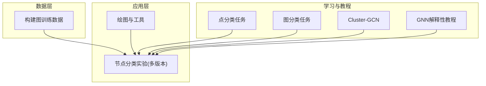
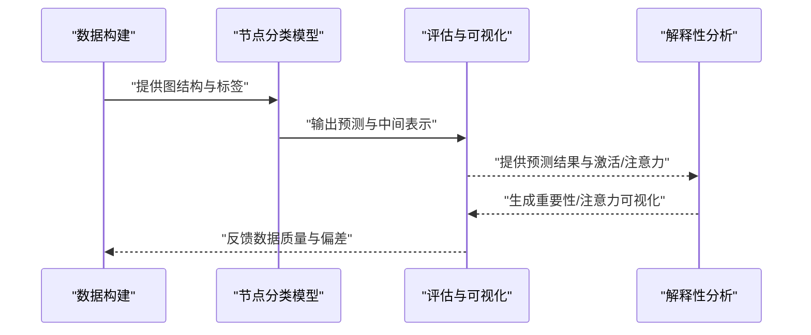
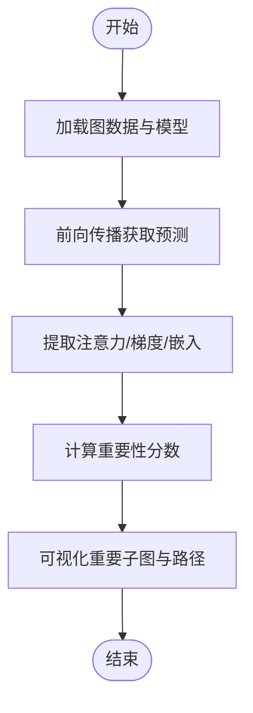
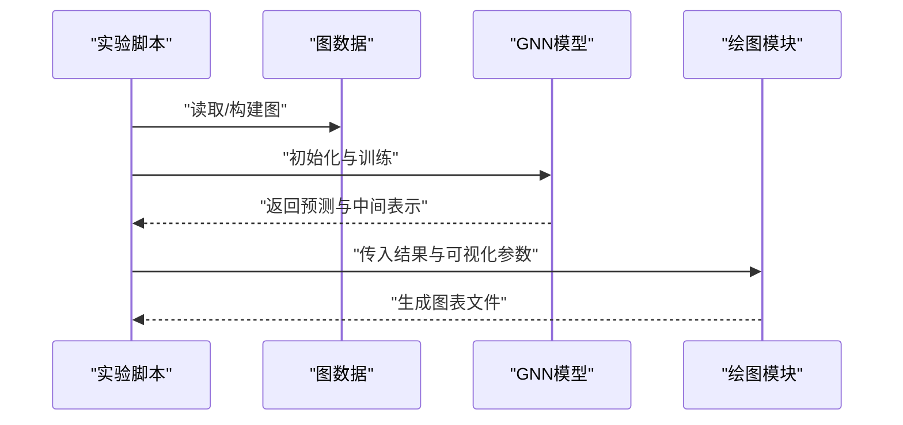
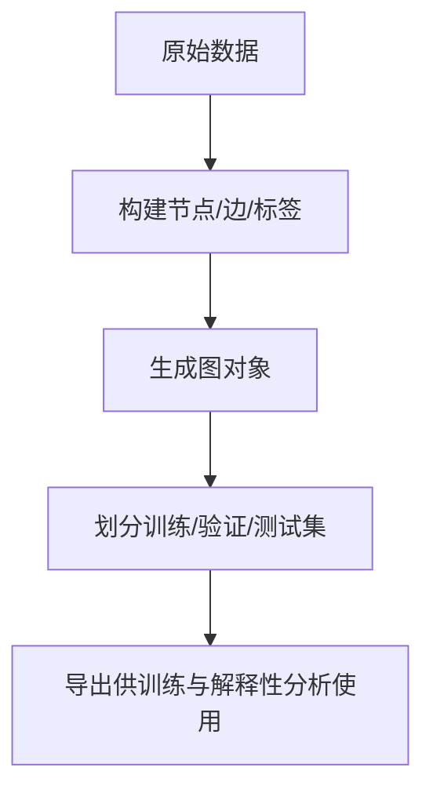
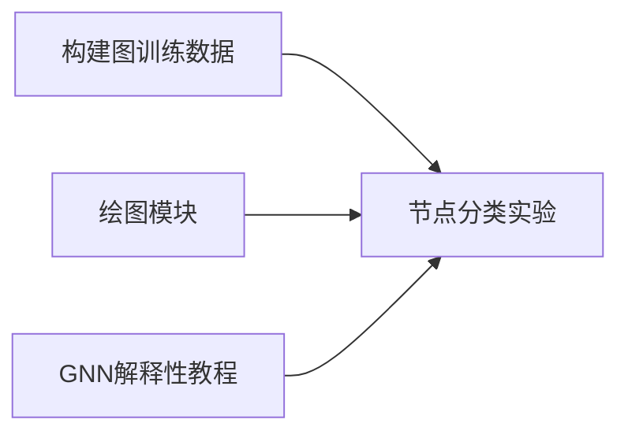

# GNN可解释性分析

<cite>
**本文引用的文件**   
- [5-GNN_Explanation.ipynb](file://网络资料/3-图模型必备神器PyTorch Geometric安装与使用/工具包使用/5-GNN_Explanation.ipynb)
- [2-点分类任务.ipynb](file://网络资料/3-图模型必备神器PyTorch Geometric安装与使用/工具包使用/2-点分类任务.ipynb)
- [3-图分类任务.ipynb](file://网络资料/3-图模型必备神器PyTorch Geometric安装与使用/工具包使用/3-图分类任务.ipynb)
- [4-Cluster-GCN.ipynb](file://网络资料/3-图模型必备神器PyTorch Geometric安装与使用/工具包使用/4-Cluster-GCN.ipynb)
- [1.节点分类实验.py](file://MyProject/Model/1.节点分类实验.py)
- [2.节点分类实验_74.19%_20240423.py](file://MyProject/Model/2.节点分类实验_74.19%_20240423.py)
- [3.节点分类实验_79.57%_20240413.py](file://MyProject/Model/3.节点分类实验_79.57%_20240413.py)
- [4.节点分类实验_80.7%+画图_20240521.py](file://MyProject/Model/4.节点分类实验_80.7%+画图_20240521.py)
- [5.节点分类实验.py](file://MyProject/Model/5.节点分类实验.py)
- [8.节点分类实验_MACD_93.47%+画图_20240505.py](file://MyProject/Model/8.节点分类实验_MACD_93.47%+画图_20240505.py)
- [9.节点分类实验_MACD_93.47%+画图_20240505.py](file://MyProject/Model/9.节点分类实验_MACD_93.47%+画图_20240505.py)
- [DrawHelper.py](file://MyProject/Helper/DrawHelper.py)
- [DrawHelper_class.py](file://MyProject/Helper/DrawHelper_class.py)
- [构建图train数据.py](file://生成train数据/构建图train数据.py)
- [构建图train数据_ForInMemoryDataset.py](file://生成train数据/构建图train数据_ForInMemoryDataset.py)
</cite>

## 目录
1. [简介](#简介)
2. [项目结构](#项目结构)
3. [核心组件](#核心组件)
4. [架构总览](#架构总览)
5. [详细组件分析](#详细组件分析)
6. [依赖关系分析](#依赖关系分析)
7. [性能考量](#性能考量)
8. [故障排查指南](#故障排查指南)
9. [结论](#结论)
10. [附录](#附录)

## 简介
本指南面向需要在图神经网络（GNN）上进行可解释性分析与可视化的工程师与研究者，聚焦以下目标：
- 系统梳理GNN解释性方法：注意力可视化、节点重要性分析、决策路径追踪。
- 结合仓库中的示例，给出Grad-CAM、GNNExplainer等方法的理论基础与应用场景说明。
- 提供基于现有代码的“如何复现”的路径指引，帮助快速落地到金融预测、医疗诊断等高风险领域。
- 总结调试与优化技巧，提升模型可解释性与稳定性。

## 项目结构
仓库围绕“股票时序图建模 + 节点分类”展开，同时包含PyTorch Geometric（PyG）学习材料与GNN解释性教程。关键组织方式如下：
- MyProject/Model：节点分类实验脚本集合，涵盖多版本实验与绘图辅助。
- MyProject/Helper：绘图与通用工具模块，便于可视化结果。
- 生成train数据：图数据构建脚本，用于构造训练样本。
- 网络资料/3-图模型必备神器PyTorch Geometric安装与使用/工具包使用：包含点分类、图分类、Cluster-GCN以及GNN解释性教程Notebook。

图表来源
- [1.节点分类实验.py](file://MyProject/Model/1.节点分类实验.py)
- [4.节点分类实验_80.7%+画图_20240521.py](file://MyProject/Model/4.节点分类实验_80.7%+画图_20240521.py)
- [构建图train数据.py](file://生成train数据/构建图train数据.py)
- [2-点分类任务.ipynb](file://网络资料/3-图模型必备神器PyTorch Geometric安装与使用/工具包使用/2-点分类任务.ipynb)
- [3-图分类任务.ipynb](file://网络资料/3-图模型必备神器PyTorch Geometric安装与使用/工具包使用/3-图分类任务.ipynb)
- [4-Cluster-GCN.ipynb](file://网络资料/3-图模型必备神器PyTorch Geometric安装与使用/工具包使用/4-Cluster-GCN.ipynb)
- [5-GNN_Explanation.ipynb](file://网络资料/3-图模型必备神器PyTorch Geometric安装与使用/工具包使用/5-GNN_Explanation.ipynb)

章节来源
- [1.节点分类实验.py](file://MyProject/Model/1.节点分类实验.py)
- [4.节点分类实验_80.7%+画图_20240521.py](file://MyProject/Model/4.节点分类实验_80.7%+画图_20240521.py)
- [构建图train数据.py](file://生成train数据/构建图train数据.py)
- [2-点分类任务.ipynb](file://网络资料/3-图模型必备神器PyTorch Geometric安装与使用/工具包使用/2-点分类任务.ipynb)
- [3-图分类任务.ipynb](file://网络资料/3-图模型必备神器PyTorch Geometric安装与使用/工具包使用/3-图分类任务.ipynb)
- [4-Cluster-GCN.ipynb](file://网络资料/3-图模型必备神器PyTorch Geometric安装与使用/工具包使用/4-Cluster-GCN.ipynb)
- [5-GNN_Explanation.ipynb](file://网络资料/3-图模型必备神器PyTorch Geometric安装与使用/工具包使用/5-GNN_Explanation.ipynb)

## 核心组件
- 节点分类实验脚本族：提供不同版本的图模型训练与评估流程，部分版本集成绘图能力，便于可视化中间结果与最终输出。
- 绘图与工具模块：封装常用可视化函数，支持将节点特征、边权重或注意力分布渲染为图形。
- 图数据构建脚本：负责从原始数据构造图结构（节点、边、标签），是后续解释性分析的输入基础。
- PyG学习材料：包括点分类、图分类、Cluster-GCN与GNN解释性教程，可作为方法与API参考。

章节来源
- [1.节点分类实验.py](file://MyProject/Model/1.节点分类实验.py)
- [2.节点分类实验_74.19%_20240423.py](file://MyProject/Model/2.节点分类实验_74.19%_20240423.py)
- [3.节点分类实验_79.57%_20240413.py](file://MyProject/Model/3.节点分类实验_79.57%_20240413.py)
- [4.节点分类实验_80.7%+画图_20240521.py](file://MyProject/Model/4.节点分类实验_80.7%+画图_20240521.py)
- [5.节点分类实验.py](file://MyProject/Model/5.节点分类实验.py)
- [8.节点分类实验_MACD_93.47%+画图_20240505.py](file://MyProject/Model/8.节点分类实验_MACD_93.47%+画图_20240505.py)
- [9.节点分类实验_MACD_93.47%+画图_20240505.py](file://MyProject/Model/9.节点分类实验_MACD_93.47%+画图_20240505.py)
- [DrawHelper.py](file://MyProject/Helper/DrawHelper.py)
- [DrawHelper_class.py](file://MyProject/Helper/DrawHelper_class.py)
- [构建图train数据.py](file://生成train数据/构建图train数据.py)
- [构建图train数据_ForInMemoryDataset.py](file://生成train数据/构建图train数据_ForInMemoryDataset.py)
- [2-点分类任务.ipynb](file://网络资料/3-图模型必备神器PyTorch Geometric安装与使用/工具包使用/2-点分类任务.ipynb)
- [3-图分类任务.ipynb](file://网络资料/3-图模型必备神器PyTorch Geometric安装与使用/工具包使用/3-图分类任务.ipynb)
- [4-Cluster-GCN.ipynb](file://网络资料/3-图模型必备神器PyTorch Geometric安装与使用/工具包使用/4-Cluster-GCN.ipynb)
- [5-GNN_Explanation.ipynb](file://网络资料/3-图模型必备神器PyTorch Geometric安装与使用/工具包使用/5-GNN_Explanation.ipynb)

## 架构总览
下图展示了从数据构建、模型训练到解释性分析的端到端流程，并标注了与仓库文件的对应关系。

图表来源
- [构建图train数据.py](file://生成train数据/构建图train数据.py)
- [4.节点分类实验_80.7%+画图_20240521.py](file://MyProject/Model/4.节点分类实验_80.7%+画图_20240521.py)
- [5-GNN_Explanation.ipynb](file://网络资料/3-图模型必备神器PyTorch Geometric安装与使用/工具包使用/5-GNN_Explanation.ipynb)

## 详细组件分析

### 组件A：GNN解释性教程（PyG）
该Notebook作为方法入口，演示如何使用PyG生态进行GNN解释性分析，通常包括：
- 加载数据集与预训练模型
- 提取注意力权重或梯度信息
- 计算节点/边重要性分数
- 可视化重要子图与决策路径

图表来源
- [5-GNN_Explanation.ipynb](file://网络资料/3-图模型必备神器PyTorch Geometric安装与使用/工具包使用/5-GNN_Explanation.ipynb)

章节来源
- [5-GNN_Explanation.ipynb](file://网络资料/3-图模型必备神器PyTorch Geometric安装与使用/工具包使用/5-GNN_Explanation.ipynb)

### 组件B：节点分类实验（含绘图）
多个实验脚本覆盖不同配置与指标，其中部分版本集成绘图功能，便于观察训练过程与结果。典型流程：
- 准备图数据与标签
- 定义GCN/GAT等模型
- 训练与验证
- 绘制准确率曲线、混淆矩阵或关键节点高亮

图表来源
- [4.节点分类实验_80.7%+画图_20240521.py](file://MyProject/Model/4.节点分类实验_80.7%+画图_20240521.py)
- [DrawHelper.py](file://MyProject/Helper/DrawHelper.py)
- [DrawHelper_class.py](file://MyProject/Helper/DrawHelper_class.py)

章节来源
- [1.节点分类实验.py](file://MyProject/Model/1.节点分类实验.py)
- [2.节点分类实验_74.19%_20240423.py](file://MyProject/Model/2.节点分类实验_74.19%_20240423.py)
- [3.节点分类实验_79.57%_20240413.py](file://MyProject/Model/3.节点分类实验_79.57%_20240413.py)
- [4.节点分类实验_80.7%+画图_20240521.py](file://MyProject/Model/4.节点分类实验_80.7%+画图_20240521.py)
- [5.节点分类实验.py](file://MyProject/Model/5.节点分类实验.py)
- [8.节点分类实验_MACD_93.47%+画图_20240505.py](file://MyProject/Model/8.节点分类实验_MACD_93.47%+画图_20240505.py)
- [9.节点分类实验_MACD_93.47%+画图_20240505.py](file://MyProject/Model/9.节点分类实验_MACD_93.47%+画图_20240505.py)
- [DrawHelper.py](file://MyProject/Helper/DrawHelper.py)
- [DrawHelper_class.py](file://MyProject/Helper/DrawHelper_class.py)

### 组件C：图数据构建
图数据构建脚本负责将原始序列或表格数据转换为图结构（节点特征、邻接矩阵、标签），是解释性分析的基础输入。

图表来源
- [构建图train数据.py](file://生成train数据/构建图train数据.py)
- [构建图train数据_ForInMemoryDataset.py](file://生成train数据/构建图train数据_ForInMemoryDataset.py)

章节来源
- [构建图train数据.py](file://生成train数据/构建图train数据.py)
- [构建图train数据_ForInMemoryDataset.py](file://生成train数据/构建图train数据_ForInMemoryDataset.py)

### 概念总览：常见解释性技术
- 注意力机制可视化：适用于自注意力或门控聚合的GNN（如GAT），通过可视化注意力权重定位关键邻居与边。
- 节点/边重要性分析：基于梯度或扰动的方法（如GNNExplainer、PGExplainer、SubgraphX），量化对预测的贡献度。
- Grad-CAM类方法：利用最后一层卷积/聚合层的激活与梯度，生成热力图以突出重要区域。
- 决策路径追踪：通过反事实或子图搜索，理解导致特定预测的关键路径。

[本节为概念性内容，不直接分析具体文件]

## 依赖关系分析
- 实验脚本依赖绘图模块与数据构建脚本；解释性教程独立于业务脚本，但可复用相同的数据与模型接口。
- 潜在耦合点：
  - 数据格式一致性：节点特征维度、边索引顺序需与模型期望一致。
  - 可视化接口：绘图模块的参数约定需与实验脚本的输出对齐。

图表来源
- [构建图train数据.py](file://生成train数据/构建图train数据.py)
- [4.节点分类实验_80.7%+画图_20240521.py](file://MyProject/Model/4.节点分类实验_80.7%+画图_20240521.py)
- [DrawHelper.py](file://MyProject/Helper/DrawHelper.py)
- [5-GNN_Explanation.ipynb](file://网络资料/3-图模型必备神器PyTorch Geometric安装与使用/工具包使用/5-GNN_Explanation.ipynb)

章节来源
- [构建图train数据.py](file://生成train数据/构建图train数据.py)
- [4.节点分类实验_80.7%+画图_20240521.py](file://MyProject/Model/4.节点分类实验_80.7%+画图_20240521.py)
- [DrawHelper.py](file://MyProject/Helper/DrawHelper.py)
- [5-GNN_Explanation.ipynb](file://网络资料/3-图模型必备神器PyTorch Geometric安装与使用/工具包使用/5-GNN_Explanation.ipynb)

## 性能考量
- 大图训练与解释性：优先采用稀疏化与采样策略（如Cluster-GCN）以降低显存占用与计算开销。
- 注意力/梯度提取：仅在需要时启用，避免在大规模批次上频繁计算额外梯度。
- 可视化批处理：批量生成图表并异步写入磁盘，减少I/O阻塞。
- 缓存中间表示：对重复使用的嵌入或注意力权重进行缓存，加速多次解释性分析。

[本节提供一般性指导，不直接分析具体文件]

## 故障排查指南
- 数据不一致：检查节点特征维度、边索引范围是否与模型定义匹配。
- 可视化异常：确认绘图模块输入数据的形状与标签映射是否正确。
- 解释性结果不稳定：调整随机种子、增加采样次数或使用集成方法提高稳健性。
- 内存不足：减小批次大小、启用梯度累积或改用更轻量的解释性方法。

章节来源
- [DrawHelper.py](file://MyProject/Helper/DrawHelper.py)
- [DrawHelper_class.py](file://MyProject/Helper/DrawHelper_class.py)
- [4.节点分类实验_80.7%+画图_20240521.py](file://MyProject/Model/4.节点分类实验_80.7%+画图_20240521.py)

## 结论
本指南基于仓库中的节点分类实验与PyG解释性教程，构建了从数据构建、模型训练到解释性可视化的完整链路。通过注意力可视化、节点/边重要性分析与决策路径追踪，可在高风险领域（如金融预测、医疗诊断）中增强模型透明度与可信度。建议在实际工程中结合采样与缓存策略，平衡解释性精度与运行效率。

[本节为总结性内容，不直接分析具体文件]

## 附录
- 快速上手路径：
  - 参考解释性教程Notebook，了解基本API与可视化流程。
  - 复用节点分类实验脚本，替换数据构建逻辑以适配新场景。
  - 使用绘图模块统一输出可视化结果，便于对比与归档。

章节来源
- [5-GNN_Explanation.ipynb](file://网络资料/3-图模型必备神器PyTorch Geometric安装与使用/工具包使用/5-GNN_Explanation.ipynb)
- [4.节点分类实验_80.7%+画图_20240521.py](file://MyProject/Model/4.节点分类实验_80.7%+画图_20240521.py)
- [DrawHelper.py](file://MyProject/Helper/DrawHelper.py)