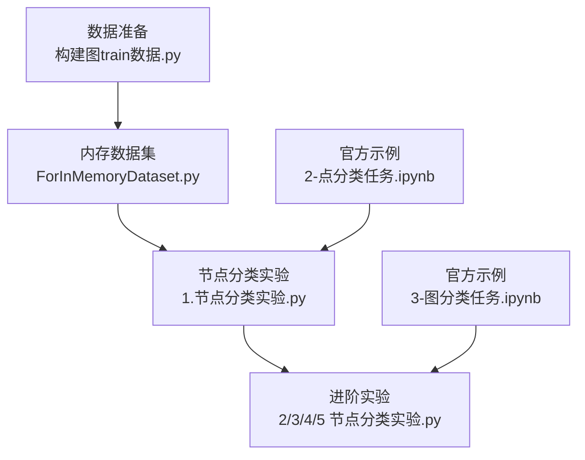
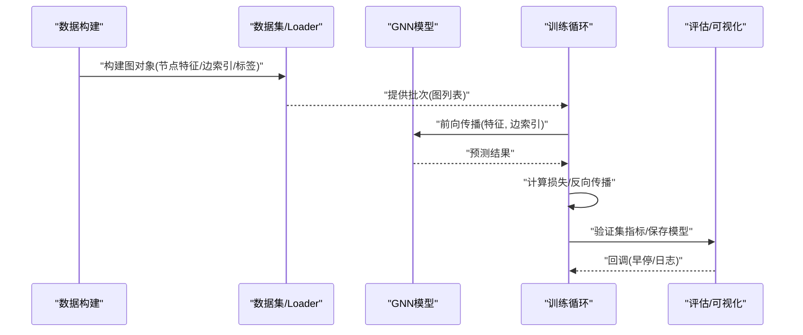
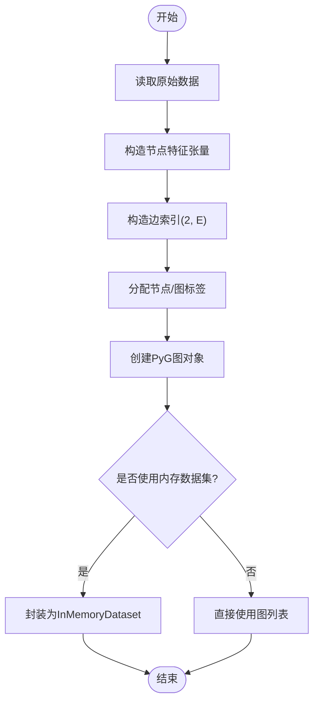
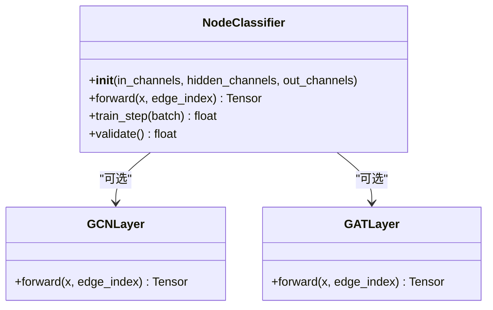

# PyTorch Geometric基础教程

<cite>
**本文引用的文件**   
- [MyProject/Model/1.节点分类实验.py](file://MyProject/Model/1.节点分类实验.py)
- [MyProject/Model/2.节点分类实验_74.19%_20240423.py](file://MyProject/Model/2.节点分类实验_74.19%_20240423.py)
- [MyProject/Model/3.节点分类实验_79.57%_20240413.py](file://MyProject/Model/3.节点分类实验_79.57%_20240413.py)
- [MyProject/Model/4.节点分类实验_80.7%+画图_20240521.py](file://MyProject/Model/4.节点分类实验_80.7%+画图_20240521.py)
- [MyProject/Model/5.节点分类实验.py](file://MyProject/Model/5.节点分类实验.py)
- [生成train数据/构建图train数据.py](file://生成train数据/构建图train数据.py)
- [生成train数据/构建图train数据_ForInMemoryDataset.py](file://生成train数据/构建图train数据_ForInMemoryDataset.py)
- [网络资料/3-图模型必备神器PyTorch Geometric安装与使用/工具包使用/2-点分类任务.ipynb](file://网络资料/3-图模型必备神器PyTorch Geometric安装与使用/工具包使用/2-点分类任务.ipynb)
- [网络资料/3-图模型必备神器PyTorch Geometric安装与使用/工具包使用/3-图分类任务.ipynb](file://网络资料/3-图模型必备神器PyTorch Geometric安装与使用/工具包使用/3-图分类任务.ipynb)
</cite>

## 目录
1. [简介](#简介)
2. [项目结构](#项目结构)
3. [核心组件](#核心组件)
4. [架构总览](#架构总览)
5. [详细组件分析](#详细组件分析)
6. [依赖关系分析](#依赖关系分析)
7. [性能考虑](#性能考虑)
8. [故障排查指南](#故障排查指南)
9. [结论](#结论)
10. [附录](#附录)

## 简介
本教程面向初学者，系统讲解基于 PyTorch Geometric（简称 PyG）的图神经网络入门实践。内容涵盖：
- 安装与环境配置要点
- 图数据基本结构（节点特征、边索引、邻接矩阵等）
- 如何创建和操作图对象
- 常用 GNN 层（如 GCNConv、GATConv）的参数说明与调用方式
- 数据加载、批处理与训练循环的基本流程
- 循序渐进的学习路径与常见陷阱

本仓库包含多个节点分类实验脚本与数据构建脚本，可作为学习与实践的良好起点。

## 项目结构
仓库围绕“数据准备—模型定义—训练评估”的主线组织，关键目录与文件如下：
- MyProject/Model：节点分类实验脚本集合，覆盖从简单到进阶的训练流程
- 生成train数据：图数据构建脚本，演示如何从原始数据构造 PyG 图对象
- 网络资料：官方示例 Notebook，涵盖点分类、图分类、Cluster-GCN 与可解释性

图表来源
- [生成train数据/构建图train数据.py](file://生成train数据/构建图train数据.py)
- [生成train数据/构建图train数据_ForInMemoryDataset.py](file://生成train数据/构建图train数据_ForInMemoryDataset.py)
- [MyProject/Model/1.节点分类实验.py](file://MyProject/Model/1.节点分类实验.py)
- [MyProject/Model/2.节点分类实验_74.19%_20240423.py](file://MyProject/Model/2.节点分类实验_74.19%_20240423.py)
- [网络资料/3-图模型必备神器PyTorch Geometric安装与使用/工具包使用/2-点分类任务.ipynb](file://网络资料/3-图模型必备神器PyTorch Geometric安装与使用/工具包使用/2-点分类任务.ipynb)
- [网络资料/3-图模型必备神器PyTorch Geometric安装与使用/工具包使用/3-图分类任务.ipynb](file://网络资料/3-图模型必备神器PyTorch Geometric安装与使用/工具包使用/3-图分类任务.ipynb)

章节来源
- [生成train数据/构建图train数据.py](file://生成train数据/构建图train数据.py)
- [生成train数据/构建图train数据_ForInMemoryDataset.py](file://生成train数据/构建图train数据_ForInMemoryDataset.py)
- [MyProject/Model/1.节点分类实验.py](file://MyProject/Model/1.节点分类实验.py)
- [MyProject/Model/2.节点分类实验_74.19%_20240423.py](file://MyProject/Model/2.节点分类实验_74.19%_20240423.py)
- [网络资料/3-图模型必备神器PyTorch Geometric安装与使用/工具包使用/2-点分类任务.ipynb](file://网络资料/3-图模型必备神器PyTorch Geometric安装与使用/工具包使用/2-点分类任务.ipynb)
- [网络资料/3-图模型必备神器PyTorch Geometric安装与使用/工具包使用/3-图分类任务.ipynb](file://网络资料/3-图模型必备神器PyTorch Geometric安装与使用/工具包使用/3-图分类任务.ipynb)

## 核心组件
- 图数据表示
  - 节点特征：通常以张量形式存储，形状为 (节点数, 特征维度)
  - 边索引：记录边的起止节点对，形状为 (2, 边数)
  - 标签：节点或图的类别标签
  - 可选属性：掩码（train/val/test）、边权重、图级标签等
- 常用 GNN 层
  - GCNConv：基于谱域近似的图卷积层，适合稀疏图与大规模训练
  - GATConv：带注意力机制的图卷积层，能自适应聚合邻居信息
- 数据加载与批处理
  - InMemoryDataset：将多张图缓存至内存，便于小图批量训练
  - DataLoader：按批次采样图，自动拼接并维护每图的偏移信息
- 训练循环
  - 前向传播：输入节点特征与边索引，输出预测
  - 损失计算：交叉熵等
  - 反向传播与优化器更新
  - 验证与保存最佳模型

章节来源
- [MyProject/Model/1.节点分类实验.py](file://MyProject/Model/1.节点分类实验.py)
- [MyProject/Model/2.节点分类实验_74.19%_20240423.py](file://MyProject/Model/2.节点分类实验_74.19%_20240423.py)
- [生成train数据/构建图train数据_ForInMemoryDataset.py](file://生成train数据/构建图train数据_ForInMemoryDataset.py)

## 架构总览
下图展示了从数据构建到训练评估的整体流程，以及各模块之间的交互关系。

图表来源
- [生成train数据/构建图train数据.py](file://生成train数据/构建图train数据.py)
- [生成train数据/构建图train数据_ForInMemoryDataset.py](file://生成train数据/构建图train数据_ForInMemoryDataset.py)
- [MyProject/Model/1.节点分类实验.py](file://MyProject/Model/1.节点分类实验.py)
- [网络资料/3-图模型必备神器PyTorch Geometric安装与使用/工具包使用/2-点分类任务.ipynb](file://网络资料/3-图模型必备神器PyTorch Geometric安装与使用/工具包使用/2-点分类任务.ipynb)

## 详细组件分析

### 数据构建与图对象操作
- 目标：从原始数据构造 PyG 图对象，包括节点特征、边索引与标签
- 关键点
  - 节点特征需为连续数值型张量
  - 边索引应使用长整型，且无自环（GCNConv 内部会添加）
  - 对于大图，建议使用分块或采样策略；对于中小图，可使用 InMemoryDataset
- 参考实现位置
  - 图构建主流程：[构建图train数据.py](file://生成train数据/构建图train数据.py)
  - 内存数据集封装：[构建图train数据_ForInMemoryDataset.py](file://生成train数据/构建图train数据_ForInMemoryDataset.py)

图表来源
- [生成train数据/构建图train数据.py](file://生成train数据/构建图train数据.py)
- [生成train数据/构建图train数据_ForInMemoryDataset.py](file://生成train数据/构建图train数据_ForInMemoryDataset.py)

章节来源
- [生成train数据/构建图train数据.py](file://生成train数据/构建图train数据.py)
- [生成train数据/构建图train数据_ForInMemoryDataset.py](file://生成train数据/构建图train数据_ForInMemoryDataset.py)

### 节点分类模型与训练流程
- 模型组成
  - 输入层：接收节点特征与边索引
  - 隐藏层：堆叠若干 GNN 层（如 GCNConv/GATConv），配合激活函数与归一化
  - 输出层：线性映射到类别数
- 训练步骤
  - 前向传播得到预测
  - 根据掩码选择训练样本计算损失
  - 反向传播与参数更新
  - 在验证集上评估并保存最佳模型
- 参考实现位置
  - 基础节点分类实验：[1.节点分类实验.py](file://MyProject/Model/1.节点分类实验.py)
  - 进阶实验（含调参与可视化）：[2.节点分类实验_74.19%_20240423.py](file://MyProject/Model/2.节点分类实验_74.19%_20240423.py)、[3.节点分类实验_79.57%_20240413.py](file://MyProject/Model/3.节点分类实验_79.57%_20240413.py)、[4.节点分类实验_80.7%+画图_20240521.py](file://MyProject/Model/4.节点分类实验_80.7%+画图_20240521.py)、[5.节点分类实验.py](file://MyProject/Model/5.节点分类实验.py)

图表来源
- [MyProject/Model/1.节点分类实验.py](file://MyProject/Model/1.节点分类实验.py)
- [MyProject/Model/2.节点分类实验_74.19%_20240423.py](file://MyProject/Model/2.节点分类实验_74.19%_20240423.py)
- [MyProject/Model/3.节点分类实验_79.57%_20240413.py](file://MyProject/Model/3.节点分类实验_79.57%_20240413.py)
- [MyProject/Model/4.节点分类实验_80.7%+画图_20240521.py](file://MyProject/Model/4.节点分类实验_80.7%+画图_20240521.py)
- [MyProject/Model/5.节点分类实验.py](file://MyProject/Model/5.节点分类实验.py)

章节来源
- [MyProject/Model/1.节点分类实验.py](file://MyProject/Model/1.节点分类实验.py)
- [MyProject/Model/2.节点分类实验_74.19%_20240423.py](file://MyProject/Model/2.节点分类实验_74.19%_20240423.py)
- [MyProject/Model/3.节点分类实验_79.57%_20240413.py](file://MyProject/Model/3.节点分类实验_79.57%_20240413.py)
- [MyProject/Model/4.节点分类实验_80.7%+画图_20240521.py](file://MyProject/Model/4.节点分类实验_80.7%+画图_20240521.py)
- [MyProject/Model/5.节点分类实验.py](file://MyProject/Model/5.节点分类实验.py)

### 官方示例对照（点分类与图分类）
- 点分类任务 Notebook：展示如何在标准数据集上完成节点分类全流程
- 图分类任务 Notebook：展示图级别预测的数据组织与训练范式
- 建议结合仓库中的节点分类实验脚本进行对比学习

章节来源
- [网络资料/3-图模型必备神器PyTorch Geometric安装与使用/工具包使用/2-点分类任务.ipynb](file://网络资料/3-图模型必备神器PyTorch Geometric安装与使用/工具包使用/2-点分类任务.ipynb)
- [网络资料/3-图模型必备神器PyTorch Geometric安装与使用/工具包使用/3-图分类任务.ipynb](file://网络资料/3-图模型必备神器PyTorch Geometric安装与使用/工具包使用/3-图分类任务.ipynb)

## 依赖关系分析
- 模块耦合
  - 数据构建与数据集封装相对独立，便于替换数据源
  - 模型与训练循环通过统一的图接口解耦，易于替换 GNN 层
- 外部依赖
  - PyTorch：张量运算与自动微分
  - PyTorch Geometric：图数据结构与 GNN 层
  - 可视化工具：用于训练曲线与结果展示
- 潜在循环依赖
  - 当前结构清晰，未见明显循环导入

图表来源
- [生成train数据/构建图train数据.py](file://生成train数据/构建图train数据.py)
- [生成train数据/构建图train数据_ForInMemoryDataset.py](file://生成train数据/构建图train数据_ForInMemoryDataset.py)
- [MyProject/Model/1.节点分类实验.py](file://MyProject/Model/1.节点分类实验.py)

章节来源
- [生成train数据/构建图train数据.py](file://生成train数据/构建图train数据.py)
- [生成train数据/构建图train数据_ForInMemoryDataset.py](file://生成train数据/构建图train数据_ForInMemoryDataset.py)
- [MyProject/Model/1.节点分类实验.py](file://MyProject/Model/1.节点分类实验.py)

## 性能考虑
- 内存与显存
  - 大图优先使用分块（如 Cluster-GCN）或采样策略
  - 合理设置 batch size 与 hidden channels，避免 OOM
- 计算效率
  - GCNConv 通常比 GATConv 更快，但表达能力略弱
  - 使用稀疏张量与高效算子（PyG 已内置优化）
- I/O 与数据加载
  - 使用 InMemoryDataset 缓存小图，减少重复 IO
  - 开启 DataLoader 的多进程并行加载
- 训练稳定性
  - 合适的学习率与梯度裁剪
  - 早停与权重衰减防止过拟合

## 故障排查指南
- 常见问题
  - 维度不匹配：检查节点特征维度与模型输入通道一致
  - 边索引类型错误：确保为长整型且范围合法
  - 内存不足：减小 batch size、hidden channels 或使用分块训练
  - 收敛缓慢：调整学习率、增加归一化层或加深网络
- 定位方法
  - 打印中间张量形状与数据类型
  - 逐步注释代码，缩小问题范围
  - 使用官方 Notebook 的最小可复现示例进行对照

章节来源
- [MyProject/Model/1.节点分类实验.py](file://MyProject/Model/1.节点分类实验.py)
- [MyProject/Model/2.节点分类实验_74.19%_20240423.py](file://MyProject/Model/2.节点分类实验_74.19%_20240423.py)

## 结论
本教程基于仓库中的实际脚本与官方示例，梳理了 PyG 的基础概念与端到端流程。建议初学者按以下路径循序渐进：
- 先运行“点分类任务” Notebook，理解图数据与训练流程
- 再阅读“节点分类实验”系列脚本，掌握模型设计与训练细节
- 最后尝试“图分类任务” Notebook，扩展至图级别预测

## 附录
- 安装与配置要点
  - 安装 PyTorch（与 CUDA 版本匹配）
  - 安装 PyTorch Geometric（遵循官方指引）
  - 准备数据并转换为 PyG 图对象
- 学习资源
  - 官方文档与示例 Notebook
  - 社区教程与论文解读