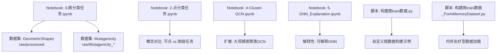
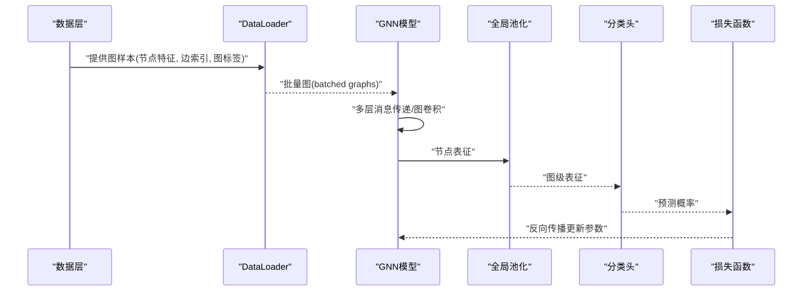
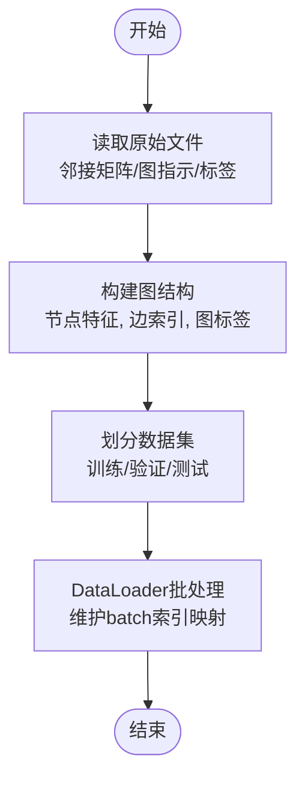
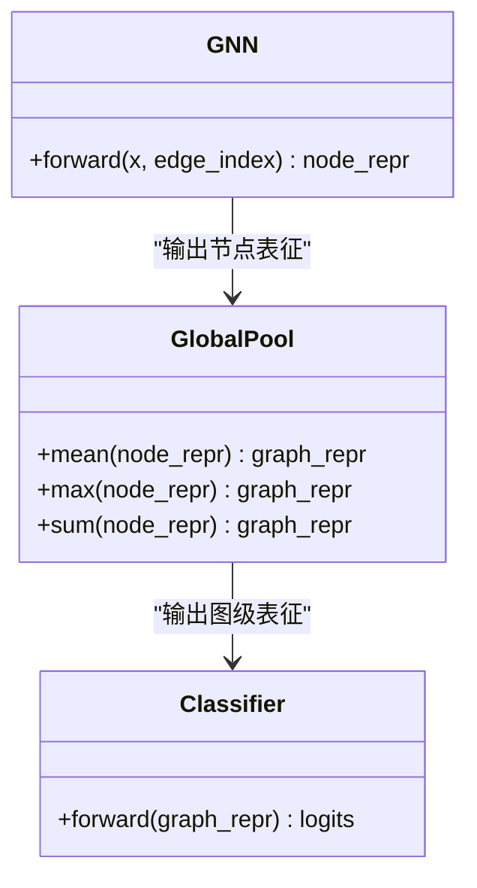
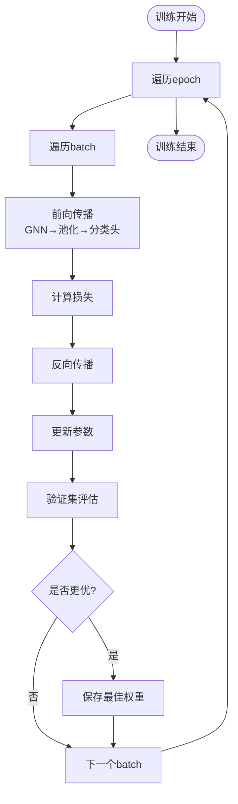
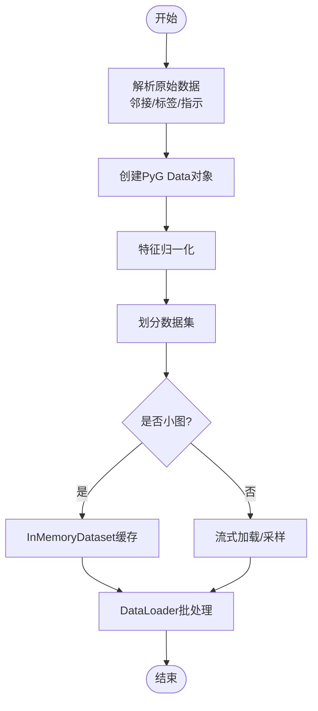
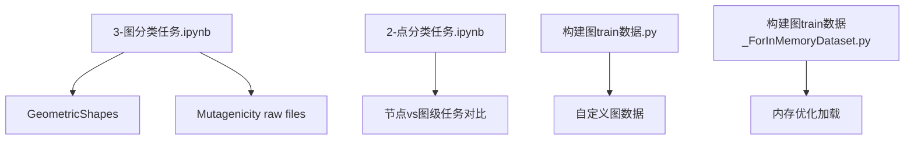

# 图分类任务实战

<cite>
**本文引用的文件**   
- [3-图分类任务.ipynb](file://网络资料/3-图模型必备神器PyTorch Geometric安装与使用/工具包使用/3-图分类任务.ipynb)
- [2-点分类任务.ipynb](file://网络资料/3-图模型必备神器PyTorch Geometric安装与使用/工具包使用/2-点分类任务.ipynb)
- [4-Cluster-GCN.ipynb](file://网络资料/3-图模型必备神器PyTorch Geometric安装与使用/工具包使用/4-Cluster-GCN.ipynb)
- [5-GNN_Explanation.ipynb](file://网络资料/3-图模型必备神器PyTorch Geometric安装与使用/工具包使用/5-GNN_Explanation.ipynb)
- [Mutagenicity_edge_labels.txt](file://网络资料/3-图模型必备神器PyTorch Geometric安装与使用/工具包使用/Mutagenicity/raw/Mutagenicity_edge_labels.txt)
- [Mutagenicity_graph_indicator.txt](file://网络资料/3-图模型必备神器PyTorch Geometric安装与使用/工具包使用/Mutagenicity/raw/Mutagenicity_graph_indicator.txt)
- [Mutagenicity_graph_labels.txt](file://网络资料/3-图模型必备神器PyTorch Geometric安装与使用/工具包使用/Mutagenicity/raw/Mutagenicity_graph_labels.txt)
- [MUTAG_A.txt](file://网络资料/3-图模型必备神器PyTorch Geometric安装与使用/工具包使用/TUDataset/MUTAG/raw/MUTAG_A.txt)
- [MUTAG_graph_indicator.txt](file://网络资料/3-图模型必备神器PyTorch Geometric安装与使用/工具包使用/TUDataset/MUTAG/raw/MUTAG_graph_indicator.txt)
- [MUTAG_graph_labels.txt](file://网络资料/3-图模型必备神器PyTorch Geometric安装与使用/工具包使用/TUDataset/MUTAG/raw/MUTAG_graph_labels.txt)
- [构建图train数据.py](file://生成train数据/构建图train数据.py)
- [构建图train数据_ForInMemoryDataset.py](file://生成train数据/构建图train数据_ForInMemoryDataset.py)
</cite>

## 目录
1. [简介](#简介)
2. [项目结构](#项目结构)
3. [核心组件](#核心组件)
4. [架构总览](#架构总览)
5. [详细组件分析](#详细组件分析)
6. [依赖关系分析](#依赖关系分析)
7. [性能考量](#性能考量)
8. [故障排查指南](#故障排查指南)
9. [结论](#结论)
10. [附录](#附录)

## 简介
本指南面向希望使用 PyTorch Geometric（PyG）完成“图级别分类”任务的读者。我们将以 GeometricShapes 和 Mutagenicity（MUTAG）两个数据集为例，系统讲解：
- 图数据的读取与批处理策略
- 图池化技术（Global Pooling）的原理与应用
- 不同池化方法（全局平均、全局最大、全局求和）的特点与适用场景
- 完整的模型训练、验证与测试流程
- 自定义图数据集的构建方法与最佳实践

通过循序渐进的内容与可视化图示，帮助读者从零开始搭建并优化一个图分类模型。

## 项目结构
仓库中与图分类相关的核心内容主要位于“网络资料/3-图模型必备神器PyTorch Geometric安装与使用/工具包使用”目录下的 Jupyter Notebook 与数据集原始文件；同时，“生成train数据”目录下提供了构建训练图的示例脚本，便于理解如何从原始数据构造图样本。

图表来源
- [3-图分类任务.ipynb](file://网络资料/3-图模型必备神器PyTorch Geometric安装与使用/工具包使用/3-图分类任务.ipynb)
- [2-点分类任务.ipynb](file://网络资料/3-图模型必备神器PyTorch Geometric安装与使用/工具包使用/2-点分类任务.ipynb)
- [4-Cluster-GCN.ipynb](file://网络资料/3-图模型必备神器PyTorch Geometric安装与使用/工具包使用/4-Cluster-GCN.ipynb)
- [5-GNN_Explanation.ipynb](file://网络资料/3-图模型必备神器PyTorch Geometric安装与使用/工具包使用/5-GNN_Explanation.ipynb)
- [构建图train数据.py](file://生成train数据/构建图train数据.py)
- [构建图train数据_ForInMemoryDataset.py](file://生成train数据/构建图train数据_ForInMemoryDataset.py)

章节来源
- [3-图分类任务.ipynb](file://网络资料/3-图模型必备神器PyTorch Geometric安装与使用/工具包使用/3-图分类任务.ipynb)
- [2-点分类任务.ipynb](file://网络资料/3-图模型必备神器PyTorch Geometric安装与使用/工具包使用/2-点分类任务.ipynb)
- [4-Cluster-GCN.ipynb](file://网络资料/3-图模型必备神器PyTorch Gelectric安装与使用/工具包使用/4-Cluster-GCN.ipynb)
- [5-GNN_Explanation.ipynb](file://网络资料/3-图模型必备神器PyTorch Geometric安装与使用/工具包使用/5-GNN_Explanation.ipynb)
- [构建图train数据.py](file://生成train数据/构建图train数据.py)
- [构建图train数据_ForInMemoryDataset.py](file://生成train数据/构建图train数据_ForInMemoryDataset.py)

## 核心组件
- 数据层
  - GeometricShapes：几何形状图集合，适合演示图级分类的基础流程。
  - Mutagenicity（MUTAG）：分子图分类基准，包含邻接矩阵、节点标签、边标签与图标签等原始文件。
- 模型层
  - GNN编码器：多层图卷积/消息传递层，提取节点表征。
  - 全局池化层：将节点表征聚合为图级表征（平均/最大/求和）。
  - 分类头：MLP或线性层输出类别概率。
- 训练层
  - 损失函数：交叉熵。
  - 优化器：Adam/SGD。
  - 评估指标：准确率、混淆矩阵、ROC-AUC（可选）。
- 数据加载与批处理
  - DataLoader 自动拼接多个图，维护 batch 维度的索引映射。
  - 针对大图或小图的不同策略（如采样、截断、Padding）。

章节来源
- [3-图分类任务.ipynb](file://网络资料/3-图模型必备神器PyTorch Geometric安装与使用/工具包使用/3-图分类任务.ipynb)
- [Mutagenicity_graph_labels.txt](file://网络资料/3-图模型必备神器PyTorch Geometric安装与使用/工具包使用/Mutagenicity/raw/Mutagenicity_graph_labels.txt)
- [MUTAG_graph_labels.txt](file://网络资料/3-图模型必备神器PyTorch Geometric安装与使用/工具包使用/TUDataset/MUTAG/raw/MUTAG_graph_labels.txt)

## 架构总览
下图展示了图分类任务的整体数据流与模型调用顺序：从原始图数据到节点特征传播，再到全局池化得到图级表征，最后进行分类预测。

图表来源
- [3-图分类任务.ipynb](file://网络资料/3-图模型必备神器PyTorch Geometric安装与使用/工具包使用/3-图分类任务.ipynb)

章节来源
- [3-图分类任务.ipynb](file://网络资料/3-图模型必备神器PyTorch Geometric安装与使用/工具包使用/3-图分类任务.ipynb)

## 详细组件分析

### 数据读取与预处理
- GeometricShapes
  - 通常由 OFF/PLY 等几何格式转换为图结构（节点坐标、邻接关系），再编码为节点特征与边索引。
  - 在 Notebook 中演示了如何加载、划分训练/验证/测试集，并使用 DataLoader 进行批处理。
- Mutagenicity（MUTAG）
  - 原始文件包括邻接矩阵、图指示（graph_indicator）、图标签、节点/边标签等。
  - 需要将这些文件解析为 PyG 的 Data 对象，建立节点-边关系与图标签映射。

图表来源
- [Mutagenicity_graph_indicator.txt](file://网络资料/3-图模型必备神器PyTorch Geometric安装与使用/工具包使用/Mutagenicity/raw/Mutagenicity_graph_indicator.txt)
- [Mutagenicity_graph_labels.txt](file://网络资料/3-图模型必备神器PyTorch Geometric安装与使用/工具包使用/Mutagenicity/raw/Mutagenicity_graph_labels.txt)
- [MUTAG_A.txt](file://网络资料/3-图模型必备神器PyTorch Geometric安装与使用/工具包使用/TUDataset/MUTAG/raw/MUTAG_A.txt)
- [MUTAG_graph_indicator.txt](file://网络资料/3-图模型必备神器PyTorch Geometric安装与使用/工具包使用/TUDataset/MUTAG/raw/MUTAG_graph_indicator.txt)
- [MUTAG_graph_labels.txt](file://网络资料/3-图模型必备神器PyTorch Geometric安装与使用/工具包使用/TUDataset/MUTAG/raw/MUTAG_graph_labels.txt)

章节来源
- [3-图分类任务.ipynb](file://网络资料/3-图模型必备神器PyTorch Geometric安装与使用/工具包使用/3-图分类任务.ipynb)
- [Mutagenicity_graph_indicator.txt](file://网络资料/3-图模型必备神器PyTorch Geometric安装与使用/工具包使用/Mutagenicity/raw/Mutagenicity_graph_indicator.txt)
- [Mutagenicity_graph_labels.txt](file://网络资料/3-图模型必备神器PyTorch Geometric安装与使用/工具包使用/Mutagenicity/raw/Mutagenicity_graph_labels.txt)
- [MUTAG_A.txt](file://网络资料/3-图模型必备神器PyTorch Geometric安装与使用/工具包使用/TUDataset/MUTAG/raw/MUTAG_A.txt)
- [MUTAG_graph_indicator.txt](file://网络资料/3-图模型必备神器PyTorch Geometric安装与使用/工具包使用/TUDataset/MUTAG/raw/MUTAG_graph_indicator.txt)
- [MUTAG_graph_labels.txt](file://网络资料/3-图模型必备神器PyTorch Geometric安装与使用/工具包使用/TUDataset/MUTAG/raw/MUTAG_graph_labels.txt)

### 模型设计与池化策略
- GNN编码器
  - 多消息传递层（如 GCN/GAT/GraphSAGE）逐层融合局部邻域信息。
- 全局池化（Global Pooling）
  - 全局平均池化：对节点表征求均值，适用于节点贡献相对均衡的场景。
  - 全局最大池化：取各维度最大值，强调显著特征，适合稀疏关键子图。
  - 全局求和池化：对节点表征求和，适合节点数差异较大的图。
- 分类头
  - 将图级表征输入 MLP/线性层，输出类别概率。

图表来源
- [3-图分类任务.ipynb](file://网络资料/3-图模型必备神器PyTorch Geometric安装与使用/工具包使用/3-图分类任务.ipynb)

章节来源
- [3-图分类任务.ipynb](file://网络资料/3-图模型必备神器PyTorch Geometric安装与使用/工具包使用/3-图分类任务.ipynb)

### 训练、验证与测试流程
- 训练循环
  - 前向传播：GNN → 全局池化 → 分类头。
  - 计算损失（交叉熵），反向传播更新参数。
  - 记录训练/验证指标，早停与学习率调度。
- 验证与测试
  - 在验证集上选择最优模型权重。
  - 在测试集上评估最终性能（准确率、混淆矩阵、AUC等）。

图表来源
- [3-图分类任务.ipynb](file://网络资料/3-图模型必备神器PyTorch Geometric安装与使用/工具包使用/3-图分类任务.ipynb)

章节来源
- [3-图分类任务.ipynb](file://网络资料/3-图模型必备神器PyTorch Geometric安装与使用/工具包使用/3-图分类任务.ipynb)

### 自定义图数据集构建与最佳实践
- 数据组织
  - 明确节点特征维度、边索引格式、图标签类型。
  - 合理划分训练/验证/测试集，避免数据泄露。
- 构建步骤
  - 解析原始文件（邻接矩阵、图指示、标签）。
  - 构建 PyG Data 对象，确保 edge_index 为 (2, E) 形式。
  - 使用 DataLoader 进行批处理，注意 batch_size 与内存占用。
- 最佳实践
  - 对大图采用采样或分块策略，控制显存。
  - 对节点特征进行归一化/标准化，提升收敛稳定性。
  - 使用 InMemoryDataset 缓存小图，加速训练。

图表来源
- [构建图train数据.py](file://生成train数据/构建图train数据.py)
- [构建图train数据_ForInMemoryDataset.py](file://生成train数据/构建图train数据_ForInMemoryDataset.py)

章节来源
- [构建图train数据.py](file://生成train数据/构建图train数据.py)
- [构建图train数据_ForInMemoryDataset.py](file://生成train数据/构建图train数据_ForInMemoryDataset.py)

### 不同池化方法的比较与适用场景
- 全局平均池化
  - 优点：对节点数量变化鲁棒，平滑噪声。
  - 缺点：可能弱化关键节点信号。
  - 适用：节点贡献相对均匀的任务。
- 全局最大池化
  - 优点：突出显著特征，利于稀疏关键子图。
  - 缺点：对异常值敏感。
  - 适用：存在强判别子结构的任务。
- 全局求和池化
  - 优点：保留总量信息，适合节点数差异大的图。
  - 缺点：对节点规模敏感，需配合归一化。
  - 适用：分子图、社交网络等规模波动大的场景。

章节来源
- [3-图分类任务.ipynb](file://网络资料/3-图模型必备神器PyTorch Geometric安装与使用/工具包使用/3-图分类任务.ipynb)

## 依赖关系分析
- Notebook 与数据集
  - 3-图分类任务.ipynb 依赖 GeometricShapes 与 Mutagenicity 原始文件。
  - 2-点分类任务.ipynb 用于对比节点级与图级任务的数据与模型差异。
- 脚本与数据构建
  - 构建图train数据.py 展示从原始数据到 PyG Data 的转换过程。
  - 构建图train数据_ForInMemoryDataset.py 演示内存友好型数据加载。

图表来源
- [3-图分类任务.ipynb](file://网络资料/3-图模型必备神器PyTorch Geometric安装与使用/工具包使用/3-图分类任务.ipynb)
- [2-点分类任务.ipynb](file://网络资料/3-图模型必备神器PyTorch Geometric安装与使用/工具包使用/2-点分类任务.ipynb)
- [构建图train数据.py](file://生成train数据/构建图train数据.py)
- [构建图train数据_ForInMemoryDataset.py](file://生成train数据/构建图train数据_ForInMemoryDataset.py)

章节来源
- [3-图分类任务.ipynb](file://网络资料/3-图模型必备神器PyTorch Geometric安装与使用/工具包使用/3-图分类任务.ipynb)
- [2-点分类任务.ipynb](file://网络资料/3-图模型必备神器PyTorch Geometric安装与使用/工具包使用/2-点分类任务.ipynb)
- [构建图train数据.py](file://生成train数据/构建图train数据.py)
- [构建图train数据_ForInMemoryDataset.py](file://生成train数据/构建图train数据_ForInMemoryDataset.py)

## 性能考量
- 批大小与显存
  - 增大 batch_size 提升吞吐但增加显存占用，需平衡 GPU 资源。
- 图规模与采样
  - 大图可采用邻居采样、分层采样或 Cluster-GCN 策略降低复杂度。
- 池化选择
  - 根据任务特性选择合适的全局池化，必要时尝试组合（如平均+最大拼接）。
- 特征归一化
  - 对节点特征进行标准化/归一化，提高训练稳定性与收敛速度。
- 数据加载优化
  - 使用 InMemoryDataset 缓存小图，减少 IO 开销；大图采用流式加载。

[本节为通用指导，不直接分析具体文件]

## 故障排查指南
- 常见错误
  - 边索引维度不匹配：检查 edge_index 是否为 (2, E)。
  - 图标签与图数量不一致：核对 graph_indicator 与 graph_labels 长度。
  - 显存不足：减小 batch_size、图规模或使用采样策略。
- 调试建议
  - 打印每个 batch 的图数量、节点数、边数，确认 DataLoader 行为。
  - 逐步替换池化方法，定位性能瓶颈。
  - 使用可视化工具检查图结构与特征分布。

章节来源
- [3-图分类任务.ipynb](file://网络资料/3-图模型必备神器PyTorch Geometric安装与使用/工具包使用/3-图分类任务.ipynb)
- [Mutagenicity_graph_indicator.txt](file://网络资料/3-图模型必备神器PyTorch Geometric安装与使用/工具包使用/Mutagenicity/raw/Mutagenicity_graph_indicator.txt)
- [MUTAG_graph_indicator.txt](file://网络资料/3-图模型必备神器PyTorch Geometric安装与使用/工具包使用/TUDataset/MUTAG/raw/MUTAG_graph_indicator.txt)

## 结论
通过本指南，读者可以掌握使用 PyTorch Geometric 进行图级分类的核心流程：从数据读取与预处理、模型设计（GNN+全局池化）、训练验证测试，到自定义数据集构建与性能优化。针对不同任务特性选择合适的池化方法与数据加载策略，是提升模型性能的关键。建议结合 Notebook 中的示例代码与数据集，逐步迭代实验，形成自己的最佳实践。

[本节为总结，不直接分析具体文件]

## 附录
- 相关 Notebook
  - 2-点分类任务.ipynb：节点级分类对比，帮助理解图级与节点级的差异。
  - 4-Cluster-GCN.ipynb：大规模图聚类与高效训练策略。
  - 5-GNN_Explanation.ipynb：GNN 可解释性分析与可视化。
- 数据集原始文件
  - Mutagenicity：edge_labels、graph_indicator、graph_labels 等。
  - MUTAG：A、graph_indicator、graph_labels 等。

章节来源
- [2-点分类任务.ipynb](file://网络资料/3-图模型必备神器PyTorch Geometric安装与使用/工具包使用/2-点分类任务.ipynb)
- [4-Cluster-GCN.ipynb](file://网络资料/3-图模型必备神器PyTorch Geometric安装与使用/工具包使用/4-Cluster-GCN.ipynb)
- [5-GNN_Explanation.ipynb](file://网络资料/3-图模型必备神器PyTorch Geometric安装与使用/工具包使用/5-GNN_Explanation.ipynb)
- [Mutagenicity_edge_labels.txt](file://网络资料/3-图模型必备神器PyTorch Geometric安装与使用/工具包使用/Mutagenicity/raw/Mutagenicity_edge_labels.txt)
- [Mutagenicity_graph_indicator.txt](file://网络资料/3-图模型必备神器PyTorch Geometric安装与使用/工具包使用/Mutagenicity/raw/Mutagenicity_graph_indicator.txt)
- [Mutagenicity_graph_labels.txt](file://网络资料/3-图模型必备神器PyTorch Geometric安装与使用/工具包使用/Mutagenicity/raw/Mutagenicity_graph_labels.txt)
- [MUTAG_A.txt](file://网络资料/3-图模型必备神器PyTorch Geometric安装与使用/工具包使用/TUDataset/MUTAG/raw/MUTAG_A.txt)
- [MUTAG_graph_indicator.txt](file://网络资料/3-图模型必备神器PyTorch Geometric安装与使用/工具包使用/TUDataset/MUTAG/raw/MUTAG_graph_indicator.txt)
- [MUTAG_graph_labels.txt](file://网络资料/3-图模型必备神器PyTorch Geometric安装与使用/工具包使用/TUDataset/MUTAG/raw/MUTAG_graph_labels.txt)