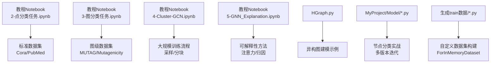
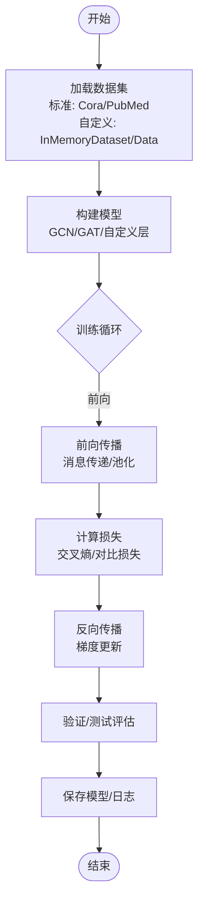
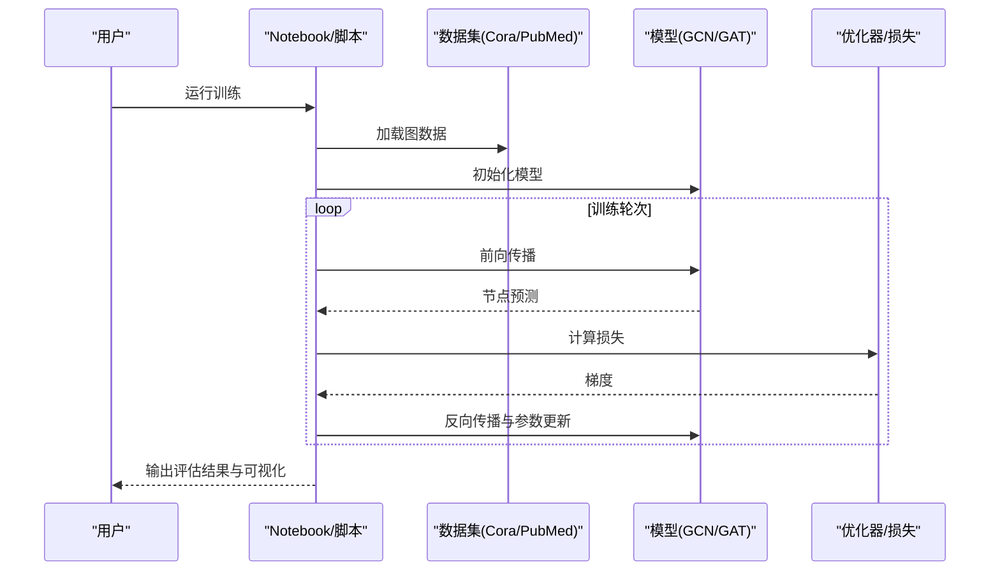
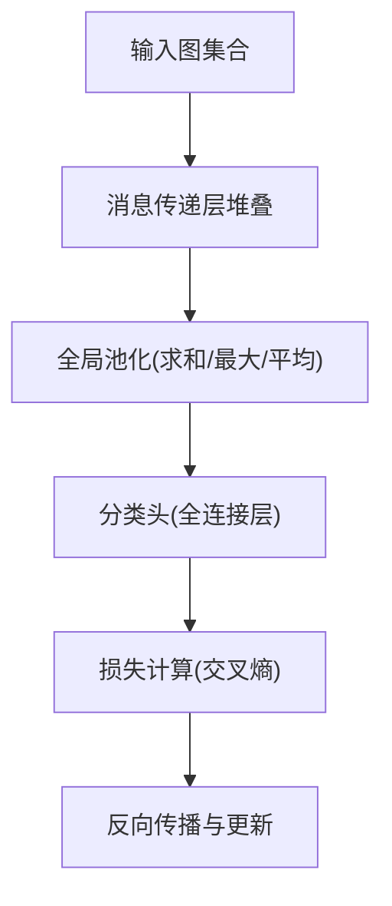
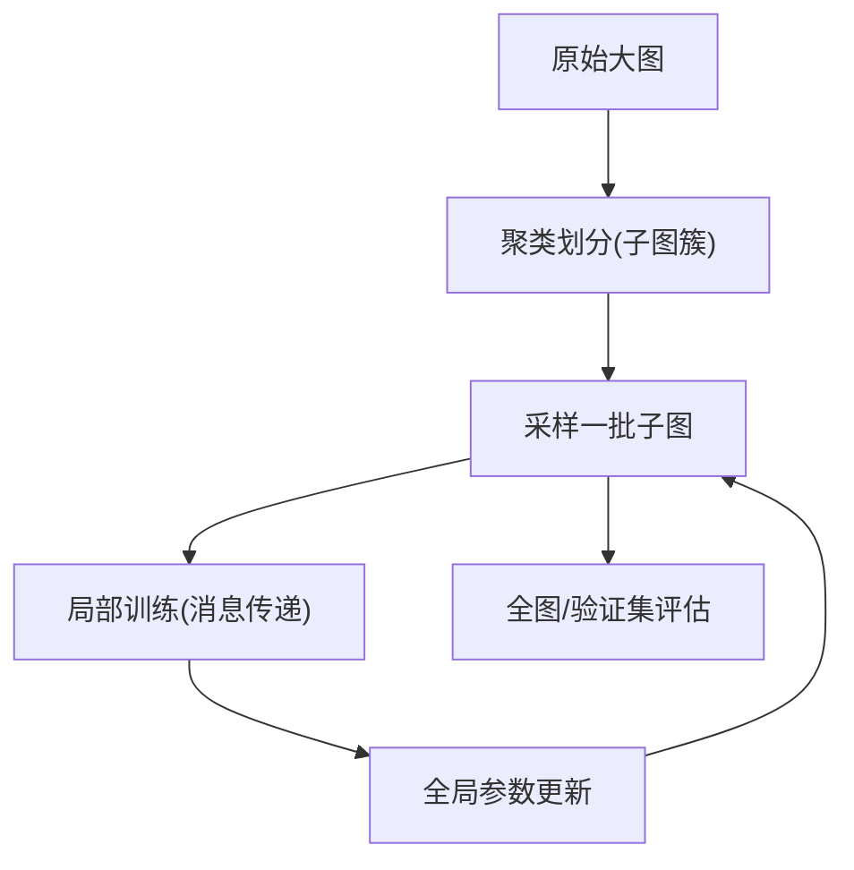
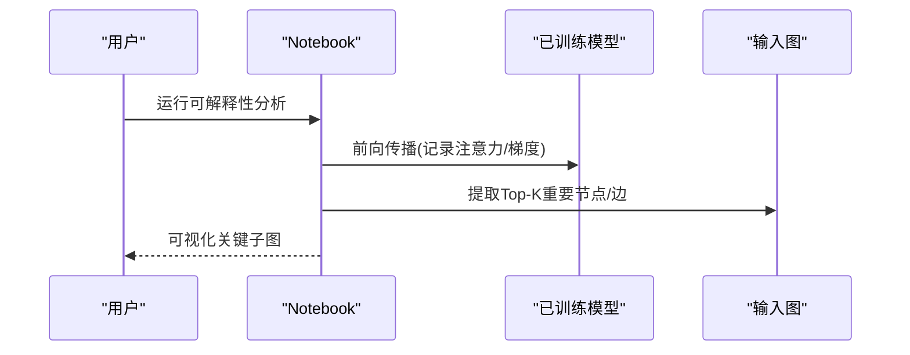
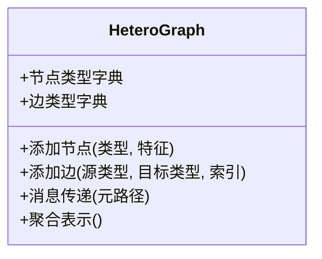
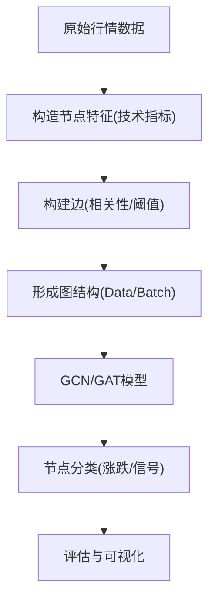
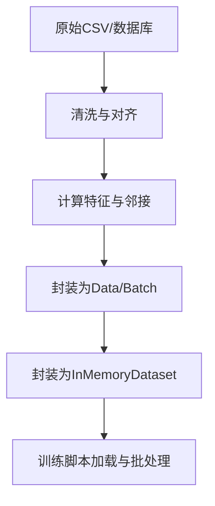
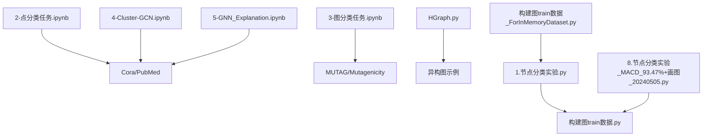

# 教程与示例

<cite>
**本文引用的文件**   
- [2-点分类任务.ipynb](file://网络资料/3-图模型必备神器PyTorch Geometric安装与使用/工具包使用/2-点分类任务.ipynb)
- [3-图分类任务.ipynb](file://网络资料/3-图模型必备神器PyTorch Geometric安装与使用/工具包使用/3-图分类任务.ipynb)
- [4-Cluster-GCN.ipynb](file://网络资料/3-图模型必备神器PyTorch Geometric安装与使用/工具包使用/4-Cluster-GCN.ipynb)
- [5-GNN_Explanation.ipynb](file://网络资料/3-图模型必备神器PyTorch Geometric安装与使用/工具包使用/5-GNN_Explanation.ipynb)
- [HGraph.py](file://网络资料/HeterogeneousGraph/HGraph.py)
- [1.节点分类实验.py](file://MyProject/Model/1.节点分类实验.py)
- [2.节点分类实验_74.19%_20240423.py](file://MyProject/Model/2.节点分类实验_74.19%_20240423.py)
- [3.节点分类实验_79.57%_20240413.py](file://MyProject/Model/3.节点分类实验_79.57%_20240413.py)
- [4.节点分类实验_80.7%+画图_20240521.py](file://MyProject/Model/4.节点分类实验_80.7%+画图_20240521.py)
- [5.节点分类实验.py](file://MyProject/Model/5.节点分类实验.py)
- [8.节点分类实验_MACD_93.47%+画图_20240505.py](file://MyProject/Model/8.节点分类实验_MACD_93.47%+画图_20240505.py)
- [构建图train数据.py](file://生成train数据/构建图train数据.py)
- [构建图train数据_ForInMemoryDataset.py](file://生成train数据/构建图train数据_ForInMemoryDataset.py)
- [model.py](file://生成train数据/model.py)
</cite>

## 目录
1. [简介](#简介)
2. [项目结构](#项目结构)
3. [核心组件](#核心组件)
4. [架构总览](#架构总览)
5. [详细组件分析](#详细组件分析)
6. [依赖关系分析](#依赖关系分析)
7. [性能考虑](#性能考虑)
8. [故障排查指南](#故障排查指南)
9. [结论](#结论)
10. [附录](#附录)

## 简介
本教程面向从机器学习初学者到深度学习专家的不同层次读者，系统讲解基于 PyTorch Geometric（PyG）的图神经网络（GNN）学习路径。内容覆盖：
- PyG 基础用法与核心概念
- 经典任务：节点分类、图分类
- 大规模训练：Cluster-GCN 算法实现思路
- 数据集加载与处理：标准数据集（Cora、PubMed）与自定义数据集构建
- Jupyter Notebook 案例逐步解析与调试技巧
- 常见问题解决方案与性能优化建议

通过“由浅入深”的结构化组织，帮助读者快速上手并深入掌握 GNN 实践。

## 项目结构
仓库围绕“教学案例 + 实战脚本”展开，主要包含：
- 网络资料/工具包使用：Jupyter Notebook 系列教程，涵盖点分类、图分类、Cluster-GCN、可解释性
- HeterogeneousGraph：异构图示例
- MyProject/Model：股票场景下的节点分类实验脚本集合
- 生成train数据：图训练数据构建与 InMemoryDataset 封装示例

图表来源
- [2-点分类任务.ipynb](file://网络资料/3-图模型必备神器PyTorch Geometric安装与使用/工具包使用/2-点分类任务.ipynb)
- [3-图分类任务.ipynb](file://网络资料/3-图模型必备神器PyTorch Geometric安装与使用/工具包使用/3-图分类任务.ipynb)
- [4-Cluster-GCN.ipynb](file://网络资料/3-图模型必备神器PyTorch Geometric安装与使用/工具包使用/4-Cluster-GCN.ipynb)
- [5-GNN_Explanation.ipynb](file://网络资料/3-图模型必备神器PyTorch Geometric安装与使用/工具包使用/5-GNN_Explanation.ipynb)
- [HGraph.py](file://网络资料/HeterogeneousGraph/HGraph.py)
- [1.节点分类实验.py](file://MyProject/Model/1.节点分类实验.py)
- [构建图train数据.py](file://生成train数据/构建图train数据.py)
- [构建图train数据_ForInMemoryDataset.py](file://生成train数据/构建图train数据_ForInMemoryDataset.py)

章节来源
- [2-点分类任务.ipynb](file://网络资料/3-图模型必备神器PyTorch Geometric安装与使用/工具包使用/2-点分类任务.ipynb)
- [3-图分类任务.ipynb](file://网络资料/3-图模型必备神器PyTorch Geometric安装与使用/工具包使用/3-图分类任务.ipynb)
- [4-Cluster-GCN.ipynb](file://网络资料/3-图模型必备神器PyTorch Geometric安装与使用/工具包使用/4-Cluster-GCN.ipynb)
- [5-GNN_Explanation.ipynb](file://网络资料/3-图模型必备神器PyTorch Geometric安装与使用/工具包使用/5-GNN_Explanation.ipynb)
- [HGraph.py](file://网络资料/HeterogeneousGraph/HGraph.py)
- [1.节点分类实验.py](file://MyProject/Model/1.节点分类实验.py)
- [构建图train数据.py](file://生成train数据/构建图train数据.py)
- [构建图train数据_ForInMemoryDataset.py](file://生成train数据/构建图train数据_ForInMemoryDataset.py)

## 核心组件
- 节点分类任务（点分类）
  - 目标：对图中每个节点进行类别预测
  - 典型流程：加载标准数据集 → 定义GCN/GAT等层 → 前向传播 → 交叉熵损失 → 反向传播与评估
  - 参考案例：[2-点分类任务.ipynb](file://网络资料/3-图模型必备神器PyTorch Geometric安装与使用/工具包使用/2-点分类任务.ipynb)

- 图分类任务（图级预测）
  - 目标：对整张图进行类别预测
  - 典型流程：加载图级数据集 → 池化/读函数聚合节点表示 → 分类头 → 训练与评估
  - 参考案例：[3-图分类任务.ipynb](file://网络资料/3-图模型必备神器PyTorch Geometric安装与使用/工具包使用/3-图分类任务.ipynb)

- Cluster-GCN（大规模训练）
  - 目标：在大规模图上通过子图采样提升训练效率
  - 典型流程：按簇划分子图 → 批量采样 → 局部训练 → 全局参数更新
  - 参考案例：[4-Cluster-GCN.ipynb](file://网络资料/3-图模型必备神器PyTorch Geometric安装与使用/工具包使用/4-Cluster-GCN.ipynb)

- GNN 可解释性
  - 目标：理解模型决策依据（节点/边重要性）
  - 典型流程：提取注意力权重或梯度归因 → 可视化关键子图
  - 参考案例：[5-GNN_Explanation.ipynb](file://网络资料/3-图模型必备神器PyTorch Geometric安装与使用/工具包使用/5-GNN_Explanation.ipynb)

- 异构图建模
  - 目标：处理多种节点/边类型的复杂关系
  - 参考案例：[HGraph.py](file://网络资料/HeterogeneousGraph/HGraph.py)

- 实战：节点分类（股票场景）
  - 目标：将金融时序特征构造成图，进行节点分类
  - 参考案例：[1.节点分类实验.py](file://MyProject/Model/1.节点分类实验.py)、[2.节点分类实验_74.19%_20240423.py](file://MyProject/Model/2.节点分类实验_74.19%_20240423.py)、[3.节点分类实验_79.57%_20240413.py](file://MyProject/Model/3.节点分类实验_79.57%_20240413.py)、[4.节点分类实验_80.7%+画图_20240521.py](file://MyProject/Model/4.节点分类实验_80.7%+画图_20240521.py)、[5.节点分类实验.py](file://MyProject/Model/5.节点分类实验.py)、[8.节点分类实验_MACD_93.47%+画图_20240505.py](file://MyProject/Model/8.节点分类实验_MACD_93.47%+画图_20240505.py)

- 自定义数据集构建
  - 目标：将业务数据转换为 PyG 可用的 Data/Batch 或 InMemoryDataset
  - 参考案例：[构建图train数据.py](file://生成train数据/构建图train数据.py)、[构建图train数据_ForInMemoryDataset.py](file://生成train数据/构建图train数据_ForInMemoryDataset.py)、[model.py](file://生成train数据/model.py)

章节来源
- [2-点分类任务.ipynb](file://网络资料/3-图模型必备神器PyTorch Geometric安装与使用/工具包使用/2-点分类任务.ipynb)
- [3-图分类任务.ipynb](file://网络资料/3-图模型必备神器PyTorch Geometric安装与使用/工具包使用/3-图分类任务.ipynb)
- [4-Cluster-GCN.ipynb](file://网络资料/3-图模型必备神器PyTorch Geometric安装与使用/工具包使用/4-Cluster-GCN.ipynb)
- [5-GNN_Explanation.ipynb](file://网络资料/3-图模型必备神器PyTorch Geometric安装与使用/工具包使用/5-GNN_Explanation.ipynb)
- [HGraph.py](file://网络资料/HeterogeneousGraph/HGraph.py)
- [1.节点分类实验.py](file://MyProject/Model/1.节点分类实验.py)
- [2.节点分类实验_74.19%_20240423.py](file://MyProject/Model/2.节点分类实验_74.19%_20240423.py)
- [3.节点分类实验_79.57%_20240413.py](file://MyProject/Model/3.节点分类实验_79.57%_20240413.py)
- [4.节点分类实验_80.7%+画图_20240521.py](file://MyProject/Model/4.节点分类实验_80.7%+画图_20240521.py)
- [5.节点分类实验.py](file://MyProject/Model/5.节点分类实验.py)
- [8.节点分类实验_MACD_93.47%+画图_20240505.py](file://MyProject/Model/8.节点分类实验_MACD_93.47%+画图_20240505.py)
- [构建图train数据.py](file://生成train数据/构建图train数据.py)
- [构建图train数据_ForInMemoryDataset.py](file://生成train数据/构建图train数据_ForInMemoryDataset.py)
- [model.py](file://生成train数据/model.py)

## 架构总览
下图展示从数据到模型的端到端流程，包括标准数据集与自定义数据的接入方式，以及训练与评估的关键步骤。

图表来源
- [2-点分类任务.ipynb](file://网络资料/3-图模型必备神器PyTorch Geometric安装与使用/工具包使用/2-点分类任务.ipynb)
- [3-图分类任务.ipynb](file://网络资料/3-图模型必备神器PyTorch Geometric安装与使用/工具包使用/3-图分类任务.ipynb)
- [构建图train数据_ForInMemoryDataset.py](file://生成train数据/构建图train数据_ForInMemoryDataset.py)

## 详细组件分析

### 节点分类任务（点分类）
- 学习目标
  - 掌握 PyG 的 Data/Batch 数据结构
  - 使用 GCNConv/GATConv 等消息传递层
  - 完成训练、验证、测试与指标统计
- 关键步骤
  - 数据准备：读取邻接矩阵与节点特征、标签
  - 模型设计：多层消息传递 + 非线性激活 + 分类头
  - 训练策略：学习率调度、早停、正则化
  - 评估：准确率、混淆矩阵、可视化
- 参考实现
  - [2-点分类任务.ipynb](file://网络资料/3-图模型必备神器PyTorch Geometric安装与使用/工具包使用/2-点分类任务.ipynb)
  - [1.节点分类实验.py](file://MyProject/Model/1.节点分类实验.py)

图表来源
- [2-点分类任务.ipynb](file://网络资料/3-图模型必备神器PyTorch Geometric安装与使用/工具包使用/2-点分类任务.ipynb)
- [1.节点分类实验.py](file://MyProject/Model/1.节点分类实验.py)

章节来源
- [2-点分类任务.ipynb](file://网络资料/3-图模型必备神器PyTorch Geometric安装与使用/工具包使用/2-点分类任务.ipynb)
- [1.节点分类实验.py](file://MyProject/Model/1.节点分类实验.py)

### 图分类任务（图级预测）
- 学习目标
  - 理解图级任务的池化与读函数
  - 掌握图级数据集（如 MUTAG/Mutagenicity）的使用
- 关键步骤
  - 数据准备：图列表与对应标签
  - 模型设计：消息传递层 + 全局池化（Sum/Max/Avg）+ 分类头
  - 训练策略：批处理、混合精度、梯度累积
  - 评估：AUC、F1、ROC曲线
- 参考实现
  - [3-图分类任务.ipynb](file://网络资料/3-图模型必备神器PyTorch Geometric安装与使用/工具包使用/3-图分类任务.ipynb)

图表来源
- [3-图分类任务.ipynb](file://网络资料/3-图模型必备神器PyTorch Geometric安装与使用/工具包使用/3-图分类任务.ipynb)

章节来源
- [3-图分类任务.ipynb](file://网络资料/3-图模型必备神器PyTorch Geometric安装与使用/工具包使用/3-图分类任务.ipynb)

### Cluster-GCN 算法实现
- 学习目标
  - 理解大规模图上的子图采样与分块训练
  - 掌握 Cluster-GCN 的核心思想与工程落地
- 关键步骤
  - 聚类划分：根据图结构划分子图簇
  - 采样策略：每批次随机选择若干子图
  - 训练流程：在子图上执行局部训练，共享全局参数
  - 评估：在全图或保留集上进行评估
- 参考实现
  - [4-Cluster-GCN.ipynb](file://网络资料/3-图模型必备神器PyTorch Geometric安装与使用/工具包使用/4-Cluster-GCN.ipynb)

图表来源
- [4-Cluster-GCN.ipynb](file://网络资料/3-图模型必备神器PyTorch Geometric安装与使用/工具包使用/4-Cluster-GCN.ipynb)

章节来源
- [4-Cluster-GCN.ipynb](file://网络资料/3-图模型必备神器PyTorch Geometric安装与使用/工具包使用/4-Cluster-GCN.ipynb)

### GNN 可解释性
- 学习目标
  - 了解注意力权重与梯度归因方法
  - 可视化关键节点/边以辅助模型诊断
- 关键步骤
  - 提取注意力权重（GAT）或梯度信息（Grad-CAM/Integrated Gradients）
  - 筛选Top-K重要节点/边
  - 绘制子图高亮关键路径
- 参考实现
  - [5-GNN_Explanation.ipynb](file://网络资料/3-图模型必备神器PyTorch Geometric安装与使用/工具包使用/5-GNN_Explanation.ipynb)

图表来源
- [5-GNN_Explanation.ipynb](file://网络资料/3-图模型必备神器PyTorch Geometric安装与使用/工具包使用/5-GNN_Explanation.ipynb)

章节来源
- [5-GNN_Explanation.ipynb](file://网络资料/3-图模型必备神器PyTorch Geometric安装与使用/工具包使用/5-GNN_Explanation.ipynb)

### 异构图建模
- 学习目标
  - 理解异构图的数据结构与建模方式
  - 掌握不同节点/边类型的消息传递策略
- 关键步骤
  - 定义异构元路径与类型映射
  - 为每种类型设计专用层或统一编码
  - 训练与评估：按任务需求聚合异构信息
- 参考实现
  - [HGraph.py](file://网络资料/HeterogeneousGraph/HGraph.py)

图表来源
- [HGraph.py](file://网络资料/HeterogeneousGraph/HGraph.py)

章节来源
- [HGraph.py](file://网络资料/HeterogeneousGraph/HGraph.py)

### 实战：节点分类（股票场景）
- 学习目标
  - 将时序特征转化为图结构并进行节点分类
  - 结合交易信号（如MACD）增强特征表达
- 关键步骤
  - 数据构建：节点=标的，边=相关性/共动关系；特征=技术指标
  - 模型设计：GCN/GAT + 时间窗口融合
  - 训练策略：滚动窗口、样本不平衡处理
  - 评估：分类准确率、收益曲线、回撤控制
- 参考实现
  - [1.节点分类实验.py](file://MyProject/Model/1.节点分类实验.py)
  - [2.节点分类实验_74.19%_20240423.py](file://MyProject/Model/2.节点分类实验_74.19%_20240423.py)
  - [3.节点分类实验_79.57%_20240413.py](file://MyProject/Model/3.节点分类实验_79.57%_20240413.py)
  - [4.节点分类实验_80.7%+画图_20240521.py](file://MyProject/Model/4.节点分类实验_80.7%+画图_20240521.py)
  - [5.节点分类实验.py](file://MyProject/Model/5.节点分类实验.py)
  - [8.节点分类实验_MACD_93.47%+画图_20240505.py](file://MyProject/Model/8.节点分类实验_MACD_93.47%+画图_20240505.py)

图表来源
- [1.节点分类实验.py](file://MyProject/Model/1.节点分类实验.py)
- [8.节点分类实验_MACD_93.47%+画图_20240505.py](file://MyProject/Model/8.节点分类实验_MACD_93.47%+画图_20240505.py)

章节来源
- [1.节点分类实验.py](file://MyProject/Model/1.节点分类实验.py)
- [2.节点分类实验_74.19%_20240423.py](file://MyProject/Model/2.节点分类实验_74.19%_20240423.py)
- [3.节点分类实验_79.57%_20240413.py](file://MyProject/Model/3.节点分类实验_79.57%_20240413.py)
- [4.节点分类实验_80.7%+画图_20240521.py](file://MyProject/Model/4.节点分类实验_80.7%+画图_20240521.py)
- [5.节点分类实验.py](file://MyProject/Model/5.节点分类实验.py)
- [8.节点分类实验_MACD_93.47%+画图_20240505.py](file://MyProject/Model/8.节点分类实验_MACD_93.47%+画图_20240505.py)

### 自定义数据集构建
- 学习目标
  - 将业务数据转换为 PyG 的 Data/Batch 或 InMemoryDataset
  - 掌握数据预处理、缓存与高效加载
- 关键步骤
  - 数据清洗与对齐（时间戳、缺失值）
  - 构建邻接矩阵与节点特征
  - 封装为 InMemoryDataset 以便复用
  - 训练脚本中直接调用数据集对象
- 参考实现
  - [构建图train数据.py](file://生成train数据/构建图train数据.py)
  - [构建图train数据_ForInMemoryDataset.py](file://生成train数据/构建图train数据_ForInMemoryDataset.py)
  - [model.py](file://生成train数据/model.py)

图表来源
- [构建图train数据.py](file://生成train数据/构建图train数据.py)
- [构建图train数据_ForInMemoryDataset.py](file://生成train数据/构建图train数据_ForInMemoryDataset.py)
- [model.py](file://生成train数据/model.py)

章节来源
- [构建图train数据.py](file://生成train数据/构建图train数据.py)
- [构建图train数据_ForInMemoryDataset.py](file://生成train数据/构建图train数据_ForInMemoryDataset.py)
- [model.py](file://生成train数据/model.py)

## 依赖关系分析
- 教程Notebook与数据集
  - 点分类任务依赖标准图数据集（Cora、PubMed）
  - 图分类任务依赖图级数据集（MUTAG/Mutagenicity）
- 实战脚本与数据构建
  - 节点分类实验脚本依赖自定义数据集构建模块
  - InMemoryDataset 提供高效数据访问接口
- 异构图与可解释性
  - 异构图示例独立于标准数据集，便于扩展
  - 可解释性模块可与任意模型集成

图表来源
- [2-点分类任务.ipynb](file://网络资料/3-图模型必备神器PyTorch Geometric安装与使用/工具包使用/2-点分类任务.ipynb)
- [3-图分类任务.ipynb](file://网络资料/3-图模型必备神器PyTorch Geometric安装与使用/工具包使用/3-图分类任务.ipynb)
- [4-Cluster-GCN.ipynb](file://网络资料/3-图模型必备神器PyTorch Geometric安装与使用/工具包使用/4-Cluster-GCN.ipynb)
- [5-GNN_Explanation.ipynb](file://网络资料/3-图模型必备神器PyTorch Geometric安装与使用/工具包使用/5-GNN_Explanation.ipynb)
- [HGraph.py](file://网络资料/HeterogeneousGraph/HGraph.py)
- [1.节点分类实验.py](file://MyProject/Model/1.节点分类实验.py)
- [8.节点分类实验_MACD_93.47%+画图_20240505.py](file://MyProject/Model/8.节点分类实验_MACD_93.47%+画图_20240505.py)
- [构建图train数据.py](file://生成train数据/构建图train数据.py)
- [构建图train数据_ForInMemoryDataset.py](file://生成train数据/构建图train数据_ForInMemoryDataset.py)

章节来源
- [2-点分类任务.ipynb](file://网络资料/3-图模型必备神器PyTorch Geometric安装与使用/工具包使用/2-点分类任务.ipynb)
- [3-图分类任务.ipynb](file://网络资料/3-图模型必备神器PyTorch Geometric安装与使用/工具包使用/3-图分类任务.ipynb)
- [4-Cluster-GCN.ipynb](file://网络资料/3-图模型必备神器PyTorch Geometric安装与使用/工具包使用/4-Cluster-GCN.ipynb)
- [5-GNN_Explanation.ipynb](file://网络资料/3-图模型必备神器PyTorch Geometric安装与使用/工具包使用/5-GNN_Explanation.ipynb)
- [HGraph.py](file://网络资料/HeterogeneousGraph/HGraph.py)
- [1.节点分类实验.py](file://MyProject/Model/1.节点分类实验.py)
- [8.节点分类实验_MACD_93.47%+画图_20240505.py](file://MyProject/Model/8.节点分类实验_MACD_93.47%+画图_20240505.py)
- [构建图train数据.py](file://生成train数据/构建图train数据.py)
- [构建图train数据_ForInMemoryDataset.py](file://生成train数据/构建图train数据_ForInMemoryDataset.py)

## 性能考虑
- 数据加载与缓存
  - 使用 InMemoryDataset 减少重复IO开销
  - 预计算邻接矩阵与特征，避免每次训练重复构建
- 训练效率
  - 合理设置 batch_size 与 num_workers
  - 使用混合精度训练与梯度累积降低显存占用
- 模型规模
  - 控制隐藏维度与层数，避免过拟合
  - 采用稀疏矩阵运算与GPU加速
- 大规模训练
  - 使用 Cluster-GCN 或邻居采样策略
  - 分块训练与异步参数更新

## 故障排查指南
- 常见错误
  - 数据类型不匹配（int64 vs long）
  - 设备不一致（CPU vs CUDA）
  - 内存溢出（显存不足）
- 定位方法
  - 打印关键张量形状与设备
  - 逐层检查前向传播中间结果
  - 使用断点与日志记录训练过程
- 解决建议
  - 统一数据类型与设备
  - 减小 batch_size 或使用梯度累积
  - 启用数据缓存与增量加载

## 结论
本教程从基础到高级，系统梳理了 PyG 在节点分类、图分类与大规模训练中的应用，并结合实际案例与自定义数据集构建，提供了完整的学习路径与实践指导。建议读者按顺序阅读 Notebook 案例，逐步迁移至自己的业务数据，并通过性能优化与故障排查提升工程落地能力。

## 附录
- 学习路径建议
  - 入门：先跑通点分类与图分类 Notebook
  - 进阶：尝试 Cluster-GCN 与可解释性分析
  - 实战：复现股票节点分类实验，替换为自有数据
- 参考资料
  - PyG 官方文档与示例
  - 相关论文与开源实现