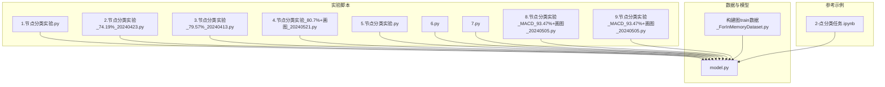
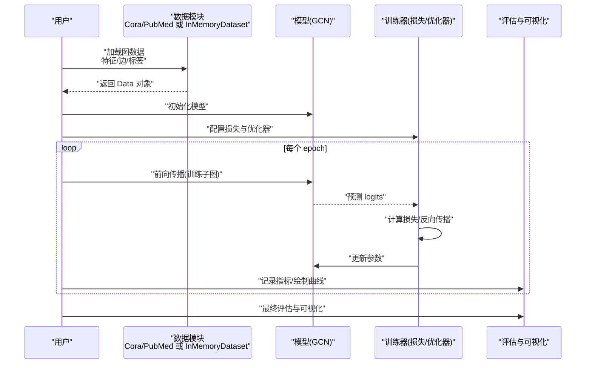
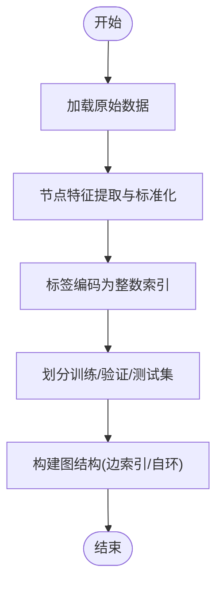
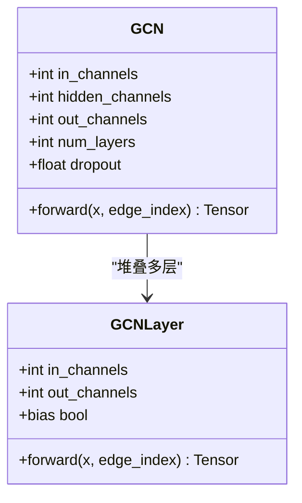
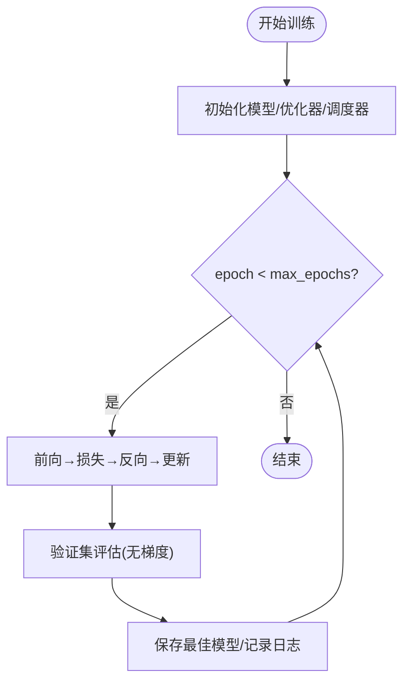
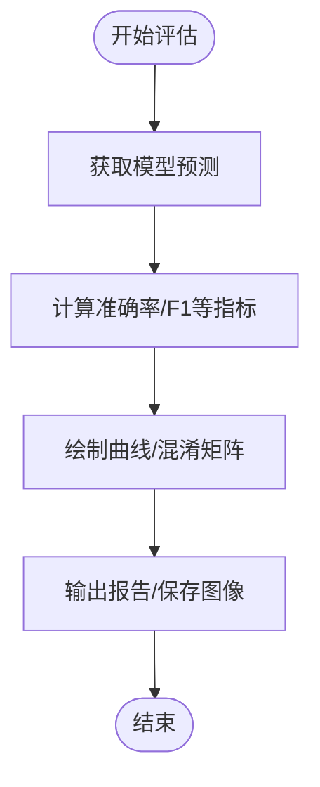
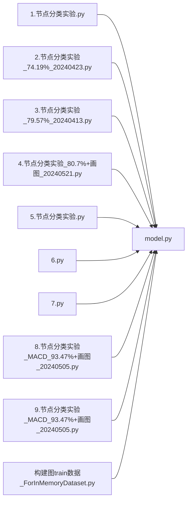

# 节点分类任务实战

<cite>
**本文引用的文件**   
- [MyProject/Model/1.节点分类实验.py](file://MyProject/Model/1.节点分类实验.py)
- [MyProject/Model/2.节点分类实验_74.19%_20240423.py](file://MyProject/Model/2.节点分类实验_74.19%_20240423.py)
- [MyProject/Model/3.节点分类实验_79.57%_20240413.py](file://MyProject/Model/3.节点分类实验_79.57%_20240413.py)
- [MyProject/Model/4.节点分类实验_80.7%+画图_20240521.py](file://MyProject/Model/4.节点分类实验_80.7%+画图_20240521.py)
- [MyProject/Model/5.节点分类实验.py](file://MyProject/Model/5.节点分类实验.py)
- [MyProject/Model/6.py](file://MyProject/Model/6.py)
- [MyProject/Model/7.py](file://MyProject/Model/7.py)
- [MyProject/Model/8.节点分类实验_MACD_93.47%+画图_20240505.py](file://MyProject/Model/8.节点分类实验_MACD_93.47%+画图_20240505.py)
- [MyProject/Model/9.节点分类实验_MACD_93.47%+画图_20240505.py](file://MyProject/Model/9.节点分类实验_MACD_93.47%+画图_20240505.py)
- [生成train数据/构建图train数据_ForInMemoryDataset.py](file://生成train数据/构建图train数据_ForInMemoryDataset.py)
- [生成train数据/model.py](file://生成train数据/model.py)
- [网络资料/3-图模型必备神器PyTorch Geometric安装与使用/工具包使用/2-点分类任务.ipynb](file://网络资料/3-图模型必备神器PyTorch Geometric安装与使用/工具包使用/2-点分类任务.ipynb)
</cite>

## 目录
1. [简介](#简介)
2. [项目结构](#项目结构)
3. [核心组件](#核心组件)
4. [架构总览](#架构总览)
5. [详细组件分析](#详细组件分析)
6. [依赖关系分析](#依赖关系分析)
7. [性能考虑](#性能考虑)
8. [故障排查指南](#故障排查指南)
9. [结论](#结论)
10. [附录](#附录)

## 简介
本教程面向希望使用 PyTorch Geometric（PyG）完成节点分类任务的开发者，以 Cora、PubMed 等标准数据集为例，系统讲解从数据预处理、模型设计、训练监控到评估可视化的完整流程。结合仓库中已有的多个“节点分类实验”脚本与示例 Notebook，我们将逐步拆解关键步骤，提供可复现的实践路径与优化建议。

## 项目结构
本项目围绕“节点分类实验”的多次迭代展开，包含：
- 多版本节点分类实验脚本（不同日期与策略），涵盖特征工程、模型配置、可视化与结果对比
- 基于 InMemoryDataset 的数据构建脚本，展示如何构造图数据并用于训练
- 独立的模型定义文件，便于复用与扩展
- 官方示例 Notebook，演示在 Cora/PubMed 上的点分类流程

图表来源
- [MyProject/Model/1.节点分类实验.py](file://MyProject/Model/1.节点分类实验.py)
- [MyProject/Model/2.节点分类实验_74.19%_20240423.py](file://MyProject/Model/2.节点分类实验_74.19%_20240423.py)
- [MyProject/Model/3.节点分类实验_79.57%_20240413.py](file://MyProject/Model/3.节点分类实验_79.57%_20240413.py)
- [MyProject/Model/4.节点分类实验_80.7%+画图_20240521.py](file://MyProject/Model/4.节点分类实验_80.7%+画图_20240521.py)
- [MyProject/Model/5.节点分类实验.py](file://MyProject/Model/5.节点分类实验.py)
- [MyProject/Model/6.py](file://MyProject/Model/6.py)
- [MyProject/Model/7.py](file://MyProject/Model/7.py)
- [MyProject/Model/8.节点分类实验_MACD_93.47%+画图_20240505.py](file://MyProject/Model/8.节点分类实验_MACD_93.47%+画图_20240505.py)
- [MyProject/Model/9.节点分类实验_MACD_93.47%+画图_20240505.py](file://MyProject/Model/9.节点分类实验_MACD_93.47%+画图_20240505.py)
- [生成train数据/构建图train数据_ForInMemoryDataset.py](file://生成train数据/构建图train数据_ForInMemoryDataset.py)
- [生成train数据/model.py](file://生成train数据/model.py)
- [网络资料/3-图模型必备神器PyTorch Geometric安装与使用/工具包使用/2-点分类任务.ipynb](file://网络资料/3-图模型必备神器PyTorch Geometric安装与使用/工具包使用/2-点分类任务.ipynb)

章节来源
- [MyProject/Model/1.节点分类实验.py](file://MyProject/Model/1.节点分类实验.py)
- [MyProject/Model/2.节点分类实验_74.19%_20240423.py](file://MyProject/Model/2.节点分类实验_74.19%_20240423.py)
- [MyProject/Model/3.节点分类实验_79.57%_20240413.py](file://MyProject/Model/3.节点分类实验_79.57%_20240413.py)
- [MyProject/Model/4.节点分类实验_80.7%+画图_20240521.py](file://MyProject/Model/4.节点分类实验_80.7%+画图_20240521.py)
- [MyProject/Model/5.节点分类实验.py](file://MyProject/Model/5.节点分类实验.py)
- [MyProject/Model/6.py](file://MyProject/Model/6.py)
- [MyProject/Model/7.py](file://MyProject/Model/7.py)
- [MyProject/Model/8.节点分类实验_MACD_93.47%+画图_20240505.py](file://MyProject/Model/8.节点分类实验_MACD_93.47%+画图_20240505.py)
- [MyProject/Model/9.节点分类实验_MACD_93.47%+画图_20240505.py](file://MyProject/Model/9.节点分类实验_MACD_93.47%+画图_20240505.py)
- [生成train数据/构建图train数据_ForInMemoryDataset.py](file://生成train数据/构建图train数据_ForInMemoryDataset.py)
- [生成train数据/model.py](file://生成train数据/model.py)
- [网络资料/3-图模型必备神器PyTorch Geometric安装与使用/工具包使用/2-点分类任务.ipynb](file://网络资料/3-图模型必备神器PyTorch Geometric安装与使用/工具包使用/2-点分类任务.ipynb)

## 核心组件
- 数据加载与预处理
  - 使用 PyG 内置数据集（如 Cora、PubMed）或自定义 InMemoryDataset 构建图数据
  - 节点特征标准化、标签编码、训练/验证/测试集划分
- 模型定义
  - GCN 层堆叠、非线性激活、Dropout 正则化
  - 输出层映射至类别数
- 训练循环
  - 损失函数（交叉熵）、优化器（Adam/SGD）、学习率调度
  - 早停、梯度裁剪、混合精度（可选）
- 评估与可视化
  - 准确率、混淆矩阵、学习曲线、预测分布可视化

章节来源
- [生成train数据/构建图train数据_ForInMemoryDataset.py](file://生成train数据/构建图train数据_ForInMemoryDataset.py)
- [生成train数据/model.py](file://生成train数据/model.py)
- [网络资料/3-图模型必备神器PyTorch Geometric安装与使用/工具包使用/2-点分类任务.ipynb](file://网络资料/3-图模型必备神器PyTorch Geometric安装与使用/工具包使用/2-点分类任务.ipynb)

## 架构总览
下图展示了端到端节点分类流程：数据准备 → 模型前向传播 → 损失计算 → 反向传播与参数更新 → 评估与可视化。

图表来源
- [MyProject/Model/1.节点分类实验.py](file://MyProject/Model/1.节点分类实验.py)
- [MyProject/Model/4.节点分类实验_80.7%+画图_20240521.py](file://MyProject/Model/4.节点分类实验_80.7%+画图_20240521.py)
- [生成train数据/构建图train数据_ForInMemoryDataset.py](file://生成train数据/构建图train数据_ForInMemoryDataset.py)
- [生成train数据/model.py](file://生成train数据/model.py)
- [网络资料/3-图模型必备神器PyTorch Geometric安装与使用/工具包使用/2-点分类任务.ipynb](file://网络资料/3-图模型必备神器PyTorch Geometric安装与使用/工具包使用/2-点分类任务.ipynb)

## 详细组件分析

### 数据预处理与划分
- 节点特征提取
  - 对原始文本或数值特征进行词频/TF-IDF/归一化等操作，得到固定维度的节点特征向量
- 标签编码
  - 将类别字符串映射为整数索引，确保与模型输出维度一致
- 训练/验证/测试集划分
  - 按固定比例随机划分，或使用数据集自带的划分索引；注意保持类别分布均衡
- 图构建
  - 使用邻接矩阵或边列表构建稀疏边索引，必要时添加自环以提升稳定性

图表来源
- [生成train数据/构建图train数据_ForInMemoryDataset.py](file://生成train数据/构建图train数据_ForInMemoryDataset.py)
- [网络资料/3-图模型必备神器PyTorch Geometric安装与使用/工具包使用/2-点分类任务.ipynb](file://网络资料/3-图模型必备神器PyTorch Geometric安装与使用/工具包使用/2-点分类任务.ipynb)

章节来源
- [生成train数据/构建图train数据_ForInMemoryDataset.py](file://生成train数据/构建图train数据_ForInMemoryDataset.py)
- [网络资料/3-图模型必备神器PyTorch Geometric安装与使用/工具包使用/2-点分类任务.ipynb](file://网络资料/3-图模型必备神器PyTorch Geometric安装与使用/工具包使用/2-点分类任务.ipynb)

### GCN 模型实现与架构设计
- 输入层
  - 接收节点特征矩阵 X 与边索引 edge_index
- GCN 层
  - 聚合邻居信息并进行线性变换，通常配合批归一化与 Dropout
- 输出层
  - 全连接层映射到类别数，输出 logits
- 超参配置
  - 隐藏层维度、层数、学习率、权重衰减、Dropout 比率等

图表来源
- [生成train数据/model.py](file://生成train数据/model.py)
- [MyProject/Model/1.节点分类实验.py](file://MyProject/Model/1.节点分类实验.py)
- [MyProject/Model/2.节点分类实验_74.19%_20240423.py](file://MyProject/Model/2.节点分类实验_74.19%_20240423.py)
- [MyProject/Model/3.节点分类实验_79.57%_20240413.py](file://MyProject/Model/3.节点分类实验_79.57%_20240413.py)
- [MyProject/Model/4.节点分类实验_80.7%+画图_20240521.py](file://MyProject/Model/4.节点分类实验_80.7%+画图_20240521.py)
- [MyProject/Model/5.节点分类实验.py](file://MyProject/Model/5.节点分类实验.py)
- [MyProject/Model/6.py](file://MyProject/Model/6.py)
- [MyProject/Model/7.py](file://MyProject/Model/7.py)
- [MyProject/Model/8.节点分类实验_MACD_93.47%+画图_20240505.py](file://MyProject/Model/8.节点分类实验_MACD_93.47%+画图_20240505.py)
- [MyProject/Model/9.节点分类实验_MACD_93.47%+画图_20240505.py](file://MyProject/Model/9.节点分类实验_MACD_93.47%+画图_20240505.py)

章节来源
- [生成train数据/model.py](file://生成train数据/model.py)
- [MyProject/Model/1.节点分类实验.py](file://MyProject/Model/1.节点分类实验.py)
- [MyProject/Model/2.节点分类实验_74.19%_20240423.py](file://MyProject/Model/2.节点分类实验_74.19%_20240423.py)
- [MyProject/Model/3.节点分类实验_79.57%_20240413.py](file://MyProject/Model/3.节点分类实验_79.57%_20240413.py)
- [MyProject/Model/4.节点分类实验_80.7%+画图_20240521.py](file://MyProject/Model/4.节点分类实验_80.7%+画图_20240521.py)
- [MyProject/Model/5.节点分类实验.py](file://MyProject/Model/5.节点分类实验.py)
- [MyProject/Model/6.py](file://MyProject/Model/6.py)
- [MyProject/Model/7.py](file://MyProject/Model/7.py)
- [MyProject/Model/8.节点分类实验_MACD_93.47%+画图_20240505.py](file://MyProject/Model/8.节点分类实验_MACD_93.47%+画图_20240505.py)
- [MyProject/Model/9.节点分类实验_MACD_93.47%+画图_20240505.py](file://MyProject/Model/9.节点分类实验_MACD_93.47%+画图_20240505.py)

### 训练过程监控与优化设置
- 损失函数
  - 多分类常用交叉熵损失；若类别不平衡可使用加权交叉熵
- 优化器
  - Adam 作为默认选择；SGD 配合动量也可行
- 学习率调度
  - 指数衰减、余弦退火或 ReduceLROnPlateau
- 正则化与稳定技巧
  - Dropout、权重衰减、梯度裁剪、早停
- 训练循环要点
  - 仅对训练子图计算损失；验证阶段关闭梯度；记录 loss/acc 曲线

图表来源
- [MyProject/Model/4.节点分类实验_80.7%+画图_20240521.py](file://MyProject/Model/4.节点分类实验_80.7%+画图_20240521.py)
- [MyProject/Model/8.节点分类实验_MACD_93.47%+画图_20240505.py](file://MyProject/Model/8.节点分类实验_MACD_93.47%+画图_20240505.py)
- [MyProject/Model/9.节点分类实验_MACD_93.47%+画图_20240505.py](file://MyProject/Model/9.节点分类实验_MACD_93.47%+画图_20240505.py)

章节来源
- [MyProject/Model/4.节点分类实验_80.7%+画图_20240521.py](file://MyProject/Model/4.节点分类实验_80.7%+画图_20240521.py)
- [MyProject/Model/8.节点分类实验_MACD_93.47%+画图_20240505.py](file://MyProject/Model/8.节点分类实验_MACD_93.47%+画图_20240505.py)
- [MyProject/Model/9.节点分类实验_MACD_93.47%+画图_20240505.py](file://MyProject/Model/9.节点分类实验_MACD_93.47%+画图_20240505.py)

### 评估指标与结果可视化
- 指标
  - 准确率、精确率、召回率、F1 分数；多类场景建议使用宏平均或微平均
- 可视化
  - 训练/验证损失与准确率曲线
  - 混淆矩阵、ROC/PR 曲线（二分类）
  - 预测概率分布直方图
- 代码组织
  - 将评估与绘图逻辑封装为独立函数，便于在不同实验中复用

图表来源
- [MyProject/Model/4.节点分类实验_80.7%+画图_20240521.py](file://MyProject/Model/4.节点分类实验_80.7%+画图_20240521.py)
- [MyProject/Model/8.节点分类实验_MACD_93.47%+画图_20240505.py](file://MyProject/Model/8.节点分类实验_MACD_93.47%+画图_20240505.py)
- [MyProject/Model/9.节点分类实验_MACD_93.47%+画图_20240505.py](file://MyProject/Model/9.节点分类实验_MACD_93.47%+画图_20240505.py)

章节来源
- [MyProject/Model/4.节点分类实验_80.7%+画图_20240521.py](file://MyProject/Model/4.节点分类实验_80.7%+画图_20240521.py)
- [MyProject/Model/8.节点分类实验_MACD_93.47%+画图_20240505.py](file://MyProject/Model/8.节点分类实验_MACD_93.47%+画图_20240505.py)
- [MyProject/Model/9.节点分类实验_MACD_93.47%+画图_20240505.py](file://MyProject/Model/9.节点分类实验_MACD_93.47%+画图_20240505.py)

### 调试技巧与常见问题
- 数据检查
  - 确认 edge_index 形状、dtype 与设备一致；检查节点特征维度与类别数匹配
- 数值稳定性
  - 防止 NaN/Inf：检查学习率过大、未归一化特征、过深网络导致的梯度爆炸
- 过拟合诊断
  - 训练/验证差距大时，增加 Dropout、权重衰减或减少模型容量
- 可视化辅助
  - 打印每层输出统计、绘制损失曲线、观察预测概率分布

章节来源
- [MyProject/Model/1.节点分类实验.py](file://MyProject/Model/1.节点分类实验.py)
- [MyProject/Model/2.节点分类实验_74.19%_20240423.py](file://MyProject/Model/2.节点分类实验_74.19%_20240423.py)
- [MyProject/Model/3.节点分类实验_79.57%_20240413.py](file://MyProject/Model/3.节点分类实验_79.57%_20240413.py)
- [MyProject/Model/4.节点分类实验_80.7%+画图_20240521.py](file://MyProject/Model/4.节点分类实验_80.7%+画图_20240521.py)
- [MyProject/Model/5.节点分类实验.py](file://MyProject/Model/5.节点分类实验.py)
- [MyProject/Model/6.py](file://MyProject/Model/6.py)
- [MyProject/Model/7.py](file://MyProject/Model/7.py)
- [MyProject/Model/8.节点分类实验_MACD_93.47%+画图_20240505.py](file://MyProject/Model/8.节点分类实验_MACD_93.47%+画图_20240505.py)
- [MyProject/Model/9.节点分类实验_MACD_93.47%+画图_20240505.py](file://MyProject/Model/9.节点分类实验_MACD_93.47%+画图_20240505.py)

## 依赖关系分析
- 内部依赖
  - 各实验脚本均依赖 model.py 中的模型定义；部分脚本引入绘图与日志工具
- 外部依赖
  - PyTorch、PyTorch Geometric、NumPy、Matplotlib/Seaborn 等
- 耦合与内聚
  - 模型与训练逻辑解耦，便于替换模型或调整训练策略
- 潜在循环依赖
  - 当前结构未见明显循环导入；建议在大型项目中统一入口与配置管理

图表来源
- [MyProject/Model/1.节点分类实验.py](file://MyProject/Model/1.节点分类实验.py)
- [MyProject/Model/2.节点分类实验_74.19%_20240423.py](file://MyProject/Model/2.节点分类实验_74.19%_20240423.py)
- [MyProject/Model/3.节点分类实验_79.57%_20240413.py](file://MyProject/Model/3.节点分类实验_79.57%_20240413.py)
- [MyProject/Model/4.节点分类实验_80.7%+画图_20240521.py](file://MyProject/Model/4.节点分类实验_80.7%+画图_20240521.py)
- [MyProject/Model/5.节点分类实验.py](file://MyProject/Model/5.节点分类实验.py)
- [MyProject/Model/6.py](file://MyProject/Model/6.py)
- [MyProject/Model/7.py](file://MyProject/Model/7.py)
- [MyProject/Model/8.节点分类实验_MACD_93.47%+画图_20240505.py](file://MyProject/Model/8.节点分类实验_MACD_93.47%+画图_20240505.py)
- [MyProject/Model/9.节点分类实验_MACD_93.47%+画图_20240505.py](file://MyProject/Model/9.节点分类实验_MACD_93.47%+画图_20240505.py)
- [生成train数据/构建图train数据_ForInMemoryDataset.py](file://生成train数据/构建图train数据_ForInMemoryDataset.py)
- [生成train数据/model.py](file://生成train数据/model.py)

章节来源
- [MyProject/Model/1.节点分类实验.py](file://MyProject/Model/1.节点分类实验.py)
- [MyProject/Model/2.节点分类实验_74.19%_20240423.py](file://MyProject/Model/2.节点分类实验_74.19%_20240423.py)
- [MyProject/Model/3.节点分类实验_79.57%_20240413.py](file://MyProject/Model/3.节点分类实验_79.57%_20240413.py)
- [MyProject/Model/4.节点分类实验_80.7%+画图_20240521.py](file://MyProject/Model/4.节点分类实验_80.7%+画图_20240521.py)
- [MyProject/Model/5.节点分类实验.py](file://MyProject/Model/5.节点分类实验.py)
- [MyProject/Model/6.py](file://MyProject/Model/6.py)
- [MyProject/Model/7.py](file://MyProject/Model/7.py)
- [MyProject/Model/8.节点分类实验_MACD_93.47%+画图_20240505.py](file://MyProject/Model/8.节点分类实验_MACD_93.47%+画图_20240505.py)
- [MyProject/Model/9.节点分类实验_MACD_93.47%+画图_20240505.py](file://MyProject/Model/9.节点分类实验_MACD_93.47%+画图_20240505.py)
- [生成train数据/构建图train数据_ForInMemoryDataset.py](file://生成train数据/构建图train数据_ForInMemoryDataset.py)
- [生成train数据/model.py](file://生成train数据/model.py)

## 性能考虑
- 数据侧
  - 使用稀疏张量存储边索引；避免重复边与自环缺失
  - 特征归一化提升收敛速度与稳定性
- 模型侧
  - 合理设置隐藏层维度与层数；过深易导致过平滑
  - 使用 Dropout 与权重衰减抑制过拟合
- 训练侧
  - 选择合适的 batch 策略（全图 vs 子图采样）；大规模图可采用 NeighborSampler
  - 学习率预热与余弦退火有助于稳定训练
- 硬件侧
  - GPU 内存不足时减小 batch 或采用分块推理；启用混合精度降低显存占用

[本节为通用指导，不直接分析具体文件]

## 故障排查指南
- 常见错误
  - 维度不匹配：检查特征维度与类别数
  - 设备不一致：确保所有张量在同一设备上
  - NaN/Inf：降低学习率、检查数据范围与数值稳定性
- 定位方法
  - 打印中间层输出统计；逐层注释定位问题
  - 使用最小可复现实例快速验证
- 恢复策略
  - 回滚到上一个稳定 checkpoint；调整正则化强度

章节来源
- [MyProject/Model/1.节点分类实验.py](file://MyProject/Model/1.节点分类实验.py)
- [MyProject/Model/2.节点分类实验_74.19%_20240423.py](file://MyProject/Model/2.节点分类实验_74.19%_20240423.py)
- [MyProject/Model/3.节点分类实验_79.57%_20240413.py](file://MyProject/Model/3.节点分类实验_79.57%_20240413.py)
- [MyProject/Model/4.节点分类实验_80.7%+画图_20240521.py](file://MyProject/Model/4.节点分类实验_80.7%+画图_20240521.py)
- [MyProject/Model/5.节点分类实验.py](file://MyProject/Model/5.节点分类实验.py)
- [MyProject/Model/6.py](file://MyProject/Model/6.py)
- [MyProject/Model/7.py](file://MyProject/Model/7.py)
- [MyProject/Model/8.节点分类实验_MACD_93.47%+画图_20240505.py](file://MyProject/Model/8.节点分类实验_MACD_93.47%+画图_20240505.py)
- [MyProject/Model/9.节点分类实验_MACD_93.47%+画图_20240505.py](file://MyProject/Model/9.节点分类实验_MACD_93.47%+画图_20240505.py)

## 结论
通过本教程，我们系统梳理了使用 PyG 完成节点分类的关键步骤：数据预处理、GCN 模型设计与实现、训练监控与优化、评估与可视化。结合仓库中的多版本实验脚本与示例 Notebook，读者可以快速搭建基线模型并在此基础上进行改进与调优。建议在实际工程中建立统一的配置管理与日志记录机制，以便更好地追踪实验与复现结果。

[本节为总结性内容，不直接分析具体文件]

## 附录
- 推荐实践
  - 先跑通基线（浅层 GCN、简单特征），再逐步加深模型与复杂特征
  - 使用交叉验证与早停提高泛化能力
  - 将评估与可视化封装为可复用模块，形成标准化流水线
- 参考资源
  - 官方示例 Notebook 提供了在 Cora/PubMed 上的点分类流程，可作为入门模板

[本节为补充说明，不直接分析具体文件]