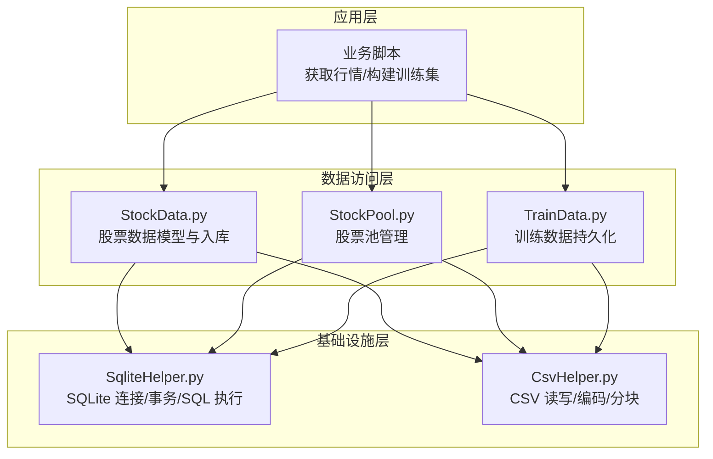
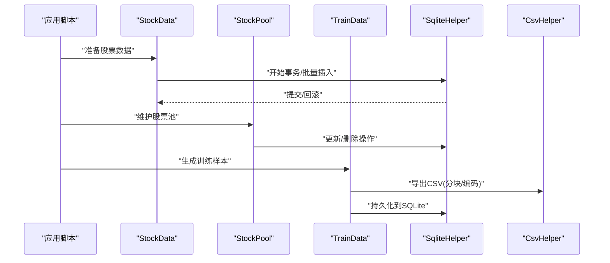
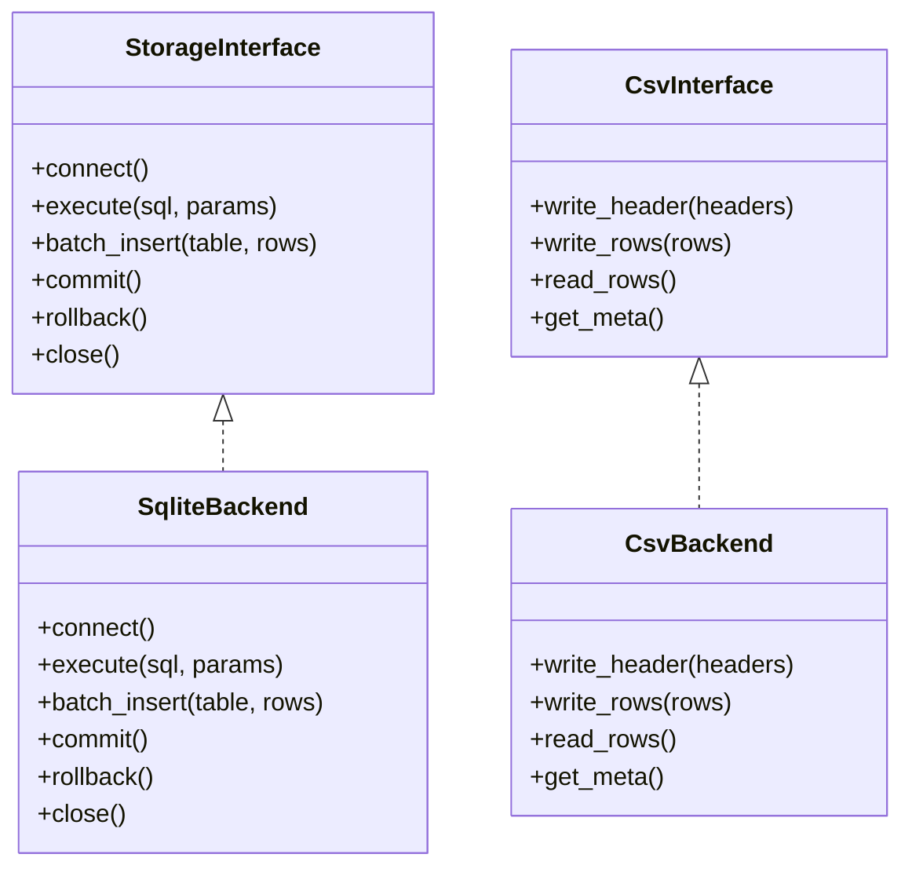
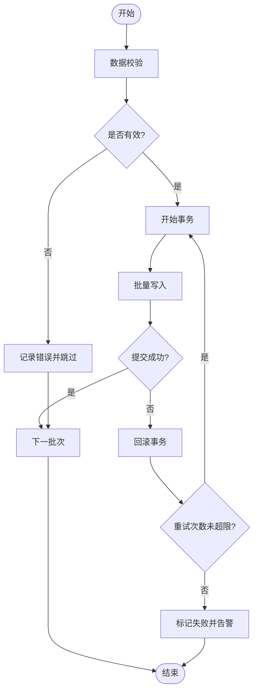
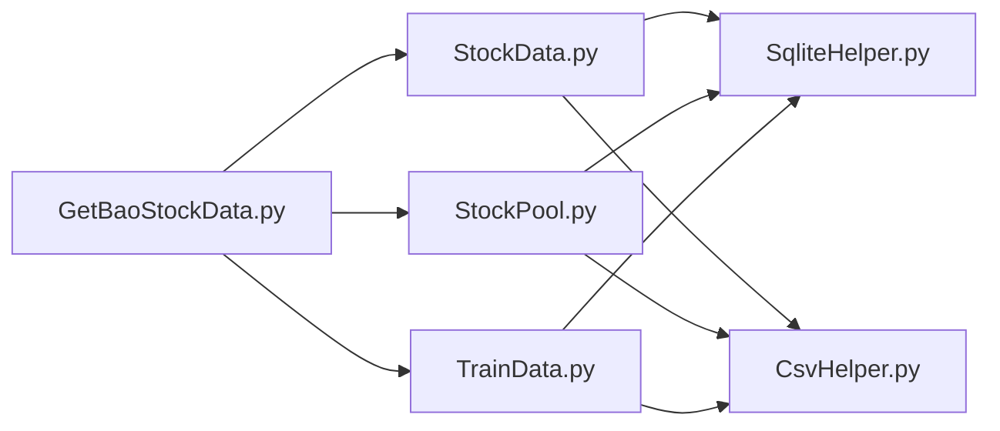

# 数据存储管理

<cite>
**本文引用的文件**   
- [MyProject/DataBase/StockData.py](file://MyProject/DataBase/StockData.py)
- [MyProject/DataBase/StockPool.py](file://MyProject/DataBase/StockPool.py)
- [MyProject/DataBase/TrainData.py](file://MyProject/DataBase/TrainData.py)
- [MyProject/Helper/CsvHelper.py](file://MyProject/Helper/CsvHelper.py)
- [MyProject/Helper/SqliteHelper.py](file://MyProject/Helper/SqliteHelper.py)
- [GetBaoStockData.py](file://GetBaoStockData.py)
</cite>

## 目录
1. [简介](#简介)
2. [项目结构](#项目结构)
3. [核心组件](#核心组件)
4. [架构总览](#架构总览)
5. [详细组件分析](#详细组件分析)
6. [依赖关系分析](#依赖关系分析)
7. [性能考虑](#性能考虑)
8. [故障排查指南](#故障排查指南)
9. [结论](#结论)
10. [附录](#附录)

## 简介
本文件面向“数据存储管理系统”，聚焦以下目标：
- SQLite 数据库设计：表结构、索引与查询优化策略
- CSV 存储规范：编码、分隔符、版本兼容
- 数据持久化：事务、备份恢复、迁移机制
- 扩展新存储后端：抽象层设计与实现示例
- 数据完整性验证与异常恢复
- 大规模数据处理：内存管理与磁盘 I/O 优化

## 项目结构
本项目采用分层组织方式，数据存储相关代码主要分布在以下模块：
- MyProject/DataBase：业务数据模型与持久化入口（股票池、训练数据等）
- MyProject/Helper：通用工具（CSV 读写、SQLite 封装、日志、绘图等）
- GetBaoStockData.py：外部数据源接入脚本（如行情采集）

图表来源
- [MyProject/DataBase/StockData.py](file://MyProject/DataBase/StockData.py)
- [MyProject/DataBase/StockPool.py](file://MyProject/DataBase/StockPool.py)
- [MyProject/DataBase/TrainData.py](file://MyProject/DataBase/TrainData.py)
- [MyProject/Helper/SqliteHelper.py](file://MyProject/Helper/SqliteHelper.py)
- [MyProject/Helper/CsvHelper.py](file://MyProject/Helper/CsvHelper.py)

章节来源
- [MyProject/DataBase/StockData.py](file://MyProject/DataBase/StockData.py)
- [MyProject/DataBase/StockPool.py](file://MyProject/DataBase/StockPool.py)
- [MyProject/DataBase/TrainData.py](file://MyProject/DataBase/TrainData.py)
- [MyProject/Helper/SqliteHelper.py](file://MyProject/Helper/SqliteHelper.py)
- [MyProject/Helper/CsvHelper.py](file://MyProject/Helper/CsvHelper.py)
- [GetBaoStockData.py](file://GetBaoStockData.py)

## 核心组件
- SQLite 辅助层（SqliteHelper）
  - 提供连接管理、事务封装、批量写入、SQL 执行与结果读取
  - 建议开启 WAL 模式以提升并发读性能；使用 PRAGMA 控制同步策略
- CSV 辅助层（CsvHelper）
  - 统一编码（UTF-8）、分隔符约定、空值处理、分块读写
  - 提供版本头或元数据记录以支持向后兼容
- 数据模型与入库（StockData、StockPool、TrainData）
  - 将外部数据转换为结构化对象，按批次写入 SQLite 或导出为 CSV
  - 在入库前进行字段校验、去重与一致性检查

章节来源
- [MyProject/Helper/SqliteHelper.py](file://MyProject/Helper/SqliteHelper.py)
- [MyProject/Helper/CsvHelper.py](file://MyProject/Helper/CsvHelper.py)
- [MyProject/DataBase/StockData.py](file://MyProject/DataBase/StockData.py)
- [MyProject/DataBase/StockPool.py](file://MyProject/DataBase/StockPool.py)
- [MyProject/DataBase/TrainData.py](file://MyProject/DataBase/TrainData.py)

## 架构总览
系统采用“应用层 → 数据访问层 → 基础设施层”的分层架构。应用层负责业务流程编排；数据访问层定义领域模型与入库流程；基础设施层提供 SQLite 与 CSV 的通用能力。

图表来源
- [MyProject/DataBase/StockData.py](file://MyProject/DataBase/StockData.py)
- [MyProject/DataBase/StockPool.py](file://MyProject/DataBase/StockPool.py)
- [MyProject/DataBase/TrainData.py](file://MyProject/DataBase/TrainData.py)
- [MyProject/Helper/SqliteHelper.py](file://MyProject/Helper/SqliteHelper.py)
- [MyProject/Helper/CsvHelper.py](file://MyProject/Helper/CsvHelper.py)

## 详细组件分析

### SQLite 数据库设计
- 表结构设计要点
  - 主键与唯一约束：确保每只股票的时间序列唯一性（如 stock_code + date）
  - 外键与关联：交易明细与标的、因子与标签的关联关系清晰
  - 列类型选择：时间戳用整数或文本（ISO），数值用 REAL/INTEGER，分类用 TEXT
- 索引优化
  - 单列索引：stock_code、date、trade_date
  - 复合索引：(stock_code, date)、(trade_date, stock_code) 用于范围查询与聚合
  - 覆盖索引：对高频查询列组合建立索引以减少回表
- 查询性能调优
  - 使用 EXPLAIN QUERY PLAN 分析执行计划
  - 避免 SELECT *，仅取必要列
  - 分页与分批读取，减少一次性加载
  - 合理设置 PRAGMA（如 journal_mode=WAL、synchronous=NORMAL）

章节来源
- [MyProject/DataBase/StockData.py](file://MyProject/DataBase/StockData.py)
- [MyProject/Helper/SqliteHelper.py](file://MyProject/Helper/SqliteHelper.py)

### CSV 存储格式规范
- 编码标准
  - 统一使用 UTF-8（无 BOM），跨平台一致
- 分隔符约定
  - 默认逗号分隔；若字段含逗号则加引号包裹
  - 日期时间使用 ISO 8601 文本格式
- 版本兼容性
  - 首行或独立元数据文件记录 schema_version、encoding、delimiter
  - 读取时根据元数据进行解析适配，缺失时回退默认值
- 空值与异常
  - 空值使用空字符串或特定占位符（如 NULL），并在读取阶段做转换
  - 对缺失列进行补齐或报错提示

章节来源
- [MyProject/Helper/CsvHelper.py](file://MyProject/Helper/CsvHelper.py)

### 数据持久化策略
- 事务处理
  - 批量写入包裹在单个事务中，失败自动回滚
  - 长事务拆分为多段，降低锁竞争与内存占用
- 备份恢复
  - 基于文件级复制（WAL 模式下需同时复制 .wal/.shm）
  - 或使用 sqlite3 提供的备份 API 进行在线热备
- 数据迁移
  - 通过版本号与变更脚本实现增量迁移
  - 迁移前后进行一致性校验（行数、抽样对比）

章节来源
- [MyProject/Helper/SqliteHelper.py](file://MyProject/Helper/SqliteHelper.py)
- [MyProject/DataBase/StockData.py](file://MyProject/DataBase/StockData.py)

### 扩展新的存储后端（抽象层设计与实现）
- 抽象接口设计
  - 定义统一的存储接口：connect、execute、batch_insert、commit、rollback、close
  - 定义 CSV 接口：write_header、write_rows、read_rows、get_meta
- 实现策略
  - SQLiteBackend：基于 SqliteHelper 实现
  - CsvBackend：基于 CsvHelper 实现
  - 未来可扩展至 Parquet/JSON 等后端
- 工厂与注册
  - 通过配置选择后端；新增后端仅需实现接口并注册

图表来源
- [MyProject/Helper/SqliteHelper.py](file://MyProject/Helper/SqliteHelper.py)
- [MyProject/Helper/CsvHelper.py](file://MyProject/Helper/CsvHelper.py)

章节来源
- [MyProject/Helper/SqliteHelper.py](file://MyProject/Helper/SqliteHelper.py)
- [MyProject/Helper/CsvHelper.py](file://MyProject/Helper/CsvHelper.py)

### 数据完整性验证与异常恢复
- 完整性验证
  - 主键/唯一约束冲突检测
  - 字段取值范围与类型校验
  - 统计量校验（计数、总和、分布）
- 异常恢复
  - 捕获异常后回滚事务，记录错误上下文
  - 断点续传：记录已处理批次，失败从下一批继续
  - 幂等写入：基于唯一键的 INSERT OR REPLACE/UPSERT

图表来源
- [MyProject/Helper/SqliteHelper.py](file://MyProject/Helper/SqliteHelper.py)
- [MyProject/DataBase/StockData.py](file://MyProject/DataBase/StockData.py)

章节来源
- [MyProject/Helper/SqliteHelper.py](file://MyProject/Helper/SqliteHelper.py)
- [MyProject/DataBase/StockData.py](file://MyProject/DataBase/StockData.py)

## 依赖关系分析
- 模块耦合
  - StockData/StockPool/TrainData 依赖 SqliteHelper 与 CsvHelper
  - 外部数据源（如 GetBaoStockData.py）驱动上层入库流程
- 潜在循环依赖
  - 当前分层清晰，未见直接循环导入；建议在新增模块时保持单向依赖

图表来源
- [GetBaoStockData.py](file://GetBaoStockData.py)
- [MyProject/DataBase/StockData.py](file://MyProject/DataBase/StockData.py)
- [MyProject/DataBase/StockPool.py](file://MyProject/DataBase/StockPool.py)
- [MyProject/DataBase/TrainData.py](file://MyProject/DataBase/TrainData.py)
- [MyProject/Helper/SqliteHelper.py](file://MyProject/Helper/SqliteHelper.py)
- [MyProject/Helper/CsvHelper.py](file://MyProject/Helper/CsvHelper.py)

章节来源
- [GetBaoStockData.py](file://GetBaoStockData.py)
- [MyProject/DataBase/StockData.py](file://MyProject/DataBase/StockData.py)
- [MyProject/DataBase/StockPool.py](file://MyProject/DataBase/StockPool.py)
- [MyProject/DataBase/TrainData.py](file://MyProject/DataBase/TrainData.py)
- [MyProject/Helper/SqliteHelper.py](file://MyProject/Helper/SqliteHelper.py)
- [MyProject/Helper/CsvHelper.py](file://MyProject/Helper/CsvHelper.py)

## 性能考虑
- 内存管理
  - 流式读取/写入：逐批处理，避免一次性加载全量数据
  - 预分配与复用：重用游标/连接对象，减少创建开销
  - 向量化与缓冲：结合 NumPy/Pandas 提升计算效率（如需）
- 磁盘 I/O 优化
  - SQLite：启用 WAL 模式，调整 synchronous 与 cache_size
  - 批量插入：使用 executemany 或事务包裹多条语句
  - 顺序写入：尽量按主键顺序写入，减少页分裂
  - 压缩与归档：历史数据归档为 CSV/Parquet 以降低库体积
- 查询优化
  - 选择性高的列建索引；避免过度索引导致写放大
  - 使用覆盖索引减少回表；必要时物化视图/中间表

[本节为通用指导，不直接分析具体文件]

## 故障排查指南
- 常见问题定位
  - 连接失败：检查路径权限、WAL 文件完整性
  - 写入缓慢：确认是否在事务内批量写入；检查索引数量
  - CSV 乱码：确认编码为 UTF-8；检查分隔符与转义规则
- 日志与监控
  - 记录关键步骤耗时与错误堆栈
  - 输出批次大小、行数、失败率等指标
- 恢复策略
  - 断点续传：记录 last_processed_id/batch_index
  - 幂等写入：基于唯一键的 UPSERT 保证可重复运行

章节来源
- [MyProject/Helper/SqliteHelper.py](file://MyProject/Helper/SqliteHelper.py)
- [MyProject/Helper/CsvHelper.py](file://MyProject/Helper/CsvHelper.py)

## 结论
本系统通过清晰的层次划分与通用基础设施（SQLite/CSV），实现了稳定高效的数据持久化能力。围绕表结构、索引、事务、备份与迁移的策略，配合完整性校验与异常恢复机制，可在大规模数据场景下保持较好的性能与可靠性。未来可通过抽象存储接口平滑扩展更多后端，进一步提升系统的灵活性与可维护性。

## 附录
- 术语
  - WAL：Write-Ahead Logging，预写日志模式
  - UPSERT：INSERT OR REPLACE/ON CONFLICT DO UPDATE
- 参考实践
  - 使用 EXPLAIN QUERY PLAN 分析慢查询
  - 定期 VACUUM 与 ANALYZE 维护统计信息

[本节为补充说明，不直接分析具体文件]