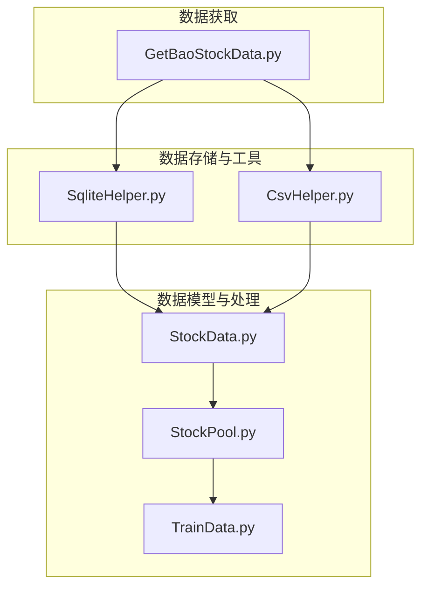
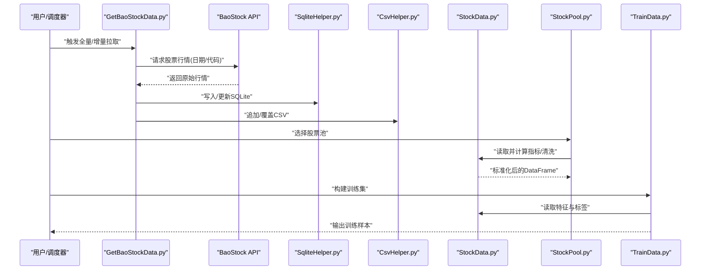
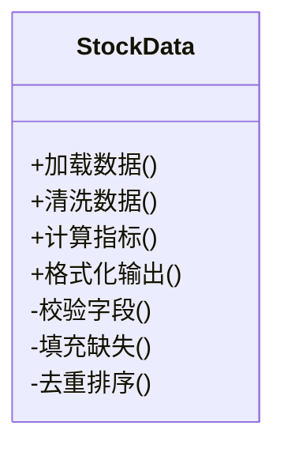
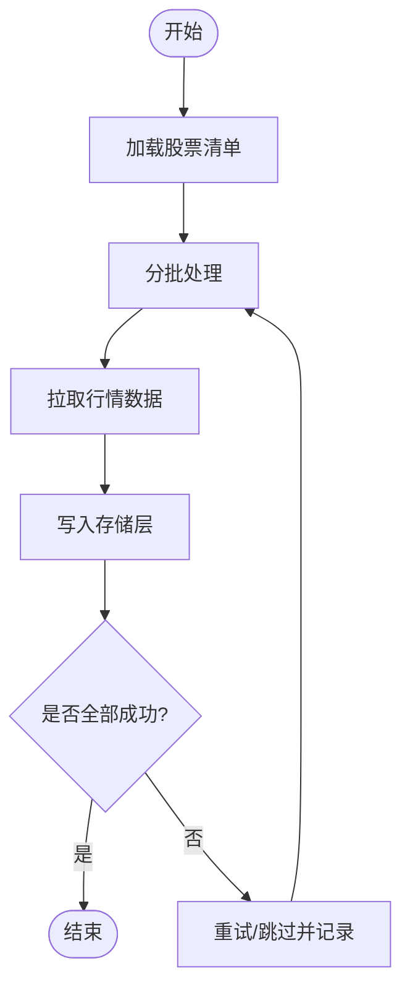
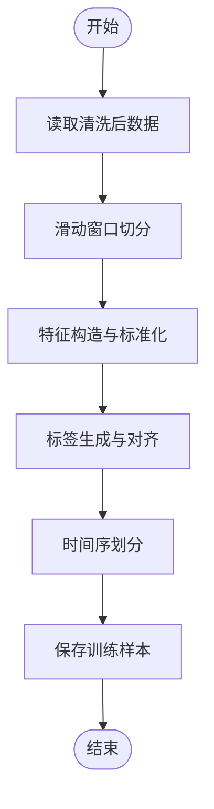
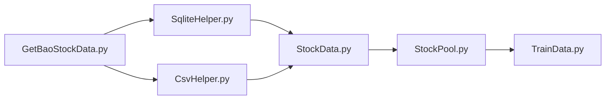

# 数据管理模块

<cite>
**本文引用的文件**   
- [StockData.py](file://MyProject/DataBase/StockData.py)
- [StockPool.py](file://MyProject/DataBase/StockPool.py)
- [TrainData.py](file://MyProject/DataBase/TrainData.py)
- [CsvHelper.py](file://MyProject/Helper/CsvHelper.py)
- [SqliteHelper.py](file://MyProject/Helper/SqliteHelper.py)
- [GetBaoStockData.py](file://GetBaoStockData.py)
</cite>

## 目录
1. [简介](#简介)
2. [项目结构](#项目结构)
3. [核心组件](#核心组件)
4. [架构总览](#架构总览)
5. [详细组件分析](#详细组件分析)
6. [依赖关系分析](#依赖关系分析)
7. [性能考虑](#性能考虑)
8. [故障排查指南](#故障排查指南)
9. [结论](#结论)
10. [附录](#附录)

## 简介
本章节面向数据管理模块，聚焦于股票数据的获取、存储与预处理流程。模块围绕以下目标展开：
- 通过 BaoStock API 获取股票行情数据，并持久化至 SQLite 数据库与 CSV 文件。
- 提供 StockData 类进行技术指标计算、数据清洗与格式转换。
- 通过 StockPool 管理股票池，统一拉取与更新策略。
- 基于 TrainData 构建训练数据集，支撑后续模型训练。
- 建立数据质量检查方法与异常处理策略，保障数据可用性与一致性。
- 给出扩展新数据源与处理逻辑的实践建议，覆盖数据生命周期管理与性能优化。

## 项目结构
数据管理相关代码主要分布在 MyProject/DataBase 与 MyProject/Helper 两个子包中，并通过根目录的脚本完成外部数据源的接入。

图表来源
- [GetBaoStockData.py](file://GetBaoStockData.py)
- [SqliteHelper.py](file://MyProject/Helper/SqliteHelper.py)
- [CsvHelper.py](file://MyProject/Helper/CsvHelper.py)
- [StockData.py](file://MyProject/DataBase/StockData.py)
- [StockPool.py](file://MyProject/DataBase/StockPool.py)
- [TrainData.py](file://MyProject/DataBase/TrainData.py)

章节来源
- [GetBaoStockData.py](file://GetBaoStockData.py)
- [StockData.py](file://MyProject/DataBase/StockData.py)
- [StockPool.py](file://MyProject/DataBase/StockPool.py)
- [TrainData.py](file://MyProject/DataBase/TrainData.py)
- [CsvHelper.py](file://MyProject/Helper/CsvHelper.py)
- [SqliteHelper.py](file://MyProject/Helper/SqliteHelper.py)

## 核心组件
本节概述数据管理模块的核心职责与交互方式：
- 数据获取层：封装 BaoStock API 调用，负责按股票代码或时间范围拉取行情数据，并进行基础校验与落盘。
- 存储层：SQLite 用于结构化查询与增量更新；CSV 用于离线分析与可视化。
- 数据处理层：StockData 提供指标计算、清洗与格式转换能力。
- 资产管理层：StockPool 维护股票列表与批量更新策略。
- 训练数据层：TrainData 将历史行情转换为模型可用的样本序列与标签。

章节来源
- [StockData.py](file://MyProject/DataBase/StockData.py)
- [StockPool.py](file://MyProject/DataBase/StockPool.py)
- [TrainData.py](file://MyProject/DataBase/TrainData.py)
- [CsvHelper.py](file://MyProject/Helper/CsvHelper.py)
- [SqliteHelper.py](file://MyProject/Helper/SqliteHelper.py)
- [GetBaoStockData.py](file://GetBaoStockData.py)

## 架构总览
下图展示了从数据源到训练数据的端到端流程，包括获取、存储、处理与建模准备的关键环节。

图表来源
- [GetBaoStockData.py](file://GetBaoStockData.py)
- [SqliteHelper.py](file://MyProject/Helper/SqliteHelper.py)
- [CsvHelper.py](file://MyProject/Helper/CsvHelper.py)
- [StockData.py](file://MyProject/DataBase/StockData.py)
- [StockPool.py](file://MyProject/DataBase/StockPool.py)
- [TrainData.py](file://MyProject/DataBase/TrainData.py)

## 详细组件分析

### 数据获取：BaoStock API 集成
- 职责
  - 根据股票代码与时间范围调用 BaoStock API。
  - 对返回数据进行基本校验（字段完整性、时间连续性）。
  - 将数据写入 SQLite 与 CSV，支持增量更新。
- 关键流程
  - 参数校验与重试机制。
  - 去重与幂等写入（避免重复记录）。
  - 失败回滚与日志记录。
- 扩展点
  - 新增数据源时，遵循统一的输入输出契约（时间戳、开高低收、成交量等），并在存储层做适配。

章节来源
- [GetBaoStockData.py](file://GetBaoStockData.py)
- [SqliteHelper.py](file://MyProject/Helper/SqliteHelper.py)
- [CsvHelper.py](file://MyProject/Helper/CsvHelper.py)

### 存储层：SQLite 与 CSV
- SQLite
  - 表结构设计：以股票代码为维度，包含交易日期与OHLCV字段，必要时附加元数据与索引。
  - 事务与并发：使用事务保证写入原子性；读写分离避免锁竞争。
  - 增量更新：基于主键或唯一索引实现 upsert。
- CSV
  - 列顺序与编码约定，便于跨工具链消费。
  - 分文件按日或按股票组织，便于并行处理与归档。
- 一致性
  - 双写策略：先写 SQLite，再写 CSV；任一失败需回滚或补偿。

章节来源
- [SqliteHelper.py](file://MyProject/Helper/SqliteHelper.py)
- [CsvHelper.py](file://MyProject/Helper/CsvHelper.py)

### 数据处理：StockData 类
- 核心功能
  - 数据清洗：缺失值填充、异常值检测与剔除、复权处理。
  - 格式转换：统一列名、类型转换、时间索引规范化。
  - 技术指标计算：均线、MACD、RSI、布林带等常用指标。
- 设计要点
  - 方法级幂等：相同输入产生相同输出，便于缓存与回放。
  - 可插拔指标：通过配置注册新的指标函数。
  - 中间态管理：保留清洗前后版本，便于审计与回溯。
- 复杂度与性能
  - 向量化优先，避免逐行循环。
  - 大窗口指标采用滑动窗口优化与内存复用。

图表来源
- [StockData.py](file://MyProject/DataBase/StockData.py)

章节来源
- [StockData.py](file://MyProject/DataBase/StockData.py)

### 股票池管理：StockPool
- 职责
  - 维护股票列表与分组（如板块、指数成分）。
  - 批量拉取与增量更新策略。
  - 监控与告警：拉取失败率、数据新鲜度。
- 关键流程
  - 初始化：加载候选股票清单。
  - 调度：按批次并发拉取，控制速率限制。
  - 汇总：合并结果，生成全局统计与报告。
- 容错
  - 断点续拉：记录已处理股票与时间范围。
  - 重试与退避：网络抖动自动恢复。

图表来源
- [StockPool.py](file://MyProject/DataBase/StockPool.py)
- [GetBaoStockData.py](file://GetBaoStockData.py)
- [SqliteHelper.py](file://MyProject/Helper/SqliteHelper.py)
- [CsvHelper.py](file://MyProject/Helper/CsvHelper.py)

章节来源
- [StockPool.py](file://MyProject/DataBase/StockPool.py)

### 训练数据构建：TrainData
- 职责
  - 从 StockData 提供的特征中抽取样本窗口。
  - 构造标签（如涨跌分类、收益区间等）。
  - 划分训练/验证/测试集，保持时间序不泄露。
- 关键流程
  - 窗口采样：固定长度滑动窗口或事件驱动窗口。
  - 特征工程：标准化、归一化、滞后项构造。
  - 标签对齐：确保标签与窗口终点一致，避免未来信息泄露。
- 输出
  - 图节点/边表示（若为图模型）或序列样本（若为时序模型）。

图表来源
- [TrainData.py](file://MyProject/DataBase/TrainData.py)
- [StockData.py](file://MyProject/DataBase/StockData.py)

章节来源
- [TrainData.py](file://MyProject/DataBase/TrainData.py)

### 数据质量检查与异常处理
- 质量检查
  - 完整性：必填字段非空、时间连续、无重复主键。
  - 合理性：价格非负、涨跌幅在合理区间、成交量非负。
  - 一致性：多源对比（SQLite vs CSV）、跨日衔接平滑。
- 异常处理
  - 网络异常：超时、限流、重试与退避。
  - 数据异常：脏数据隔离、告警与人工复核通道。
  - 存储异常：事务回滚、损坏文件修复与备份恢复。
- 监控与审计
  - 记录拉取与处理日志，保留错误样本与上下文。
  - 定期生成数据健康报告（覆盖率、缺失率、异常率）。

章节来源
- [StockData.py](file://MyProject/DataBase/StockData.py)
- [StockPool.py](file://MyProject/DataBase/StockPool.py)
- [SqliteHelper.py](file://MyProject/Helper/SqliteHelper.py)
- [CsvHelper.py](file://MyProject/Helper/CsvHelper.py)
- [GetBaoStockData.py](file://GetBaoStockData.py)

### 扩展新数据源与处理逻辑
- 数据源扩展步骤
  - 定义输入契约：统一字段名、时间戳与时区、单位与复权口径。
  - 实现适配器：对接新 API，遵循现有重试、去重与落盘策略。
  - 注册处理管线：在 StockData 中注册新的清洗规则与指标函数。
  - 回归测试：用历史数据回放，验证指标与标签一致性。
- 示例路径（不含具体代码）
  - 新增数据源适配：参考 [GetBaoStockData.py](file://GetBaoStockData.py) 的调用模式与错误处理。
  - 新增指标函数：参考 [StockData.py](file://MyProject/DataBase/StockData.py) 的计算接口与输入输出约定。
  - 新增存储后端：参考 [SqliteHelper.py](file://MyProject/Helper/SqliteHelper.py) 与 [CsvHelper.py](file://MyProject/Helper/CsvHelper.py) 的抽象接口。

章节来源
- [GetBaoStockData.py](file://GetBaoStockData.py)
- [StockData.py](file://MyProject/DataBase/StockData.py)
- [SqliteHelper.py](file://MyProject/Helper/SqliteHelper.py)
- [CsvHelper.py](file://MyProject/Helper/CsvHelper.py)

## 依赖关系分析
- 内部依赖
  - GetBaoStockData 依赖 SqliteHelper 与 CsvHelper 完成持久化。
  - StockData 依赖存储层读取原始数据，并提供清洗与指标计算。
  - StockPool 协调多个股票的拉取与更新，依赖 StockData 进行单标的处理。
  - TrainData 依赖 StockData 的输出作为特征与标签来源。
- 外部依赖
  - BaoStock API：提供行情数据接口。
  - SQLite：轻量级关系型数据库。
  - CSV：通用文本表格格式。

图表来源
- [GetBaoStockData.py](file://GetBaoStockData.py)
- [SqliteHelper.py](file://MyProject/Helper/SqliteHelper.py)
- [CsvHelper.py](file://MyProject/Helper/CsvHelper.py)
- [StockData.py](file://MyProject/DataBase/StockData.py)
- [StockPool.py](file://MyProject/DataBase/StockPool.py)
- [TrainData.py](file://MyProject/DataBase/TrainData.py)

章节来源
- [GetBaoStockData.py](file://GetBaoStockData.py)
- [StockData.py](file://MyProject/DataBase/StockData.py)
- [StockPool.py](file://MyProject/DataBase/StockPool.py)
- [TrainData.py](file://MyProject/DataBase/TrainData.py)
- [CsvHelper.py](file://MyProject/Helper/CsvHelper.py)
- [SqliteHelper.py](file://MyProject/Helper/SqliteHelper.py)

## 性能考虑
- 批处理与并发
  - 股票池拉取采用分批并发，控制并发度以避免 API 限流。
  - 存储写入使用批量插入与事务包裹，减少磁盘 I/O 次数。
- 内存与索引
  - 大窗口指标计算采用滑动窗口与预分配数组，降低内存峰值。
  - SQLite 针对股票代码与日期建立复合索引，加速查询与去重。
- 缓存与增量
  - 对频繁访问的中间结果进行缓存（如标准化参数、指标系数）。
  - 增量更新仅拉取最新交易日，避免全量重算。
- 序列化与传输
  - CSV 使用压缩与分片，提升传输与归档效率。
  - 统一编码与列顺序，减少解析开销。

[本节为通用性能建议，无需特定文件引用]

## 故障排查指南
- 常见问题
  - API 限流或超时：检查重试间隔与最大重试次数，适当降速。
  - 数据缺失或不连续：核对时间范围与复权口径，补充缺失日。
  - 写入失败或锁冲突：确认事务边界与并发写入策略，必要时串行化。
- 定位手段
  - 查看拉取与处理日志，定位失败股票与时间点。
  - 对比 SQLite 与 CSV 的一致性，快速发现双写问题。
  - 回放历史数据，复现问题并验证修复效果。
- 恢复策略
  - 断点续拉：记录已处理进度，避免重复工作。
  - 备份与回滚：在重大变更前备份数据，失败时快速回滚。

章节来源
- [StockPool.py](file://MyProject/DataBase/StockPool.py)
- [StockData.py](file://MyProject/DataBase/StockData.py)
- [SqliteHelper.py](file://MyProject/Helper/SqliteHelper.py)
- [CsvHelper.py](file://MyProject/Helper/CsvHelper.py)
- [GetBaoStockData.py](file://GetBaoStockData.py)

## 结论
数据管理模块通过清晰的层次划分与严格的契约约束，实现了从数据获取、存储、处理到训练样本构建的完整闭环。借助 StockData 的可插拔指标与清洗能力、StockPool 的批量管理能力以及 TrainData 的样本构造流程，系统具备良好的可扩展性与稳定性。配合完善的质量检查与异常处理策略，能够保障数据生命周期内的一致性与可用性。

[本节为总结性内容，无需特定文件引用]

## 附录
- 术语
  - OHLCV：开盘价、最高价、最低价、收盘价、成交量。
  - 复权：前复权/后复权，消除分红拆股对价格的影响。
  - 滑动窗口：固定长度的时间切片，用于时序建模。
- 最佳实践
  - 统一数据契约与命名规范，避免歧义。
  - 所有写入操作置于事务中，确保原子性。
  - 对关键指标与标签进行单元测试与回归测试。
  - 建立数据健康看板，持续监控质量与时效。

[本节为概念性内容，无需特定文件引用]