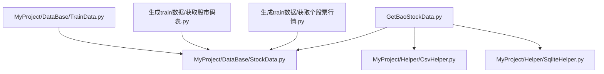
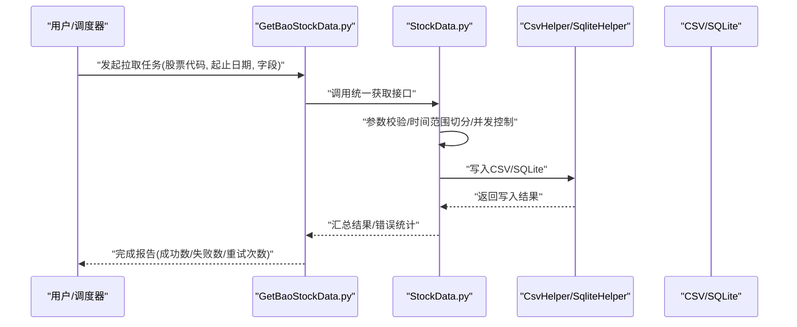
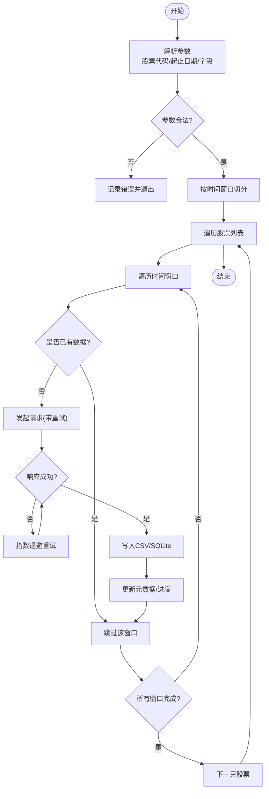
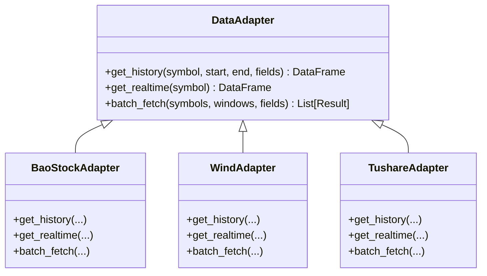
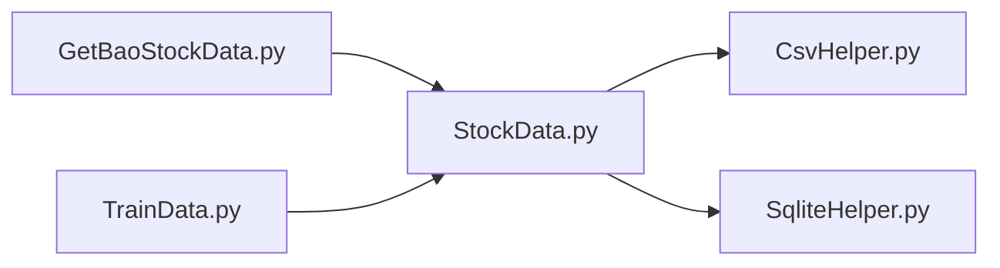

# 数据获取与采集

<cite>
**本文引用的文件**   
- [GetBaoStockData.py](file://GetBaoStockData.py)
- [MyProject/DataBase/StockData.py](file://MyProject/DataBase/StockData.py)
- [MyProject/DataBase/StockData_20241001.py](file://MyProject/DataBase/StockData_20241001.py)
- [MyProject/DataBase/TrainData.py](file://MyProject/DataBase/TrainData.py)
- [MyProject/Helper/CsvHelper.py](file://MyProject/Helper/CsvHelper.py)
- [MyProject/Helper/SqliteHelper.py](file://MyProject/Helper/SqliteHelper.py)
- [生成train数据/获取个股票行情.py](file://生成train数据/获取个股票行情.py)
- [生成train数据/获取股市码表.py](file://生成train数据/获取股市码表.py)
</cite>

## 目录
1. [简介](#简介)
2. [项目结构](#项目结构)
3. [核心组件](#核心组件)
4. [架构总览](#架构总览)
5. [详细组件分析](#详细组件分析)
6. [依赖关系分析](#依赖关系分析)
7. [性能考虑](#性能考虑)
8. [故障排查指南](#故障排查指南)
9. [结论](#结论)
10. [附录](#附录)

## 简介
本章节面向“数据获取与采集”主题，围绕 BaoStock API 的集成机制、历史数据批量获取流程、实时数据更新与同步策略、可扩展的数据源适配器模式，以及并发、缓存、断点续传等性能优化手段进行系统化说明。文档同时给出常见网络异常的处理方案与重试机制实现要点，帮助读者在现有代码基础上快速扩展新的数据源接口并稳定运行。

## 项目结构
本项目中与数据获取和采集相关的核心位置如下：
- 根目录脚本：用于直接调用 BaoStock 拉取数据或生成训练数据
- MyProject/DataBase：存放与数据存储、清洗、入库相关的模块
- MyProject/Helper：通用工具（CSV、SQLite、日志等）
- 生成train数据：包含从行情到训练数据的流水线脚本

图表来源
- [GetBaoStockData.py](file://GetBaoStockData.py)
- [MyProject/DataBase/StockData.py](file://MyProject/DataBase/StockData.py)
- [MyProject/Helper/CsvHelper.py](file://MyProject/Helper/CsvHelper.py)
- [MyProject/Helper/SqliteHelper.py](file://MyProject/Helper/SqliteHelper.py)
- [生成train数据/获取个股票行情.py](file://生成train数据/获取个股票行情.py)
- [生成train数据/获取股市码表.py](file://生成train数据/获取股市码表.py)
- [MyProject/DataBase/TrainData.py](file://MyProject/DataBase/TrainData.py)

章节来源
- [GetBaoStockData.py](file://GetBaoStockData.py)
- [MyProject/DataBase/StockData.py](file://MyProject/DataBase/StockData.py)
- [MyProject/Helper/CsvHelper.py](file://MyProject/Helper/CsvHelper.py)
- [MyProject/Helper/SqliteHelper.py](file://MyProject/Helper/SqliteHelper.py)
- [生成train数据/获取个股票行情.py](file://生成train数据/获取个股票行情.py)
- [生成train数据/获取股市码表.py](file://生成train数据/获取股市码表.py)
- [MyProject/DataBase/TrainData.py](file://MyProject/DataBase/TrainData.py)

## 核心组件
- BaoStock 数据获取入口：提供统一的拉取方法封装，负责参数校验、时间范围切分、字段选择、错误处理与落盘
- 数据持久化层：通过 CSV/SQLite 将原始数据落地，便于后续训练与回测
- 辅助工具：CSV 读写、SQLite 连接管理、日志记录等
- 训练数据构建：基于已落地的历史数据生成模型输入

章节来源
- [GetBaoStockData.py](file://GetBaoStockData.py)
- [MyProject/DataBase/StockData.py](file://MyProject/DataBase/StockData.py)
- [MyProject/Helper/CsvHelper.py](file://MyProject/Helper/CsvHelper.py)
- [MyProject/Helper/SqliteHelper.py](file://MyProject/Helper/SqliteHelper.py)
- [MyProject/DataBase/TrainData.py](file://MyProject/DataBase/TrainData.py)

## 架构总览
整体数据流从 BaoStock 接口开始，经过本地适配与批处理，最终写入存储介质，供下游训练使用。

图表来源
- [GetBaoStockData.py](file://GetBaoStockData.py)
- [MyProject/DataBase/StockData.py](file://MyProject/DataBase/StockData.py)
- [MyProject/Helper/CsvHelper.py](file://MyProject/Helper/CsvHelper.py)
- [MyProject/Helper/SqliteHelper.py](file://MyProject/Helper/SqliteHelper.py)

## 详细组件分析

### BaoStock 集成与调用方法
- 认证配置
  - 若 BaoStock 需要凭据，建议在配置文件或环境变量中集中管理，避免硬编码
  - 初始化时读取配置并建立会话/客户端实例，复用连接以减少握手开销
- API 调用方法
  - 统一封装为高层函数，暴露参数：股票代码、起始/结束日期、频率、字段列表
  - 内部实现：参数校验、时间窗口切分、请求构造、响应解析、异常捕获
- 错误处理策略
  - 区分可重试错误（网络抖动、限流）与不可重试错误（参数非法、权限不足）
  - 对可重试错误实施指数退避重试；对不可重试错误快速失败并记录上下文

章节来源
- [GetBaoStockData.py](file://GetBaoStockData.py)
- [MyProject/DataBase/StockData.py](file://MyProject/DataBase/StockData.py)

### 股票历史数据获取流程
- 时间范围设置
  - 按交易日或自然日切分，避免单次请求过大导致超时或被限流
  - 支持增量拉取：仅拉取上次缺失的时间段
- 数据字段选择
  - 按需指定字段，减少传输体积与解析成本
  - 字段映射至本地标准结构，保证一致性
- 批量下载优化
  - 并发控制：限制最大并发度，避免触发服务端限流
  - 去重与幂等：以“股票+日期+字段”作为唯一键，重复请求不产生冗余写入
  - 断点续传：记录每个批次/每只股票的进度，中断后可恢复

图表来源
- [MyProject/DataBase/StockData.py](file://MyProject/DataBase/StockData.py)
- [MyProject/Helper/CsvHelper.py](file://MyProject/Helper/CsvHelper.py)
- [MyProject/Helper/SqliteHelper.py](file://MyProject/Helper/SqliteHelper.py)

章节来源
- [MyProject/DataBase/StockData.py](file://MyProject/DataBase/StockData.py)
- [MyProject/Helper/CsvHelper.py](file://MyProject/Helper/CsvHelper.py)
- [MyProject/Helper/SqliteHelper.py](file://MyProject/Helper/SqliteHelper.py)

### 实时数据更新机制与数据同步策略
- 实时拉取
  - 采用定时任务或事件驱动，按分钟/秒级频率拉取最新K线或快照
  - 增量合并：以主键去重，避免重复插入
- 同步策略
  - 全量+增量结合：首次全量，之后增量
  - 冲突解决：以服务器时间为准，保留最新记录
  - 健康检查：定期探测服务可用性，异常时降级为离线模式

章节来源
- [MyProject/DataBase/StockData.py](file://MyProject/DataBase/StockData.py)
- [MyProject/Helper/SqliteHelper.py](file://MyProject/Helper/SqliteHelper.py)

### 可扩展的数据源适配器模式
- 设计原则
  - 定义统一抽象接口：get_history(symbol, start, end, fields)、get_realtime(symbol)、batch_fetch(...)
  - 具体实现：BaoStockAdapter、WindAdapter、TushareAdapter 等
  - 工厂注册：根据配置动态选择适配器
- 扩展步骤
  - 新增适配器类实现统一接口
  - 在工厂中注册新适配器
  - 在配置中选择目标数据源
- 示例路径（示意）
  - 适配器接口定义参考：[MyProject/DataBase/StockData.py](file://MyProject/DataBase/StockData.py)
  - 具体实现与调用参考：[GetBaoStockData.py](file://GetBaoStockData.py)

图表来源
- [MyProject/DataBase/StockData.py](file://MyProject/DataBase/StockData.py)
- [GetBaoStockData.py](file://GetBaoStockData.py)

章节来源
- [MyProject/DataBase/StockData.py](file://MyProject/DataBase/StockData.py)
- [GetBaoStockData.py](file://GetBaoStockData.py)

### 数据落盘与训练数据构建
- 落盘格式
  - CSV：适合小批量、易查看
  - SQLite：适合结构化查询与增量合并
- 训练数据构建
  - 从已落地的历史数据中抽取特征序列，生成模型输入
  - 版本化管理：按日期或版本号保存中间产物，便于回溯

章节来源
- [MyProject/Helper/CsvHelper.py](file://MyProject/Helper/CsvHelper.py)
- [MyProject/Helper/SqliteHelper.py](file://MyProject/Helper/SqliteHelper.py)
- [MyProject/DataBase/TrainData.py](file://MyProject/DataBase/TrainData.py)

### 相关脚本与用法
- 获取个股行情：用于单股或少量股票的快速拉取与验证
- 获取股市码表：用于获取标的清单，配合批量拉取

章节来源
- [生成train数据/获取个股票行情.py](file://生成train数据/获取个股票行情.py)
- [生成train数据/获取股市码表.py](file://生成train数据/获取股市码表.py)

## 依赖关系分析
- 模块耦合
  - GetBaoStockData.py 依赖 StockData.py 的核心拉取逻辑
  - StockData.py 依赖 CsvHelper.py 与 SqliteHelper.py 进行落盘
  - 训练数据构建依赖已落地的历史数据
- 外部依赖
  - BaoStock SDK/HTTP 接口
  - 数据库驱动（SQLite）
  - 文件系统（CSV）

图表来源
- [GetBaoStockData.py](file://GetBaoStockData.py)
- [MyProject/DataBase/StockData.py](file://MyProject/DataBase/StockData.py)
- [MyProject/Helper/CsvHelper.py](file://MyProject/Helper/CsvHelper.py)
- [MyProject/Helper/SqliteHelper.py](file://MyProject/Helper/SqliteHelper.py)
- [MyProject/DataBase/TrainData.py](file://MyProject/DataBase/TrainData.py)

章节来源
- [GetBaoStockData.py](file://GetBaoStockData.py)
- [MyProject/DataBase/StockData.py](file://MyProject/DataBase/StockData.py)
- [MyProject/Helper/CsvHelper.py](file://MyProject/Helper/CsvHelper.py)
- [MyProject/Helper/SqliteHelper.py](file://MyProject/Helper/SqliteHelper.py)
- [MyProject/DataBase/TrainData.py](file://MyProject/DataBase/TrainData.py)

## 性能考虑
- 并发请求
  - 使用线程池或进程池控制并发度，避免触发服务端限流
  - 针对热点股票设置更低的并发度，冷门股票提高并发度
- 缓存策略
  - 本地缓存：按“股票+日期+字段”缓存最近一次结果，避免重复请求
  - 内存缓存：短生命周期缓存高频访问的元数据（如交易日历）
- 断点续传
  - 记录每个批次的进度（股票、时间窗口、状态），重启后跳过已完成部分
  - 写入原子性：先写临时文件，成功后再重命名为正式文件
- 网络优化
  - 连接复用：保持长连接或会话对象
  - 压缩与字段裁剪：仅拉取必要字段，必要时启用压缩
- 存储优化
  - SQLite 使用事务批量提交，减少磁盘IO
  - CSV 使用追加模式并按天分文件，降低单文件大小

[本节为通用性能建议，无需特定文件引用]

## 故障排查指南
- 常见网络异常
  - 连接超时/断开：增加重试次数与退避间隔，记录失败详情
  - 限流/配额不足：降低并发度，增加等待时间，分批执行
  - 证书/代理问题：检查系统代理与证书配置
- 数据异常
  - 字段缺失/类型不一致：在解析阶段做严格校验与默认值填充
  - 重复数据：以主键去重，合并策略以服务器时间为准
- 重试机制实现要点
  - 指数退避：基础间隔 × 2^重试次数，加入随机抖动
  - 熔断保护：连续失败超过阈值则暂停一段时间，避免雪崩
  - 可观测性：记录每次重试的耗时、错误码、堆栈信息

章节来源
- [MyProject/DataBase/StockData.py](file://MyProject/DataBase/StockData.py)
- [MyProject/Helper/SqliteHelper.py](file://MyProject/Helper/SqliteHelper.py)
- [MyProject/Helper/CsvHelper.py](file://MyProject/Helper/CsvHelper.py)

## 结论
通过对 BaoStock API 的统一封装、严格的错误处理与重试机制、并发与缓存优化、以及断点续传能力，本项目实现了稳定高效的历史与实时数据采集链路。借助适配器模式，未来可平滑接入更多数据源，满足多样化业务需求。

## 附录
- 术语
  - 增量拉取：仅拉取缺失时间段的数据
  - 幂等：重复请求不会产生副作用
  - 指数退避：重试间隔随次数呈指数增长
- 最佳实践
  - 配置与代码分离，敏感信息不入仓
  - 明确的主键与去重策略
  - 完善的日志与监控指标

[本节为概念性内容，无需特定文件引用]