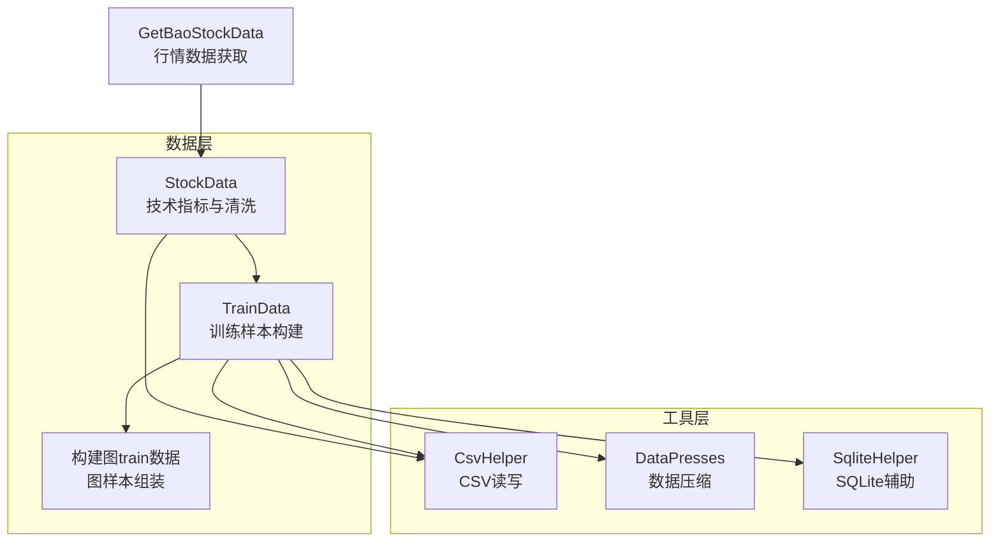
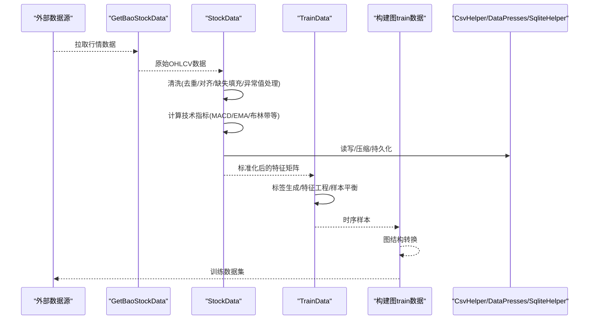
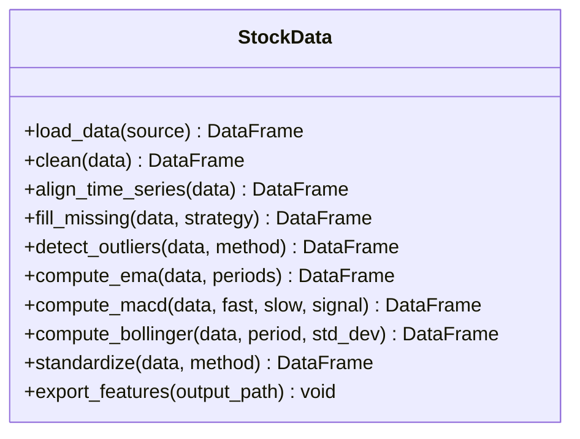
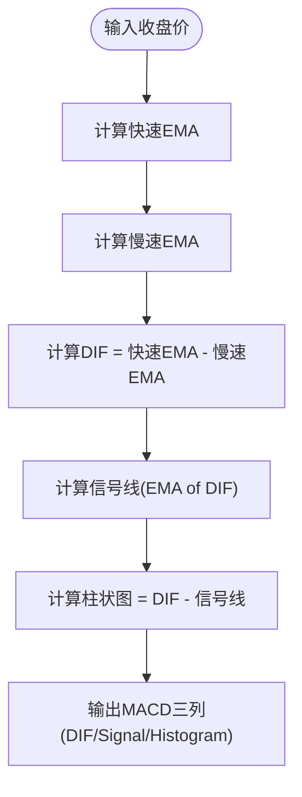
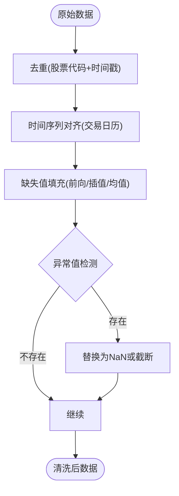
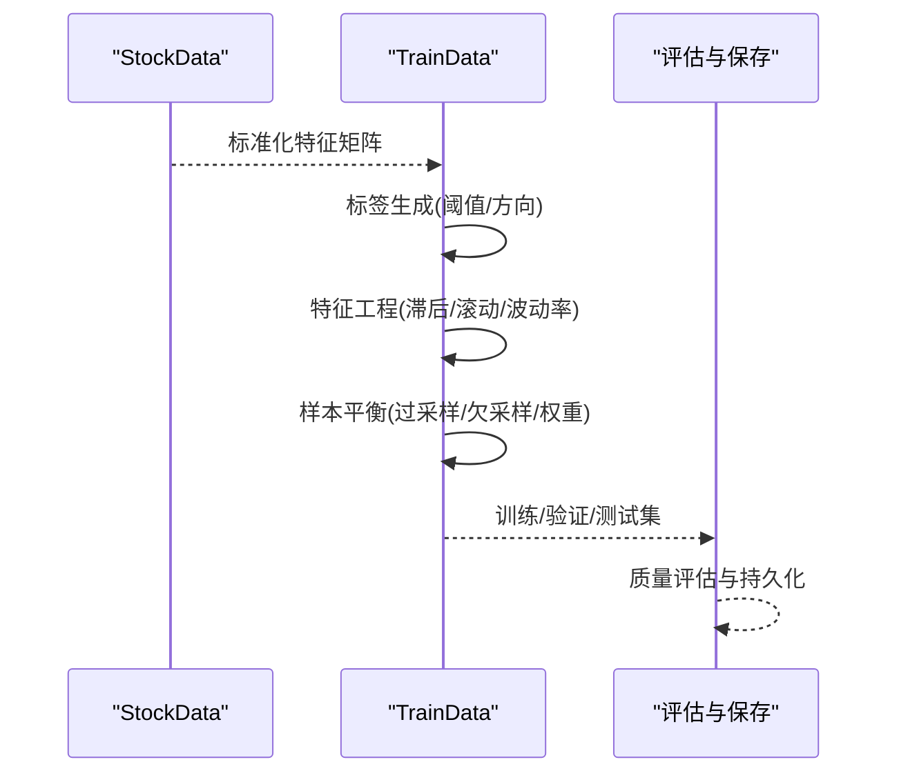
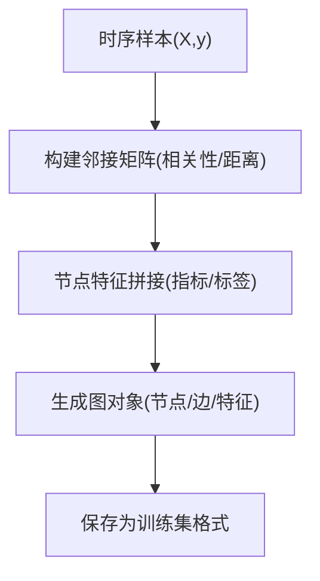
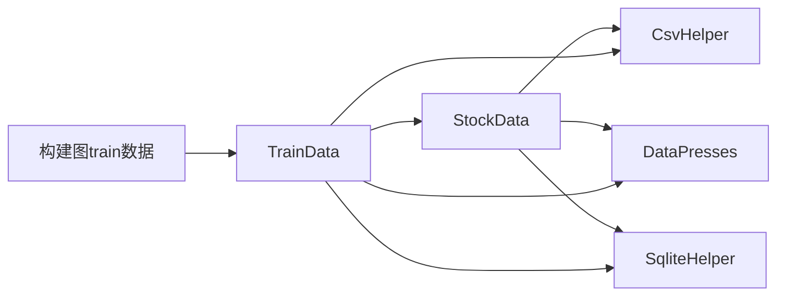

# 数据预处理与清洗

<cite>
**本文引用的文件**   
- [StockData.py](file://MyProject/DataBase/StockData.py)
- [StockData_20241001.py](file://MyProject/DataBase/StockData_20241001.py)
- [TrainData.py](file://MyProject/DataBase/TrainData.py)
- [TrainData_20240423.py](file://MyProject/DataBase/TrainData_20240423.py)
- [构建图train数据.py](file://MyProject/DataBase/构建图train数据.py)
- [CsvHelper.py](file://MyProject/Helper/CsvHelper.py)
- [DataPresses.py](file://MyProject/Helper/DataPresses.py)
- [SqliteHelper.py](file://MyProject/Helper/SqliteHelper.py)
- [GetBaoStockData.py](file://GetBaoStockData.py)
</cite>

## 目录
1. [简介](#简介)
2. [项目结构](#项目结构)
3. [核心组件](#核心组件)
4. [架构总览](#架构总览)
5. [详细组件分析](#详细组件分析)
6. [依赖关系分析](#依赖关系分析)
7. [性能考虑](#性能考虑)
8. [故障排查指南](#故障排查指南)
9. [结论](#结论)
10. [附录](#附录)

## 简介
本文件面向数据预处理与清洗模块，重点围绕 StockData 类的核心算法与数据处理流程展开，涵盖技术指标计算（MACD、EMA、布林带等）、数据标准化处理、缺失值填充策略；数据清洗流程（异常值检测、去重、时间序列对齐）；训练数据构建（标签生成规则、特征工程、样本平衡）；并给出扩展新指标与自定义转换函数的方法。同时提供数据质量评估指标与自动化测试建议，以及大数据量场景下的性能优化与内存使用策略。

## 项目结构
本项目采用按功能域划分的目录组织方式：
- MyProject/DataBase：数据模型与训练数据构建的核心实现，包含 StockData、TrainData 及图训练数据构建脚本。
- MyProject/Helper：通用工具库，包括 CSV 读写、数据压缩、SQLite 辅助等。
- GetBaoStockData.py：外部行情数据获取入口。

图表来源
- [StockData.py:1-200](file://MyProject/DataBase/StockData.py#L1-L200)
- [TrainData.py:1-200](file://MyProject/DataBase/TrainData.py#L1-L200)
- [构建图train数据.py:1-200](file://MyProject/DataBase/构建图train数据.py#L1-L200)
- [CsvHelper.py:1-200](file://MyProject/Helper/CsvHelper.py#L1-L200)
- [DataPresses.py:1-200](file://MyProject/Helper/DataPresses.py#L1-L200)
- [SqliteHelper.py:1-200](file://MyProject/Helper/SqliteHelper.py#L1-L200)
- [GetBaoStockData.py:1-200](file://GetBaoStockData.py#L1-L200)

章节来源
- [StockData.py:1-200](file://MyProject/DataBase/StockData.py#L1-L200)
- [TrainData.py:1-200](file://MyProject/DataBase/TrainData.py#L1-L200)
- [构建图train数据.py:1-200](file://MyProject/DataBase/构建图train数据.py#L1-L200)
- [CsvHelper.py:1-200](file://MyProject/Helper/CsvHelper.py#L1-L200)
- [DataPresses.py:1-200](file://MyProject/Helper/DataPresses.py#L1-L200)
- [SqliteHelper.py:1-200](file://MyProject/Helper/SqliteHelper.py#L1-L200)
- [GetBaoStockData.py:1-200](file://GetBaoStockData.py#L1-L200)

## 核心组件
- StockData：负责原始行情数据的加载、清洗、技术指标计算、标准化与缺失值填充，是后续训练数据构建的基础。
- TrainData：基于 StockData 的输出，进行标签生成、特征工程、样本划分与平衡策略，输出可用于训练的样本集。
- 构建图train数据：将时序样本转换为图结构样本，适配图神经网络训练需求。
- Helper 工具：提供 CSV 读写、数据压缩、SQLite 存取等通用能力，支撑大规模数据处理。

章节来源
- [StockData.py:1-200](file://MyProject/DataBase/StockData.py#L1-L200)
- [TrainData.py:1-200](file://MyProject/DataBase/TrainData.py#L1-L200)
- [构建图train数据.py:1-200](file://MyProject/DataBase/构建图train数据.py#L1-L200)
- [CsvHelper.py:1-200](file://MyProject/Helper/CsvHelper.py#L1-L200)
- [DataPresses.py:1-200](file://MyProject/Helper/DataPresses.py#L1-L200)
- [SqliteHelper.py:1-200](file://MyProject/Helper/SqliteHelper.py#L1-L200)

## 架构总览
整体数据流从外部行情数据获取开始，经过 StockData 的清洗与指标计算，再由 TrainData 完成标签与特征工程，最终由图构建脚本产出训练样本。

图表来源
- [GetBaoStockData.py:1-200](file://GetBaoStockData.py#L1-L200)
- [StockData.py:1-200](file://MyProject/DataBase/StockData.py#L1-L200)
- [TrainData.py:1-200](file://MyProject/DataBase/TrainData.py#L1-L200)
- [构建图train数据.py:1-200](file://MyProject/DataBase/构建图train数据.py#L1-L200)
- [CsvHelper.py:1-200](file://MyProject/Helper/CsvHelper.py#L1-L200)
- [DataPresses.py:1-200](file://MyProject/Helper/DataPresses.py#L1-L200)
- [SqliteHelper.py:1-200](file://MyProject/Helper/SqliteHelper.py#L1-L200)

## 详细组件分析

### StockData 类：技术指标与数据清洗
StockData 承担以下职责：
- 数据加载与校验：读取 OHLCV 字段，校验时间戳连续性、数据类型与范围。
- 数据清洗：
  - 重复数据去除：基于股票代码与时间戳去重。
  - 时间序列对齐：统一交易日历，补齐缺失交易日。
  - 缺失值填充：前向填充、线性插值或均值填充，依据字段特性选择。
  - 异常值检测：基于分位数或移动窗口统计剔除极端值。
- 技术指标计算：
  - EMA：指数移动平均，支持多周期。
  - MACD：快慢EMA差值与信号线平滑。
  - 布林带：基于移动均值与标准差上下轨。
  - 其他常见指标（如RSI、KDJ等）可按需扩展。
- 数据标准化：
  - Z-Score标准化、Min-Max归一化、对数变换等，针对价格与成交量分别处理。
- 输出：结构化特征矩阵与元数据（时间戳、股票ID）。

图表来源
- [StockData.py:1-200](file://MyProject/DataBase/StockData.py#L1-L200)
- [StockData_20241001.py:1-200](file://MyProject/DataBase/StockData_20241001.py#L1-L200)

章节来源
- [StockData.py:1-200](file://MyProject/DataBase/StockData.py#L1-L200)
- [StockData_20241001.py:1-200](file://MyProject/DataBase/StockData_20241001.py#L1-L200)

#### 技术指标计算流程（以MACD为例）

图表来源
- [StockData.py:1-200](file://MyProject/DataBase/StockData.py#L1-L200)

#### 数据清洗流程（异常值检测与缺失填充）

图表来源
- [StockData.py:1-200](file://MyProject/DataBase/StockData.py#L1-L200)

### TrainData：训练数据构建
TrainData 基于 StockData 输出的特征矩阵，执行以下步骤：
- 标签生成：根据未来收益阈值或趋势方向生成分类/回归标签。
- 特征工程：构造滞后特征、滚动统计、波动率特征、动量因子等。
- 样本平衡：过采样、欠采样或加权损失函数缓解类别不平衡。
- 数据切分：时间序列切分（训练/验证/测试），避免未来信息泄露。
- 输出：可直接用于模型训练的样本集（X, y）与元数据。

图表来源
- [TrainData.py:1-200](file://MyProject/DataBase/TrainData.py#L1-L200)
- [TrainData_20240423.py:1-200](file://MyProject/DataBase/TrainData_20240423.py#L1-L200)

章节来源
- [TrainData.py:1-200](file://MyProject/DataBase/TrainData.py#L1-L200)
- [TrainData_20240423.py:1-200](file://MyProject/DataBase/TrainData.py#L1-L200)

### 构建图train数据：图结构转换
该模块将时序样本转换为图结构，节点表示时间步或资产，边表示相关性或邻接关系，便于图神经网络学习跨资产与时序的联合模式。

图表来源
- [构建图train数据.py:1-200](file://MyProject/DataBase/构建图train数据.py#L1-L200)

章节来源
- [构建图train数据.py:1-200](file://MyProject/DataBase/构建图train数据.py#L1-L200)

### 扩展新指标与自定义转换函数
- 新增技术指标：在 StockData 中增加计算方法，遵循统一的输入输出规范（DataFrame 列名约定），并在导出前纳入特征矩阵。
- 自定义数据转换：通过注册式或工厂模式添加转换函数，支持链式调用，便于组合多种标准化与缩放策略。

章节来源
- [StockData.py:1-200](file://MyProject/DataBase/StockData.py#L1-L200)

## 依赖关系分析
- StockData 依赖 CsvHelper 进行CSV读写，可能依赖 DataPresses 进行数据压缩，依赖 SqliteHelper 进行中间结果持久化。
- TrainData 依赖 StockData 的输出，并复用工具库进行数据持久化与压缩。
- 构建图train数据依赖 TrainData 的输出，进行图结构转换。

图表来源
- [StockData.py:1-200](file://MyProject/DataBase/StockData.py#L1-L200)
- [TrainData.py:1-200](file://MyProject/DataBase/TrainData.py#L1-L200)
- [构建图train数据.py:1-200](file://MyProject/DataBase/构建图train数据.py#L1-L200)
- [CsvHelper.py:1-200](file://MyProject/Helper/CsvHelper.py#L1-L200)
- [DataPresses.py:1-200](file://MyProject/Helper/DataPresses.py#L1-L200)
- [SqliteHelper.py:1-200](file://MyProject/Helper/SqliteHelper.py#L1-L200)

章节来源
- [StockData.py:1-200](file://MyProject/DataBase/StockData.py#L1-L200)
- [TrainData.py:1-200](file://MyProject/DataBase/TrainData.py#L1-L200)
- [构建图train数据.py:1-200](file://MyProject/DataBase/构建图train数据.py#L1-L200)
- [CsvHelper.py:1-200](file://MyProject/Helper/CsvHelper.py#L1-L200)
- [DataPresses.py:1-200](file://MyProject/Helper/DataPresses.py#L1-L200)
- [SqliteHelper.py:1-200](file://MyProject/Helper/SqliteHelper.py#L1-L200)

## 性能考虑
- 大数据量处理：
  - 使用增量读取与分块处理（chunksize）降低内存峰值。
  - 优先使用向量化操作（NumPy/Pandas）替代循环。
  - 利用并行计算（多进程/多线程）加速指标计算与清洗。
- 内存优化：
  - 使用合适的数据类型（如 float32、int16）减少内存占用。
  - 及时释放中间变量，避免不必要的副本。
  - 使用生成器与惰性求值处理长序列。
- I/O 优化：
  - 使用压缩格式（Parquet/Zstd）存储中间结果。
  - 缓存热点数据到 SQLite 或内存数据库。
- 指标计算优化：
  - 预计算常用窗口统计（滚动均值/方差）。
  - 使用Cython/Numba加速关键路径。

[本节为通用指导，不直接分析具体文件]

## 故障排查指南
- 常见问题：
  - 时间戳不一致导致对齐失败：检查交易日历与本地时区设置。
  - 缺失值过多导致指标失效：调整填充策略或过滤低质量标的。
  - 异常值误删：放宽阈值或使用稳健统计量（中位数/四分位距）。
  - 标签泄露：确保标签仅使用未来信息，避免前视偏差。
- 调试建议：
  - 打印关键步骤的统计摘要（均值、方差、缺失比例）。
  - 可视化指标曲线与异常点定位。
  - 使用单元测试覆盖清洗与指标计算的关键分支。

章节来源
- [StockData.py:1-200](file://MyProject/DataBase/StockData.py#L1-L200)
- [TrainData.py:1-200](file://MyProject/DataBase/TrainData.py#L1-L200)

## 结论
StockData 与 TrainData 构成了完整的数据预处理与训练样本构建流水线。通过严谨的清洗流程、丰富的技术指标与灵活的标准化策略，系统能够稳定地生成高质量训练数据。结合图结构转换，可进一步发挥图神经网络在多资产与时序建模中的优势。建议在扩展新指标与转换函数时遵循统一接口，持续完善数据质量评估与自动化测试，以提升系统的可维护性与鲁棒性。

[本节为总结，不直接分析具体文件]

## 附录
- 数据质量评估指标：
  - 缺失率、异常值比例、分布稳定性（KS检验）、指标有效性（与收益的相关性）。
- 自动化测试方法：
  - 单元测试：覆盖清洗、指标计算、标准化等核心逻辑。
  - 集成测试：端到端数据流验证，确保输入输出一致性。
  - 性能基准：监控内存与耗时，防止退化。

[本节为补充说明，不直接分析具体文件]