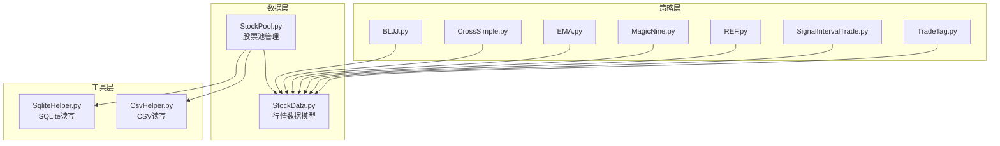
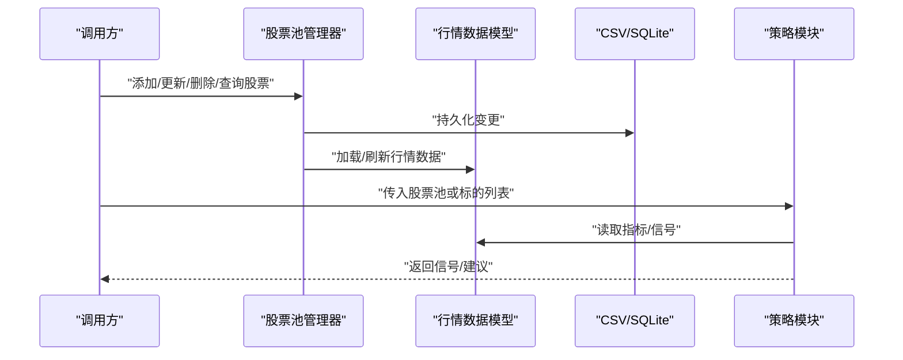
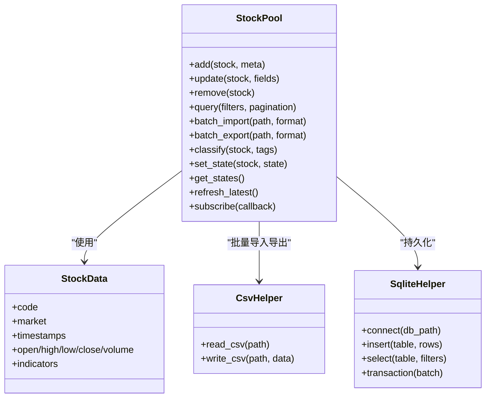
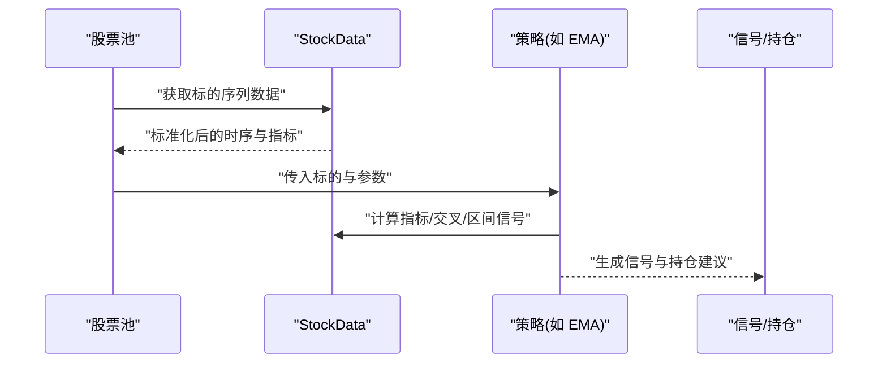
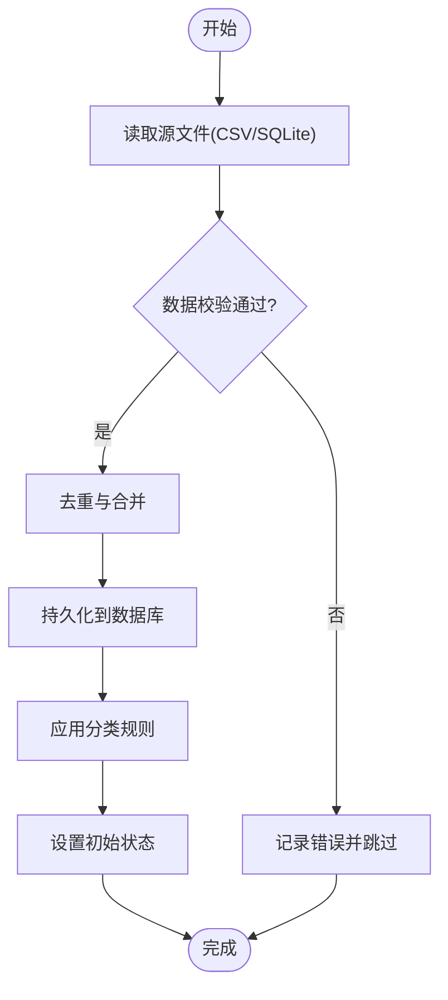
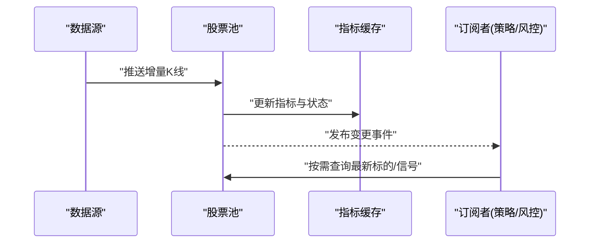
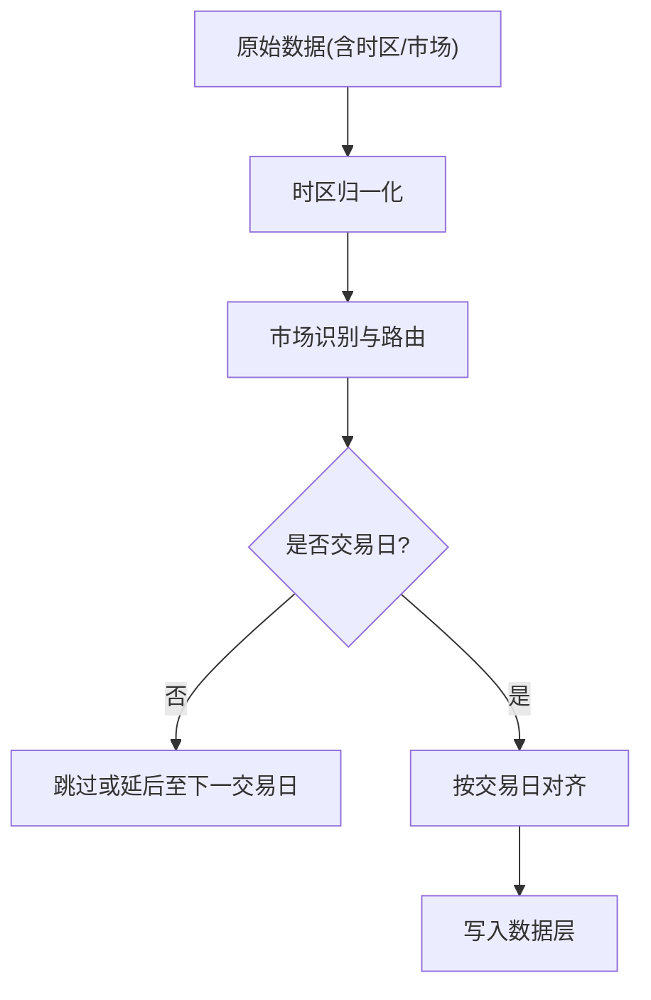
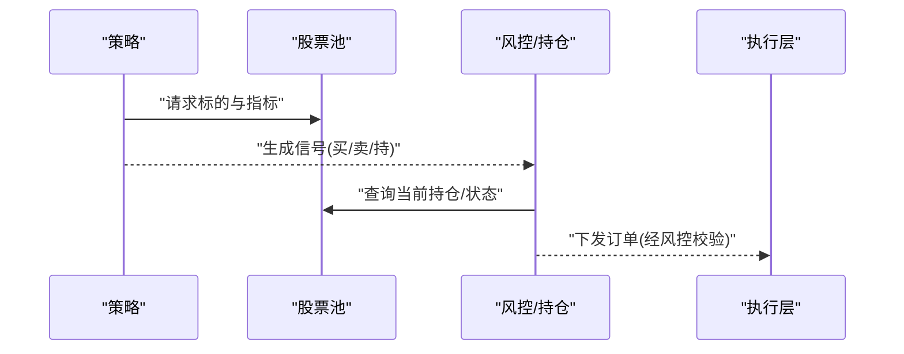
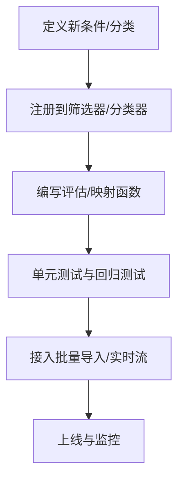
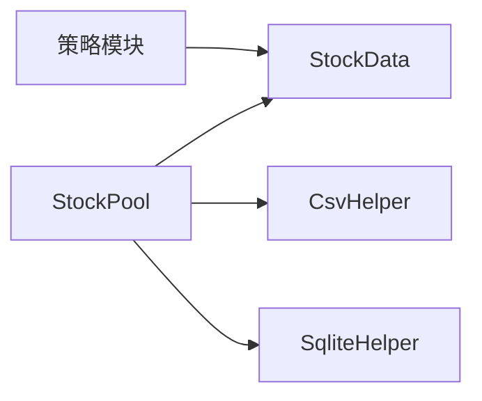

# 股票池管理

<cite>
**本文引用的文件**   
- [StockPool.py](file://MyProject/DataBase/StockPool.py)
- [StockData.py](file://MyProject/DataBase/StockData.py)
- [CsvHelper.py](file://MyProject/Helper/CsvHelper.py)
- [SqliteHelper.py](file://MyProject/Helper/SqliteHelper.py)
- [BLJJ.py](file://MyProject/Model/Strategy/BLJJ.py)
- [CrossSimple.py](file://MyProject/Model/Strategy/CrossSimple.py)
- [EMA.py](file://MyProject/Model/Strategy/EMA.py)
- [MagicNine.py](file://MyProject/Model/Strategy/MagicNine.py)
- [REF.py](file://MyProject/Model/Strategy/REF.py)
- [SignalIntervalTrade.py](file://MyProject/Model/Strategy/SignalIntervalTrade.py)
- [TradeTag.py](file://MyProject/Model/Strategy/TradeTag.py)
</cite>

## 目录
1. [简介](#简介)
2. [项目结构](#项目结构)
3. [核心组件](#核心组件)
4. [架构总览](#架构总览)
5. [详细组件分析](#详细组件分析)
6. [依赖关系分析](#依赖关系分析)
7. [性能考虑](#性能考虑)
8. [故障排查指南](#故障排查指南)
9. [结论](#结论)
10. [附录](#附录)

## 简介
本文件为“股票池管理系统”的权威技术文档，面向策略研发与工程实现人员。文档围绕以下目标展开：
- 动态管理机制：筛选规则、分类体系、状态跟踪
- 增删改查能力：批量导入导出、条件过滤、实时更新
- 与交易策略集成：信号匹配、持仓管理
- 扩展性：新增筛选条件与自定义分类体系
- 性能监控与优化：吞吐、延迟、内存与存储
- 多市场数据支持、时区处理与节假日处理

## 项目结构
系统采用分层组织方式：
- 数据层（DataBase）：负责股票池持久化、行情数据存取
- 工具层（Helper）：CSV/SQLite 等通用读写辅助
- 策略层（Model/Strategy）：策略定义、信号生成与交易标签
- 入口脚本：用于训练数据构建与示例流程

图表来源
- [StockPool.py](file://MyProject/DataBase/StockPool.py)
- [StockData.py](file://MyProject/DataBase/StockData.py)
- [CsvHelper.py](file://MyProject/Helper/CsvHelper.py)
- [SqliteHelper.py](file://MyProject/Helper/SqliteHelper.py)
- [BLJJ.py](file://MyProject/Model/Strategy/BLJJ.py)
- [CrossSimple.py](file://MyProject/Model/Strategy/CrossSimple.py)
- [EMA.py](file://MyProject/Model/Strategy/EMA.py)
- [MagicNine.py](file://MyProject/Model/Strategy/MagicNine.py)
- [REF.py](file://MyProject/Model/Strategy/REF.py)
- [SignalIntervalTrade.py](file://MyProject/Model/Strategy/SignalIntervalTrade.py)
- [TradeTag.py](file://MyProject/Model/Strategy/TradeTag.py)

章节来源
- [StockPool.py](file://MyProject/DataBase/StockPool.py)
- [StockData.py](file://MyProject/DataBase/StockData.py)
- [CsvHelper.py](file://MyProject/Helper/CsvHelper.py)
- [SqliteHelper.py](file://MyProject/Helper/SqliteHelper.py)
- [BLJJ.py](file://MyProject/Model/Strategy/BLJJ.py)
- [CrossSimple.py](file://MyProject/Model/Strategy/CrossSimple.py)
- [EMA.py](file://MyProject/Model/Strategy/EMA.py)
- [MagicNine.py](file://MyProject/Model/Strategy/MagicNine.py)
- [REF.py](file://MyProject/Model/Strategy/REF.py)
- [SignalIntervalTrade.py](file://MyProject/Model/Strategy/SignalIntervalTrade.py)
- [TradeTag.py](file://MyProject/Model/Strategy/TradeTag.py)

## 核心组件
- 股票池管理器（StockPool）：提供股票的增删改查、批量导入导出、条件过滤、分类管理与状态跟踪。
- 行情数据模型（StockData）：封装单只或多只股票的时序数据与元信息，供策略与池管理使用。
- 策略模块（Strategy/*）：基于 StockData 计算指标与信号，并与股票池联动进行信号匹配与持仓管理。
- 工具模块（Helper/*）：CSV/SQLite 读写封装，支撑批量导入导出与持久化。

章节来源
- [StockPool.py](file://MyProject/DataBase/StockPool.py)
- [StockData.py](file://MyProject/DataBase/StockData.py)
- [CsvHelper.py](file://MyProject/Helper/CsvHelper.py)
- [SqliteHelper.py](file://MyProject/Helper/SqliteHelper.py)
- [BLJJ.py](file://MyProject/Model/Strategy/BLJJ.py)
- [CrossSimple.py](file://MyProject/Model/Strategy/CrossSimple.py)
- [EMA.py](file://MyProject/Model/Strategy/EMA.py)
- [MagicNine.py](file://MyProject/Model/Strategy/MagicNine.py)
- [REF.py](file://MyProject/Model/Strategy/REF.py)
- [SignalIntervalTrade.py](file://MyProject/Model/Strategy/SignalIntervalTrade.py)
- [TradeTag.py](file://MyProject/Model/Strategy/TradeTag.py)

## 架构总览
系统以“数据层-工具层-策略层”三层解耦为核心，股票池作为中枢协调数据与策略。

图表来源
- [StockPool.py](file://MyProject/DataBase/StockPool.py)
- [StockData.py](file://MyProject/DataBase/StockData.py)
- [CsvHelper.py](file://MyProject/Helper/CsvHelper.py)
- [SqliteHelper.py](file://MyProject/Helper/SqliteHelper.py)
- [BLJJ.py](file://MyProject/Model/Strategy/BLJJ.py)
- [CrossSimple.py](file://MyProject/Model/Strategy/CrossSimple.py)
- [EMA.py](file://MyProject/Model/Strategy/EMA.py)
- [MagicNine.py](file://MyProject/Model/Strategy/MagicNine.py)
- [REF.py](file://MyProject/Model/Strategy/REF.py)
- [SignalIntervalTrade.py](file://MyProject/Model/Strategy/SignalIntervalTrade.py)
- [TradeTag.py](file://MyProject/Model/Strategy/TradeTag.py)

## 详细组件分析

### 股票池管理器（StockPool）
职责
- 维护股票集合与元信息（代码、名称、市场、行业、自定义标签等）
- 提供增删改查接口，支持按条件过滤与分页
- 批量导入/导出（CSV/SQLite）
- 分类体系管理（内置分类与自定义分类）
- 状态跟踪（观察、候选、入库、禁用等）
- 实时增量更新（拉取最新行情并触发重评估）

关键能力
- 筛选规则引擎：支持技术指标阈值、基本面条件、事件驱动条件组合
- 分类体系：多级分类、动态打标、继承与互斥规则
- 状态机：状态转换与审计日志
- 并发安全：读写锁与事务提交
- 缓存：热点标的与指标结果缓存

图表来源
- [StockPool.py](file://MyProject/DataBase/StockPool.py)
- [StockData.py](file://MyProject/DataBase/StockData.py)
- [CsvHelper.py](file://MyProject/Helper/CsvHelper.py)
- [SqliteHelper.py](file://MyProject/Helper/SqliteHelper.py)

章节来源
- [StockPool.py](file://MyProject/DataBase/StockPool.py)
- [StockData.py](file://MyProject/DataBase/StockData.py)
- [CsvHelper.py](file://MyProject/Helper/CsvHelper.py)
- [SqliteHelper.py](file://MyProject/Helper/SqliteHelper.py)

### 行情数据模型（StockData）
职责
- 统一表示个股时序数据与衍生指标
- 提供时间对齐、缺失值填充、复权处理等基础能力
- 暴露指标计算接口，供策略与池筛选使用

复杂度与优化
- 向量化计算优先，避免逐行循环
- 滑动窗口函数采用增量更新降低重复计算
- 大表分片与列式存储提升查询效率

章节来源
- [StockData.py](file://MyProject/DataBase/StockData.py)

### 策略模块（Strategy/*）
职责
- 基于 StockData 计算信号（买入/卖出/持有）
- 与股票池联动，对池内标的进行信号匹配
- 输出交易标签与持仓建议

典型策略
- BLJJ、CrossSimple、EMA、MagicNine、REF、SignalIntervalTrade、TradeTag

图表来源
- [StockData.py](file://MyProject/DataBase/StockData.py)
- [EMA.py](file://MyProject/Model/Strategy/EMA.py)
- [CrossSimple.py](file://MyProject/Model/Strategy/CrossSimple.py)
- [BLJJ.py](file://MyProject/Model/Strategy/BLJJ.py)
- [MagicNine.py](file://MyProject/Model/Strategy/MagicNine.py)
- [REF.py](file://MyProject/Model/Strategy/REF.py)
- [SignalIntervalTrade.py](file://MyProject/Model/Strategy/SignalIntervalTrade.py)
- [TradeTag.py](file://MyProject/Model/Strategy/TradeTag.py)

章节来源
- [EMA.py](file://MyProject/Model/Strategy/EMA.py)
- [CrossSimple.py](file://MyProject/Model/Strategy/CrossSimple.py)
- [BLJJ.py](file://MyProject/Model/Strategy/BLJJ.py)
- [MagicNine.py](file://MyProject/Model/Strategy/MagicNine.py)
- [REF.py](file://MyProject/Model/Strategy/REF.py)
- [SignalIntervalTrade.py](file://MyProject/Model/Strategy/SignalIntervalTrade.py)
- [TradeTag.py](file://MyProject/Model/Strategy/TradeTag.py)

### 批量导入导出与条件过滤
- 批量导入：从 CSV/SQLite 读取标的清单与元信息，去重校验后写入池
- 批量导出：将当前池状态与分类、状态、最近更新时间导出
- 条件过滤：支持多维条件组合（市场、行业、技术指标阈值、状态、标签）

图表来源
- [CsvHelper.py](file://MyProject/Helper/CsvHelper.py)
- [SqliteHelper.py](file://MyProject/Helper/SqliteHelper.py)
- [StockPool.py](file://MyProject/DataBase/StockPool.py)

章节来源
- [CsvHelper.py](file://MyProject/Helper/CsvHelper.py)
- [SqliteHelper.py](file://MyProject/Helper/SqliteHelper.py)
- [StockPool.py](file://MyProject/DataBase/StockPool.py)

### 实时增量更新与订阅
- 增量拉取：按时间戳增量获取最新行情，避免全量覆盖
- 事件驱动：当新数据到达时，触发筛选器与策略重新计算
- 订阅机制：外部模块可订阅池变化事件，实现低延迟联动

图表来源
- [StockPool.py](file://MyProject/DataBase/StockPool.py)
- [StockData.py](file://MyProject/DataBase/StockData.py)

章节来源
- [StockPool.py](file://MyProject/DataBase/StockPool.py)
- [StockData.py](file://MyProject/DataBase/StockData.py)

### 多市场、时区与节假日处理
- 多市场：统一编码规范与市场前缀，按市场维度隔离索引与权限
- 时区：统一转换为基准时区（如本地交易时区），在存储与展示层做时区标注
- 节假日：维护交易日历，非交易日不产生新数据；跨日事件按交易日边界对齐

图表来源
- [StockData.py](file://MyProject/DataBase/StockData.py)
- [StockPool.py](file://MyProject/DataBase/StockPool.py)

章节来源
- [StockData.py](file://MyProject/DataBase/StockData.py)
- [StockPool.py](file://MyProject/DataBase/StockPool.py)

### 与交易策略的集成：信号匹配与持仓管理
- 信号匹配：策略输出信号后，由池管理器根据标的状态与风控规则进行二次校验
- 持仓管理：结合信号强度、仓位上限、集中度限制，生成最终交易指令
- 回测与实盘：同一套信号与持仓逻辑，支持离线回测与在线执行

图表来源
- [StockPool.py](file://MyProject/DataBase/StockPool.py)
- [SignalIntervalTrade.py](file://MyProject/Model/Strategy/SignalIntervalTrade.py)
- [TradeTag.py](file://MyProject/Model/Strategy/TradeTag.py)

章节来源
- [StockPool.py](file://MyProject/DataBase/StockPool.py)
- [SignalIntervalTrade.py](file://MyProject/Model/Strategy/SignalIntervalTrade.py)
- [TradeTag.py](file://MyProject/Model/Strategy/TradeTag.py)

### 扩展指南：新增筛选条件与自定义分类
- 新增筛选条件
  - 在筛选器注册表中声明新的条件类型与参数
  - 实现条件评估函数，输入 StockData，输出布尔结果
  - 将条件加入组合表达式，支持 AND/OR/NOT 组合
- 自定义分类体系
  - 定义分类层级与标签字典
  - 实现分类规则（静态映射/动态计算）
  - 支持标签继承与冲突消解策略

图表来源
- [StockPool.py](file://MyProject/DataBase/StockPool.py)
- [StockData.py](file://MyProject/DataBase/StockData.py)

章节来源
- [StockPool.py](file://MyProject/DataBase/StockPool.py)
- [StockData.py](file://MyProject/DataBase/StockData.py)

## 依赖关系分析
- 模块耦合
  - 股票池对数据层与工具层有直接依赖
  - 策略仅依赖 StockData 抽象，保持松耦合
- 外部依赖
  - CSV/SQLite 作为持久化后端
  - 可选消息队列用于实时事件分发

图表来源
- [StockPool.py](file://MyProject/DataBase/StockPool.py)
- [StockData.py](file://MyProject/DataBase/StockData.py)
- [CsvHelper.py](file://MyProject/Helper/CsvHelper.py)
- [SqliteHelper.py](file://MyProject/Helper/SqliteHelper.py)
- [BLJJ.py](file://MyProject/Model/Strategy/BLJJ.py)
- [CrossSimple.py](file://MyProject/Model/Strategy/CrossSimple.py)
- [EMA.py](file://MyProject/Model/Strategy/EMA.py)
- [MagicNine.py](file://MyProject/Model/Strategy/MagicNine.py)
- [REF.py](file://MyProject/Model/Strategy/REF.py)
- [SignalIntervalTrade.py](file://MyProject/Model/Strategy/SignalIntervalTrade.py)
- [TradeTag.py](file://MyProject/Model/Strategy/TradeTag.py)

章节来源
- [StockPool.py](file://MyProject/DataBase/StockPool.py)
- [StockData.py](file://MyProject/DataBase/StockData.py)
- [CsvHelper.py](file://MyProject/Helper/CsvHelper.py)
- [SqliteHelper.py](file://MyProject/Helper/SqliteHelper.py)
- [BLJJ.py](file://MyProject/Model/Strategy/BLJJ.py)
- [CrossSimple.py](file://MyProject/Model/Strategy/CrossSimple.py)
- [EMA.py](file://MyProject/Model/Strategy/EMA.py)
- [MagicNine.py](file://MyProject/Model/Strategy/MagicNine.py)
- [REF.py](file://MyProject/Model/Strategy/REF.py)
- [SignalIntervalTrade.py](file://MyProject/Model/Strategy/SignalIntervalTrade.py)
- [TradeTag.py](file://MyProject/Model/Strategy/TradeTag.py)

## 性能考虑
- 计算优化
  - 向量化与增量滑动窗口，减少重复计算
  - 指标结果缓存与失效策略（TTL/脏标记）
- I/O 优化
  - 批量写入与事务打包
  - 列式存储与索引设计（按 code、timestamp、market）
- 并发与资源
  - 读写分离与连接池
  - 任务分片与并行拉取
- 监控指标
  - 端到端延迟、吞吐、缓存命中率、失败率
  - 内存占用与GC频率

[本节为通用指导，无需具体文件引用]

## 故障排查指南
- 常见问题
  - 数据缺失与异常值：检查复权与对齐逻辑，补充插值或剔除
  - 时区不一致：确认基准时区配置与存储格式
  - 节假日错位：核对交易日历与跨日事件处理
  - 导入失败：查看校验日志与错误码，定位字段缺失或类型不匹配
- 诊断手段
  - 启用详细日志与审计追踪
  - 快照对比与差异报告
  - 回放模式验证修复效果

章节来源
- [CsvHelper.py](file://MyProject/Helper/CsvHelper.py)
- [SqliteHelper.py](file://MyProject/Helper/SqliteHelper.py)
- [StockPool.py](file://MyProject/DataBase/StockPool.py)
- [StockData.py](file://MyProject/DataBase/StockData.py)

## 结论
本系统以清晰的层次划分与松耦合设计，实现了股票池的动态管理、批量操作、条件过滤与实时更新，并与策略层良好集成。通过完善的扩展点与性能优化策略，可支撑多市场、复杂筛选与高吞吐场景。建议在上线前完善监控与回滚方案，确保稳定性与可观测性。

[本节为总结性内容，无需具体文件引用]

## 附录
- 术语
  - 标的：股票代码及其元信息的抽象
  - 信号：策略输出的交易建议（买/卖/持）
  - 分类：对标的进行多维度打标签的组织方式
- 最佳实践
  - 先离线验证再上线
  - 小流量灰度与快速回滚
  - 持续监控与容量规划

[本节为概念性内容，无需具体文件引用]