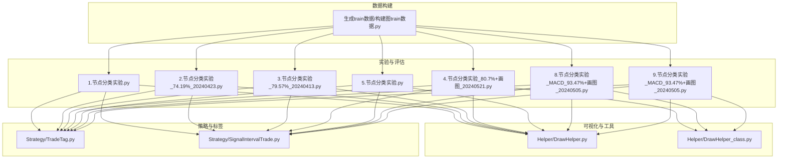
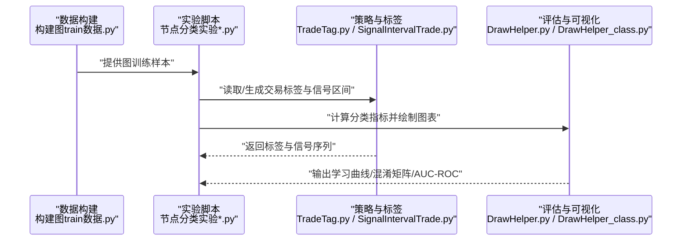
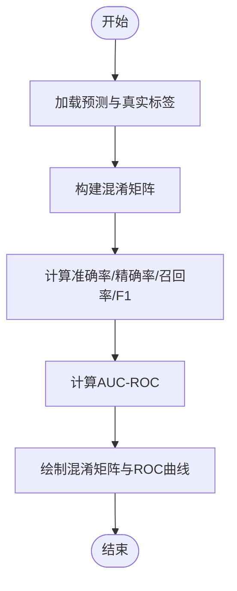
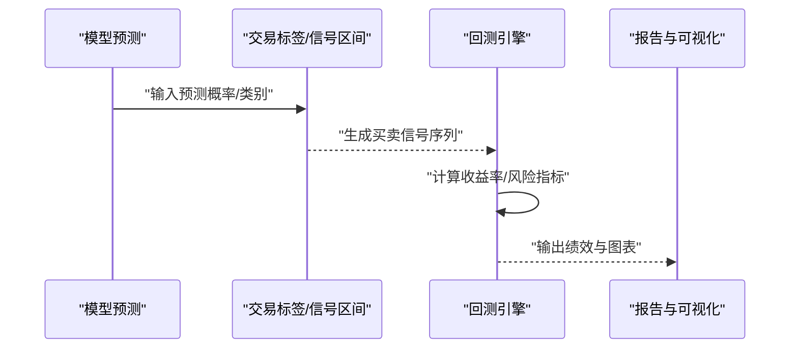
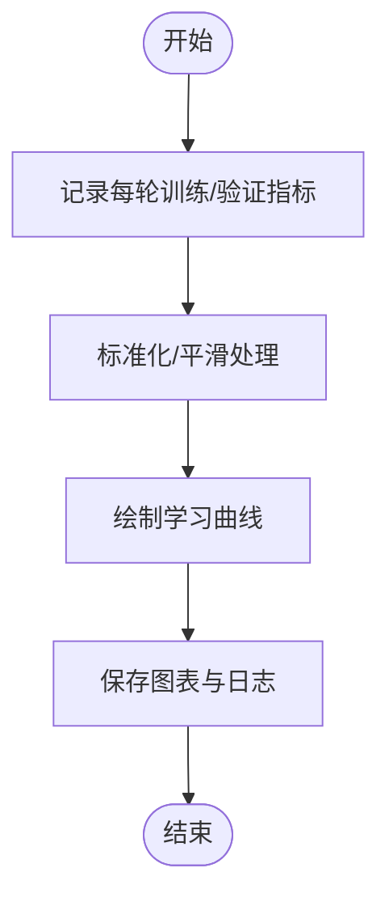
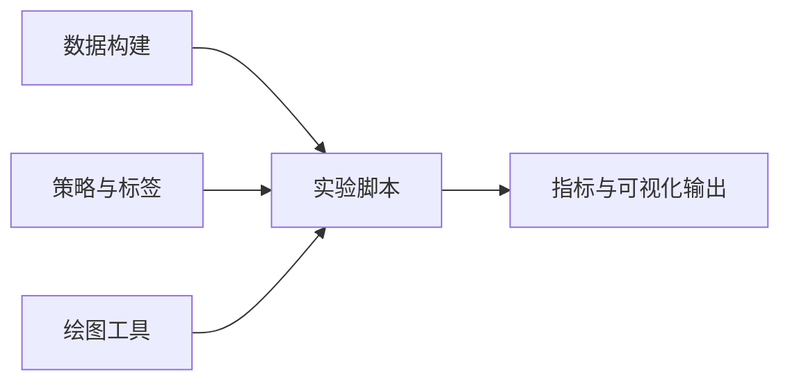

# 性能评估指标

<cite>
**本文引用的文件**   
- [MyProject/Model/1.节点分类实验.py](file://MyProject/Model/1.节点分类实验.py)
- [MyProject/Model/2.节点分类实验_74.19%_20240423.py](file://MyProject/Model/2.节点分类实验_74.19%_20240423.py)
- [MyProject/Model/3.节点分类实验_79.57%_20240413.py](file://MyProject/Model/3.节点分类实验_79.57%_20240413.py)
- [MyProject/Model/4.节点分类实验_80.7%+画图_20240521.py](file://MyProject/Model/4.节点分类实验_80.7%+画图_20240521.py)
- [MyProject/Model/5.节点分类实验.py](file://MyProject/Model/5.节点分类实验.py)
- [MyProject/Model/8.节点分类实验_MACD_93.47%+画图_20240505.py](file://MyProject/Model/8.节点分类实验_MACD_93.47%+画图_20240505.py)
- [MyProject/Model/9.节点分类实验_MACD_93.47%+画图_20240505.py](file://MyProject/Model/9.节点分类实验_MACD_93.47%+画图_20240505.py)
- [MyProject/Helper/DrawHelper.py](file://MyProject/Helper/DrawHelper.py)
- [MyProject/Helper/DrawHelper_class.py](file://MyProject/Helper/DrawHelper_class.py)
- [MyProject/Model/Strategy/TradeTag.py](file://MyProject/Model/Strategy/TradeTag.py)
- [MyProject/Model/Strategy/SignalIntervalTrade.py](file://MyProject/Model/Strategy/SignalIntervalTrade.py)
- [生成train数据/构建图train数据.py](file://生成train数据/构建图train数据.py)
</cite>

## 目录
1. [引言](#引言)
2. [项目结构](#项目结构)
3. [核心组件](#核心组件)
4. [架构总览](#架构总览)
5. [详细组件分析](#详细组件分析)
6. [依赖分析](#依赖分析)
7. [性能考量](#性能考量)
8. [故障排查指南](#故障排查指南)
9. [结论](#结论)
10. [附录](#附录)

## 引言
本文件聚焦于“性能评估指标”的体系化说明，面向节点分类任务与股票预测场景。内容涵盖：
- 分类指标：准确率、精确率、召回率、F1分数、AUC-ROC曲线
- 混淆矩阵的构建与解读，以及按类别的性能差异分析
- 股票预测的特殊评估需求：交易信号准确性、收益率与风险指标
- 可视化方法：学习曲线、特征重要性、错误案例分析
- 策略组合对比与统计显著性检验

## 项目结构
本项目围绕“图模型节点分类 + 交易策略标签 + 可视化评估”展开。关键路径包括：
- 实验脚本：多版本节点分类实验（含绘图）
- 辅助工具：绘图与数据处理
- 策略模块：交易标签与信号区间处理
- 数据构建：训练数据构建流程

图表来源
- [MyProject/Model/1.节点分类实验.py](file://MyProject/Model/1.节点分类实验.py)
- [MyProject/Model/2.节点分类实验_74.19%_20240423.py](file://MyProject/Model/2.节点分类实验_74.19%_20240423.py)
- [MyProject/Model/3.节点分类实验_79.57%_20240413.py](file://MyProject/Model/3.节点分类实验_79.57%_20240413.py)
- [MyProject/Model/4.节点分类实验_80.7%+画图_20240521.py](file://MyProject/Model/4.节点分类实验_80.7%+画图_20240521.py)
- [MyProject/Model/5.节点分类实验.py](file://MyProject/Model/5.节点分类实验.py)
- [MyProject/Model/8.节点分类实验_MACD_93.47%+画图_20240505.py](file://MyProject/Model/8.节点分类实验_MACD_93.47%+画图_20240505.py)
- [MyProject/Model/9.节点分类实验_MACD_93.47%+画图_20240505.py](file://MyProject/Model/9.节点分类实验_MACD_93.47%+画图_20240505.py)
- [MyProject/Helper/DrawHelper.py](file://MyProject/Helper/DrawHelper.py)
- [MyProject/Helper/DrawHelper_class.py](file://MyProject/Helper/DrawHelper_class.py)
- [MyProject/Model/Strategy/TradeTag.py](file://MyProject/Model/Strategy/TradeTag.py)
- [MyProject/Model/Strategy/SignalIntervalTrade.py](file://MyProject/Model/Strategy/SignalIntervalTrade.py)
- [生成train数据/构建图train数据.py](file://生成train数据/构建图train数据.py)

章节来源
- [MyProject/Model/1.节点分类实验.py](file://MyProject/Model/1.节点分类实验.py)
- [MyProject/Model/4.节点分类实验_80.7%+画图_20240521.py](file://MyProject/Model/4.节点分类实验_80.7%+画图_20240521.py)
- [MyProject/Model/8.节点分类实验_MACD_93.47%+画图_20240505.py](file://MyProject/Model/8.节点分类实验_MACD_93.47%+画图_20240505.py)
- [MyProject/Helper/DrawHelper.py](file://MyProject/Helper/DrawHelper.py)
- [MyProject/Helper/DrawHelper_class.py](file://MyProject/Helper/DrawHelper_class.py)
- [MyProject/Model/Strategy/TradeTag.py](file://MyProject/Model/Strategy/TradeTag.py)
- [MyProject/Model/Strategy/SignalIntervalTrade.py](file://MyProject/Model/Strategy/SignalIntervalTrade.py)
- [生成train数据/构建图train数据.py](file://生成train数据/构建图train数据.py)

## 核心组件
- 节点分类实验脚本：负责数据加载、模型训练、评估与可视化输出
- 绘图工具：提供学习曲线、混淆矩阵、AUC-ROC等可视化能力
- 策略与标签：定义交易标签与信号区间，支撑交易相关评估
- 数据构建：将原始行情转换为图训练样本，影响评估的数据基础

章节来源
- [MyProject/Model/1.节点分类实验.py](file://MyProject/Model/1.节点分类实验.py)
- [MyProject/Model/4.节点分类实验_80.7%+画图_20240521.py](file://MyProject/Model/4.节点分类实验_80.7%+画图_20240521.py)
- [MyProject/Model/8.节点分类实验_MACD_93.47%+画图_20240505.py](file://MyProject/Model/8.节点分类实验_MACD_93.47%+画图_20240505.py)
- [MyProject/Helper/DrawHelper.py](file://MyProject/Helper/DrawHelper.py)
- [MyProject/Helper/DrawHelper_class.py](file://MyProject/Helper/DrawHelper_class.py)
- [MyProject/Model/Strategy/TradeTag.py](file://MyProject/Model/Strategy/TradeTag.py)
- [MyProject/Model/Strategy/SignalIntervalTrade.py](file://MyProject/Model/Strategy/SignalIntervalTrade.py)
- [生成train数据/构建图train数据.py](file://生成train数据/构建图train数据.py)

## 架构总览
下图展示从数据到评估的整体流程：数据构建 → 节点分类训练 → 指标计算 → 可视化输出；同时包含交易策略相关的评估分支。

图表来源
- [生成train数据/构建图train数据.py](file://生成train数据/构建图train数据.py)
- [MyProject/Model/1.节点分类实验.py](file://MyProject/Model/1.节点分类实验.py)
- [MyProject/Model/4.节点分类实验_80.7%+画图_20240521.py](file://MyProject/Model/4.节点分类实验_80.7%+画图_20240521.py)
- [MyProject/Model/8.节点分类实验_MACD_93.47%+画图_20240505.py](file://MyProject/Model/8.节点分类实验_MACD_93.47%+画图_20240505.py)
- [MyProject/Model/Strategy/TradeTag.py](file://MyProject/Model/Strategy/TradeTag.py)
- [MyProject/Model/Strategy/SignalIntervalTrade.py](file://MyProject/Model/Strategy/SignalIntervalTrade.py)
- [MyProject/Helper/DrawHelper.py](file://MyProject/Helper/DrawHelper.py)
- [MyProject/Helper/DrawHelper_class.py](file://MyProject/Helper/DrawHelper_class.py)

## 详细组件分析

### 分类指标与混淆矩阵
- 指标定义与适用场景
  - 准确率：整体正确比例，适用于类别均衡场景
  - 精确率：正类预测中真实为正的比例，关注误报成本
  - 召回率：真实正类中被正确识别的比例，关注漏报成本
  - F1分数：精确率与召回率的调和平均，综合衡量
  - AUC-ROC：阈值无关的排序质量度量，适合不平衡数据
- 混淆矩阵构建与解读
  - 四象限：真正例(TP)、假正例(FP)、真负例(TN)、假负例(FN)
  - 行归一化用于观察各类别召回表现，列归一化用于观察各类别精确表现
  - 多分类时逐类计算或采用宏/加权平均
- 类别差异化分析
  - 针对少数类重点监控召回与F1
  - 结合业务代价矩阵调整阈值或采样策略

章节来源
- [MyProject/Model/1.节点分类实验.py](file://MyProject/Model/1.节点分类实验.py)
- [MyProject/Model/4.节点分类实验_80.7%+画图_20240521.py](file://MyProject/Model/4.节点分类实验_80.7%+画图_20240521.py)
- [MyProject/Model/8.节点分类实验_MACD_93.47%+画图_20240505.py](file://MyProject/Model/8.节点分类实验_MACD_93.47%+画图_20240505.py)
- [MyProject/Helper/DrawHelper.py](file://MyProject/Helper/DrawHelper.py)
- [MyProject/Helper/DrawHelper_class.py](file://MyProject/Helper/DrawHelper_class.py)

#### 混淆矩阵与指标计算流程图

图表来源
- [MyProject/Helper/DrawHelper.py](file://MyProject/Helper/DrawHelper.py)
- [MyProject/Helper/DrawHelper_class.py](file://MyProject/Helper/DrawHelper_class.py)
- [MyProject/Model/4.节点分类实验_80.7%+画图_20240521.py](file://MyProject/Model/4.节点分类实验_80.7%+画图_20240521.py)

### 股票预测场景下的特殊评估需求
- 交易信号准确性
  - 基于预测信号与实际涨跌/趋势标签，计算信号准确率、方向一致性
  - 考虑信号延迟与滑点对实际收益的影响
- 收益率与风险指标
  - 累计收益率、年化收益率、夏普比率、最大回撤、波动率
  - 胜率、盈亏比、期望收益
- 信号区间与持有期
  - 使用信号区间策略评估不同持有期的稳定性与鲁棒性
  - 结合TradeTag生成的标签进行回测对齐

章节来源
- [MyProject/Model/Strategy/TradeTag.py](file://MyProject/Model/Strategy/TradeTag.py)
- [MyProject/Model/Strategy/SignalIntervalTrade.py](file://MyProject/Model/Strategy/SignalIntervalTrade.py)
- [MyProject/Model/8.节点分类实验_MACD_93.47%+画图_20240505.py](file://MyProject/Model/8.节点分类实验_MACD_93.47%+画图_20240505.py)
- [MyProject/Model/9.节点分类实验_MACD_93.47%+画图_20240505.py](file://MyProject/Model/9.节点分类实验_MACD_93.47%+画图_20240505.py)

#### 交易评估时序流程

图表来源
- [MyProject/Model/Strategy/TradeTag.py](file://MyProject/Model/Strategy/TradeTag.py)
- [MyProject/Model/Strategy/SignalIntervalTrade.py](file://MyProject/Model/Strategy/SignalIntervalTrade.py)
- [MyProject/Model/8.节点分类实验_MACD_93.47%+画图_20240505.py](file://MyProject/Model/8.节点分类实验_MACD_93.47%+画图_20240505.py)

### 可视化评估结果
- 学习曲线
  - 训练/验证损失与指标随迭代变化，诊断过拟合与欠拟合
- 特征重要性
  - 基于模型权重或置换重要性，定位关键因子
- 错误案例分析
  - 混淆矩阵高误差单元对应的样本回溯，结合时间窗口与外部事件

章节来源
- [MyProject/Model/4.节点分类实验_80.7%+画图_20240521.py](file://MyProject/Model/4.节点分类实验_80.7%+画图_20240521.py)
- [MyProject/Helper/DrawHelper.py](file://MyProject/Helper/DrawHelper.py)
- [MyProject/Helper/DrawHelper_class.py](file://MyProject/Helper/DrawHelper_class.py)

#### 学习曲线绘制流程

图表来源
- [MyProject/Model/4.节点分类实验_80.7%+画图_20240521.py](file://MyProject/Model/4.节点分类实验_80.7%+画图_20240521.py)
- [MyProject/Helper/DrawHelper.py](file://MyProject/Helper/DrawHelper.py)

### 策略组合对比与统计显著性检验
- 对比维度
  - 不同策略参数组合的收益率、风险指标、交易频率
  - 不同模型在相同策略下的信号质量差异
- 统计显著性检验
  - 配对t检验或Wilcoxon符号秩检验比较策略收益分布
  - 交叉验证下多次运行的均值与方差估计
  - 多重比较校正（如Bonferroni或FDR）控制假阳性

章节来源
- [MyProject/Model/8.节点分类实验_MACD_93.47%+画图_20240505.py](file://MyProject/Model/8.节点分类实验_MACD_93.47%+画图_20240505.py)
- [MyProject/Model/9.节点分类实验_MACD_93.47%+画图_20240505.py](file://MyProject/Model/9.节点分类实验_MACD_93.47%+画图_20240505.py)

## 依赖分析
- 模块耦合
  - 实验脚本依赖绘图工具与策略模块
  - 数据构建为上游依赖，直接影响评估数据的分布与质量
- 外部依赖
  - 数值计算与可视化库（如numpy、pandas、matplotlib、sklearn）
  - 图神经网络框架（如PyTorch Geometric）

图表来源
- [生成train数据/构建图train数据.py](file://生成train数据/构建图train数据.py)
- [MyProject/Model/1.节点分类实验.py](file://MyProject/Model/1.节点分类实验.py)
- [MyProject/Model/4.节点分类实验_80.7%+画图_20240521.py](file://MyProject/Model/4.节点分类实验_80.7%+画图_20240521.py)
- [MyProject/Helper/DrawHelper.py](file://MyProject/Helper/DrawHelper.py)
- [MyProject/Model/Strategy/TradeTag.py](file://MyProject/Model/Strategy/TradeTag.py)

章节来源
- [MyProject/Model/1.节点分类实验.py](file://MyProject/Model/1.节点分类实验.py)
- [MyProject/Model/4.节点分类实验_80.7%+画图_20240521.py](file://MyProject/Model/4.节点分类实验_80.7%+画图_20240521.py)
- [MyProject/Helper/DrawHelper.py](file://MyProject/Helper/DrawHelper.py)
- [MyProject/Model/Strategy/TradeTag.py](file://MyProject/Model/Strategy/TradeTag.py)
- [生成train数据/构建图train数据.py](file://生成train数据/构建图train数据.py)

## 性能考量
- 数据层面
  - 类别不平衡导致指标偏差，需采用重采样、阈值调优或代价敏感学习
  - 时间序列划分避免未来信息泄露，确保评估稳健性
- 模型层面
  - 学习曲线诊断过拟合，正则化与早停提升泛化
  - 特征工程与选择降低噪声，提高可解释性与稳定性
- 评估层面
  - 多指标联合评估，避免单一指标误导决策
  - 滚动窗口与跨市场验证增强鲁棒性

[本节为通用指导，不直接分析具体文件]

## 故障排查指南
- 常见指标异常
  - 准确率高但F1低：类别不平衡或阈值不当
  - AUC高但交易收益差：排序好但阈值未优化或交易成本过高
- 可视化问题
  - 学习曲线震荡：学习率过大或批次过小
  - 混淆矩阵稀疏：样本不足或类别划分不合理
- 策略回测问题
  - 信号频繁反转：过滤机制缺失或滑点未计入
  - 收益不稳定：持有期过长或市场环境变化

章节来源
- [MyProject/Model/4.节点分类实验_80.7%+画图_20240521.py](file://MyProject/Model/4.节点分类实验_80.7%+画图_20240521.py)
- [MyProject/Helper/DrawHelper.py](file://MyProject/Helper/DrawHelper.py)
- [MyProject/Model/Strategy/SignalIntervalTrade.py](file://MyProject/Model/Strategy/SignalIntervalTrade.py)

## 结论
- 分类指标与混淆矩阵是理解模型行为的基础，AUC-ROC提供阈值无关的排序质量视角
- 股票预测需引入交易信号准确性、收益率与风险指标，形成端到端评估闭环
- 可视化与错误案例有助于定位问题与改进策略
- 策略组合对比与统计显著性检验保障结论的可靠性与可复现性

[本节为总结，不直接分析具体文件]

## 附录
- 术语表
  - TP/TN/FP/FN：真正例/真负例/假正例/假负例
  - 宏平均/加权平均：多分类聚合方式
  - 夏普比率/最大回撤：风险调整后收益与下行风险度量
- 建议实践
  - 以业务目标为导向设定阈值与评估权重
  - 建立自动化评估流水线，统一指标与可视化模板
  - 定期复盘错误案例，持续优化特征与策略

[本节为补充信息，不直接分析具体文件]