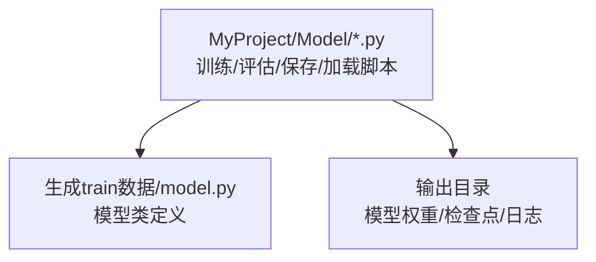
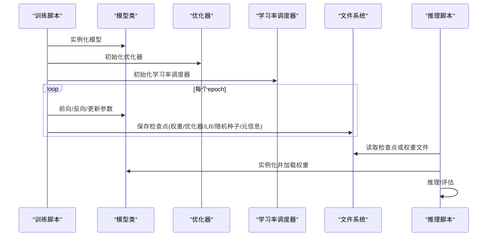
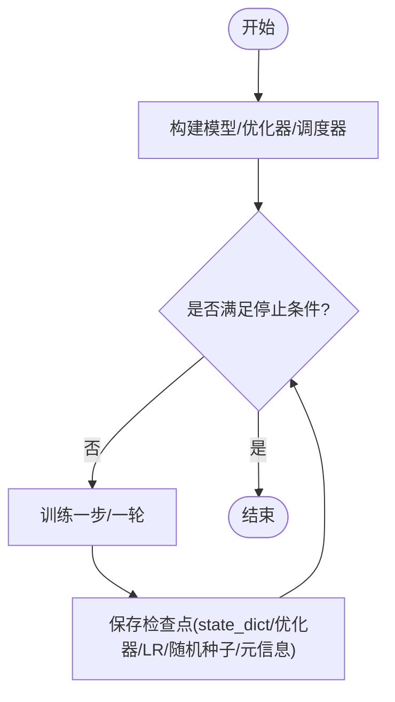
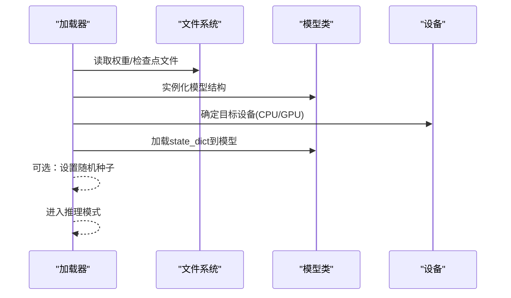
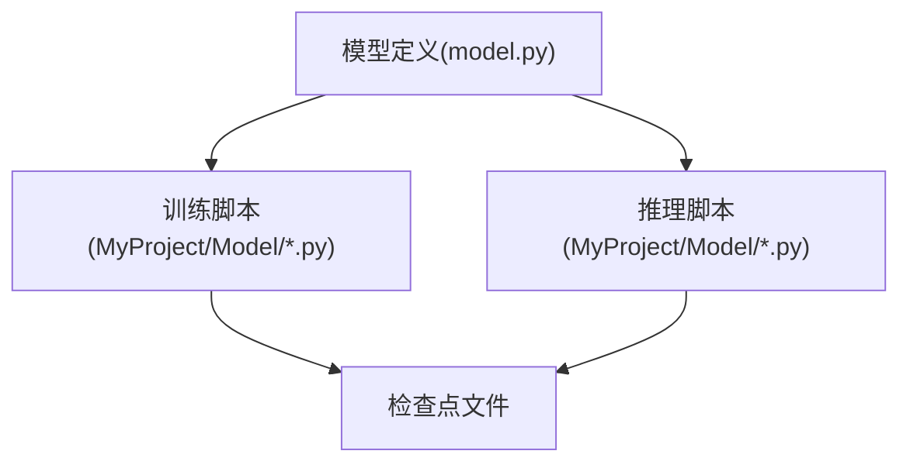

# 模型保存与加载

<cite>
**本文引用的文件**   
- [MyProject/Model/1.节点分类实验.py](file://MyProject/Model/1.节点分类实验.py)
- [MyProject/Model/2.节点分类实验_74.19%_20240423.py](file://MyProject/Model/2.节点分类实验_74.19%_20240423.py)
- [MyProject/Model/3.节点分类实验_79.57%_20240413.py](file://MyProject/Model/3.节点分类实验_79.57%_20240413.py)
- [MyProject/Model/4.节点分类实验_80.7%+画图_20240521.py](file://MyProject/Model/4.节点分类实验_80.7%+画图_20240521.py)
- [MyProject/Model/5.节点分类实验.py](file://MyProject/Model/5.节点分类实验.py)
- [MyProject/Model/6.py](file://MyProject/Model/6.py)
- [MyProject/Model/7.py](file://MyProject/Model/7.py)
- [MyProject/Model/8.节点分类实验_MACD_93.47%+画图_20240505.py](file://MyProject/Model/8.节点分类实验_MACD_93.47%+画图_20240505.py)
- [MyProject/Model/9.节点分类实验_MACD_93.47%+画图_20240505.py](file://MyProject/Model/9.节点分类实验_MACD_93.47%+画图_20240505.py)
- [生成train数据/model.py](file://生成train数据/model.py)
</cite>

## 目录
1. [简介](#简介)
2. [项目结构](#项目结构)
3. [核心组件](#核心组件)
4. [架构总览](#架构总览)
5. [详细组件分析](#详细组件分析)
6. [依赖关系分析](#依赖关系分析)
7. [性能考虑](#性能考虑)
8. [故障排查指南](#故障排查指南)
9. [结论](#结论)
10. [附录](#附录)

## 简介
本章节聚焦于PyTorch模型的序列化与恢复，围绕以下目标展开：
- 模型权重与结构的保存策略（state_dict、完整模型）
- 训练状态恢复（优化器状态、学习率状态、随机种子）
- 部署最佳实践（轻量化导出、推理优化、内存管理）
- 模型文件组织与命名规范
- 迁移学习与增量更新
- 生产环境加载与使用预训练模型的流程

## 项目结构
本项目为图神经网络相关实验脚本集合，包含多个节点分类实验脚本与一个独立的模型定义文件。与“模型保存与加载”直接相关的代码主要分布在以下位置：
- MyProject/Model 下的多份实验脚本（含训练、验证、保存与加载逻辑）
- 生成train数据/model.py（模型类定义）

图表来源
- [MyProject/Model/1.节点分类实验.py](file://MyProject/Model/1.节点分类实验.py)
- [生成train数据/model.py](file://生成train数据/model.py)

章节来源
- [MyProject/Model/1.节点分类实验.py](file://MyProject/Model/1.节点分类实验.py)
- [生成train数据/model.py](file://生成train数据/model.py)

## 核心组件
- 模型定义：位于独立文件中，便于在训练与推理两端复用。
- 训练循环：负责前向传播、损失计算、反向传播、指标统计与检查点保存。
- 检查点保存：通常包括模型权重、优化器状态、学习率调度器状态、随机种子、训练轮次等元信息。
- 检查点加载：支持从指定路径恢复训练或仅加载权重进行推理。
- 版本管理：通过文件名或元数据记录版本、日期、指标等信息，便于回溯与选择。

章节来源
- [MyProject/Model/1.节点分类实验.py](file://MyProject/Model/1.节点分类实验.py)
- [MyProject/Model/2.节点分类实验_74.19%_20240423.py](file://MyProject/Model/2.节点分类实验_74.19%_20240423.py)
- [MyProject/Model/3.节点分类实验_79.57%_20240413.py](file://MyProject/Model/3.节点分类实验_79.57%_20240413.py)
- [MyProject/Model/4.节点分类实验_80.7%+画图_20240521.py](file://MyProject/Model/4.节点分类实验_80.7%+画图_20240521.py)
- [MyProject/Model/5.节点分类实验.py](file://MyProject/Model/5.节点分类实验.py)
- [MyProject/Model/6.py](file://MyProject/Model/6.py)
- [MyProject/Model/7.py](file://MyProject/Model/7.py)
- [MyProject/Model/8.节点分类实验_MACD_93.47%+画图_20240505.py](file://MyProject/Model/8.节点分类实验_MACD_93.47%+画图_20240505.py)
- [MyProject/Model/9.节点分类实验_MACD_93.47%+画图_20240505.py](file://MyProject/Model/9.节点分类实验_MACD_93.47%+画图_20240505.py)
- [生成train数据/model.py](file://生成train数据/model.py)

## 架构总览
下图展示了训练与推理两条主线的典型交互：训练侧负责保存检查点；推理侧按需加载权重或检查点进行预测。

图表来源
- [MyProject/Model/1.节点分类实验.py](file://MyProject/Model/1.节点分类实验.py)
- [生成train数据/model.py](file://生成train数据/model.py)

## 详细组件分析

### 组件A：模型定义与复用
- 职责：封装网络结构与forward方法，供训练与推理共用。
- 建议：将模型类放在独立文件中，避免在训练/推理脚本中重复定义，降低不一致风险。

图表来源
- [生成train数据/model.py](file://生成train数据/model.py)

章节来源
- [生成train数据/model.py](file://生成train数据/model.py)

### 组件B：训练与检查点保存
- 关键要点
  - state_dict保存：仅保存模型参数，体积小、跨设备兼容性好。
  - 完整模型保存：同时保存模型结构与参数，便于快速恢复但存在版本耦合风险。
  - 训练状态恢复：保存优化器状态、学习率调度器状态、随机种子、当前epoch/步数、最佳指标等元信息。
  - 版本管理：在文件名或元数据中包含日期、指标、分支等信息，便于追溯。

图表来源
- [MyProject/Model/1.节点分类实验.py](file://MyProject/Model/1.节点分类实验.py)
- [MyProject/Model/2.节点分类实验_74.19%_20240423.py](file://MyProject/Model/2.节点分类实验_74.19%_20240423.py)
- [MyProject/Model/3.节点分类实验_79.57%_20240413.py](file://MyProject/Model/3.节点分类实验_79.57%_20240413.py)
- [MyProject/Model/4.节点分类实验_80.7%+画图_20240521.py](file://MyProject/Model/4.节点分类实验_80.7%+画图_20240521.py)
- [MyProject/Model/5.节点分类实验.py](file://MyProject/Model/5.节点分类实验.py)
- [MyProject/Model/6.py](file://MyProject/Model/6.py)
- [MyProject/Model/7.py](file://MyProject/Model/7.py)
- [MyProject/Model/8.节点分类实验_MACD_93.47%+画图_20240505.py](file://MyProject/Model/8.节点分类实验_MACD_93.47%+画图_20240505.py)
- [MyProject/Model/9.节点分类实验_MACD_93.47%+画图_20240505.py](file://MyProject/Model/9.节点分类实验_MACD_93.47%+画图_20240505.py)

章节来源
- [MyProject/Model/1.节点分类实验.py](file://MyProject/Model/1.节点分类实验.py)
- [MyProject/Model/2.节点分类实验_74.19%_20240423.py](file://MyProject/Model/2.节点分类实验_74.19%_20240423.py)
- [MyProject/Model/3.节点分类实验_79.57%_20240413.py](file://MyProject/Model/3.节点分类实验_79.57%_20240413.py)
- [MyProject/Model/4.节点分类实验_80.7%+画图_20240521.py](file://MyProject/Model/4.节点分类实验_80.7%+画图_20240521.py)
- [MyProject/Model/5.节点分类实验.py](file://MyProject/Model/5.节点分类实验.py)
- [MyProject/Model/6.py](file://MyProject/Model/6.py)
- [MyProject/Model/7.py](file://MyProject/Model/7.py)
- [MyProject/Model/8.节点分类实验_MACD_93.47%+画图_20240505.py](file://MyProject/Model/8.节点分类实验_MACD_93.47%+画图_20240505.py)
- [MyProject/Model/9.节点分类实验_MACD_93.47%+画图_20240505.py](file://MyProject/Model/9.节点分类实验_MACD_93.47%+画图_20240505.py)

### 组件C：推理与模型加载
- 关键要点
  - 仅加载权重：推荐在生产环境使用state_dict加载，减少依赖与体积。
  - 设备一致性：确保加载时设备与训练一致，或使用to(device)迁移。
  - 随机种子：若需复现推理结果（如Dropout），应设置随机种子。
  - 内存管理：及时释放不再使用的张量，避免显存泄漏。

图表来源
- [MyProject/Model/1.节点分类实验.py](file://MyProject/Model/1.节点分类实验.py)
- [MyProject/Model/2.节点分类实验_74.19%_20240423.py](file://MyProject/Model/2.节点分类实验_74.19%_20240423.py)
- [MyProject/Model/3.节点分类实验_79.57%_20240413.py](file://MyProject/Model/3.节点分类实验_79.57%_20240413.py)
- [MyProject/Model/4.节点分类实验_80.7%+画图_20240521.py](file://MyProject/Model/4.节点分类实验_80.7%+画图_20240521.py)
- [MyProject/Model/5.节点分类实验.py](file://MyProject/Model/5.节点分类实验.py)
- [MyProject/Model/6.py](file://MyProject/Model/6.py)
- [MyProject/Model/7.py](file://MyProject/Model/7.py)
- [MyProject/Model/8.节点分类实验_MACD_93.47%+画图_20240505.py](file://MyProject/Model/8.节点分类实验_MACD_93.47%+画图_20240505.py)
- [MyProject/Model/9.节点分类实验_MACD_93.47%+画图_20240505.py](file://MyProject/Model/9.节点分类实验_MACD_93.47%+画图_20240505.py)
- [生成train数据/model.py](file://生成train数据/model.py)

章节来源
- [MyProject/Model/1.节点分类实验.py](file://MyProject/Model/1.节点分类实验.py)
- [MyProject/Model/2.节点分类实验_74.19%_20240423.py](file://MyProject/Model/2.节点分类实验_74.19%_20240423.py)
- [MyProject/Model/3.节点分类实验_79.57%_20240413.py](file://MyProject/Model/3.节点分类实验_79.57%_20240413.py)
- [MyProject/Model/4.节点分类实验_80.7%+画图_20240521.py](file://MyProject/Model/4.节点分类实验_80.7%+画图_20240521.py)
- [MyProject/Model/5.节点分类实验.py](file://MyProject/Model/5.节点分类实验.py)
- [MyProject/Model/6.py](file://MyProject/Model/6.py)
- [MyProject/Model/7.py](file://MyProject/Model/7.py)
- [MyProject/Model/8.节点分类实验_MACD_93.47%+画图_20240505.py](file://MyProject/Model/8.节点分类实验_MACD_93.47%+画图_20240505.py)
- [MyProject/Model/9.节点分类实验_MACD_93.47%+画图_20240505.py](file://MyProject/Model/9.节点分类实验_MACD_93.47%+画图_20240505.py)
- [生成train数据/model.py](file://生成train数据/model.py)

### 组件D：版本管理与文件组织
- 命名规范建议
  - 包含模型名、任务、日期、关键指标、随机种子等元信息。
  - 示例格式：modelname_task_yyyymmdd_acc0.xx_seed001.pth
- 目录结构建议
  - checkpoints/：按任务/日期分目录存放检查点
  - weights/：仅存放纯权重文件（用于推理）
  - logs/：训练日志与可视化结果
  - configs/：超参与配置（便于复现实验）

章节来源
- [MyProject/Model/1.节点分类实验.py](file://MyProject/Model/1.节点分类实验.py)
- [MyProject/Model/2.节点分类实验_74.19%_20240423.py](file://MyProject/Model/2.节点分类实验_74.19%_20240423.py)
- [MyProject/Model/3.节点分类实验_79.57%_20240413.py](file://MyProject/Model/3.节点分类实验_79.57%_20240413.py)
- [MyProject/Model/4.节点分类实验_80.7%+画图_20240521.py](file://MyProject/Model/4.节点分类实验_80.7%+画图_20240521.py)
- [MyProject/Model/5.节点分类实验.py](file://MyProject/Model/5.节点分类实验.py)
- [MyProject/Model/6.py](file://MyProject/Model/6.py)
- [MyProject/Model/7.py](file://MyProject/Model/7.py)
- [MyProject/Model/8.节点分类实验_MACD_93.47%+画图_20240505.py](file://MyProject/Model/8.节点分类实验_MACD_93.47%+画图_20240505.py)
- [MyProject/Model/9.节点分类实验_MACD_93.47%+画图_20240505.py](file://MyProject/Model/9.节点分类实验_MACD_93.47%+画图_20240505.py)

### 组件E：迁移学习与增量更新
- 迁移学习
  - 冻结部分层：固定预训练层参数，仅微调下游任务头。
  - 解冻与分层学习率：对深层采用较小学习率，浅层较大学习率。
- 增量更新
  - 基于最新检查点继续训练，保留优化器与调度器状态。
  - 增量保存策略：定期保存快照，保留最近N个最优权重。

章节来源
- [MyProject/Model/1.节点分类实验.py](file://MyProject/Model/1.节点分类实验.py)
- [MyProject/Model/2.节点分类实验_74.19%_20240423.py](file://MyProject/Model/2.节点分类实验_74.19%_20240423.py)
- [MyProject/Model/3.节点分类实验_79.57%_20240413.py](file://MyProject/Model/3.节点分类实验_79.57%_20240413.py)
- [MyProject/Model/4.节点分类实验_80.7%+画图_20240521.py](file://MyProject/Model/4.节点分类实验_80.7%+画图_20240521.py)
- [MyProject/Model/5.节点分类实验.py](file://MyProject/Model/5.节点分类实验.py)
- [MyProject/Model/6.py](file://MyProject/Model/6.py)
- [MyProject/Model/7.py](file://MyProject/Model/7.py)
- [MyProject/Model/8.节点分类实验_MACD_93.47%+画图_20240505.py](file://MyProject/Model/8.节点分类实验_MACD_93.47%+画图_20240505.py)
- [MyProject/Model/9.节点分类实验_MACD_93.47%+画图_20240505.py](file://MyProject/Model/9.节点分类实验_MACD_93.47%+画图_20240505.py)

### 组件F：生产环境加载与使用预训练模型
- 标准流程
  - 准备环境与依赖（PyTorch、GNN库）
  - 导入模型类并实例化
  - 加载state_dict到模型
  - 切换到推理模式
  - 执行推理/评估
- 注意事项
  - 设备与数据类型一致性
  - 输入数据预处理与模型期望一致
  - 资源清理与异常处理

章节来源
- [MyProject/Model/1.节点分类实验.py](file://MyProject/Model/1.节点分类实验.py)
- [MyProject/Model/2.节点分类实验_74.19%_20240423.py](file://MyProject/Model/2.节点分类实验_74.19%_20240423.py)
- [MyProject/Model/3.节点分类实验_79.57%_20240413.py](file://MyProject/Model/3.节点分类实验_79.57%_20240413.py)
- [MyProject/Model/4.节点分类实验_80.7%+画图_20240521.py](file://MyProject/Model/4.节点分类实验_80.7%+画图_20240521.py)
- [MyProject/Model/5.节点分类实验.py](file://MyProject/Model/5.节点分类实验.py)
- [MyProject/Model/6.py](file://MyProject/Model/6.py)
- [MyProject/Model/7.py](file://MyProject/Model/7.py)
- [MyProject/Model/8.节点分类实验_MACD_93.47%+画图_20240505.py](file://MyProject/Model/8.节点分类实验_MACD_93.47%+画图_20240505.py)
- [MyProject/Model/9.节点分类实验_MACD_93.47%+画图_20240505.py](file://MyProject/Model/9.节点分类实验_MACD_93.47%+画图_20240505.py)
- [生成train数据/model.py](file://生成train数据/model.py)

## 依赖关系分析
- 模块内聚性
  - 模型定义与训练/推理分离，提升可复用性与可测试性。
- 外部依赖
  - PyTorch核心API（模型、优化器、IO）
  - 图神经网络框架（如PyG）
- 潜在耦合点
  - 模型结构变更可能导致加载失败，需配合版本管理。
  - 设备差异（CPU/GPU）需要显式迁移。

图表来源
- [生成train数据/model.py](file://生成train数据/model.py)
- [MyProject/Model/1.节点分类实验.py](file://MyProject/Model/1.节点分类实验.py)

章节来源
- [生成train数据/model.py](file://生成train数据/model.py)
- [MyProject/Model/1.节点分类实验.py](file://MyProject/Model/1.节点分类实验.py)

## 性能考虑
- 轻量化导出
  - 优先使用state_dict减小体积；必要时结合torch.jit.trace/script导出为TorchScript。
- 推理优化
  - 使用推理模式关闭dropout/batchnorm的梯度计算
  - 批处理推理、半精度推理（如可用）
- 内存管理
  - 及时释放中间张量，避免累积
  - 合理设置batch size与缓存策略

[本节为通用指导，不直接分析具体文件]

## 故障排查指南
- 常见错误
  - 键名不匹配：模型结构变化导致state_dict无法加载
  - 设备不一致：GPU/CPU切换未迁移
  - 版本不兼容：不同PyTorch/GNN版本导致的序列化问题
- 定位方法
  - 打印并对比state_dict键名
  - 检查加载时的device与dtype
  - 查看检查点元信息（epoch、指标、随机种子）

章节来源
- [MyProject/Model/1.节点分类实验.py](file://MyProject/Model/1.节点分类实验.py)
- [MyProject/Model/2.节点分类实验_74.19%_20240423.py](file://MyProject/Model/2.节点分类实验_74.19%_20240423.py)
- [MyProject/Model/3.节点分类实验_79.57%_20240413.py](file://MyProject/Model/3.节点分类实验_79.57%_20240413.py)
- [MyProject/Model/4.节点分类实验_80.7%+画图_20240521.py](file://MyProject/Model/4.节点分类实验_80.7%+画图_20240521.py)
- [MyProject/Model/5.节点分类实验.py](file://MyProject/Model/5.节点分类实验.py)
- [MyProject/Model/6.py](file://MyProject/Model/6.py)
- [MyProject/Model/7.py](file://MyProject/Model/7.py)
- [MyProject/Model/8.节点分类实验_MACD_93.47%+画图_20240505.py](file://MyProject/Model/8.节点分类实验_MACD_93.47%+画图_20240505.py)
- [MyProject/Model/9.节点分类实验_MACD_93.47%+画图_20240505.py](file://MyProject/Model/9.节点分类实验_MACD_93.47%+画图_20240505.py)

## 结论
- 推荐以state_dict为主进行权重保存，配合完善的元信息与版本管理。
- 训练状态恢复需覆盖优化器、学习率调度器与随机种子，确保可复现与断点续训。
- 生产环境优先加载轻量权重，做好设备与类型一致性校验与异常处理。
- 通过清晰的目录结构与命名规范，提升模型资产的可维护性与可追溯性。

[本节为总结性内容，不直接分析具体文件]

## 附录
- 术语
  - state_dict：模型参数字典
  - 检查点：包含模型权重与训练状态的存档
  - 迁移学习：利用预训练模型在新任务上微调
- 参考实现路径
  - 模型定义：[生成train数据/model.py](file://生成train数据/model.py)
  - 训练/保存/加载示例：见各实验脚本文件