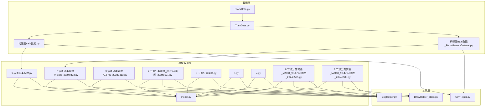
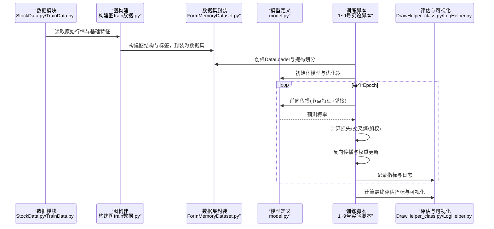
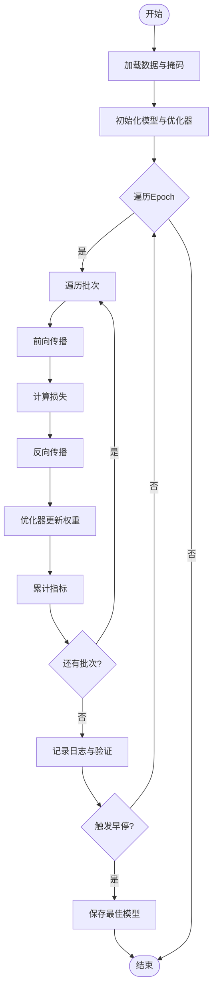
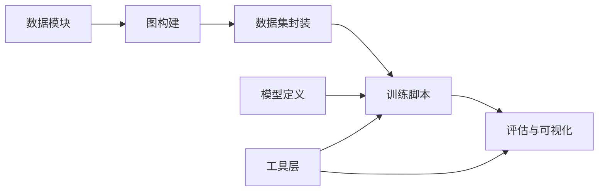

# 模型训练与评估

<cite>
**本文引用的文件**   
- [1.节点分类实验.py](file://MyProject/Model/1.节点分类实验.py)
- [2.节点分类实验_74.19%_20240423.py](file://MyProject/Model/2.节点分类实验_74.19%_20240423.py)
- [3.节点分类实验_79.57%_20240413.py](file://MyProject/Model/3.节点分类实验_79.57%_20240413.py)
- [4.节点分类实验_80.7%+画图_20240521.py](file://MyProject/Model/4.节点分类实验_80.7%+画图_20240521.py)
- [5.节点分类实验.py](file://MyProject/Model/5.节点分类实验.py)
- [6.py](file://MyProject/Model/6.py)
- [7.py](file://MyProject/Model/7.py)
- [8.节点分类实验_MACD_93.47%+画图_20240505.py](file://MyProject/Model/8.节点分类实验_MACD_93.47%+画图_20240505.py)
- [9.节点分类实验_MACD_93.47%+画图_20240505.py](file://MyProject/Model/9.节点分类实验_MACD_93.47%+画图_20240505.py)
- [构建图train数据.py](file://生成train数据/构建图train数据.py)
- [构建图train数据_ForInMemoryDataset.py](file://生成train数据/构建图train数据_ForInMemoryDataset.py)
- [model.py](file://生成train数据/model.py)
- [TrainData.py](file://MyProject/DataBase/TrainData.py)
- [StockData.py](file://MyProject/DataBase/StockData.py)
- [CsvHelper.py](file://MyProject/Helper/CsvHelper.py)
- [LogHelper.py](file://MyProject/Helper/LogHelper.py)
- [DrawHelper_class.py](file://MyProject/Helper/DrawHelper_class.py)
</cite>

## 目录
1. [简介](#简介)
2. [项目结构](#项目结构)
3. [核心组件](#核心组件)
4. [架构总览](#架构总览)
5. [详细组件分析](#详细组件分析)
6. [依赖关系分析](#依赖关系分析)
7. [性能考虑](#性能考虑)
8. [故障排查指南](#故障排查指南)
9. [结论](#结论)
10. [附录](#附录)

## 简介
本文件面向“节点分类”任务的模型训练与评估，结合仓库中的多个实验脚本与数据处理模块，系统阐述：
- 任务设置与数据准备（图构建、标签定义、划分策略）
- 损失函数选择与优化器配置
- 训练流程各阶段（数据加载、前向传播、反向传播、权重更新）
- 超参数调优策略（学习率调度、批量大小、早停机制）
- 评估指标体系（准确率、召回率、F1、混淆矩阵）
- 自定义训练循环实现要点
- 分布式训练、模型保存加载与推理部署最佳实践

## 项目结构
本项目围绕“股票相关图数据”的节点分类展开，主要包含：
- 数据准备与图构建：位于“生成train数据”与“MyProject/DataBase”，负责从原始行情数据构建图结构、特征与标签，并输出供训练使用的数据集。
- 模型与训练脚本：位于“MyProject/Model”，提供多版本节点分类实验脚本，涵盖不同模型变体、可视化与结果记录。
- 辅助工具：位于“MyProject/Helper”，提供CSV读写、日志、绘图等通用能力。

图表来源
- [构建图train数据.py](file://生成train数据/构建图train数据.py)
- [构建图train数据_ForInMemoryDataset.py](file://生成train数据/构建图train数据_ForInMemoryDataset.py)
- [1.节点分类实验.py](file://MyProject/Model/1.节点分类实验.py)
- [2.节点分类实验_74.19%_20240423.py](file://MyProject/Model/2.节点分类实验_74.19%_20240423.py)
- [3.节点分类实验_79.57%_20240413.py](file://MyProject/Model/3.节点分类实验_79.57%_20240413.py)
- [4.节点分类实验_80.7%+画图_20240521.py](file://MyProject/Model/4.节点分类实验_80.7%+画图_20240521.py)
- [5.节点分类实验.py](file://MyProject/Model/5.节点分类实验.py)
- [6.py](file://MyProject/Model/6.py)
- [7.py](file://MyProject/Model/7.py)
- [8.节点分类实验_MACD_93.47%+画图_20240505.py](file://MyProject/Model/8.节点分类实验_MACD_93.47%+画图_20240505.py)
- [9.节点分类实验_MACD_93.47%+画图_20240505.py](file://MyProject/Model/9.节点分类实验_MACD_93.47%+画图_20240505.py)
- [model.py](file://生成train数据/model.py)
- [StockData.py](file://MyProject/DataBase/StockData.py)
- [TrainData.py](file://MyProject/DataBase/TrainData.py)
- [CsvHelper.py](file://MyProject/Helper/CsvHelper.py)
- [LogHelper.py](file://MyProject/Helper/LogHelper.py)
- [DrawHelper_class.py](file://MyProject/Helper/DrawHelper_class.py)

章节来源
- [构建图train数据.py](file://生成train数据/构建图train数据.py)
- [构建图train数据_ForInMemoryDataset.py](file://生成train数据/构建图train数据_ForInMemoryDataset.py)
- [1.节点分类实验.py](file://MyProject/Model/1.节点分类实验.py)
- [2.节点分类实验_74.19%_20240423.py](file://MyProject/Model/2.节点分类实验_74.19%_20240423.py)
- [3.节点分类实验_79.57%_20240413.py](file://MyProject/Model/3.节点分类实验_79.57%_20240413.py)
- [4.节点分类实验_80.7%+画图_20240521.py](file://MyProject/Model/4.节点分类实验_80.7%+画图_20240521.py)
- [5.节点分类实验.py](file://MyProject/Model/5.节点分类实验.py)
- [6.py](file://MyProject/Model/6.py)
- [7.py](file://MyProject/Model/7.py)
- [8.节点分类实验_MACD_93.47%+画图_20240505.py](file://MyProject/Model/8.节点分类实验_MACD_93.47%+画图_20240505.py)
- [9.节点分类实验_MACD_93.47%+画图_20240505.py](file://MyProject/Model/9.节点分类实验_MACD_93.47%+画图_20240505.py)
- [model.py](file://生成train数据/model.py)
- [StockData.py](file://MyProject/DataBase/StockData.py)
- [TrainData.py](file://MyProject/DataBase/TrainData.py)
- [CsvHelper.py](file://MyProject/Helper/CsvHelper.py)
- [LogHelper.py](file://MyProject/Helper/LogHelper.py)
- [DrawHelper_class.py](file://MyProject/Helper/DrawHelper_class.py)

## 核心组件
- 数据与图构建
  - 原始数据读取与清洗：通过数据模块获取个股行情序列，构造时间窗口与统计特征。
  - 图结构构建：以时间为维度或行业/板块为维度建立节点与边，形成邻接关系；同时生成节点特征向量与标签（如涨跌方向）。
  - 数据集封装：将图对象与标签打包为可迭代的数据集，支持按批次采样与掩码划分（训练/验证/测试）。
- 模型与训练
  - 模型定义：基于图神经网络（如GCN/GAT等）的节点分类模型，输入节点特征与邻接信息，输出每个节点的类别概率。
  - 损失函数：多分类常用交叉熵损失；若类别不平衡可采用加权交叉熵或Focal Loss。
  - 优化器与调度：Adam/AdamW优化器配合余弦退火或StepLR学习率调度；支持梯度裁剪与权重衰减。
  - 训练循环：前向计算损失、反向传播求导、优化器步进、指标累计与日志记录。
- 评估与可视化
  - 指标：准确率、精确率、召回率、F1分数（宏平均/微平均）、混淆矩阵。
  - 可视化：绘制ROC曲线、PR曲线、混淆矩阵热力图与训练过程曲线。
- 工具与工程化
  - 日志与绘图：统一日志输出与图表保存，便于复现实验与对比。
  - 模型持久化：保存/加载模型权重、优化器状态与最佳阈值。

章节来源
- [构建图train数据.py](file://生成train数据/构建图train数据.py)
- [构建图train数据_ForInMemoryDataset.py](file://生成train数据/构建图train数据_ForInMemoryDataset.py)
- [model.py](file://生成train数据/model.py)
- [1.节点分类实验.py](file://MyProject/Model/1.节点分类实验.py)
- [2.节点分类实验_74.19%_20240423.py](file://MyProject/Model/2.节点分类实验_74.19%_20240423.py)
- [3.节点分类实验_79.57%_20240413.py](file://MyProject/Model/3.节点分类实验_79.57%_20240413.py)
- [4.节点分类实验_80.7%+画图_20240521.py](file://MyProject/Model/4.节点分类实验_80.7%+画图_20240521.py)
- [5.节点分类实验.py](file://MyProject/Model/5.节点分类实验.py)
- [6.py](file://MyProject/Model/6.py)
- [7.py](file://MyProject/Model/7.py)
- [8.节点分类实验_MACD_93.47%+画图_20240505.py](file://MyProject/Model/8.节点分类实验_MACD_93.47%+画图_20240505.py)
- [9.节点分类实验_MACD_93.47%+画图_20240505.py](file://MyProject/Model/9.节点分类实验_MACD_93.47%+画图_20240505.py)
- [CsvHelper.py](file://MyProject/Helper/CsvHelper.py)
- [LogHelper.py](file://MyProject/Helper/LogHelper.py)
- [DrawHelper_class.py](file://MyProject/Helper/DrawHelper_class.py)

## 架构总览
下图展示了从数据到训练再到评估的整体流程，以及关键模块之间的交互关系。

图表来源
- [构建图train数据.py](file://生成train数据/构建图train数据.py)
- [构建图train数据_ForInMemoryDataset.py](file://生成train数据/构建图train数据_ForInMemoryDataset.py)
- [model.py](file://生成train数据/model.py)
- [1.节点分类实验.py](file://MyProject/Model/1.节点分类实验.py)
- [2.节点分类实验_74.19%_20240423.py](file://MyProject/Model/2.节点分类实验_74.19%_20240423.py)
- [3.节点分类实验_79.57%_20240413.py](file://MyProject/Model/3.节点分类实验_79.57%_20240413.py)
- [4.节点分类实验_80.7%+画图_20240521.py](file://MyProject/Model/4.节点分类实验_80.7%+画图_20240521.py)
- [5.节点分类实验.py](file://MyProject/Model/5.节点分类实验.py)
- [6.py](file://MyProject/Model/6.py)
- [7.py](file://MyProject/Model/7.py)
- [8.节点分类实验_MACD_93.47%+画图_20240505.py](file://MyProject/Model/8.节点分类实验_MACD_93.47%+画图_20240505.py)
- [9.节点分类实验_MACD_93.47%+画图_20240505.py](file://MyProject/Model/9.节点分类实验_MACD_93.47%+画图_20240505.py)
- [CsvHelper.py](file://MyProject/Helper/CsvHelper.py)
- [LogHelper.py](file://MyProject/Helper/LogHelper.py)
- [DrawHelper_class.py](file://MyProject/Helper/DrawHelper_class.py)

## 详细组件分析

### 数据与图构建组件
- 功能职责
  - 从原始行情数据提取技术指标与统计量作为节点特征。
  - 根据业务规则构建节点间边（如时间相邻、同板块关联），生成邻接矩阵或稀疏边索引。
  - 生成节点标签（例如未来区间涨跌方向），并按时间顺序划分训练/验证/测试集。
- 关键数据结构
  - 节点特征矩阵：形状为[节点数, 特征维度]。
  - 边索引：形状为[2, 边数]，表示无向或双向边的端点。
  - 标签向量：形状为[节点数]，类别索引。
  - 掩码数组：分别标记训练/验证/测试节点集合。
- 复杂度与内存
  - 图规模较大时建议使用稀疏存储与内存数据集封装，避免重复IO。
- 常见问题
  - 标签泄露：确保标签仅使用未来信息，避免用当前时刻的未来值参与训练。
  - 类别不平衡：采用分层抽样或重采样策略。

章节来源
- [构建图train数据.py](file://生成train数据/构建图train数据.py)
- [构建图train数据_ForInMemoryDataset.py](file://生成train数据/构建图train数据_ForInMemoryDataset.py)
- [StockData.py](file://MyProject/DataBase/StockData.py)
- [TrainData.py](file://MyProject/DataBase/TrainData.py)

### 模型定义组件
- 功能职责
  - 定义图卷积层与多层堆叠，输出每个节点的类别概率分布。
  - 提供标准化、正则化与Dropout等稳定训练的组件。
- 设计模式
  - 模块化：将特征编码、图卷积、分类头分离，便于替换与扩展。
  - 可配置：通过超参数字典控制层数、隐藏维、激活函数等。
- 复杂度
  - 每层图卷积的时间复杂度近似O(E·d)，E为边数，d为特征维。
- 可扩展性
  - 支持GAT注意力权重、残差连接、批归一化等增强。

章节来源
- [model.py](file://生成train数据/model.py)
- [1.节点分类实验.py](file://MyProject/Model/1.节点分类实验.py)
- [2.节点分类实验_74.19%_20240423.py](file://MyProject/Model/2.节点分类实验_74.19%_20240423.py)
- [3.节点分类实验_79.57%_20240413.py](file://MyProject/Model/3.节点分类实验_79.57%_20240413.py)
- [4.节点分类实验_80.7%+画图_20240521.py](file://MyProject/Model/4.节点分类实验_80.7%+画图_20240521.py)
- [5.节点分类实验.py](file://MyProject/Model/5.节点分类实验.py)
- [6.py](file://MyProject/Model/6.py)
- [7.py](file://MyProject/Model/7.py)
- [8.节点分类实验_MACD_93.47%+画图_20240505.py](file://MyProject/Model/8.节点分类实验_MACD_93.47%+画图_20240505.py)
- [9.节点分类实验_MACD_93.47%+画图_20240505.py](file://MyProject/Model/9.节点分类实验_MACD_93.47%+画图_20240505.py)

### 训练脚本与自定义训练循环
- 训练流程阶段
  - 数据加载：创建DataLoader，按批次抽取子图或全图掩码。
  - 前向传播：输入节点特征与边索引，得到预测概率。
  - 损失计算：多分类交叉熵；类别不平衡时使用加权或Focal Loss。
  - 反向传播：清零梯度、计算梯度、应用梯度裁剪。
  - 权重更新：调用优化器step，必要时更新学习率调度器。
  - 指标记录：累计损失与正确率，写入日志。
- 超参数调优
  - 学习率：初始学习率与调度策略（余弦退火/StepLR），配合Warmup提升稳定性。
  - 批量大小：在显存允许范围内增大batch以提升收敛速度。
  - 正则化：权重衰减、Dropout、早停（基于验证集指标）。
- 可视化与日志
  - 训练曲线：损失与指标随epoch变化。
  - 混淆矩阵与分类报告：定位易混淆类别。

图表来源
- [1.节点分类实验.py](file://MyProject/Model/1.节点分类实验.py)
- [2.节点分类实验_74.19%_20240423.py](file://MyProject/Model/2.节点分类实验_74.19%_20240423.py)
- [3.节点分类实验_79.57%_20240413.py](file://MyProject/Model/3.节点分类实验_79.57%_20240413.py)
- [4.节点分类实验_80.7%+画图_20240521.py](file://MyProject/Model/4.节点分类实验_80.7%+画图_20240521.py)
- [5.节点分类实验.py](file://MyProject/Model/5.节点分类实验.py)
- [6.py](file://MyProject/Model/6.py)
- [7.py](file://MyProject/Model/7.py)
- [8.节点分类实验_MACD_93.47%+画图_20240505.py](file://MyProject/Model/8.节点分类实验_MACD_93.47%+画图_20240505.py)
- [9.节点分类实验_MACD_93.47%+画图_20240505.py](file://MyProject/Model/9.节点分类实验_MACD_93.47%+画图_20240505.py)

章节来源
- [1.节点分类实验.py](file://MyProject/Model/1.节点分类实验.py)
- [2.节点分类实验_74.19%_20240423.py](file://MyProject/Model/2.节点分类实验_74.19%_20240423.py)
- [3.节点分类实验_79.57%_20240413.py](file://MyProject/Model/3.节点分类实验_79.57%_20240413.py)
- [4.节点分类实验_80.7%+画图_20240521.py](file://MyProject/Model/4.节点分类实验_80.7%+画图_20240521.py)
- [5.节点分类实验.py](file://MyProject/Model/5.节点分类实验.py)
- [6.py](file://MyProject/Model/6.py)
- [7.py](file://MyProject/Model/7.py)
- [8.节点分类实验_MACD_93.47%+画图_20240505.py](file://MyProject/Model/8.节点分类实验_MACD_93.47%+画图_20240505.py)
- [9.节点分类实验_MACD_93.47%+画图_20240505.py](file://MyProject/Model/9.节点分类实验_MACD_93.47%+画图_20240505.py)

### 评估与可视化组件
- 指标体系
  - 准确率：整体正确比例。
  - 精确率与召回率：针对各类别或宏/微平均。
  - F1分数：综合衡量。
  - 混淆矩阵：识别误判热点。
- 可视化
  - 训练/验证曲线：损失与指标趋势。
  - ROC/PR曲线：阈值敏感型评估。
  - 混淆矩阵热力图：直观展示类别混淆情况。
- 工具
  - 绘图类：集中管理图表样式与导出路径。
  - 日志类：结构化记录实验配置与结果。

章节来源
- [DrawHelper_class.py](file://MyProject/Helper/DrawHelper_class.py)
- [LogHelper.py](file://MyProject/Helper/LogHelper.py)
- [4.节点分类实验_80.7%+画图_20240521.py](file://MyProject/Model/4.节点分类实验_80.7%+画图_20240521.py)
- [8.节点分类实验_MACD_93.47%+画图_20240505.py](file://MyProject/Model/8.节点分类实验_MACD_93.47%+画图_20240505.py)
- [9.节点分类实验_MACD_93.47%+画图_20240505.py](file://MyProject/Model/9.节点分类实验_MACD_93.47%+画图_20240505.py)

## 依赖关系分析
- 模块耦合
  - 训练脚本依赖数据构建与模型定义，二者相对独立，便于替换与复用。
  - 工具层被多个脚本共享，降低重复代码。
- 外部依赖
  - PyTorch与PyTorch Geometric用于张量与图操作。
  - 可视化库用于绘图与日志输出。
- 潜在循环依赖
  - 建议保持数据→模型→训练→评估的单向依赖，避免反向引用。

图表来源
- [构建图train数据.py](file://生成train数据/构建图train数据.py)
- [构建图train数据_ForInMemoryDataset.py](file://生成train数据/构建图train数据_ForInMemoryDataset.py)
- [model.py](file://生成train数据/model.py)
- [1.节点分类实验.py](file://MyProject/Model/1.节点分类实验.py)
- [2.节点分类实验_74.19%_20240423.py](file://MyProject/Model/2.节点分类实验_74.19%_20240423.py)
- [3.节点分类实验_79.57%_20240413.py](file://MyProject/Model/3.节点分类实验_79.57%_20240413.py)
- [4.节点分类实验_80.7%+画图_20240521.py](file://MyProject/Model/4.节点分类实验_80.7%+画图_20240521.py)
- [5.节点分类实验.py](file://MyProject/Model/5.节点分类实验.py)
- [6.py](file://MyProject/Model/6.py)
- [7.py](file://MyProject/Model/7.py)
- [8.节点分类实验_MACD_93.47%+画图_20240505.py](file://MyProject/Model/8.节点分类实验_MACD_93.47%+画图_20240505.py)
- [9.节点分类实验_MACD_93.47%+画图_20240505.py](file://MyProject/Model/9.节点分类实验_MACD_93.47%+画图_20240505.py)
- [CsvHelper.py](file://MyProject/Helper/CsvHelper.py)
- [LogHelper.py](file://MyProject/Helper/LogHelper.py)
- [DrawHelper_class.py](file://MyProject/Helper/DrawHelper_class.py)

章节来源
- [构建图train数据.py](file://生成train数据/构建图train数据.py)
- [构建图train数据_ForInMemoryDataset.py](file://生成train数据/构建图train数据_ForInMemoryDataset.py)
- [model.py](file://生成train数据/model.py)
- [1.节点分类实验.py](file://MyProject/Model/1.节点分类实验.py)
- [2.节点分类实验_74.19%_20240423.py](file://MyProject/Model/2.节点分类实验_74.19%_20240423.py)
- [3.节点分类实验_79.57%_20240413.py](file://MyProject/Model/3.节点分类实验_79.57%_20240413.py)
- [4.节点分类实验_80.7%+画图_20240521.py](file://MyProject/Model/4.节点分类实验_80.7%+画图_20240521.py)
- [5.节点分类实验.py](file://MyProject/Model/5.节点分类实验.py)
- [6.py](file://MyProject/Model/6.py)
- [7.py](file://MyProject/Model/7.py)
- [8.节点分类实验_MACD_93.47%+画图_20240505.py](file://MyProject/Model/8.节点分类实验_MACD_93.47%+画图_20240505.py)
- [9.节点分类实验_MACD_93.47%+画图_20240505.py](file://MyProject/Model/9.节点分类实验_MACD_93.47%+画图_20240505.py)
- [CsvHelper.py](file://MyProject/Helper/CsvHelper.py)
- [LogHelper.py](file://MyProject/Helper/LogHelper.py)
- [DrawHelper_class.py](file://MyProject/Helper/DrawHelper_class.py)

## 性能考虑
- 数据加载
  - 使用内存数据集减少磁盘IO；对大图采用邻居采样或分区训练。
- 模型计算
  - 合理设置隐藏维与层数，避免过深导致梯度消失与计算开销过大。
  - 启用混合精度训练（如适用）以降低显存占用与加速训练。
- 优化器与调度
  - AdamW配合权重衰减提升泛化；余弦退火学习率有助于后期收敛。
- 并行与分布式
  - 单卡多进程数据加载；多卡使用数据并行或分布式数据并行。
  - 注意同步BN与梯度聚合。

## 故障排查指南
- 常见错误
  - 维度不匹配：检查节点特征维度与模型输入是否一致。
  - 标签越界：确认类别数量与模型输出维度一致。
  - 显存不足：减小batch size、图规模或使用邻居采样。
- 调试方法
  - 打印中间张量形状与数值范围，定位异常。
  - 逐步关闭正则化与复杂层，验证基础链路。
  - 使用小样本快速回归问题，确认训练循环正确性。
- 日志与可视化
  - 统一日志格式，记录超参与关键指标，便于回溯。
  - 定期保存训练曲线与混淆矩阵，辅助诊断过拟合或欠拟合。

章节来源
- [LogHelper.py](file://MyProject/Helper/LogHelper.py)
- [DrawHelper_class.py](file://MyProject/Helper/DrawHelper_class.py)
- [4.节点分类实验_80.7%+画图_20240521.py](file://MyProject/Model/4.节点分类实验_80.7%+画图_20240521.py)
- [8.节点分类实验_MACD_93.47%+画图_20240505.py](file://MyProject/Model/8.节点分类实验_MACD_93.47%+画图_20240505.py)
- [9.节点分类实验_MACD_93.47%+画图_20240505.py](file://MyProject/Model/9.节点分类实验_MACD_93.47%+画图_20240505.py)

## 结论
本项目围绕股票相关图数据的节点分类任务，提供了从数据构建、模型定义到训练评估的完整流水线。通过模块化设计与丰富的实验脚本，用户可快速复现实验并进行超参调优。建议在后续工作中：
- 完善数据质量与标签一致性校验
- 引入更稳健的损失与正则化策略
- 扩展分布式训练与在线推理部署能力

## 附录
- 超参数调优清单
  - 学习率：初始值、调度策略、Warmup步数
  - 批量大小：受显存限制的最大可行值
  - 正则化：权重衰减、Dropout比率
  - 早停：验证指标与耐心轮数
- 模型保存与加载
  - 保存项：模型权重、优化器状态、最佳阈值、随机种子
  - 加载项：恢复训练或进行推理
- 推理部署
  - 固定输入格式与预处理流程
  - 导出为轻量格式（如ONNX）以提升部署效率
  - 服务化接口：输入节点ID与上下文，返回预测类别与置信度