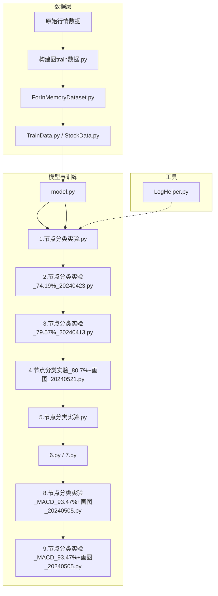
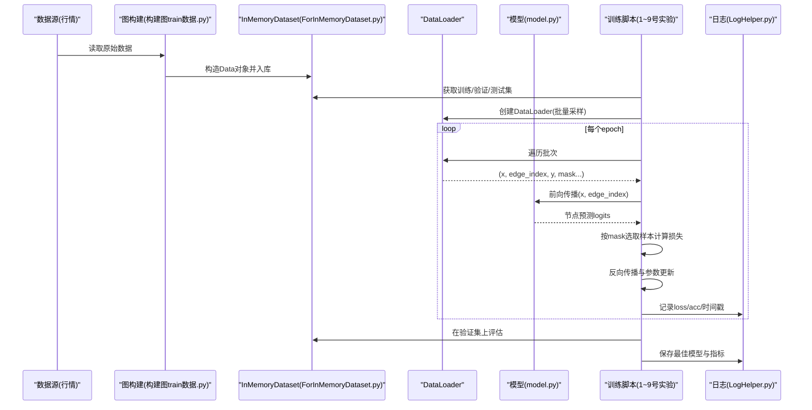
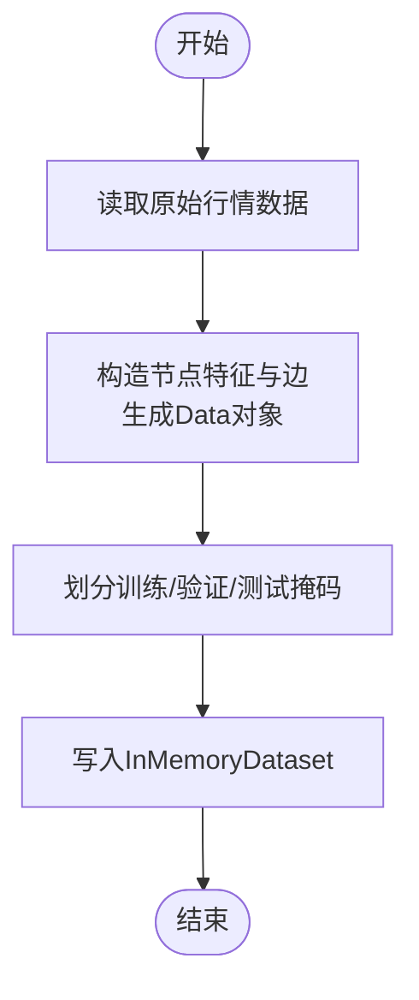
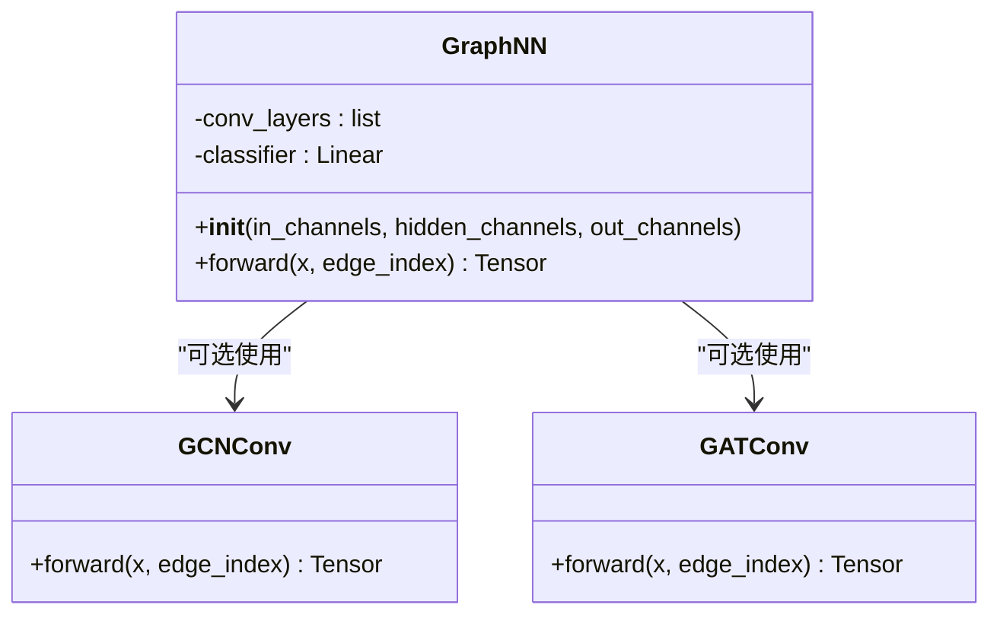
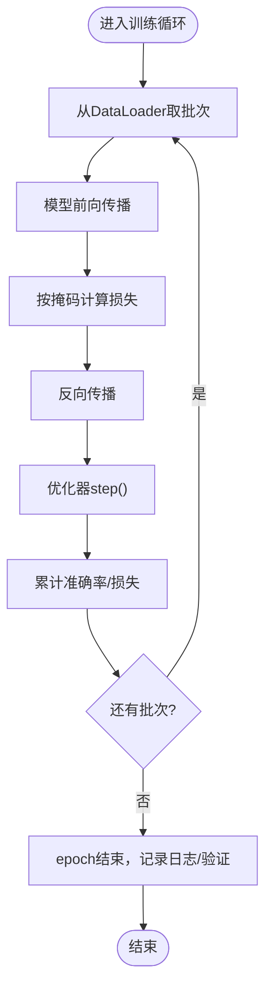
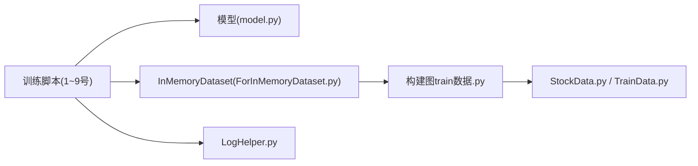

# 训练流程详解

<cite>
**本文引用的文件**   
- [MyProject/Model/1.节点分类实验.py](file://MyProject/Model/1.节点分类实验.py)
- [MyProject/Model/2.节点分类实验_74.19%_20240423.py](file://MyProject/Model/2.节点分类实验_74.19%_20240423.py)
- [MyProject/Model/3.节点分类实验_79.57%_20240413.py](file://MyProject/Model/3.节点分类实验_79.57%_20240413.py)
- [MyProject/Model/4.节点分类实验_80.7%+画图_20240521.py](file://MyProject/Model/4.节点分类实验_80.7%+画图_20240521.py)
- [MyProject/Model/5.节点分类实验.py](file://MyProject/Model/5.节点分类实验.py)
- [MyProject/Model/6.py](file://MyProject/Model/6.py)
- [MyProject/Model/7.py](file://MyProject/Model/7.py)
- [MyProject/Model/8.节点分类实验_MACD_93.47%+画图_20240505.py](file://MyProject/Model/8.节点分类实验_MACD_93.47%+画图_20240505.py)
- [MyProject/Model/9.节点分类实验_MACD_93.47%+画图_20240505.py](file://MyProject/Model/9.节点分类实验_MACD_93.47%+画图_20240505.py)
- [生成train数据/构建图train数据.py](file://生成train数据/构建图train数据.py)
- [生成train数据/构建图train数据_ForInMemoryDataset.py](file://生成train数据/构建图train数据_ForInMemoryDataset.py)
- [生成train数据/model.py](file://生成train数据/model.py)
- [生成train数据/1.节点分类实验.py](file://生成train数据/1.节点分类实验.py)
- [生成train数据/2.节点分类实验.py](file://生成train数据/2.节点分类实验.py)
- [MyProject/DataBase/TrainData.py](file://MyProject/DataBase/TrainData.py)
- [MyProject/DataBase/StockData.py](file://MyProject/DataBase/StockData.py)
- [MyProject/Helper/LogHelper.py](file://MyProject/Helper/LogHelper.py)
</cite>

## 目录
1. [简介](#简介)
2. [项目结构](#项目结构)
3. [核心组件](#核心组件)
4. [架构总览](#架构总览)
5. [详细组件分析](#详细组件分析)
6. [依赖关系分析](#依赖关系分析)
7. [性能考虑](#性能考虑)
8. [故障排查指南](#故障排查指南)
9. [结论](#结论)
10. [附录](#附录)

## 简介
本文件面向使用 PyTorch Geometric（PyG）进行节点分类任务的读者，系统化梳理该仓库中“节点分类”的完整训练流程。内容覆盖：
- 数据加载与批次处理（含 PyG 图对象结构与批处理机制）
- 前向传播、损失计算与反向传播
- 关键配置项（学习率、优化器、损失函数）
- 训练脚本解析（数据预处理、模型初始化、训练循环、验证集评估）
- 训练日志记录、进度监控与异常处理实践

目标是在不直接粘贴代码的前提下，帮助读者快速定位并理解实现细节，同时提供可视化图示辅助理解。

## 项目结构
本项目围绕“股票行情图”的节点分类任务组织，主要包含以下模块：
- 数据准备与图构建：位于“生成train数据”与“MyProject/DataBase”，负责从原始行情数据构建图结构、标签与特征，并提供 InMemory 数据集封装。
- 模型与训练脚本：位于“MyProject/Model”，包含多版节点分类实验脚本，逐步完善训练循环、可视化与指标统计。
- 工具库：位于“MyProject/Helper”，提供日志、绘图、随机数等通用能力。



图表来源
- [生成train数据/构建图train数据.py](file://生成train数据/构建图train数据.py)
- [生成train数据/构建图train数据_ForInMemoryDataset.py](file://生成train数据/构建图train数据_ForInMemoryDataset.py)
- [MyProject/DataBase/TrainData.py](file://MyProject/DataBase/TrainData.py)
- [MyProject/DataBase/StockData.py](file://MyProject/DataBase/StockData.py)
- [生成train数据/model.py](file://生成train数据/model.py)
- [MyProject/Model/1.节点分类实验.py](file://MyProject/Model/1.节点分类实验.py)
- [MyProject/Model/2.节点分类实验_74.19%_20240423.py](file://MyProject/Model/2.节点分类实验_74.19%_20240423.py)
- [MyProject/Model/3.节点分类实验_79.57%_20240413.py](file://MyProject/Model/3.节点分类实验_79.57%_20240413.py)
- [MyProject/Model/4.节点分类实验_80.7%+画图_20240521.py](file://MyProject/Model/4.节点分类实验_80.7%+画图_20240521.py)
- [MyProject/Model/5.节点分类实验.py](file://MyProject/Model/5.节点分类实验.py)
- [MyProject/Model/6.py](file://MyProject/Model/6.py)
- [MyProject/Model/7.py](file://MyProject/Model/7.py)
- [MyProject/Model/8.节点分类实验_MACD_93.47%+画图_20240505.py](file://MyProject/Model/8.节点分类实验_MACD_93.47%+画图_20240505.py)
- [MyProject/Model/9.节点分类实验_MACD_93.47%+画图_20240505.py](file://MyProject/Model/9.节点分类实验_MACD_93.47%+画图_20240505.py)
- [MyProject/Helper/LogHelper.py](file://MyProject/Helper/LogHelper.py)

章节来源
- [生成train数据/构建图train数据.py](file://生成train数据/构建图train数据.py)
- [生成train数据/构建图train数据_ForInMemoryDataset.py](file://生成train数据/构建图train数据_ForInMemoryDataset.py)
- [MyProject/DataBase/TrainData.py](file://MyProject/DataBase/TrainData.py)
- [MyProject/DataBase/StockData.py](file://MyProject/DataBase/StockData.py)
- [生成train数据/model.py](file://生成train数据/model.py)
- [MyProject/Model/1.节点分类实验.py](file://MyProject/Model/1.节点分类实验.py)
- [MyProject/Model/2.节点分类实验_74.19%_20240423.py](file://MyProject/Model/2.节点分类实验_74.19%_20240423.py)
- [MyProject/Model/3.节点分类实验_79.57%_20240413.py](file://MyProject/Model/3.节点分类实验_79.57%_20240413.py)
- [MyProject/Model/4.节点分类实验_80.7%+画图_20240521.py](file://MyProject/Model/4.节点分类实验_80.7%+画图_20240521.py)
- [MyProject/Model/5.节点分类实验.py](file://MyProject/Model/5.节点分类实验.py)
- [MyProject/Model/6.py](file://MyProject/Model/6.py)
- [MyProject/Model/7.py](file://MyProject/Model/7.py)
- [MyProject/Model/8.节点分类实验_MACD_93.47%+画图_20240505.py](file://MyProject/Model/8.节点分类实验_MACD_93.47%+画图_20240505.py)
- [MyProject/Model/9.节点分类实验_MACD_93.47%+画图_20240505.py](file://MyProject/Model/9.节点分类实验_MACD_93.47%+画图_20240505.py)
- [MyProject/Helper/LogHelper.py](file://MyProject/Helper/LogHelper.py)

## 核心组件
- 数据与图构建
  - 从原始行情数据提取时序窗口或事件序列，构造节点特征与边关系，形成 PyG 的 Data 对象；进一步封装为 InMemoryDataset 以支持高效迭代。
  - 关键路径参考：
    - [构建图train数据.py](file://生成train数据/构建图train数据.py)
    - [构建图train数据_ForInMemoryDataset.py](file://生成train数据/构建图train数据_ForInMemoryDataset.py)
    - [TrainData.py](file://MyProject/DataBase/TrainData.py)
    - [StockData.py](file://MyProject/DataBase/StockData.py)
- 模型定义
  - 基于 PyG 的 GCN/GAT 等卷积层组合成多层图神经网络，输出节点级预测。
  - 关键路径参考：
    - [model.py](file://生成train数据/model.py)
- 训练脚本
  - 多版本实验脚本逐步完善训练循环、验证、可视化与日志记录。
  - 关键路径参考：
    - [1.节点分类实验.py](file://MyProject/Model/1.节点分类实验.py)
    - [2.节点分类实验_74.19%_20240423.py](file://MyProject/Model/2.节点分类实验_74.19%_20240423.py)
    - [3.节点分类实验_79.57%_20240413.py](file://MyProject/Model/3.节点分类实验_79.57%_20240413.py)
    - [4.节点分类实验_80.7%+画图_20240521.py](file://MyProject/Model/4.节点分类实验_80.7%+画图_20240521.py)
    - [5.节点分类实验.py](file://MyProject/Model/5.节点分类实验.py)
    - [6.py](file://MyProject/Model/6.py)
    - [7.py](file://MyProject/Model/7.py)
    - [8.节点分类实验_MACD_93.47%+画图_20240505.py](file://MyProject/Model/8.节点分类实验_MACD_93.47%+画图_20240505.py)
    - [9.节点分类实验_MACD_93.47%+画图_20240505.py](file://MyProject/Model/9.节点分类实验_MACD_93.47%+画图_20240505.py)
- 工具与日志
  - 日志记录、绘图辅助等。
  - 关键路径参考：
    - [LogHelper.py](file://MyProject/Helper/LogHelper.py)

章节来源
- [生成train数据/构建图train数据.py](file://生成train数据/构建图train数据.py)
- [生成train数据/构建图train数据_ForInMemoryDataset.py](file://生成train数据/构建图train数据_ForInMemoryDataset.py)
- [MyProject/DataBase/TrainData.py](file://MyProject/DataBase/TrainData.py)
- [MyProject/DataBase/StockData.py](file://MyProject/DataBase/StockData.py)
- [生成train数据/model.py](file://生成train数据/model.py)
- [MyProject/Model/1.节点分类实验.py](file://MyProject/Model/1.节点分类实验.py)
- [MyProject/Model/2.节点分类实验_74.19%_20240423.py](file://MyProject/Model/2.节点分类实验_74.19%_20240423.py)
- [MyProject/Model/3.节点分类实验_79.57%_20240413.py](file://MyProject/Model/3.节点分类实验_79.57%_20240413.py)
- [MyProject/Model/4.节点分类实验_80.7%+画图_20240521.py](file://MyProject/Model/4.节点分类实验_80.7%+画图_20240521.py)
- [MyProject/Model/5.节点分类实验.py](file://MyProject/Model/5.节点分类实验.py)
- [MyProject/Model/6.py](file://MyProject/Model/6.py)
- [MyProject/Model/7.py](file://MyProject/Model/7.py)
- [MyProject/Model/8.节点分类实验_MACD_93.47%+画图_20240505.py](file://MyProject/Model/8.节点分类实验_MACD_93.47%+画图_20240505.py)
- [MyProject/Model/9.节点分类实验_MACD_93.47%+画图_20240505.py](file://MyProject/Model/9.节点分类实验_MACD_93.47%+画图_20240505.py)
- [MyProject/Helper/LogHelper.py](file://MyProject/Helper/LogHelper.py)

## 架构总览
下图展示了从数据到训练的端到端流程，包括数据构建、模型定义、训练循环、验证与日志记录。



图表来源
- [生成train数据/构建图train数据.py](file://生成train数据/构建图train数据.py)
- [生成train数据/构建图train数据_ForInMemoryDataset.py](file://生成train数据/构建图train数据_ForInMemoryDataset.py)
- [生成train数据/model.py](file://生成train数据/model.py)
- [MyProject/Model/1.节点分类实验.py](file://MyProject/Model/1.节点分类实验.py)
- [MyProject/Helper/LogHelper.py](file://MyProject/Helper/LogHelper.py)

## 详细组件分析

### 数据与图对象（PyG Data 与批处理）
- Data 对象字段
  - x：节点特征矩阵（N×F）
  - edge_index：稀疏边索引（2×E），COO格式
  - y：节点标签（N）
  - train_mask/val_mask/test_mask：布尔掩码，指示训练/验证/测试节点
- 批处理机制
  - DataLoader 对多个 Data 进行拼接：将各图的节点特征沿节点维度堆叠，边索引根据图序号进行偏移，自动维护 batch_size 下的全局索引映射。
  - 掩码同样被拼接，便于在同一批次内对不同子图分别计算损失与指标。
- 数据构建要点
  - 节点通常对应某只股票的某个时间片或某种聚合单元；边表示股票间相关性或交易关联。
  - 标签来源于策略信号或涨跌方向等。
- 参考实现位置
  - [构建图train数据.py](file://生成train数据/构建图train数据.py)
  - [构建图train数据_ForInMemoryDataset.py](file://生成train数据/构建图train数据_ForInMemoryDataset.py)
  - [TrainData.py](file://MyProject/DataBase/TrainData.py)
  - [StockData.py](file://MyProject/DataBase/StockData.py)



图表来源
- [生成train数据/构建图train数据.py](file://生成train数据/构建图train数据.py)
- [生成train数据/构建图train数据_ForInMemoryDataset.py](file://生成train数据/构建图train数据_ForInMemoryDataset.py)
- [MyProject/DataBase/TrainData.py](file://MyProject/DataBase/TrainData.py)
- [MyProject/DataBase/StockData.py](file://MyProject/DataBase/StockData.py)

章节来源
- [生成train数据/构建图train数据.py](file://生成train数据/构建图train数据.py)
- [生成train数据/构建图train数据_ForInMemoryDataset.py](file://生成train数据/构建图train数据_ForInMemoryDataset.py)
- [MyProject/DataBase/TrainData.py](file://MyProject/DataBase/TrainData.py)
- [MyProject/DataBase/StockData.py](file://MyProject/DataBase/StockData.py)

### 模型定义（GCN/GAT 类）
- 典型结构
  - 输入层：接收节点特征 x 与边索引 edge_index
  - 隐藏层：若干图卷积层（如 GCNConv/GATConv），配合激活与非线性
  - 输出层：线性层映射到类别数，得到 logits
- 设备与数据类型
  - 模型与数据需统一放置于同一设备（CPU/CUDA）
  - 特征与标签类型需匹配（如 float32、long）
- 参考实现位置
  - [model.py](file://生成train数据/model.py)



图表来源
- [生成train数据/model.py](file://生成train数据/model.py)

章节来源
- [生成train数据/model.py](file://生成train数据/model.py)

### 训练循环（数据加载、前向、损失、反向传播）
- 数据加载
  - 使用 DataLoader 对 InMemoryDataset 进行分批迭代，返回包含 x、edge_index、y 及掩码的批次。
- 前向传播
  - 将批次数据送入模型，得到节点级 logits。
- 损失计算
  - 仅对被掩码标记的训练节点计算交叉熵损失（避免未标注节点干扰）。
- 反向传播与更新
  - 清零梯度、计算损失、反向传播、执行一步优化器更新。
- 验证与评估
  - 在验证集上使用相同逻辑计算准确率/损失，用于早停或模型选择。
- 参考实现位置
  - [1.节点分类实验.py](file://MyProject/Model/1.节点分类实验.py)
  - [2.节点分类实验_74.19%_20240423.py](file://MyProject/Model/2.节点分类实验_74.19%_20240423.py)
  - [3.节点分类实验_79.57%_20240413.py](file://MyProject/Model/3.节点分类实验_79.57%_20240413.py)
  - [4.节点分类实验_80.7%+画图_20240521.py](file://MyProject/Model/4.节点分类实验_80.7%+画图_20240521.py)
  - [5.节点分类实验.py](file://MyProject/Model/5.节点分类实验.py)
  - [6.py](file://MyProject/Model/6.py)
  - [7.py](file://MyProject/Model/7.py)
  - [8.节点分类实验_MACD_93.47%+画图_20240505.py](file://MyProject/Model/8.节点分类实验_MACD_93.47%+画图_20240505.py)
  - [9.节点分类实验_MACD_93.47%+画图_20240505.py](file://MyProject/Model/9.节点分类实验_MACD_93.47%+画图_20240505.py)



图表来源
- [MyProject/Model/1.节点分类实验.py](file://MyProject/Model/1.节点分类实验.py)
- [MyProject/Model/2.节点分类实验_74.19%_20240423.py](file://MyProject/Model/2.节点分类实验_74.19%_20240423.py)
- [MyProject/Model/3.节点分类实验_79.57%_20240413.py](file://MyProject/Model/3.节点分类实验_79.57%_20240413.py)
- [MyProject/Model/4.节点分类实验_80.7%+画图_20240521.py](file://MyProject/Model/4.节点分类实验_80.7%+画图_20240521.py)
- [MyProject/Model/5.节点分类实验.py](file://MyProject/Model/5.节点分类实验.py)
- [MyProject/Model/6.py](file://MyProject/Model/6.py)
- [MyProject/Model/7.py](file://MyProject/Model/7.py)
- [MyProject/Model/8.节点分类实验_MACD_93.47%+画图_20240505.py](file://MyProject/Model/8.节点分类实验_MACD_93.47%+画图_20240505.py)
- [MyProject/Model/9.节点分类实验_MACD_93.47%+画图_20240505.py](file://MyProject/Model/9.节点分类实验_MACD_93.47%+画图_20240505.py)

章节来源
- [MyProject/Model/1.节点分类实验.py](file://MyProject/Model/1.节点分类实验.py)
- [MyProject/Model/2.节点分类实验_74.19%_20240423.py](file://MyProject/Model/2.节点分类实验_74.19%_20240423.py)
- [MyProject/Model/3.节点分类实验_79.57%_20240413.py](file://MyProject/Model/3.节点分类实验_79.57%_20240413.py)
- [MyProject/Model/4.节点分类实验_80.7%+画图_20240521.py](file://MyProject/Model/4.节点分类实验_80.7%+画图_20240521.py)
- [MyProject/Model/5.节点分类实验.py](file://MyProject/Model/5.节点分类实验.py)
- [MyProject/Model/6.py](file://MyProject/Model/6.py)
- [MyProject/Model/7.py](file://MyProject/Model/7.py)
- [MyProject/Model/8.节点分类实验_MACD_93.47%+画图_20240505.py](file://MyProject/Model/8.节点分类实验_MACD_93.47%+画图_20240505.py)
- [MyProject/Model/9.节点分类实验_MACD_93.47%+画图_20240505.py](file://MyProject/Model/9.节点分类实验_MACD_93.47%+画图_20240505.py)

### 关键配置选项
- 学习率与优化器
  - 常见选择：Adam（默认稳定）、SGD（可搭配动量与权重衰减）
  - 建议：先以较小学习率启动，结合验证集准确率观察收敛情况
- 损失函数
  - 节点分类常用交叉熵损失；若类别不平衡，可使用加权交叉熵或 Focal Loss
- 超参调优
  - 隐藏层维度、层数、dropout、正则化强度、batch_size、num_workers
- 参考实现位置
  - [1.节点分类实验.py](file://MyProject/Model/1.节点分类实验.py)
  - [2.节点分类实验_74.19%_20240423.py](file://MyProject/Model/2.节点分类实验_74.19%_20240423.py)
  - [3.节点分类实验_79.57%_20240413.py](file://MyProject/Model/3.节点分类实验_79.57%_20240413.py)
  - [4.节点分类实验_80.7%+画图_20240521.py](file://MyProject/Model/4.节点分类实验_80.7%+画图_20240521.py)
  - [5.节点分类实验.py](file://MyProject/Model/5.节点分类实验.py)
  - [6.py](file://MyProject/Model/6.py)
  - [7.py](file://MyProject/Model/7.py)
  - [8.节点分类实验_MACD_93.47%+画图_20240505.py](file://MyProject/Model/8.节点分类实验_MACD_93.47%+画图_20240505.py)
  - [9.节点分类实验_MACD_93.47%+画图_20240505.py](file://MyProject/Model/9.节点分类实验_MACD_93.47%+画图_20240505.py)

章节来源
- [MyProject/Model/1.节点分类实验.py](file://MyProject/Model/1.节点分类实验.py)
- [MyProject/Model/2.节点分类实验_74.19%_20240423.py](file://MyProject/Model/2.节点分类实验_74.19%_20240423.py)
- [MyProject/Model/3.节点分类实验_79.57%_20240413.py](file://MyProject/Model/3.节点分类实验_79.57%_20240413.py)
- [MyProject/Model/4.节点分类实验_80.7%+画图_20240521.py](file://MyProject/Model/4.节点分类实验_80.7%+画图_20240521.py)
- [MyProject/Model/5.节点分类实验.py](file://MyProject/Model/5.节点分类实验.py)
- [MyProject/Model/6.py](file://MyProject/Model/6.py)
- [MyProject/Model/7.py](file://MyProject/Model/7.py)
- [MyProject/Model/8.节点分类实验_MACD_93.47%+画图_20240505.py](file://MyProject/Model/8.节点分类实验_MACD_93.47%+画图_20240505.py)
- [MyProject/Model/9.节点分类实验_MACD_93.47%+画图_20240505.py](file://MyProject/Model/9.节点分类实验_MACD_93.47%+画图_20240505.py)

### 训练脚本解析（数据预处理、模型初始化、训练循环、验证）
- 数据预处理
  - 从数据库或CSV读取行情数据，构造节点特征与边，生成 Data 对象并保存到 InMemoryDataset。
  - 划分训练/验证/测试掩码，确保时间或标的维度的无泄漏。
- 模型初始化
  - 实例化模型，设置输入/隐藏/输出通道数，迁移至目标设备。
- 训练循环
  - 外层 epoch 循环，内层批次循环；每步执行前向、损失、反向与优化器更新。
- 验证集评估
  - 关闭梯度，在验证掩码上计算准确率/损失，记录最佳模型。
- 参考实现位置
  - [1.节点分类实验.py](file://MyProject/Model/1.节点分类实验.py)
  - [2.节点分类实验_74.19%_20240423.py](file://MyProject/Model/2.节点分类实验_74.19%_20240423.py)
  - [3.节点分类实验_79.57%_20240413.py](file://MyProject/Model/3.节点分类实验_79.57%_20240413.py)
  - [4.节点分类实验_80.7%+画图_20240521.py](file://MyProject/Model/4.节点分类实验_80.7%+画图_20240521.py)
  - [5.节点分类实验.py](file://MyProject/Model/5.节点分类实验.py)
  - [6.py](file://MyProject/Model/6.py)
  - [7.py](file://MyProject/Model/7.py)
  - [8.节点分类实验_MACD_93.47%+画图_20240505.py](file://MyProject/Model/8.节点分类实验_MACD_93.47%+画图_20240505.py)
  - [9.节点分类实验_MACD_93.47%+画图_20240505.py](file://MyProject/Model/9.节点分类实验_MACD_93.47%+画图_20240505.py)

```mermaid
sequenceDiagram
participant Script as "训练脚本"
participant DS as "InMemoryDataset"
participant DL as "DataLoader"
participant Net as "模型"
participant Opt as "优化器"
participant Log as "日志"
Script->>DS : 加载训练/验证/测试集
Script->>DL : 创建DataLoader(打乱/批大小)
loop 每个epoch
Script->>DL : 遍历批次
DL-->>Script : (x, edge_index, y, mask)
Script->>Net : forward(x, edge_index)
Net-->>Script : logits
Script->>Script : 按mask计算损失
Script->>Opt : backward + step
Script->>Log : 记录指标
end
Script->>DS : 在验证集上评估
Script->>Log : 保存最佳模型
```

图表来源
- [MyProject/Model/1.节点分类实验.py](file://MyProject/Model/1.节点分类实验.py)
- [MyProject/Model/2.节点分类实验_74.19%_20240423.py](file://MyProject/Model/2.节点分类实验_74.19%_20240423.py)
- [MyProject/Model/3.节点分类实验_79.57%_20240413.py](file://MyProject/Model/3.节点分类实验_79.57%_20240413.py)
- [MyProject/Model/4.节点分类实验_80.7%+画图_20240521.py](file://MyProject/Model/4.节点分类实验_80.7%+画图_20240521.py)
- [MyProject/Model/5.节点分类实验.py](file://MyProject/Model/5.节点分类实验.py)
- [MyProject/Model/6.py](file://MyProject/Model/6.py)
- [MyProject/Model/7.py](file://MyProject/Model/7.py)
- [MyProject/Model/8.节点分类实验_MACD_93.47%+画图_20240505.py](file://MyProject/Model/8.节点分类实验_MACD_93.47%+画图_20240505.py)
- [MyProject/Model/9.节点分类实验_MACD_93.47%+画图_20240505.py](file://MyProject/Model/9.节点分类实验_MACD_93.47%+画图_20240505.py)

章节来源
- [MyProject/Model/1.节点分类实验.py](file://MyProject/Model/1.节点分类实验.py)
- [MyProject/Model/2.节点分类实验_74.19%_20240423.py](file://MyProject/Model/2.节点分类实验_74.19%_20240423.py)
- [MyProject/Model/3.节点分类实验_79.57%_20240413.py](file://MyProject/Model/3.节点分类实验_79.57%_20240413.py)
- [MyProject/Model/4.节点分类实验_80.7%+画图_20240521.py](file://MyProject/Model/4.节点分类实验_80.7%+画图_20240521.py)
- [MyProject/Model/5.节点分类实验.py](file://MyProject/Model/5.节点分类实验.py)
- [MyProject/Model/6.py](file://MyProject/Model/6.py)
- [MyProject/Model/7.py](file://MyProject/Model/7.py)
- [MyProject/Model/8.节点分类实验_MACD_93.47%+画图_20240505.py](file://MyProject/Model/8.节点分类实验_MACD_93.47%+画图_20240505.py)
- [MyProject/Model/9.节点分类实验_MACD_93.47%+画图_20240505.py](file://MyProject/Model/9.节点分类实验_MACD_93.47%+画图_20240505.py)

### 训练日志记录、进度监控与异常处理
- 日志记录
  - 使用 LogHelper 记录训练 loss、准确率、耗时与超参，便于复现与对比。
- 进度监控
  - 打印每个 epoch/batch 的指标，必要时绘制曲线（部分脚本已集成绘图）。
- 异常处理
  - 捕获数据加载错误、内存不足、CUDA OOM 等异常，记录上下文信息并安全退出。
- 参考实现位置
  - [MyProject/Helper/LogHelper.py](file://MyProject/Helper/LogHelper.py)
  - [4.节点分类实验_80.7%+画图_20240521.py](file://MyProject/Model/4.节点分类实验_80.7%+画图_20240521.py)
  - [8.节点分类实验_MACD_93.47%+画图_20240505.py](file://MyProject/Model/8.节点分类实验_MACD_93.47%+画图_20240505.py)
  - [9.节点分类实验_MACD_93.47%+画图_20240505.py](file://MyProject/Model/9.节点分类实验_MACD_93.47%+画图_20240505.py)

章节来源
- [MyProject/Helper/LogHelper.py](file://MyProject/Helper/LogHelper.py)
- [MyProject/Model/4.节点分类实验_80.7%+画图_20240521.py](file://MyProject/Model/4.节点分类实验_80.7%+画图_20240521.py)
- [MyProject/Model/8.节点分类实验_MACD_93.47%+画图_20240505.py](file://MyProject/Model/8.节点分类实验_MACD_93.47%+画图_20240505.py)
- [MyProject/Model/9.节点分类实验_MACD_93.47%+画图_20240505.py](file://MyProject/Model/9.节点分类实验_MACD_93.47%+画图_20240505.py)

## 依赖关系分析
- 模块耦合
  - 训练脚本依赖模型定义与数据集；数据集依赖数据构建脚本与底层数据访问模块；日志工具被训练脚本调用。
- 外部依赖
  - PyTorch、PyTorch Geometric、Pandas/Numpy、Matplotlib（绘图）、SQLite/CSV（数据存取）
- 潜在循环依赖
  - 当前结构清晰，未见明显循环依赖；保持数据构建与训练解耦有助于扩展。



图表来源
- [生成train数据/model.py](file://生成train数据/model.py)
- [生成train数据/构建图train数据_ForInMemoryDataset.py](file://生成train数据/构建图train数据_ForInMemoryDataset.py)
- [生成train数据/构建图train数据.py](file://生成train数据/构建图train数据.py)
- [MyProject/DataBase/StockData.py](file://MyProject/DataBase/StockData.py)
- [MyProject/DataBase/TrainData.py](file://MyProject/DataBase/TrainData.py)
- [MyProject/Helper/LogHelper.py](file://MyProject/Helper/LogHelper.py)
- [MyProject/Model/1.节点分类实验.py](file://MyProject/Model/1.节点分类实验.py)
- [MyProject/Model/2.节点分类实验_74.19%_20240423.py](file://MyProject/Model/2.节点分类实验_74.19%_20240423.py)
- [MyProject/Model/3.节点分类实验_79.57%_20240413.py](file://MyProject/Model/3.节点分类实验_79.57%_20240413.py)
- [MyProject/Model/4.节点分类实验_80.7%+画图_20240521.py](file://MyProject/Model/4.节点分类实验_80.7%+画图_20240521.py)
- [MyProject/Model/5.节点分类实验.py](file://MyProject/Model/5.节点分类实验.py)
- [MyProject/Model/6.py](file://MyProject/Model/6.py)
- [MyProject/Model/7.py](file://MyProject/Model/7.py)
- [MyProject/Model/8.节点分类实验_MACD_93.47%+画图_20240505.py](file://MyProject/Model/8.节点分类实验_MACD_93.47%+画图_20240505.py)
- [MyProject/Model/9.节点分类实验_MACD_93.47%+画图_20240505.py](file://MyProject/Model/9.节点分类实验_MACD_93.47%+画图_20240505.py)

章节来源
- [生成train数据/model.py](file://生成train数据/model.py)
- [生成train数据/构建图train数据_ForInMemoryDataset.py](file://生成train数据/构建图train数据_ForInMemoryDataset.py)
- [生成train数据/构建图train数据.py](file://生成train数据/构建图train数据.py)
- [MyProject/DataBase/StockData.py](file://MyProject/DataBase/StockData.py)
- [MyProject/DataBase/TrainData.py](file://MyProject/DataBase/TrainData.py)
- [MyProject/Helper/LogHelper.py](file://MyProject/Helper/LogHelper.py)
- [MyProject/Model/1.节点分类实验.py](file://MyProject/Model/1.节点分类实验.py)
- [MyProject/Model/2.节点分类实验_74.19%_20240423.py](file://MyProject/Model/2.节点分类实验_74.19%_20240423.py)
- [MyProject/Model/3.节点分类实验_79.57%_20240413.py](file://MyProject/Model/3.节点分类实验_79.57%_20240413.py)
- [MyProject/Model/4.节点分类实验_80.7%+画图_20240521.py](file://MyProject/Model/4.节点分类实验_80.7%+画图_20240521.py)
- [MyProject/Model/5.节点分类实验.py](file://MyProject/Model/5.节点分类实验.py)
- [MyProject/Model/6.py](file://MyProject/Model/6.py)
- [MyProject/Model/7.py](file://MyProject/Model/7.py)
- [MyProject/Model/8.节点分类实验_MACD_93.47%+画图_20240505.py](file://MyProject/Model/8.节点分类实验_MACD_93.47%+画图_20240505.py)
- [MyProject/Model/9.节点分类实验_MACD_93.47%+画图_20240505.py](file://MyProject/Model/9.节点分类实验_MACD_93.47%+画图_20240505.py)

## 性能考虑
- 数据加载
  - 合理设置 num_workers 与 pin_memory，减少 IO 瓶颈；对大图采用 InMemoryDataset 提升重复访问效率。
- 批大小与显存
  - 增大 batch_size 可提升吞吐但增加显存占用；遇到 CUDA OOM 时减小 batch_size 或启用梯度累积。
- 模型复杂度
  - 控制隐藏层维度与层数，避免过拟合；使用 dropout 与权重衰减增强泛化。
- 设备与精度
  - 优先使用 GPU；如需节省显存可尝试半精度训练（注意数值稳定性）。

[本节为通用指导，无需特定文件引用]

## 故障排查指南
- 常见问题
  - 维度不匹配：检查 x 的列数与模型输入通道一致；edge_index 范围不超过节点数。
  - 标签类型错误：分类任务标签应为 long 类型。
  - 掩码形状不一致：确保 train_mask/val_mask/test_mask 长度等于节点数。
  - 设备不一致：模型与数据需置于同一设备。
- 定位方法
  - 查看训练脚本中的断点与日志输出；利用 LogHelper 记录关键张量形状与设备信息。
- 参考实现位置
  - [MyProject/Helper/LogHelper.py](file://MyProject/Helper/LogHelper.py)
  - [MyProject/Model/1.节点分类实验.py](file://MyProject/Model/1.节点分类实验.py)
  - [MyProject/Model/2.节点分类实验_74.19%_20240423.py](file://MyProject/Model/2.节点分类实验_74.19%_20240423.py)
  - [MyProject/Model/3.节点分类实验_79.57%_20240413.py](file://MyProject/Model/3.节点分类实验_79.57%_20240413.py)
  - [MyProject/Model/4.节点分类实验_80.7%+画图_20240521.py](file://MyProject/Model/4.节点分类实验_80.7%+画图_20240521.py)
  - [MyProject/Model/5.节点分类实验.py](file://MyProject/Model/5.节点分类实验.py)
  - [MyProject/Model/6.py](file://MyProject/Model/6.py)
  - [MyProject/Model/7.py](file://MyProject/Model/7.py)
  - [MyProject/Model/8.节点分类实验_MACD_93.47%+画图_20240505.py](file://MyProject/Model/8.节点分类实验_MACD_93.47%+画图_20240505.py)
  - [MyProject/Model/9.节点分类实验_MACD_93.47%+画图_20240505.py](file://MyProject/Model/9.节点分类实验_MACD_93.47%+画图_20240505.py)

章节来源
- [MyProject/Helper/LogHelper.py](file://MyProject/Helper/LogHelper.py)
- [MyProject/Model/1.节点分类实验.py](file://MyProject/Model/1.节点分类实验.py)
- [MyProject/Model/2.节点分类实验_74.19%_20240423.py](file://MyProject/Model/2.节点分类实验_74.19%_20240423.py)
- [MyProject/Model/3.节点分类实验_79.57%_20240413.py](file://MyProject/Model/3.节点分类实验_79.57%_20240413.py)
- [MyProject/Model/4.节点分类实验_80.7%+画图_20240521.py](file://MyProject/Model/4.节点分类实验_80.7%+画图_20240521.py)
- [MyProject/Model/5.节点分类实验.py](file://MyProject/Model/5.节点分类实验.py)
- [MyProject/Model/6.py](file://MyProject/Model/6.py)
- [MyProject/Model/7.py](file://MyProject/Model/7.py)
- [MyProject/Model/8.节点分类实验_MACD_93.47%+画图_20240505.py](file://MyProject/Model/8.节点分类实验_MACD_93.47%+画图_20240505.py)
- [MyProject/Model/9.节点分类实验_MACD_93.47%+画图_20240505.py](file://MyProject/Model/9.节点分类实验_MACD_93.47%+画图_20240505.py)

## 结论
本仓库围绕股票行情的节点分类任务，提供了从数据构建、模型定义到训练评估的完整链路。通过多版本实验脚本的演进，逐步完善了训练循环、可视化与日志记录。建议在现有基础上：
- 持续优化数据构建质量与掩码划分策略
- 系统性地开展超参搜索与消融实验
- 引入更稳健的异常处理与监控机制，提升训练稳定性与可复现性

[本节为总结性内容，无需特定文件引用]

## 附录
- 相关参考脚本
  - [生成train数据/1.节点分类实验.py](file://生成train数据/1.节点分类实验.py)
  - [生成train数据/2.节点分类实验.py](file://生成train数据/2.节点分类实验.py)
  - [生成train数据/model.py](file://生成train数据/model.py)
  - [生成train数据/构建图train数据.py](file://生成train数据/构建图train数据.py)
  - [生成train数据/构建图train数据_ForInMemoryDataset.py](file://生成train数据/构建图train数据_ForInMemoryDataset.py)
  - [MyProject/DataBase/TrainData.py](file://MyProject/DataBase/TrainData.py)
  - [MyProject/DataBase/StockData.py](file://MyProject/DataBase/StockData.py)
  - [MyProject/Helper/LogHelper.py](file://MyProject/Helper/LogHelper.py)
  - [MyProject/Model/1.节点分类实验.py](file://MyProject/Model/1.节点分类实验.py)
  - [MyProject/Model/2.节点分类实验_74.19%_20240423.py](file://MyProject/Model/2.节点分类实验_74.19%_20240423.py)
  - [MyProject/Model/3.节点分类实验_79.57%_20240413.py](file://MyProject/Model/3.节点分类实验_79.57%_20240413.py)
  - [MyProject/Model/4.节点分类实验_80.7%+画图_20240521.py](file://MyProject/Model/4.节点分类实验_80.7%+画图_20240521.py)
  - [MyProject/Model/5.节点分类实验.py](file://MyProject/Model/5.节点分类实验.py)
  - [MyProject/Model/6.py](file://MyProject/Model/6.py)
  - [MyProject/Model/7.py](file://MyProject/Model/7.py)
  - [MyProject/Model/8.节点分类实验_MACD_93.47%+画图_20240505.py](file://MyProject/Model/8.节点分类实验_MACD_93.47%+画图_20240505.py)
  - [MyProject/Model/9.节点分类实验_MACD_93.47%+画图_20240505.py](file://MyProject/Model/9.节点分类实验_MACD_93.47%+画图_20240505.py)