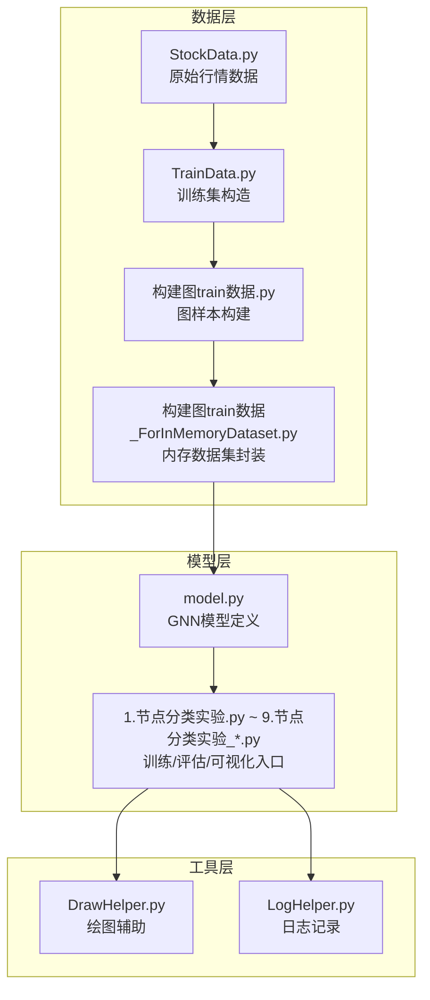
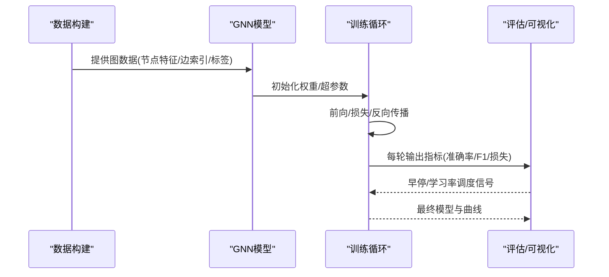
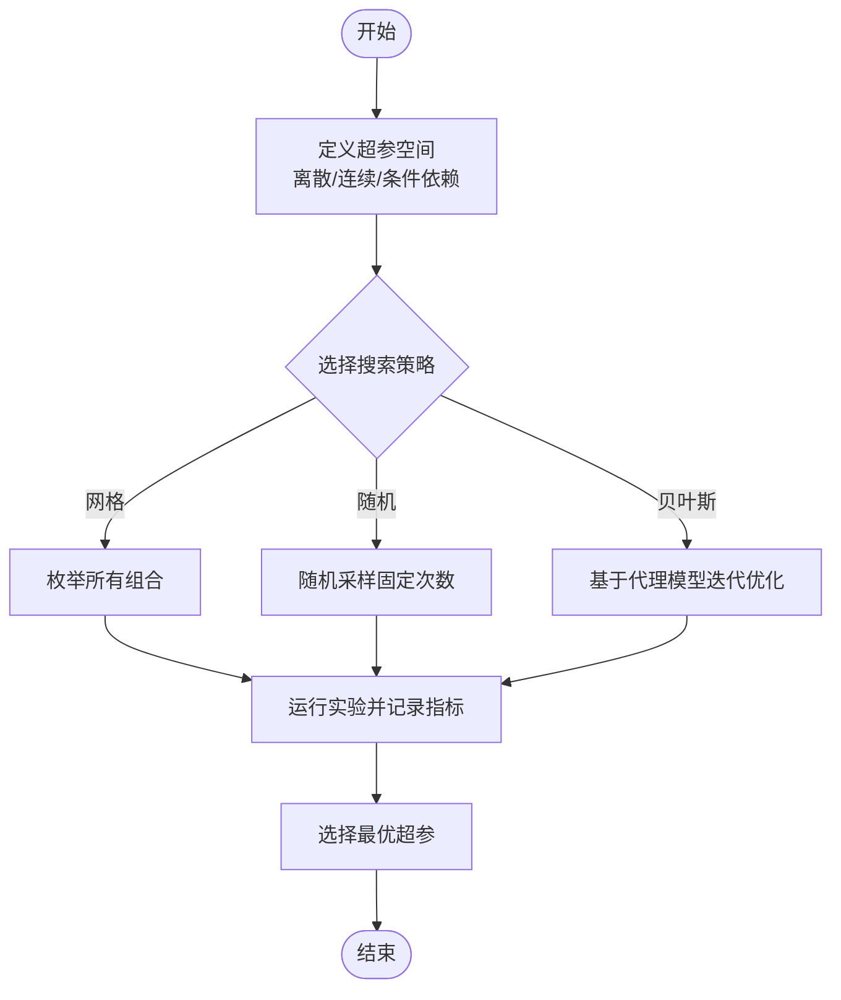
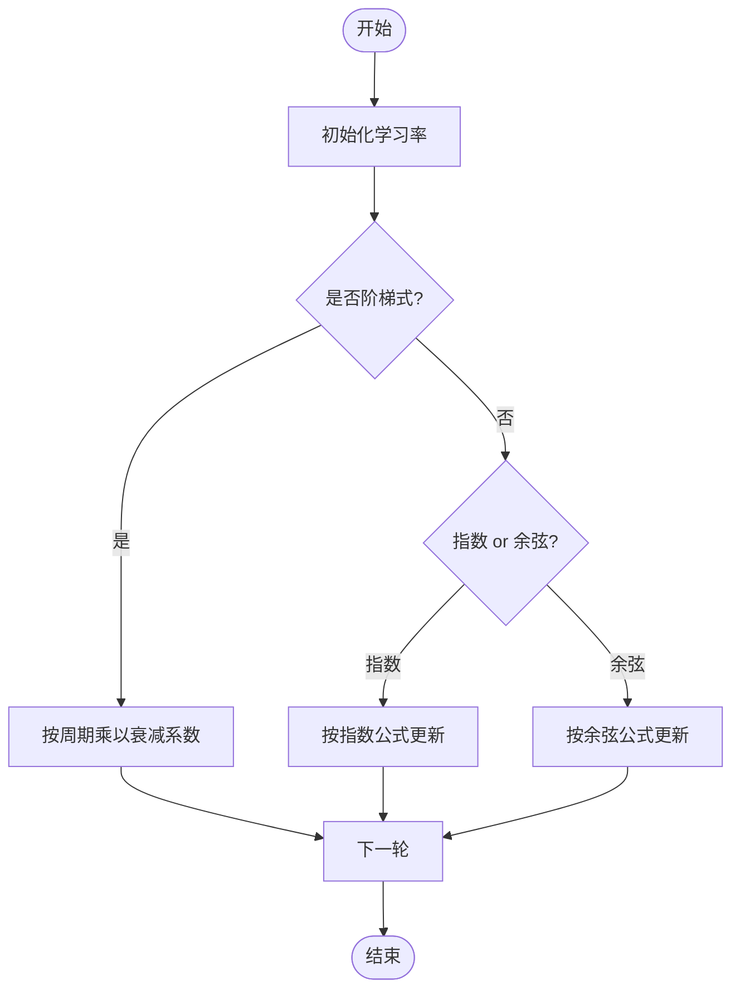
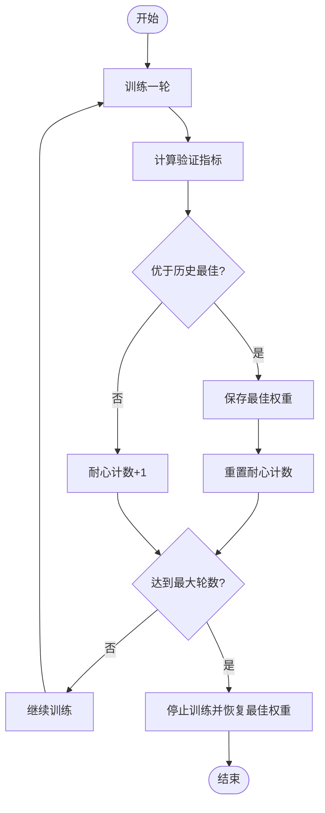
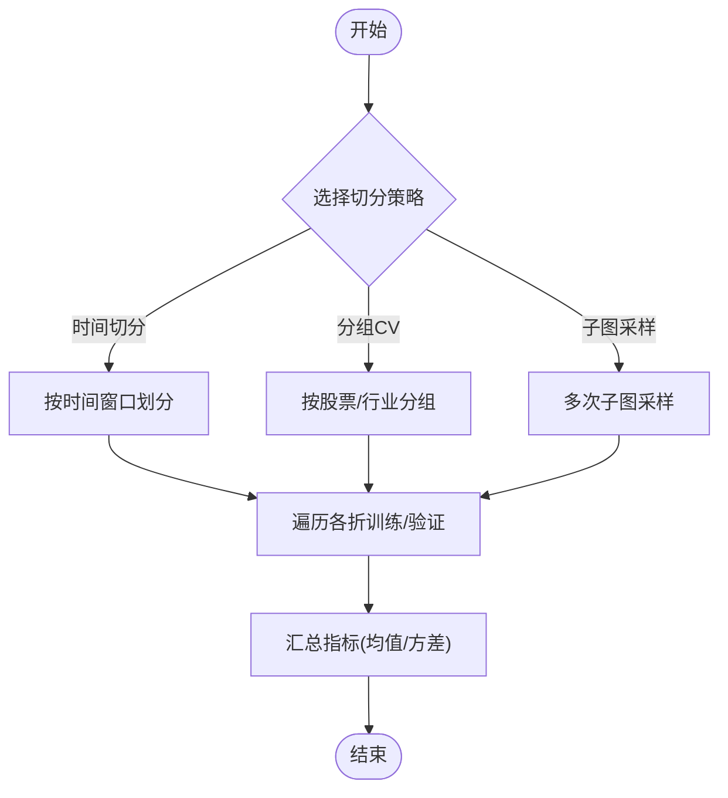
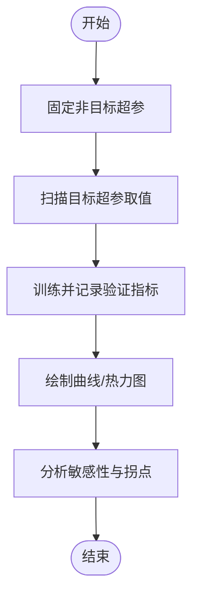
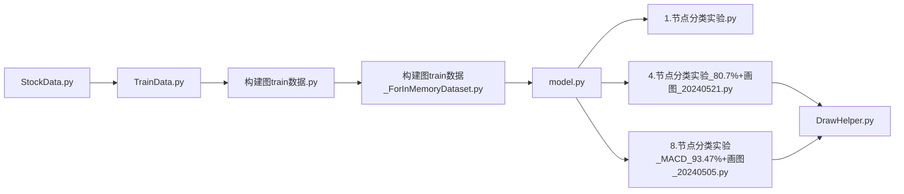

# 超参数调优策略

<cite>
**本文引用的文件**   
- [MyProject/Model/1.节点分类实验.py](file://MyProject/Model/1.节点分类实验.py)
- [MyProject/Model/2.节点分类实验_74.19%_20240423.py](file://MyProject/Model/2.节点分类实验_74.19%_20240423.py)
- [MyProject/Model/3.节点分类实验_79.57%_20240413.py](file://MyProject/Model/3.节点分类实验_79.57%_20240413.py)
- [MyProject/Model/4.节点分类实验_80.7%+画图_20240521.py](file://MyProject/Model/4.节点分类实验_80.7%+画图_20240521.py)
- [MyProject/Model/5.节点分类实验.py](file://MyProject/Model/5.节点分类实验.py)
- [MyProject/Model/6.py](file://MyProject/Model/6.py)
- [MyProject/Model/7.py](file://MyProject/Model/7.py)
- [MyProject/Model/8.节点分类实验_MACD_93.47%+画图_20240505.py](file://MyProject/Model/8.节点分类实验_MACD_93.47%+画图_20240505.py)
- [MyProject/Model/9.节点分类实验_MACD_93.47%+画图_20240505.py](file://MyProject/Model/9.节点分类实验_MACD_93.47%+画图_20240505.py)
- [生成train数据/model.py](file://生成train数据/model.py)
- [生成train数据/构建图train数据.py](file://生成train数据/构建图train数据.py)
- [生成train数据/构建图train数据_ForInMemoryDataset.py](file://生成train数据/构建图train数据_ForInMemoryDataset.py)
- [MyProject/DataBase/TrainData.py](file://MyProject/DataBase/TrainData.py)
- [MyProject/DataBase/StockData.py](file://MyProject/DataBase/StockData.py)
- [MyProject/Helper/DrawHelper.py](file://MyProject/Helper/DrawHelper.py)
</cite>

## 目录
1. [引言](#引言)
2. [项目结构](#项目结构)
3. [核心组件](#核心组件)
4. [架构总览](#架构总览)
5. [详细组件分析](#详细组件分析)
6. [依赖关系分析](#依赖关系分析)
7. [性能考量](#性能考量)
8. [故障排查指南](#故障排查指南)
9. [结论](#结论)
10. [附录](#附录)

## 引言
本文件面向图神经网络（GNN）在股票节点分类任务中的超参数调优，系统梳理影响模型性能的关键超参数与调参方法，包括：
- 关键超参数：网络层数、隐藏层维度、学习率、批量大小、Dropout比率等
- 搜索策略：网格搜索、随机搜索、贝叶斯优化
- 学习率调度：阶梯式衰减、指数衰减、余弦退火
- 早停机制：配置方法与最佳实践
- 交叉验证在图数据上的应用与参数敏感性分析
- 结合仓库中已有实验脚本的调参案例与结果对比思路

## 项目结构
本项目围绕“图数据构建—模型训练—评估可视化”的主线组织。与超参数调优直接相关的代码主要分布在以下位置：
- 模型定义与训练入口：生成train数据/model.py、MyProject/Model/*.py
- 图数据构建：生成train数据/构建图train数据*.py、MyProject/DataBase/TrainData.py
- 可视化与日志：MyProject/Helper/DrawHelper.py、MyProject/Helper/LogHelper.py

图表来源
- [生成train数据/model.py](file://生成train数据/model.py)
- [生成train数据/构建图train数据.py](file://生成train数据/构建图train数据.py)
- [生成train数据/构建图train数据_ForInMemoryDataset.py](file://生成train数据/构建图train数据_ForInMemoryDataset.py)
- [MyProject/Model/1.节点分类实验.py](file://MyProject/Model/1.节点分类实验.py)
- [MyProject/Model/4.节点分类实验_80.7%+画图_20240521.py](file://MyProject/Model/4.节点分类实验_80.7%+画图_20240521.py)
- [MyProject/Model/8.节点分类实验_MACD_93.47%+画图_20240505.py](file://MyProject/Model/8.节点分类实验_MACD_93.47%+画图_20240505.py)
- [MyProject/DataBase/TrainData.py](file://MyProject/DataBase/TrainData.py)
- [MyProject/DataBase/StockData.py](file://MyProject/DataBase/StockData.py)
- [MyProject/Helper/DrawHelper.py](file://MyProject/Helper/DrawHelper.py)

章节来源
- [MyProject/Model/1.节点分类实验.py](file://MyProject/Model/1.节点分类实验.py)
- [MyProject/Model/4.节点分类实验_80.7%+画图_20240521.py](file://MyProject/Model/4.节点分类实验_80.7%+画图_20240521.py)
- [MyProject/Model/8.节点分类实验_MACD_93.47%+画图_20240505.py](file://MyProject/Model/8.节点分类实验_MACD_93.47%+画图_20240505.py)
- [生成train数据/model.py](file://生成train数据/model.py)
- [生成train数据/构建图train数据.py](file://生成train数据/构建图train数据.py)
- [生成train数据/构建图train数据_ForInMemoryDataset.py](file://生成train数据/构建图train数据_ForInMemoryDataset.py)
- [MyProject/DataBase/TrainData.py](file://MyProject/DataBase/TrainData.py)
- [MyProject/DataBase/StockData.py](file://MyProject/DataBase/StockData.py)
- [MyProject/Helper/DrawHelper.py](file://MyProject/Helper/DrawHelper.py)

## 核心组件
- 模型定义与训练循环：位于生成train数据/model.py与各节点分类实验脚本中，负责前向传播、损失计算、反向传播与指标统计。
- 图数据构建：将时序特征转换为图结构（节点=股票，边=相关性或行业关联），并封装为PyTorch Geometric Dataset。
- 评估与可视化：绘制训练/验证曲线、混淆矩阵、ROC/AUC等，便于观察过拟合与泛化能力。

章节来源
- [生成train数据/model.py](file://生成train数据/model.py)
- [MyProject/Model/1.节点分类实验.py](file://MyProject/Model/1.节点分类实验.py)
- [MyProject/Model/4.节点分类实验_80.7%+画图_20240521.py](file://MyProject/Model/4.节点分类实验_80.7%+画图_20240521.py)
- [MyProject/Model/8.节点分类实验_MACD_93.47%+画图_20240505.py](file://MyProject/Model/8.节点分类实验_MACD_93.47%+画图_20240505.py)

## 架构总览
下图展示从数据到模型再到评估的整体流程，以及超参数在各阶段的作用点。

图表来源
- [生成train数据/model.py](file://生成train数据/model.py)
- [MyProject/Model/1.节点分类实验.py](file://MyProject/Model/1.节点分类实验.py)
- [MyProject/Model/4.节点分类实验_80.7%+画图_20240521.py](file://MyProject/Model/4.节点分类实验_80.7%+画图_20240521.py)
- [MyProject/Model/8.节点分类实验_MACD_93.47%+画图_20240505.py](file://MyProject/Model/8.节点分类实验_MACD_93.47%+画图_20240505.py)

## 详细组件分析

### 关键超参数及其影响
- 网络层数（GCN/GAT层数）
  - 作用：决定信息聚合深度；层数过多易导致过平滑，层数不足欠拟合。
  - 建议范围：2~4层（视图规模与噪声程度调整）。
- 隐藏层维度
  - 作用：控制表征容量；过大易过拟合，过小表达能力不足。
  - 建议范围：64~256，随层数递增或递减可尝试。
- 学习率
  - 作用：步长控制；过大震荡不收敛，过小收敛慢。
  - 建议范围：1e-3~1e-4，配合调度器使用。
- 批量大小
  - 作用：梯度估计方差与稳定性；小批更正则化，大批更稳定但可能泛化略差。
  - 建议范围：32~256，按显存与图规模选择。
- Dropout比率
  - 作用：正则化防止过拟合；过大抑制学习，过小无效。
  - 建议范围：0.1~0.5，通常在最后线性层前使用。
- 其他常见超参
  - 优化器（Adam/AdamW）、权重衰减、类别不平衡处理（加权损失/重采样）、图构建阈值（邻接稀疏度）。

章节来源
- [生成train数据/model.py](file://生成train数据/model.py)
- [MyProject/Model/1.节点分类实验.py](file://MyProject/Model/1.节点分类实验.py)
- [MyProject/Model/4.节点分类实验_80.7%+画图_20240521.py](file://MyProject/Model/4.节点分类实验_80.7%+画图_20240521.py)
- [MyProject/Model/8.节点分类实验_MACD_93.47%+画图_20240505.py](file://MyProject/Model/8.节点分类实验_MACD_93.47%+画图_20240505.py)

### 搜索策略：网格搜索、随机搜索、贝叶斯优化
- 网格搜索
  - 适用：超参空间小、离散且需穷尽组合时。
  - 优点：完备；缺点：组合爆炸，耗时。
  - 实践要点：先粗后细，分层搜索。
- 随机搜索
  - 适用：高维连续/离散混合空间。
  - 优点：对重要超参探索充分，效率更高。
  - 实践要点：对关键超参（学习率、层数、维度）扩大采样范围。
- 贝叶斯优化
  - 适用：昂贵目标函数（训练时间长）时的全局寻优。
  - 优点：利用历史结果建模期望改进，收敛更快。
  - 实践要点：设置合理的核函数与采集函数，限制最大迭代次数。

[此图为概念性流程图，无需图表来源]

章节来源
- [MyProject/Model/1.节点分类实验.py](file://MyProject/Model/1.节点分类实验.py)
- [MyProject/Model/4.节点分类实验_80.7%+画图_20240521.py](file://MyProject/Model/4.节点分类实验_80.7%+画图_20240521.py)
- [MyProject/Model/8.节点分类实验_MACD_93.47%+画图_20240505.py](file://MyProject/Model/8.节点分类实验_MACD_93.47%+画图_20240505.py)

### 学习率调度策略
- 阶梯式衰减
  - 思想：每隔若干轮将学习率乘以衰减系数。
  - 适用：需要阶段性降速的稳定训练。
- 指数衰减
  - 思想：按指数规律逐步降低学习率。
  - 适用：平滑下降，避免突变。
- 余弦退火
  - 思想：按余弦曲线缓慢下降至接近零。
  - 适用：后期精细微调，提升收敛质量。

[此图为概念性流程图，无需图表来源]

章节来源
- [MyProject/Model/1.节点分类实验.py](file://MyProject/Model/1.节点分类实验.py)
- [MyProject/Model/4.节点分类实验_80.7%+画图_20240521.py](file://MyProject/Model/4.节点分类实验_80.7%+画图_20240521.py)
- [MyProject/Model/8.节点分类实验_MACD_93.47%+画图_20240505.py](file://MyProject/Model/8.节点分类实验_MACD_93.47%+画图_20240505.py)

### 早停机制：配置与最佳实践
- 监控指标：建议使用验证集损失或主指标（如F1/准确率）。
- 耐心值（patience）：当指标未改善超过指定轮数则停止。
- 保存策略：仅保存最佳权重，避免保存中间退化权重。
- 与学习率调度协同：在早停触发前适当降低学习率以微调。
- 防过拟合要点：配合Dropout、权重衰减、数据增强（图层面）与合理层数/维度。

[此图为概念性流程图，无需图表来源]

章节来源
- [MyProject/Model/1.节点分类实验.py](file://MyProject/Model/1.节点分类实验.py)
- [MyProject/Model/4.节点分类实验_80.7%+画图_20240521.py](file://MyProject/Model/4.节点分类实验_80.7%+画图_20240521.py)
- [MyProject/Model/8.节点分类实验_MACD_93.47%+画图_20240505.py](file://MyProject/Model/8.节点分类实验_MACD_93.47%+画图_20240505.py)

### 交叉验证在图神经网络中的应用
- 难点：图数据存在节点/边共享，不能简单随机划分。
- 推荐方案：
  - 时间序列切分：按时间窗口划分训练/验证/测试，模拟真实预测场景。
  - 节点级留一/分组交叉验证：按股票或行业分组进行CV，减少信息泄露。
  - 子图采样：对大图进行多次子图采样，近似CV效果。
- 评估：对多折结果取均值与方差，报告稳定性。

[此图为概念性流程图，无需图表来源]

章节来源
- [生成train数据/构建图train数据.py](file://生成train数据/构建图train数据.py)
- [生成train数据/构建图train数据_ForInMemoryDataset.py](file://生成train数据/构建图train数据_ForInMemoryDataset.py)
- [MyProject/DataBase/TrainData.py](file://MyProject/DataBase/TrainData.py)

### 参数敏感性分析
- 单因素扫描：固定其余超参，逐一扫描某超参（如学习率、层数、维度），观察验证指标变化趋势。
- 双因素热力图：选取两个关键超参（如层数×维度、学习率×Dropout），绘制二维热力图定位峰值区域。
- 交互效应：关注层数与Dropout、学习率与批量大小的耦合影响。
- 可视化：借助绘图工具输出曲线/热力图，辅助决策。

[此图为概念性流程图，无需图表来源]

章节来源
- [MyProject/Helper/DrawHelper.py](file://MyProject/Helper/DrawHelper.py)
- [MyProject/Model/4.节点分类实验_80.7%+画图_20240521.py](file://MyProject/Model/4.节点分类实验_80.7%+画图_20240521.py)
- [MyProject/Model/8.节点分类实验_MACD_93.47%+画图_20240505.py](file://MyProject/Model/8.节点分类实验_MACD_93.47%+画图_20240505.py)

### 调参案例与性能对比思路
- 基线模型：使用默认超参（如2层、隐藏维度128、学习率1e-3、Batch=64、Dropout=0.3）作为基准。
- 改进路径：
  - 学习率调度：引入余弦退火，观察收敛速度与最终指标。
  - 正则化：适度增加Dropout或权重衰减，缓解过拟合。
  - 结构复杂度：在2~3层间比较，避免过平滑。
- 结果呈现：对比不同配置的验证准确率/F1、训练时长、曲线形态，选择稳健且高效的配置。

章节来源
- [MyProject/Model/1.节点分类实验.py](file://MyProject/Model/1.节点分类实验.py)
- [MyProject/Model/4.节点分类实验_80.7%+画图_20240521.py](file://MyProject/Model/4.节点分类实验_80.7%+画图_20240521.py)
- [MyProject/Model/8.节点分类实验_MACD_93.47%+画图_20240505.py](file://MyProject/Model/8.节点分类实验_MACD_93.47%+画图_20240505.py)

## 依赖关系分析
- 数据到模型的依赖：
  - StockData.py提供原始行情数据
  - TrainData.py与构建图脚本完成图样本构造
  - model.py定义GNN模型
  - 各节点分类实验脚本串联训练、评估与可视化
- 模块耦合：
  - 实验脚本依赖模型与数据接口，保持松耦合便于替换模型/数据源
  - 可视化与日志独立，便于扩展更多图表与指标

图表来源
- [MyProject/DataBase/StockData.py](file://MyProject/DataBase/StockData.py)
- [MyProject/DataBase/TrainData.py](file://MyProject/DataBase/TrainData.py)
- [生成train数据/构建图train数据.py](file://生成train数据/构建图train数据.py)
- [生成train数据/构建图train数据_ForInMemoryDataset.py](file://生成train数据/构建图train数据_ForInMemoryDataset.py)
- [生成train数据/model.py](file://生成train数据/model.py)
- [MyProject/Model/1.节点分类实验.py](file://MyProject/Model/1.节点分类实验.py)
- [MyProject/Model/4.节点分类实验_80.7%+画图_20240521.py](file://MyProject/Model/4.节点分类实验_80.7%+画图_20240521.py)
- [MyProject/Model/8.节点分类实验_MACD_93.47%+画图_20240505.py](file://MyProject/Model/8.节点分类实验_MACD_93.47%+画图_20240505.py)
- [MyProject/Helper/DrawHelper.py](file://MyProject/Helper/DrawHelper.py)

章节来源
- [MyProject/DataBase/StockData.py](file://MyProject/DataBase/StockData.py)
- [MyProject/DataBase/TrainData.py](file://MyProject/DataBase/TrainData.py)
- [生成train数据/构建图train数据.py](file://生成train数据/构建图train数据.py)
- [生成train数据/构建图train数据_ForInMemoryDataset.py](file://生成train数据/构建图train数据_ForInMemoryDataset.py)
- [生成train数据/model.py](file://生成train数据/model.py)
- [MyProject/Model/1.节点分类实验.py](file://MyProject/Model/1.节点分类实验.py)
- [MyProject/Model/4.节点分类实验_80.7%+画图_20240521.py](file://MyProject/Model/4.节点分类实验_80.7%+画图_20240521.py)
- [MyProject/Model/8.节点分类实验_MACD_93.47%+画图_20240505.py](file://MyProject/Model/8.节点分类实验_MACD_93.47%+画图_20240505.py)
- [MyProject/Helper/DrawHelper.py](file://MyProject/Helper/DrawHelper.py)

## 性能考量
- 训练稳定性：优先保证学习率与批量大小匹配，必要时引入梯度裁剪。
- 过拟合控制：Dropout、权重衰减、早停、数据增强（图层面）联合使用。
- 计算效率：大图中采用子图采样或Mini-batch GNN；合理设置缓存与并行。
- 资源约束：根据显存上限调整Batch与维度，避免OOM。

[本节为通用指导，无需章节来源]

## 故障排查指南
- 训练不收敛/震荡
  - 检查学习率是否过大；启用学习率调度；确认梯度是否爆炸。
- 验证指标停滞
  - 增大模型容量（层数/维度）或延长训练；检查早停耐心值是否过小。
- 过拟合明显
  - 提高Dropout/权重衰减；缩短训练轮数；简化模型结构。
- 显存不足
  - 减小Batch/维度；使用子图采样；关闭不必要的日志与可视化。
- 数据问题
  - 检查图构建逻辑与标签一致性；确保时间切分无泄露。

章节来源
- [MyProject/Model/1.节点分类实验.py](file://MyProject/Model/1.节点分类实验.py)
- [MyProject/Model/4.节点分类实验_80.7%+画图_20240521.py](file://MyProject/Model/4.节点分类实验_80.7%+画图_20240521.py)
- [MyProject/Model/8.节点分类实验_MACD_93.47%+画图_20240505.py](file://MyProject/Model/8.节点分类实验_MACD_93.47%+画图_20240505.py)
- [生成train数据/model.py](file://生成train数据/model.py)

## 结论
- 超参数调优应遵循“先粗后细、先稳后精”的原则，优先锁定学习率与正则化强度，再微调结构与批次。
- 学习率调度与早停是提升收敛质量与泛化的关键手段。
- 图数据的交叉验证需考虑时间与分组特性，避免信息泄露。
- 通过敏感性分析与可视化，快速定位有效超参区间，形成可复现的调参流程。

[本节为总结性内容，无需章节来源]

## 附录
- 建议的初始超参范围（可按任务规模调整）
  - 层数：2~4
  - 隐藏维度：64~256
  - 学习率：1e-3~1e-4（配合余弦退火）
  - Batch：32~128
  - Dropout：0.1~0.5
  - 权重衰减：1e-5~1e-4
- 常用评估指标
  - 准确率、精确率、召回率、F1、AUC
- 可视化清单
  - 训练/验证损失曲线、指标曲线、混淆矩阵、ROC/AUC

[本节为补充信息，无需章节来源]