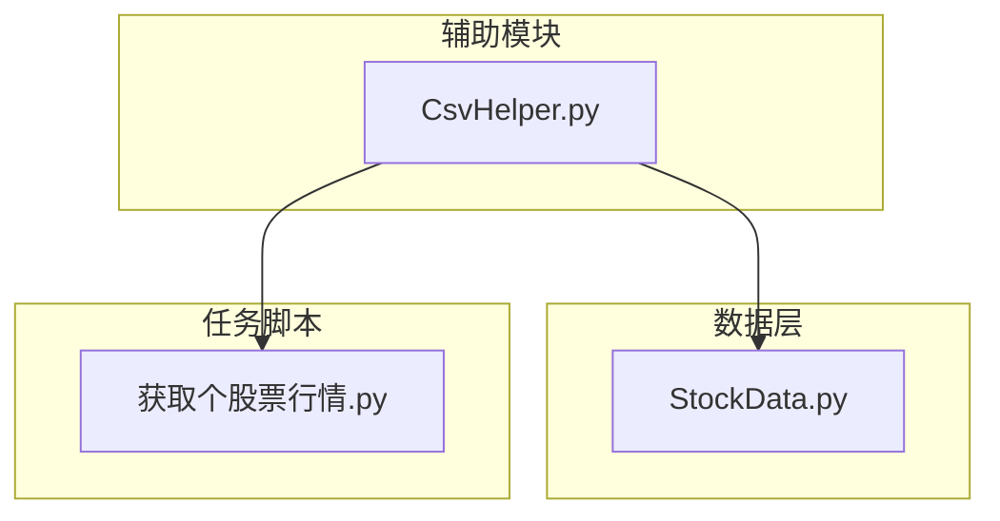
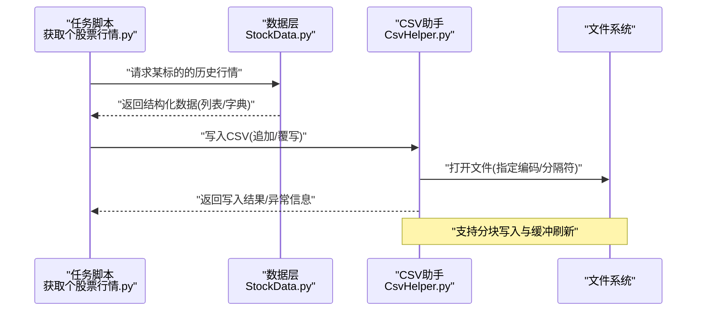
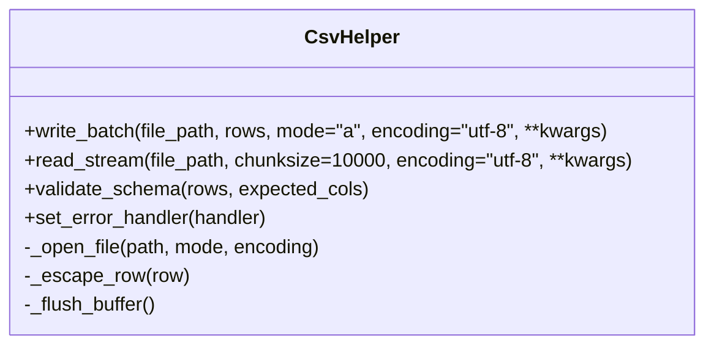
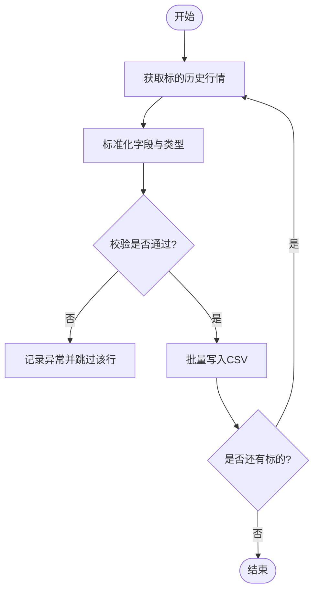
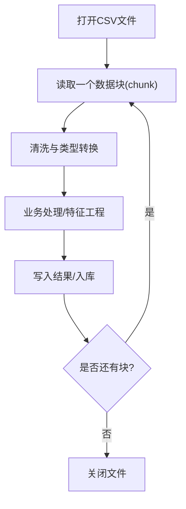
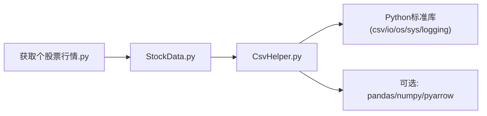

# CSV文件操作工具

<cite>
**本文引用的文件**   
- [CsvHelper.py](file://MyProject/Helper/CsvHelper.py)
- [StockData.py](file://MyProject/DataBase/StockData.py)
- [获取个股票行情.py](file://生成train数据/获取个股票行情.py)
</cite>

## 目录
1. [简介](#简介)
2. [项目结构](#项目结构)
3. [核心组件](#核心组件)
4. [架构总览](#架构总览)
5. [详细组件分析](#详细组件分析)
6. [依赖关系分析](#依赖关系分析)
7. [性能考虑](#性能考虑)
8. [故障排查指南](#故障排查指南)
9. [结论](#结论)
10. [附录](#附录)

## 简介
本文件围绕 CsvHelper 类，系统化梳理其在CSV文件读写、批量数据处理、编码转换与错误处理方面的能力，并结合股票历史行情的导入导出与格式标准化场景，给出面向大型CSV文件的分块读取与内存优化实践。文档同时覆盖字符编码处理、特殊字符转义与文件格式验证的最佳实践，以及与常见数据处理库的集成方法与性能对比建议。

## 项目结构
本项目中与CSV操作相关的核心代码位于 Helper 模块下的 CsvHelper.py；在数据库与策略脚本中广泛使用CSV进行历史行情数据的持久化与交换。下图展示了与本主题直接相关的文件组织与交互关系。

图表来源
- [CsvHelper.py](file://MyProject/Helper/CsvHelper.py)
- [StockData.py](file://MyProject/DataBase/StockData.py)
- [获取个股票行情.py](file://生成train数据/获取个股票行情.py)

章节来源
- [CsvHelper.py](file://MyProject/Helper/CsvHelper.py)
- [StockData.py](file://MyProject/DataBase/StockData.py)
- [获取个股票行情.py](file://生成train数据/获取个股票行情.py)

## 核心组件
- CsvHelper：提供CSV读写的统一接口，支持批量写入、流式读取、编码控制、异常捕获与日志记录等能力。
- 典型调用方：
  - StockData：负责从外部源拉取或构造股票数据后，通过CsvHelper将结果落盘为CSV。
  - 获取个股票行情：作为任务入口，循环多只标的，调用CsvHelper完成逐标的数据的追加或覆写。

章节来源
- [CsvHelper.py](file://MyProject/Helper/CsvHelper.py)
- [StockData.py](file://MyProject/DataBase/StockData.py)
- [获取个股票行情.py](file://生成train数据/获取个股票行情.py)

## 架构总览
下图展示“任务脚本 -> 数据层 -> CsvHelper -> 文件系统”的整体流程，体现从数据采集到CSV落盘的端到端路径。

图表来源
- [获取个股票行情.py](file://生成train数据/获取个股票行情.py)
- [StockData.py](file://MyProject/DataBase/StockData.py)
- [CsvHelper.py](file://MyProject/Helper/CsvHelper.py)

## 详细组件分析

### CsvHelper 类分析
- 职责边界
  - 封装CSV读写细节（分隔符、引号、换行、编码）。
  - 提供批量写入接口，减少I/O次数。
  - 提供流式/分块读取接口，避免一次性加载大文件导致内存峰值过高。
  - 统一异常处理与日志输出，便于定位问题。
- 关键能力
  - 批量写入：按批次聚合行数据，降低系统调用开销。
  - 编码转换：支持UTF-8、GBK等常用编码，自动检测或显式指定。
  - 特殊字符转义：对包含分隔符、引号、换行的字段进行安全转义。
  - 格式校验：可选地检查列数一致性、空值策略与类型约束。
  - 错误恢复：遇到单行解析失败时可选择跳过并记录，保证整体流程继续。
- 设计要点
  - 以上下文管理器或显式close保障资源释放。
  - 参数化配置（分隔符、quotechar、lineterminator、encoding、chunksize等）。
  - 可插拔的错误处理器与回调钩子，便于扩展审计与告警。

图表来源
- [CsvHelper.py](file://MyProject/Helper/CsvHelper.py)

章节来源
- [CsvHelper.py](file://MyProject/Helper/CsvHelper.py)

### 股票历史行情导入导出与格式标准化
- 导出流程（行情数据 -> CSV）
  - 任务脚本遍历标的列表，逐个调用数据层获取历史K线。
  - 数据层返回标准结构（如日期、开高低收、成交量等），由CsvHelper批量写入。
  - 若目标文件已存在，采用追加模式；首次创建时写入表头。
- 导入流程（CSV -> 内存结构）
  - 使用分块读取接口，逐块转换为模型可用的张量或DataFrame。
  - 在读取阶段执行基础校验（列名、列数、数值范围），不合法行记录并跳过。
- 格式标准化
  - 统一时间戳与时区，确保跨市场可比性。
  - 统一字段命名与数据类型（日期、浮点、整数）。
  - 缺失值填充策略（前向填充/零填充/删除）。

图表来源
- [获取个股票行情.py](file://生成train数据/获取个股票行情.py)
- [StockData.py](file://MyProject/DataBase/StockData.py)
- [CsvHelper.py](file://MyProject/Helper/CsvHelper.py)

章节来源
- [获取个股票行情.py](file://生成train数据/获取个股票行情.py)
- [StockData.py](file://MyProject/DataBase/StockData.py)
- [CsvHelper.py](file://MyProject/Helper/CsvHelper.py)

### 高效处理大型CSV文件的方法
- 分块读取
  - 设置合理的chunksize，平衡吞吐与内存占用。
  - 每块内做轻量清洗与类型转换，再送入下游计算。
- 内存优化
  - 避免在内存中拼接超大字符串，优先使用迭代器与生成器。
  - 及时释放中间对象，必要时显式gc。
- I/O优化
  - 使用追加模式分批写入，减少频繁打开/关闭文件。
  - 合理设置缓冲区大小，结合操作系统页缓存特性。

图表来源
- [CsvHelper.py](file://MyProject/Helper/CsvHelper.py)

章节来源
- [CsvHelper.py](file://MyProject/Helper/CsvHelper.py)

### 字符编码处理、特殊字符转义与文件格式验证最佳实践
- 编码处理
  - 明确输入输出编码，优先UTF-8；兼容GBK/BOM变体。
  - 对未知编码文件，先尝试探测，失败则回退至保守策略并告警。
- 特殊字符转义
  - 对包含分隔符、双引号、换行符的字段进行安全转义。
  - 统一quotechar与escapechar，避免解析歧义。
- 格式验证
  - 首行表头与后续行列数一致。
  - 关键字段非空、数值范围合理、日期格式规范。
  - 提供“严格/宽松”两种模式，严格模式下遇错即停，宽松模式下记录并跳过。

章节来源
- [CsvHelper.py](file://MyProject/Helper/CsvHelper.py)

### 与其他数据处理库的集成方法
- 与pandas集成
  - 用CsvHelper做底层I/O与容错，pandas做复杂变换与聚合。
  - 在大批量ETL中，CsvHelper负责稳定落盘与断点续传，pandas按需加载。
- 与numpy/PyTorch集成
  - 将CsvHelper输出的迭代器接入数据管道，实现流式训练。
  - 在GPU侧仅保留必要切片，CPU侧做批组装。
- 与SQL/SQLite集成
  - 通过SqliteHelper将CSV批量插入数据库，减少网络往返。
  - 利用事务与索引提升写入效率。

章节来源
- [CsvHelper.py](file://MyProject/Helper/CsvHelper.py)
- [StockData.py](file://MyProject/DataBase/StockData.py)

### 性能对比分析与调优建议
- 对比维度
  - 吞吐（行/秒）、峰值内存、CPU占用、磁盘I/O等待。
- 经验建议
  - 增大chunksize可降低系统调用开销，但会提高内存峰值。
  - 对纯文本转换密集型任务，优先使用C扩展库（如pandas/cython）加速。
  - 对超大数据集，考虑分区存储与并行写入（注意锁与顺序）。
  - 监控指标：写入延迟分布、GC频率、页面命中率。

[本节为通用指导，无需源码引用]

## 依赖关系分析
- 内部依赖
  - 任务脚本依赖数据层与CsvHelper完成端到端流程。
  - 数据层可能依赖其他工具（如网络抓取、数据库访问），最终通过CsvHelper落盘。
- 外部依赖
  - Python标准库csv/io/os/sys/logging等。
  - 可选第三方库：pandas、numpy、pyarrow等用于高性能读写与分析。

图表来源
- [获取个股票行情.py](file://生成train数据/获取个股票行情.py)
- [StockData.py](file://MyProject/DataBase/StockData.py)
- [CsvHelper.py](file://MyProject/Helper/CsvHelper.py)

章节来源
- [获取个股票行情.py](file://生成train数据/获取个股票行情.py)
- [StockData.py](file://MyProject/DataBase/StockData.py)
- [CsvHelper.py](file://MyProject/Helper/CsvHelper.py)

## 性能考虑
- 分块大小选择：根据可用内存与目标吞吐动态调整。
- 批写入合并：将多次小写入合并为一次批写入，减少I/O抖动。
- 编码与转义成本：尽量在源头规范化数据，减少运行时转义开销。
- 并发与锁：多进程写入需加锁或使用独立文件分区。
- 监控与压测：引入耗时打点与内存采样，建立回归基线。

[本节为通用指导，无需源码引用]

## 故障排查指南
- 常见问题
  - 编码错误：确认文件实际编码与打开编码一致，必要时带BOM处理。
  - 列数不一致：启用严格校验，定位异常行并修复上游数据。
  - 内存溢出：减小chunksize，避免在内存中累积未消费的数据。
  - 写入卡顿：检查磁盘IO瓶颈与锁竞争，适当增大批大小。
- 诊断手段
  - 开启详细日志，记录异常行内容与堆栈。
  - 使用抽样回放与最小复现用例快速定位。
  - 对关键路径增加计时与计数埋点。

章节来源
- [CsvHelper.py](file://MyProject/Helper/CsvHelper.py)

## 结论
CsvHelper 提供了稳健、可扩展且易于集成的CSV处理能力，适用于股票历史行情的大规模导入导出与格式标准化。通过分块读取、批写入、编码与转义控制以及完善的错误处理机制，可在保证正确性的前提下显著提升吞吐与稳定性。配合pandas/numpy等生态库，可构建高吞吐、低内存占用的数据流水线。

[本节为总结性内容，无需源码引用]

## 附录
- 术语
  - 分块读取：按固定行数或字节数逐步读取大文件。
  - 批写入：将多条记录合并后一次性写入，降低I/O次数。
  - 转义：对特殊字符进行安全编码，防止破坏CSV结构。
- 参考实践
  - 在ETL中优先保证幂等与可重入，支持断点续跑。
  - 对关键指标建立SLO（吞吐、延迟、错误率），持续监控与优化。

[本节为补充说明，无需源码引用]