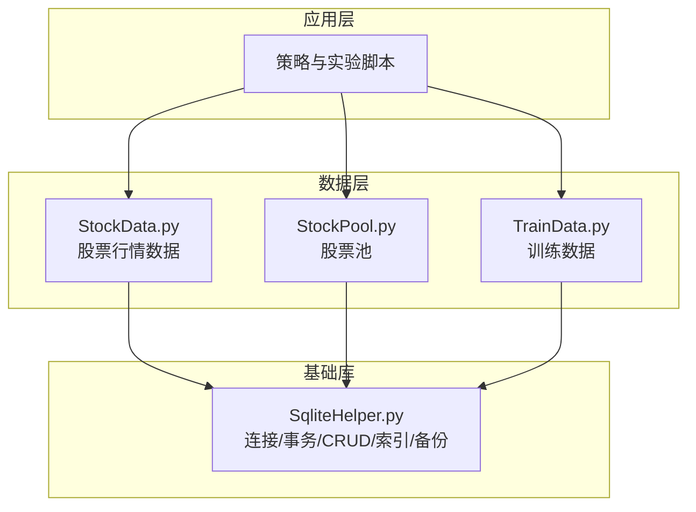
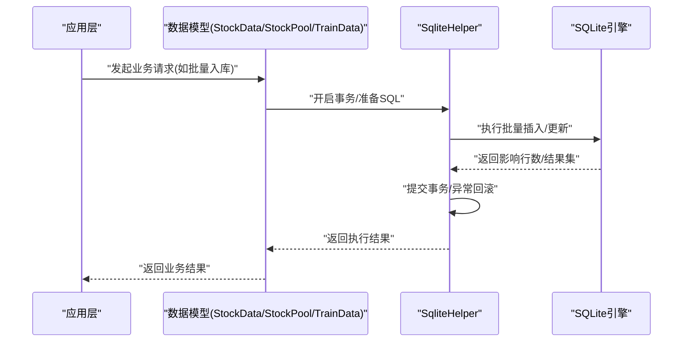
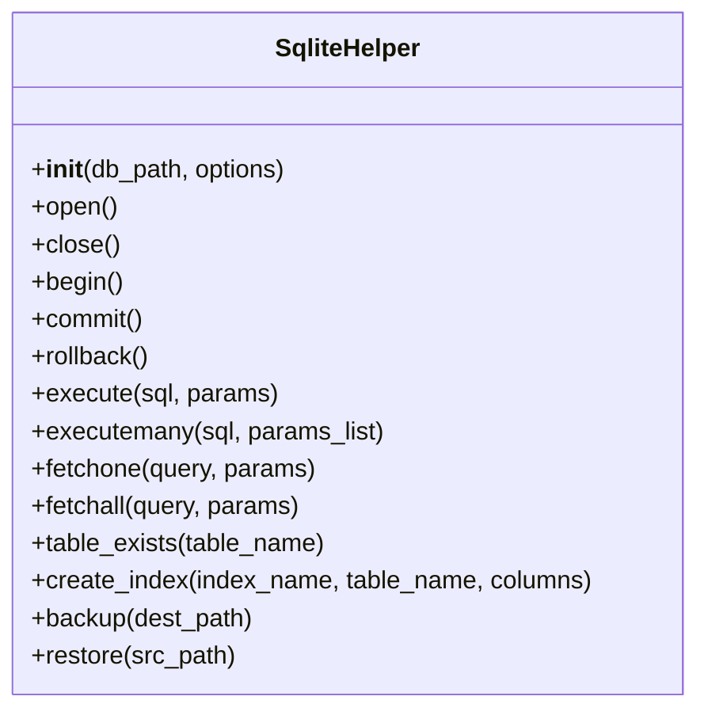
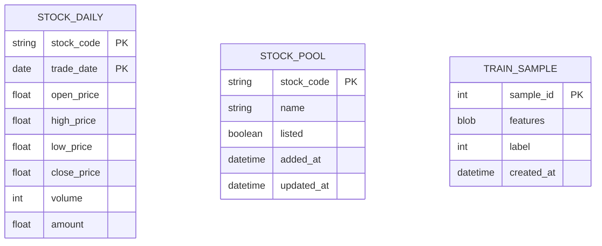
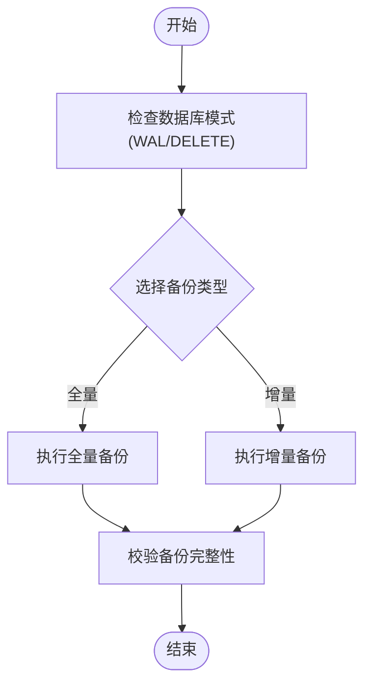
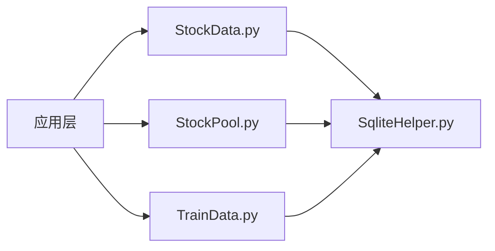

# SQLite数据库工具

<cite>
**本文引用的文件**   
- [SqliteHelper.py](file://MyProject/Helper/SqliteHelper.py)
- [StockData.py](file://MyProject/DataBase/StockData.py)
- [StockPool.py](file://MyProject/DataBase/StockPool.py)
- [TrainData.py](file://MyProject/DataBase/TrainData.py)
</cite>

## 目录
1. [简介](#简介)
2. [项目结构](#项目结构)
3. [核心组件](#核心组件)
4. [架构总览](#架构总览)
5. [详细组件分析](#详细组件分析)
6. [依赖关系分析](#依赖关系分析)
7. [性能考虑](#性能考虑)
8. [故障排除指南](#故障排除指南)
9. [结论](#结论)
10. [附录](#附录)

## 简介
本文件围绕SQLite数据库工具展开，重点介绍SqliteHelper类提供的数据库操作能力（连接管理、事务处理、查询优化），并结合股票数据存储场景说明表结构设计、索引优化与备份恢复机制。文档同时给出高效操作方法示例路径（批量插入、复杂查询、并发访问控制）、数据库迁移策略与版本管理建议，以及数据一致性保证、性能调优技巧与故障排除指南。

## 项目结构
本项目将数据库辅助逻辑集中在Helper层，业务数据模型与存储逻辑位于DataBase层。关键文件如下：
- Helper/SqliteHelper.py：封装SQLite连接、事务、CRUD、索引与备份等通用能力
- DataBase/StockData.py：股票行情数据的表结构与读写方法
- DataBase/StockPool.py：股票池（标的集合）的表结构与读写方法
- DataBase/TrainData.py：训练数据集的表结构与读写方法

图表来源
- [SqliteHelper.py](file://MyProject/Helper/SqliteHelper.py)
- [StockData.py](file://MyProject/DataBase/StockData.py)
- [StockPool.py](file://MyProject/DataBase/StockPool.py)
- [TrainData.py](file://MyProject/DataBase/TrainData.py)

章节来源
- [SqliteHelper.py](file://MyProject/Helper/SqliteHelper.py)
- [StockData.py](file://MyProject/DataBase/StockData.py)
- [StockPool.py](file://MyProject/DataBase/StockPool.py)
- [TrainData.py](file://MyProject/DataBase/TrainData.py)

## 核心组件
- SqliteHelper类
  - 职责：统一封装SQLite连接生命周期、事务边界、SQL执行、参数化查询、索引维护、备份与恢复等
  - 典型能力：
    - 连接管理：单例或线程安全连接池（根据实现选择）
    - 事务处理：自动提交/回滚、嵌套事务语义
    - 查询优化：预编译语句、批量写入、分页与条件过滤
    - 索引与约束：建表时定义主键/唯一键/外键，动态创建索引
    - 备份恢复：基于sqlite3的备份API或导出导入
- 数据模型模块
  - StockData.py：定义股票日线/分钟线等表结构及常用查询
  - StockPool.py：定义股票池表结构及增删改查
  - TrainData.py：定义训练样本表结构及批量写入接口

章节来源
- [SqliteHelper.py](file://MyProject/Helper/SqliteHelper.py)
- [StockData.py](file://MyProject/DataBase/StockData.py)
- [StockPool.py](file://MyProject/DataBase/StockPool.py)
- [TrainData.py](file://MyProject/DataBase/TrainData.py)

## 架构总览
整体采用“应用层 -> 数据模型层 -> 基础库层”的分层架构。应用层通过数据模型层进行领域操作，数据模型层再调用SqliteHelper完成底层数据库交互。

图表来源
- [StockData.py](file://MyProject/DataBase/StockData.py)
- [StockPool.py](file://MyProject/DataBase/StockPool.py)
- [TrainData.py](file://MyProject/DataBase/TrainData.py)
- [SqliteHelper.py](file://MyProject/Helper/SqliteHelper.py)

## 详细组件分析

### SqliteHelper类分析
- 设计要点
  - 连接管理：提供统一的打开/关闭接口；支持只读副本用于高并发读取
  - 事务处理：提供显式事务上下文管理器，确保原子性与一致性
  - 查询优化：使用预编译语句、参数绑定、批量操作减少往返开销
  - 索引与约束：在DDL中声明主键/唯一键/外键，并在必要时动态创建索引
  - 备份恢复：利用sqlite3内置备份函数或导出/导入流程
- 关键方法与职责
  - 连接相关：初始化、获取连接、释放连接、只读模式切换
  - 事务相关：开始事务、提交、回滚、事务上下文
  - 执行相关：execute、executemany、fetchone、fetchall
  - 元数据：表存在检查、字段信息、索引列表
  - 备份恢复：全量备份、增量备份、从备份恢复
- 并发与锁
  - 写锁串行化：避免多线程并发写导致竞争
  - 读多写少：可配置只读副本提升并发读取吞吐

图表来源
- [SqliteHelper.py](file://MyProject/Helper/SqliteHelper.py)

章节来源
- [SqliteHelper.py](file://MyProject/Helper/SqliteHelper.py)

### 股票数据存储与应用场景

#### 表结构设计
- 股票行情表（示例字段）
  - 交易日期、股票代码、开盘价、最高价、最低价、收盘价、成交量、成交额
  - 主键：(股票代码, 交易日期)
  - 索引：按交易日期范围查询的复合索引
- 股票池表（示例字段）
  - 股票代码、名称、上市状态、加入时间、更新时间
  - 主键：股票代码
  - 索引：按状态筛选的索引
- 训练数据表（示例字段）
  - 样本ID、特征向量、标签、时间戳
  - 主键：样本ID
  - 索引：按时间戳或标签分桶的索引

图表来源
- [StockData.py](file://MyProject/DataBase/StockData.py)
- [StockPool.py](file://MyProject/DataBase/StockPool.py)
- [TrainData.py](file://MyProject/DataBase/TrainData.py)

章节来源
- [StockData.py](file://MyProject/DataBase/StockData.py)
- [StockPool.py](file://MyProject/DataBase/StockPool.py)
- [TrainData.py](file://MyProject/DataBase/TrainData.py)

#### 索引优化
- 常见索引策略
  - 范围查询：为高频过滤列建立B-Tree索引（如交易日期、股票代码）
  - 排序与分组：对ORDER BY/GROUP BY涉及的列建立索引
  - 覆盖索引：尽量让查询仅命中索引，避免回表
- 注意事项
  - 索引并非越多越好，需权衡写入放大与空间占用
  - 定期分析慢查询并调整索引

章节来源
- [StockData.py](file://MyProject/DataBase/StockData.py)
- [StockPool.py](file://MyProject/DataBase/StockPool.py)
- [TrainData.py](file://MyProject/DataBase/TrainData.py)

#### 备份恢复机制
- 全量备份：在低峰期执行完整备份，确保一致性快照
- 增量备份：结合WAL模式与日志滚动，降低备份窗口
- 恢复流程：校验备份完整性后执行恢复，验证关键表记录数与抽样数据

图表来源
- [SqliteHelper.py](file://MyProject/Helper/SqliteHelper.py)

章节来源
- [SqliteHelper.py](file://MyProject/Helper/SqliteHelper.py)

### 高效数据库操作方法

#### 批量插入
- 适用场景：历史行情回填、训练样本批量入库
- 关键点：使用executemany、合理批次大小、事务包裹
- 参考路径
  - [批量插入示例路径](file://MyProject/DataBase/TrainData.py)
  - [批量写入封装参考](file://MyProject/Helper/SqliteHelper.py)

章节来源
- [TrainData.py](file://MyProject/DataBase/TrainData.py)
- [SqliteHelper.py](file://MyProject/Helper/SqliteHelper.py)

#### 复杂查询
- 常见模式：多表JOIN、窗口函数、子查询聚合
- 优化手段：选择性索引、避免SELECT *、分页限制
- 参考路径
  - [复杂查询示例路径](file://MyProject/DataBase/StockData.py)

章节来源
- [StockData.py](file://MyProject/DataBase/StockData.py)

#### 并发访问控制
- 写串行化：确保同一时刻只有一个写事务
- 读多写少：启用只读副本或使用WAL模式提升并发读
- 参考路径
  - [并发控制策略参考](file://MyProject/Helper/SqliteHelper.py)

章节来源
- [SqliteHelper.py](file://MyProject/Helper/SqliteHelper.py)

### 数据库迁移策略与版本管理
- 版本表：维护schema_version与变更日志
- 迁移脚本：按版本号顺序执行，幂等设计，失败可回滚
- 升级流程：启动时检测版本并执行未应用的迁移
- 参考路径
  - [迁移入口参考](file://MyProject/Helper/SqliteHelper.py)
  - [数据模型变更参考](file://MyProject/DataBase/StockData.py)

章节来源
- [SqliteHelper.py](file://MyProject/Helper/SqliteHelper.py)
- [StockData.py](file://MyProject/DataBase/StockData.py)

### 数据一致性保证
- 事务边界：所有写操作置于事务内，异常时回滚
- 约束与校验：主键/唯一键/外键约束，触发器或检查约束
- 幂等写入：UPSERT或去重策略，避免重复数据
- 参考路径
  - [事务封装参考](file://MyProject/Helper/SqliteHelper.py)
  - [约束定义参考](file://MyProject/DataBase/StockData.py)

章节来源
- [SqliteHelper.py](file://MyProject/Helper/SqliteHelper.py)
- [StockData.py](file://MyProject/DataBase/StockData.py)

## 依赖关系分析
- 模块耦合
  - 数据模型层依赖SqliteHelper完成底层操作
  - 应用层仅感知数据模型接口，屏蔽底层细节
- 外部依赖
  - sqlite3标准库
  - WAL模式与PRAGMA设置（可选）

图表来源
- [StockData.py](file://MyProject/DataBase/StockData.py)
- [StockPool.py](file://MyProject/DataBase/StockPool.py)
- [TrainData.py](file://MyProject/DataBase/TrainData.py)
- [SqliteHelper.py](file://MyProject/Helper/SqliteHelper.py)

章节来源
- [StockData.py](file://MyProject/DataBase/StockData.py)
- [StockPool.py](file://MyProject/DataBase/StockPool.py)
- [TrainData.py](file://MyProject/DataBase/TrainData.py)
- [SqliteHelper.py](file://MyProject/Helper/SqliteHelper.py)

## 性能考虑
- 写入优化
  - 使用事务包裹批量写入，减少磁盘同步次数
  - 合理批次大小，平衡内存与I/O
- 读取优化
  - 为高频过滤与排序列建立索引
  - 使用覆盖索引与必要字段投影
- 并发优化
  - 启用WAL模式提升并发读
  - 读写分离：只读副本分担查询压力
- 存储优化
  - 选择合适的页大小与缓存大小（视数据规模而定）
  - 定期VACUUM整理碎片

[本节为通用指导，不直接分析具体文件]

## 故障排除指南
- 常见问题
  - 数据库被锁定：检查是否存在长事务或未释放的连接
  - 写入缓慢：确认是否缺少索引或批次过小
  - 备份失败：检查磁盘空间与权限
- 诊断步骤
  - 查看慢查询日志与EXPLAIN输出
  - 监控锁等待与事务时长
  - 校验备份完整性与恢复演练
- 参考路径
  - [错误处理与日志参考](file://MyProject/Helper/SqliteHelper.py)
  - [数据校验与回滚参考](file://MyProject/DataBase/StockData.py)

章节来源
- [SqliteHelper.py](file://MyProject/Helper/SqliteHelper.py)
- [StockData.py](file://MyProject/DataBase/StockData.py)

## 结论
通过SqliteHelper的统一封装与数据模型的清晰分层，项目在股票数据存储场景中实现了高效的连接管理、事务处理与查询优化。配合合理的表结构设计与索引策略、完善的备份恢复与迁移机制，可在保证一致性的前提下获得良好的性能与可维护性。

## 附录
- 术语
  - WAL：Write-Ahead Logging，预写日志模式
  - UPSERT：插入或更新，避免重复
- 最佳实践清单
  - 始终使用参数化查询防止注入
  - 批量写入务必包裹事务
  - 为高频查询列建立合适索引
  - 定期备份与恢复演练
  - 监控慢查询并持续优化