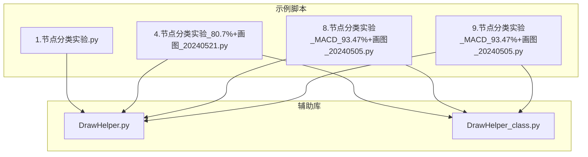
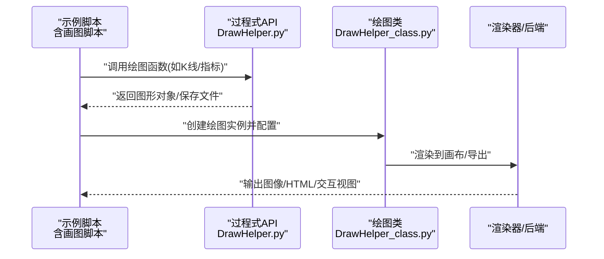
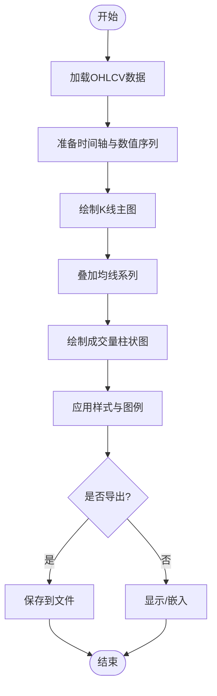
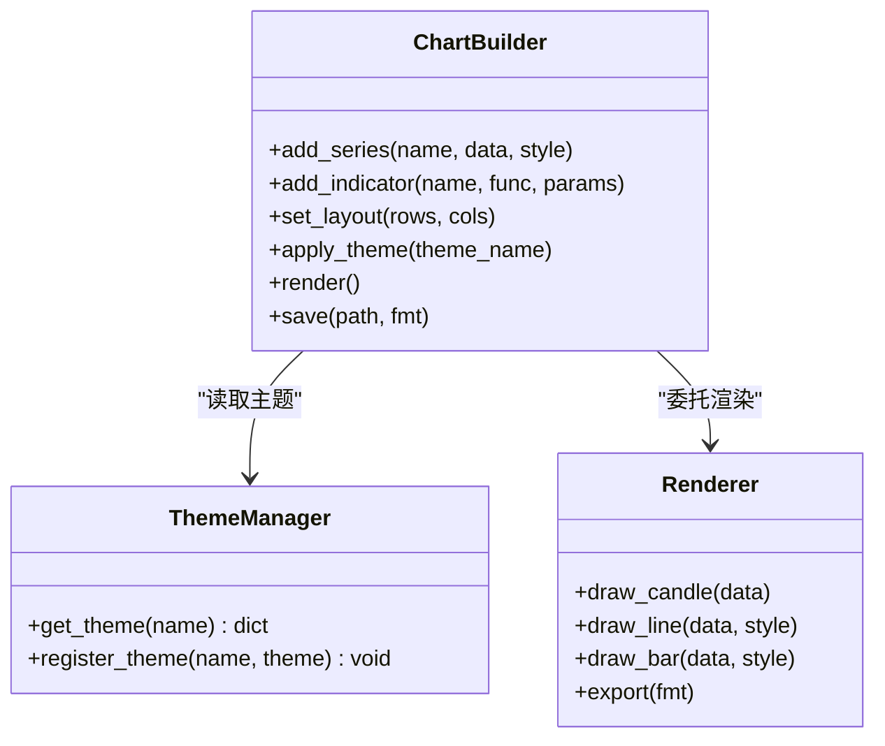
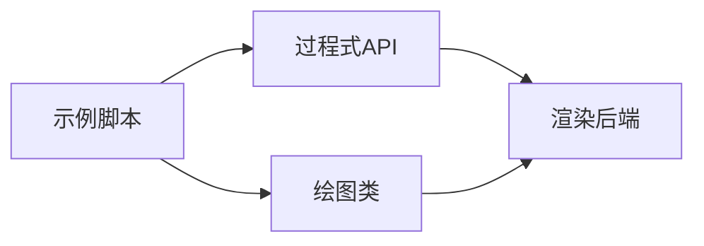

# 可视化绘图工具

<cite>
**本文引用的文件**   
- [DrawHelper.py](file://MyProject/Helper/DrawHelper.py)
- [DrawHelper_class.py](file://MyProject/Helper/DrawHelper_class.py)
- [1.节点分类实验.py](file://MyProject/Model/1.节点分类实验.py)
- [4.节点分类实验_80.7%+画图_20240521.py](file://MyProject/Model/4.节点分类实验_80.7%+画图_20240521.py)
- [8.节点分类实验_MACD_93.47%+画图_20240505.py](file://MyProject/Model/8.节点分类实验_MACD_93.47%+画图_20240505.py)
- [9.节点分类实验_MACD_93.47%+画图_20240505.py](file://MyProject/Model/9.节点分类实验_MACD_93.47%+画图_20240505.py)
</cite>

## 目录
1. [简介](#简介)
2. [项目结构](#项目结构)
3. [核心组件](#核心组件)
4. [架构总览](#架构总览)
5. [详细组件分析](#详细组件分析)
6. [依赖关系分析](#依赖关系分析)
7. [性能与可维护性建议](#性能与可维护性建议)
8. [故障排查指南](#故障排查指南)
9. [结论](#结论)
10. [附录：使用示例与最佳实践](#附录使用示例与最佳实践)

## 简介
本文件面向金融数据可视化需求，系统化梳理仓库中的绘图辅助能力，覆盖K线图绘制、技术指标图表与交易信号可视化。文档将帮助读者快速上手并构建专业级图表：包括自定义样式、多指标叠加、交互式展示、布局设计原则、颜色搭配方案、响应式适配、导出格式支持与批量报告生成方法。

## 项目结构
本项目中与可视化相关的代码主要集中在 Helper 模块的绘图辅助文件，以及 Model 目录下若干“含画图”的实验脚本中。整体组织方式以功能域划分：
- Helper/DrawHelper.py：提供面向过程的绘图函数集合（如K线、均线、MACD等）
- Helper/DrawHelper_class.py：封装面向对象绘图类，便于复用与扩展
- Model/*.py（含“+画图”后缀）：演示如何调用上述工具进行实战绘图

图示来源
- [DrawHelper.py](file://MyProject/Helper/DrawHelper.py)
- [DrawHelper_class.py](file://MyProject/Helper/DrawHelper_class.py)
- [1.节点分类实验.py](file://MyProject/Model/1.节点分类实验.py)
- [4.节点分类实验_80.7%+画图_20240521.py](file://MyProject/Model/4.节点分类实验_80.7%+画图_20240521.py)
- [8.节点分类实验_MACD_93.47%+画图_20240505.py](file://MyProject/Model/8.节点分类实验_MACD_93.47%+画图_20240505.py)
- [9.节点分类实验_MACD_93.47%+画图_20240505.py](file://MyProject/Model/9.节点分类实验_MACD_93.47%+画图_20240505.py)

章节来源
- [DrawHelper.py](file://MyProject/Helper/DrawHelper.py)
- [DrawHelper_class.py](file://MyProject/Helper/DrawHelper_class.py)
- [4.节点分类实验_80.7%+画图_20240521.py](file://MyProject/Model/4.节点分类实验_80.7%+画图_20240521.py)
- [8.节点分类实验_MACD_93.47%+画图_20240505.py](file://MyProject/Model/8.节点分类实验_MACD_93.47%+画图_20240505.py)
- [9.节点分类实验_MACD_93.47%+画图_20240505.py](file://MyProject/Model/9.节点分类实验_MACD_93.47%+画图_20240505.py)

## 核心组件
- 过程式绘图API（DrawHelper.py）
  - 职责：提供轻量、易用的函数接口，用于快速绘制K线、均线、成交量、MACD、RSI等常见金融图表元素；支持基础样式配置与多图组合。
  - 典型用法：传入时间序列与价格/指标数组，设置标题、坐标轴、网格、图例等参数，直接输出静态图像或嵌入到现有画布。
- 面向对象绘图类（DrawHelper_class.py）
  - 职责：封装绘图状态与样式，支持多子图布局、主题切换、交互回调注册、批量导出等高级特性。
  - 典型用法：实例化绘图对象后，按步骤添加数据系列、配置样式、渲染输出；适合复杂报表与交互式场景。

章节来源
- [DrawHelper.py](file://MyProject/Helper/DrawHelper.py)
- [DrawHelper_class.py](file://MyProject/Helper/DrawHelper_class.py)

## 架构总览
下图展示了从示例脚本到绘图辅助库的调用关系，体现“业务脚本 -> 绘图API/类 -> 渲染输出”的分层结构。

图示来源
- [DrawHelper.py](file://MyProject/Helper/DrawHelper.py)
- [DrawHelper_class.py](file://MyProject/Helper/DrawHelper_class.py)
- [4.节点分类实验_80.7%+画图_20240521.py](file://MyProject/Model/4.节点分类实验_80.7%+画图_20240521.py)
- [8.节点分类实验_MACD_93.47%+画图_20240505.py](file://MyProject/Model/8.节点分类实验_MACD_93.47%+画图_20240505.py)
- [9.节点分类实验_MACD_93.47%+画图_20240505.py](file://MyProject/Model/9.节点分类实验_MACD_93.47%+画图_20240505.py)

## 详细组件分析

### 过程式绘图API（DrawHelper.py）
- 设计要点
  - 函数粒度清晰：每个函数聚焦单一图表元素（如K线、均线、柱状成交量、MACD双线+柱）。
  - 参数化样式：通过统一样式字典或关键字参数控制颜色、线宽、透明度、网格与图例。
  - 组合友好：支持在同一画布上叠加多个子图，共享X轴时间刻度。
- 关键流程（以“K线+均线+成交量”为例）

图示来源
- [DrawHelper.py](file://MyProject/Helper/DrawHelper.py)

章节来源
- [DrawHelper.py](file://MyProject/Helper/DrawHelper.py)

### 面向对象绘图类（DrawHelper_class.py）
- 设计要点
  - 状态管理：内部维护当前画布、子图布局、主题、数据缓存等。
  - 链式调用：提供连贯的方法链，便于在单行内完成多步配置。
  - 扩展点：支持自定义渲染器、事件回调、批量导出模板。
- 类关系示意

图示来源
- [DrawHelper_class.py](file://MyProject/Helper/DrawHelper_class.py)

章节来源
- [DrawHelper_class.py](file://MyProject/Helper/DrawHelper_class.py)

### 实战示例脚本解析
- 含“+画图”的脚本展示了如何将模型结果与交易信号可视化结合，形成策略回测与评估报告。
- 典型场景
  - 股价走势分析：在主图叠加趋势线与支撑阻力位，副图展示成交量与波动率。
  - 策略回测结果展示：标注买卖信号、回撤区间、收益曲线与基准对比。
  - 模型性能评估：绘制混淆矩阵、ROC曲线、特征重要性条形图等。
- 参考路径
  - [4.节点分类实验_80.7%+画图_20240521.py](file://MyProject/Model/4.节点分类实验_80.7%+画图_20240521.py)
  - [8.节点分类实验_MACD_93.47%+画图_20240505.py](file://MyProject/Model/8.节点分类实验_MACD_93.47%+画图_20240505.py)
  - [9.节点分类实验_MACD_93.47%+画图_20240505.py](file://MyProject/Model/9.节点分类实验_MACD_93.47%+画图_20240505.py)

章节来源
- [4.节点分类实验_80.7%+画图_20240521.py](file://MyProject/Model/4.节点分类实验_80.7%+画图_20240521.py)
- [8.节点分类实验_MACD_93.47%+画图_20240505.py](file://MyProject/Model/8.节点分类实验_MACD_93.47%+画图_20240505.py)
- [9.节点分类实验_MACD_93.47%+画图_20240505.py](file://MyProject/Model/9.节点分类实验_MACD_93.47%+画图_20240505.py)

## 依赖关系分析
- 模块耦合
  - 示例脚本对绘图API/类的依赖为单向，利于解耦与替换渲染后端。
  - 过程式API与面向对象类可并存，前者适合快速脚本，后者适合工程化报表。
- 外部依赖
  - 通常基于通用绘图后端（如matplotlib/pyecharts等），具体实现以实际导入为准。
- 潜在循环依赖
  - 当前结构未见明显循环引用；建议在新增功能时保持“脚本 -> 辅助库”的单向依赖。

图示来源
- [DrawHelper.py](file://MyProject/Helper/DrawHelper.py)
- [DrawHelper_class.py](file://MyProject/Helper/DrawHelper_class.py)
- [4.节点分类实验_80.7%+画图_20240521.py](file://MyProject/Model/4.节点分类实验_80.7%+画图_20240521.py)
- [8.节点分类实验_MACD_93.47%+画图_20240505.py](file://MyProject/Model/8.节点分类实验_MACD_93.47%+画图_20240505.py)
- [9.节点分类实验_MACD_93.47%+画图_20240505.py](file://MyProject/Model/9.节点分类实验_MACD_93.47%+画图_20240505.py)

章节来源
- [DrawHelper.py](file://MyProject/Helper/DrawHelper.py)
- [DrawHelper_class.py](file://MyProject/Helper/DrawHelper_class.py)

## 性能与可维护性建议
- 大数据量优化
  - 按需采样与降采样：长周期K线采用聚合或下采样减少渲染压力。
  - 增量更新：交互式场景仅重绘变化区域，避免全量刷新。
- 内存与IO
  - 流式写入：大批量导出时采用分块写入与异步I/O。
  - 资源释放：及时关闭画布与句柄，避免内存泄漏。
- 可维护性
  - 样式集中管理：通过主题配置统一管理配色、字体与尺寸。
  - 函数/类边界清晰：单一职责，便于单元测试与回归测试。

[本节为通用建议，不直接分析具体文件]

## 故障排查指南
- 常见问题定位
  - 数据维度不一致：检查时间轴与数值序列长度对齐。
  - 坐标轴范围异常：确认数据极值与缩放比例设置。
  - 中文乱码：确保字体与编码配置正确。
  - 导出失败：检查目标路径权限与格式支持。
- 调试技巧
  - 逐步打印中间变量，定位数据预处理问题。
  - 最小复现：剥离无关逻辑，仅保留绘图相关代码。
  - 日志记录：在关键渲染步骤输出耗时与异常堆栈。

[本节为通用建议，不直接分析具体文件]

## 结论
本项目的可视化绘图工具以“过程式API + 面向对象类”的双轨模式，兼顾灵活性与工程化。借助示例脚本的实践，读者可快速搭建从K线图到多指标叠加、从静态导出到交互式展示的完整工作流。遵循本文的布局与配色原则、性能优化与排错建议，可进一步提升图表质量与交付效率。

[本节为总结性内容，不直接分析具体文件]

## 附录：使用示例与最佳实践

### 常用图表类型与适用场景
- K线图：适用于价格走势与量价配合分析
- 均线系统：趋势跟踪与交叉信号识别
- MACD/RSI等指标：动量与超买超卖判断
- 交易信号标注：买入/卖出点位与持仓区间可视化
- 策略回测面板：收益曲线、回撤、胜率与盈亏比

章节来源
- [4.节点分类实验_80.7%+画图_20240521.py](file://MyProject/Model/4.节点分类实验_80.7%+画图_20240521.py)
- [8.节点分类实验_MACD_93.47%+画图_20240505.py](file://MyProject/Model/8.节点分类实验_MACD_93.47%+画图_20240505.py)
- [9.节点分类实验_MACD_93.47%+画图_20240505.py](file://MyProject/Model/9.节点分类实验_MACD_93.47%+画图_20240505.py)

### 自定义样式与主题
- 主题要素
  - 颜色体系：涨跌色、指标色、背景与网格色
  - 字体与字号：标题、标签、图例、注释
  - 线条与标记：线宽、虚线、标记形状与大小
- 主题管理
  - 集中定义主题字典，按场景切换（如深色/浅色、黑白打印）
  - 提供默认主题与用户覆盖机制

章节来源
- [DrawHelper_class.py](file://MyProject/Helper/DrawHelper_class.py)

### 多指标叠加与布局设计
- 布局原则
  - 主次分明：主图展示价格与关键信号，副图展示指标与成交量
  - 共享时间轴：统一时间刻度，提升可读性
  - 留白与层级：合理间距与图层顺序，避免视觉拥挤
- 叠加策略
  - 先底后顶：先绘制背景与网格，再叠加指标与信号
  - 独立Y轴：必要时为不同量纲指标分配独立Y轴

章节来源
- [DrawHelper.py](file://MyProject/Helper/DrawHelper.py)
- [DrawHelper_class.py](file://MyProject/Helper/DrawHelper_class.py)

### 交互式图表与响应式适配
- 交互能力
  - 缩放与平移：时间窗口选择与细节放大
  - 悬停提示：显示日期、价格、指标值与信号说明
  - 联动筛选：点击图例或按钮过滤特定指标
- 响应式适配
  - 自适应尺寸：根据屏幕分辨率调整字号与间距
  - 移动端优化：简化信息密度，突出关键指标

章节来源
- [DrawHelper_class.py](file://MyProject/Helper/DrawHelper_class.py)

### 导出格式与批量报告
- 导出格式
  - 静态图像：PNG/SVG/PDF（适合报告与论文）
  - 网页交互：HTML（适合在线看板与分享）
- 批量生成
  - 模板驱动：统一布局与样式模板，批量填充数据
  - 任务队列：并发导出，断点续跑与错误重试
  - 产物归档：按日期/标的/策略维度组织输出目录

章节来源
- [DrawHelper_class.py](file://MyProject/Helper/DrawHelper_class.py)

### 实战场景速查
- 股价走势分析
  - 主图：K线 + 短期/长期均线 + 支撑/阻力线
  - 副图：成交量 + 波动率或RSI
  - 参考脚本：[4.节点分类实验_80.7%+画图_20240521.py](file://MyProject/Model/4.节点分类实验_80.7%+画图_20240521.py)
- 策略回测结果展示
  - 收益曲线 vs 基准，回撤区间高亮，买卖信号标注
  - 参考脚本：[8.节点分类实验_MACD_93.47%+画图_20240505.py](file://MyProject/Model/8.节点分类实验_MACD_93.47%+画图_20240505.py)、[9.节点分类实验_MACD_93.47%+画图_20240505.py](file://MyProject/Model/9.节点分类实验_MACD_93.47%+画图_20240505.py)
- 模型性能评估
  - 混淆矩阵、ROC/AUC、特征重要性条形图
  - 参考脚本：[1.节点分类实验.py](file://MyProject/Model/1.节点分类实验.py)

章节来源
- [4.节点分类实验_80.7%+画图_20240521.py](file://MyProject/Model/4.节点分类实验_80.7%+画图_20240521.py)
- [8.节点分类实验_MACD_93.47%+画图_20240505.py](file://MyProject/Model/8.节点分类实验_MACD_93.47%+画图_20240505.py)
- [9.节点分类实验_MACD_93.47%+画图_20240505.py](file://MyProject/Model/9.节点分类实验_MACD_93.47%+画图_20240505.py)
- [1.节点分类实验.py](file://MyProject/Model/1.节点分类实验.py)