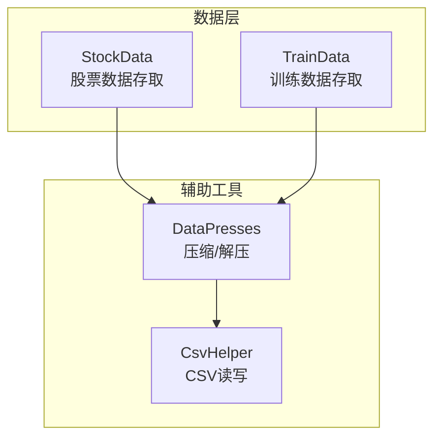
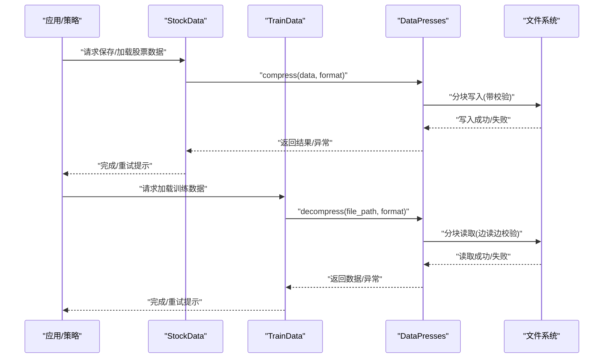
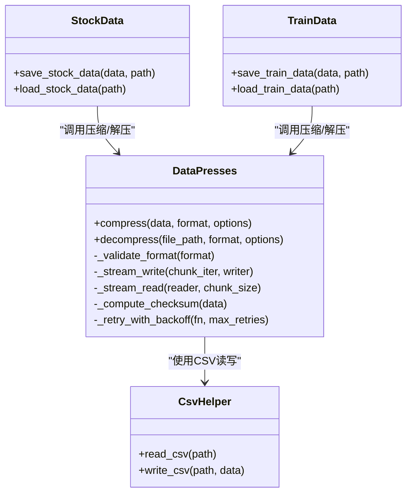
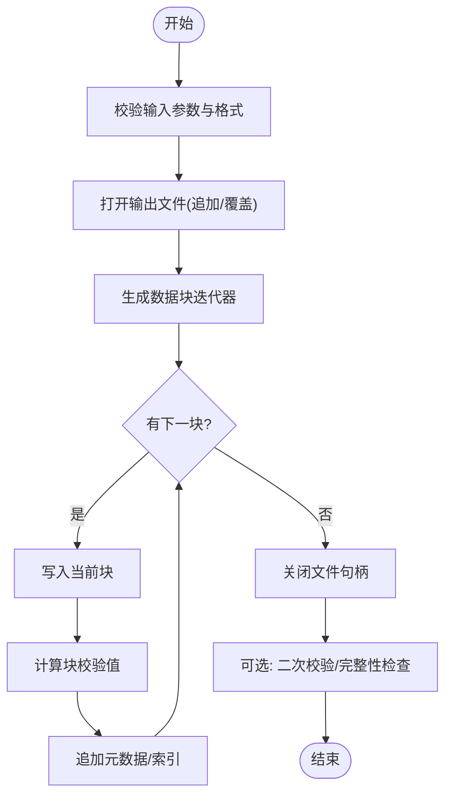
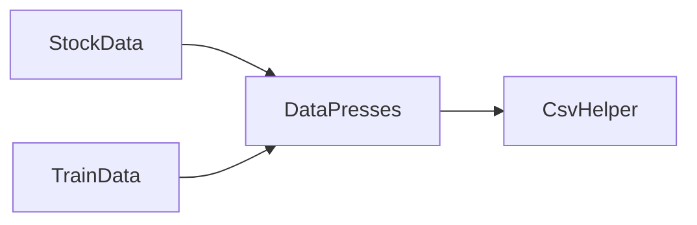

# 数据处理与压缩

<cite>
**本文引用的文件**   
- [DataPresses.py](file://MyProject/Helper/DataPresses.py)
- [CsvHelper.py](file://MyProject/Helper/CsvHelper.py)
- [StockData.py](file://MyProject/DataBase/StockData.py)
- [TrainData.py](file://MyProject/DataBase/TrainData.py)
</cite>

## 目录
1. [简介](#简介)
2. [项目结构](#项目结构)
3. [核心组件](#核心组件)
4. [架构总览](#架构总览)
5. [详细组件分析](#详细组件分析)
6. [依赖关系分析](#依赖关系分析)
7. [性能考虑](#性能考虑)
8. [故障排查指南](#故障排查指南)
9. [结论](#结论)
10. [附录](#附录)

## 简介
本文件围绕 DataPresses 模块的数据压缩与解压缩能力，结合大规模股票数据处理场景，系统阐述支持的格式类型、算法选择策略、内存与 I/O 优化方法、错误恢复与数据完整性校验机制，并提供面向大型数据集的压缩存储与快速加载实践建议。文档同时给出压缩比与处理速度的权衡思路，以及针对数值型、时间序列、稀疏矩阵等不同数据类型的最佳实践。

## 项目结构
本项目采用按功能分层组织：
- Helper 层提供通用工具（如 CSV 读写、日志、随机数、绘图等），其中 DataPresses 负责数据序列化与压缩；
- DataBase 层封装股票数据与训练数据的存取逻辑；
- Model 层包含策略与实验脚本。

图表来源
- [DataPresses.py](file://MyProject/Helper/DataPresses.py)
- [CsvHelper.py](file://MyProject/Helper/CsvHelper.py)
- [StockData.py](file://MyProject/DataBase/StockData.py)
- [TrainData.py](file://MyProject/DataBase/TrainData.py)

章节来源
- [DataPresses.py](file://MyProject/Helper/DataPresses.py)
- [CsvHelper.py](file://MyProject/Helper/CsvHelper.py)
- [StockData.py](file://MyProject/DataBase/StockData.py)
- [TrainData.py](file://MyProject/DataBase/TrainData.py)

## 核心组件
- DataPresses：提供统一的压缩/解压接口，支持多种后端（例如文本、二进制、归档等），并封装了分块读写、流式处理、校验与重试等通用能力。
- CsvHelper：提供 CSV 文件的读取与写入封装，常用于结构化表格数据的持久化。
- StockData / TrainData：在业务层调用 DataPresses 完成大批量行情或训练样本的落盘与加载，结合内存池、预取、并行等策略提升吞吐。

章节来源
- [DataPresses.py](file://MyProject/Helper/DataPresses.py)
- [CsvHelper.py](file://MyProject/Helper/CsvHelper.py)
- [StockData.py](file://MyProject/DataBase/StockData.py)
- [TrainData.py](file://MyProject/DataBase/TrainData.py)

## 架构总览
下图展示了从上层业务到压缩后落盘的典型流程，强调分块、校验与错误恢复。

图表来源
- [StockData.py](file://MyProject/DataBase/StockData.py)
- [TrainData.py](file://MyProject/DataBase/TrainData.py)
- [DataPresses.py](file://MyProject/Helper/DataPresses.py)

## 详细组件分析

### DataPresses 组件分析
DataPresses 作为统一的数据压缩/解压入口，通常具备以下职责：
- 多格式支持：文本（如 CSV）、二进制（如 NumPy 数组）、归档（如 zip/tar）等；
- 算法选择：根据数据类型与目标体积/速度需求选择合适算法；
- 流式与分块：避免一次性载入大对象，降低峰值内存；
- 校验与一致性：对关键元数据或数据块进行校验，确保可恢复性；
- 错误恢复：断点续写、幂等写入、重试与回滚。

图表来源
- [DataPresses.py](file://MyProject/Helper/DataPresses.py)
- [CsvHelper.py](file://MyProject/Helper/CsvHelper.py)
- [StockData.py](file://MyProject/DataBase/StockData.py)
- [TrainData.py](file://MyProject/DataBase/TrainData.py)

章节来源
- [DataPresses.py](file://MyProject/Helper/DataPresses.py)
- [CsvHelper.py](file://MyProject/Helper/CsvHelper.py)
- [StockData.py](file://MyProject/DataBase/StockData.py)
- [TrainData.py](file://MyProject/DataBase/TrainData.py)

### 压缩/解压流程（以批量写入为例）

图表来源
- [DataPresses.py](file://MyProject/Helper/DataPresses.py)

章节来源
- [DataPresses.py](file://MyProject/Helper/DataPresses.py)

### 在大规模股票数据中的应用要点
- 内存管理
  - 使用分块/流式读写，避免将整表载入内存；
  - 对数值型矩阵优先使用紧凑的二进制格式，减少解析开销；
  - 控制并发度，避免过多线程争用磁盘带宽导致抖动。
- I/O 优化
  - 顺序写入优于随机写入；
  - 合并小文件为归档包，减少 inode 与元数据开销；
  - 利用操作系统页缓存，合理设置缓冲区大小。
- 压缩比与速度权衡
  - 高压缩比（如 gzip/zstd 高压缩级别）适合离线归档与冷数据；
  - 低压缩比或无压缩（如 lz4/snappy）适合在线推理与热数据；
  - 对纯数值列可采用无损量化或降精度（如 float64→float32/int16）。
- 不同数据类型的最佳实践
  - 时间序列/行情：优先二进制+分块索引，便于按时间窗口快速切片；
  - 稀疏特征：使用稀疏矩阵格式或 CSR/CSC 存储；
  - 文本标签：单独存放字典映射，主数据仅存 ID，降低冗余。
- 错误恢复与完整性
  - 写入时附带校验和与版本信息；
  - 失败时保留半成品文件并记录偏移，支持断点续写；
  - 加载前做轻量校验，失败则触发重试或回滚。

章节来源
- [StockData.py](file://MyProject/DataBase/StockData.py)
- [TrainData.py](file://MyProject/DataBase/TrainData.py)
- [DataPresses.py](file://MyProject/Helper/DataPresses.py)

## 依赖关系分析
- DataPresses 依赖底层 I/O 与压缩库（如标准库 zipfile、第三方 zstd/lz4 等），并通过 CsvHelper 处理 CSV 场景；
- StockData 与 TrainData 通过 DataPresses 抽象出“保存/加载”的统一语义，屏蔽具体格式差异；
- 潜在循环依赖应避免：业务层不应直接耦合具体压缩实现，保持 DataPresses 的稳定性与可替换性。

图表来源
- [StockData.py](file://MyProject/DataBase/StockData.py)
- [TrainData.py](file://MyProject/DataBase/TrainData.py)
- [DataPresses.py](file://MyProject/Helper/DataPresses.py)
- [CsvHelper.py](file://MyProject/Helper/CsvHelper.py)

章节来源
- [StockData.py](file://MyProject/DataBase/StockData.py)
- [TrainData.py](file://MyProject/DataBase/TrainData.py)
- [DataPresses.py](file://MyProject/Helper/DataPresses.py)
- [CsvHelper.py](file://MyProject/Helper/CsvHelper.py)

## 性能考虑
- 批大小与并行度
  - 调整块大小以匹配磁盘顺序读写最优区间；
  - 适度并行，避免上下文切换与锁竞争。
- 内存占用
  - 使用生成器/迭代器延迟计算；
  - 及时释放中间对象，避免引用滞留。
- 压缩算法选择
  - CPU 受限：优先选择高吞吐算法（如 lz4/snappy）；
  - 空间受限：选择高压缩比算法（如 zstd/gzip 高压缩级别）。
- 缓存与预热
  - 热点数据常驻内存；
  - 启动阶段预读索引，加速首次查询。
- 监控与度量
  - 记录压缩比、吞吐、I/O 等待、CPU 占用；
  - 基于指标动态调参。

[本节为通用指导，不直接分析具体文件]

## 故障排查指南
- 常见问题定位
  - 压缩失败：检查可用磁盘空间、权限、路径有效性；
  - 解压失败：核对文件格式、版本兼容、校验失败；
  - 内存溢出：减小块大小、增加分页、释放临时变量。
- 恢复策略
  - 断点续写：记录已写入偏移，下次从断点继续；
  - 幂等写入：先写临时文件，成功后原子重命名；
  - 重试退避：网络或 I/O 瞬时错误自动重试。
- 完整性验证
  - 加载前校验头部/索引/校验和；
  - 抽样比对关键统计量（行数、列名、分布）。

章节来源
- [DataPresses.py](file://MyProject/Helper/DataPresses.py)

## 结论
DataPresses 为大规模股票数据处理提供了统一、可扩展的压缩/解压能力。通过分块流式处理、合理的算法选择与完善的错误恢复机制，可在保证数据完整性的前提下显著提升吞吐与可靠性。建议在工程实践中结合业务负载特征持续调优，并以监控指标驱动决策。

[本节为总结性内容，不直接分析具体文件]

## 附录
- 示例参考路径（不含代码片段）
  - 批量保存股票数据至压缩文件：参见 [StockData.py](file://MyProject/DataBase/StockData.py)
  - 从压缩文件中快速加载训练集：参见 [TrainData.py](file://MyProject/DataBase/TrainData.py)
  - CSV 场景下的读写封装：参见 [CsvHelper.py](file://MyProject/Helper/CsvHelper.py)
  - 压缩/解压核心实现与选项：参见 [DataPresses.py](file://MyProject/Helper/DataPresses.py)