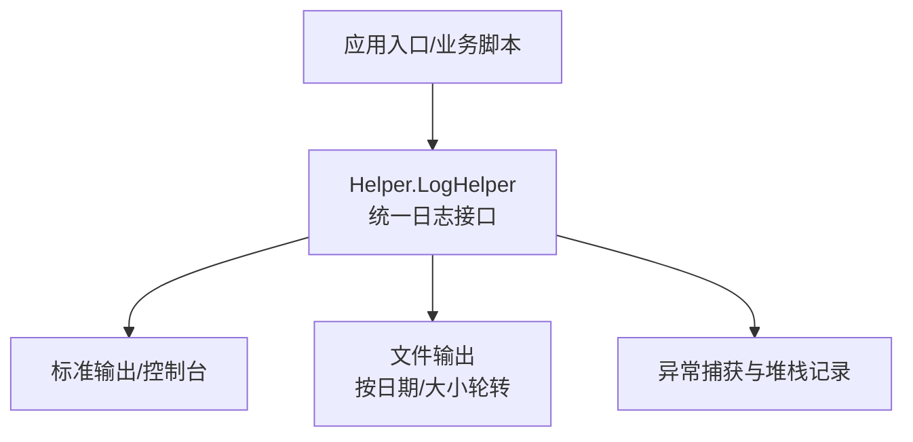
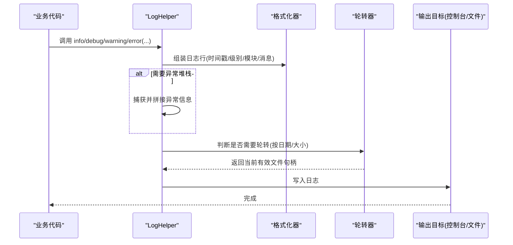
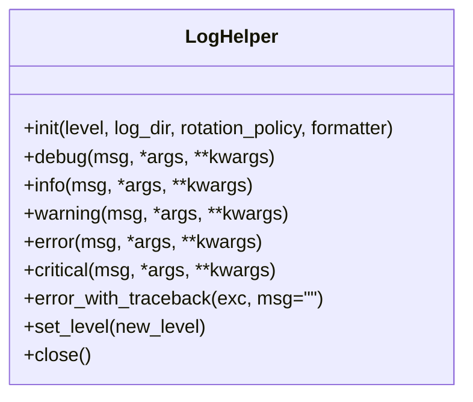
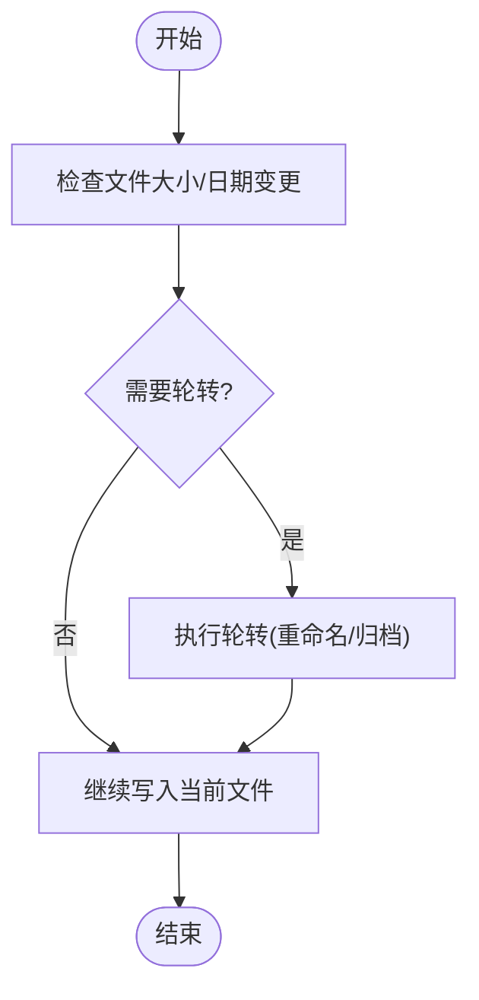
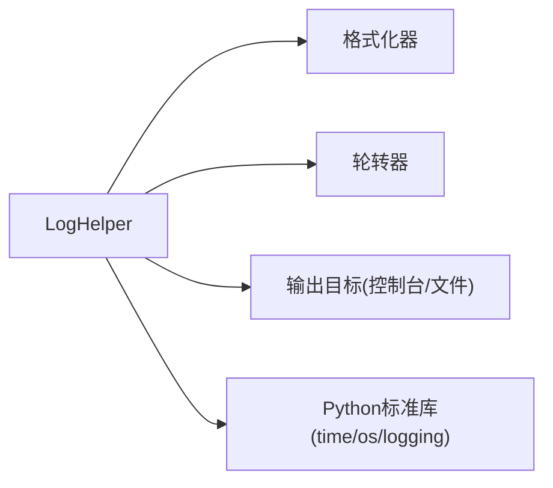

# 日志记录系统

<cite>
**本文引用的文件**   
- [LogHelper.py](file://MyProject/Helper/LogHelper.py)
</cite>

## 目录
1. [简介](#简介)
2. [项目结构](#项目结构)
3. [核心组件](#核心组件)
4. [架构总览](#架构总览)
5. [详细组件分析](#详细组件分析)
6. [依赖关系分析](#依赖关系分析)
7. [性能考虑](#性能考虑)
8. [故障排查指南](#故障排查指南)
9. [结论](#结论)
10. [附录](#附录) 

## 简介
本章节面向希望在项目中集成统一日志能力的开发者，围绕 LogHelper 类的设计与使用进行系统化说明。文档覆盖以下主题：
- 日志级别配置与输出格式定制
- 文件轮转机制与存储策略
- 性能优化策略与最佳实践
- 初始化配置、日志输出方法与错误追踪机制
- 典型使用场景示例（调试信息、异常堆栈、性能监控）
- 日志文件组织结构与清理机制
- 日志分析工具与常见问题排查方法

## 项目结构
本项目采用按功能模块划分的目录组织方式，日志相关能力集中在 Helper 子包中。核心日志实现位于 MyProject/Helper/LogHelper.py。其他业务模块通过导入该模块以获取统一的日志能力。

[本节为概念性概述，不直接分析具体源码文件]

## 核心组件
- LogHelper 类
  - 职责：提供统一的日志记录接口，封装日志级别控制、格式化、多目标输出（控制台与文件）、文件轮转、异常堆栈记录等能力。
  - 关键能力：
    - 日志级别：支持 DEBUG/INFO/WARNING/ERROR 等常用级别，便于按需过滤。
    - 输出格式：时间戳、级别、模块名、消息体等字段可配置。
    - 文件轮转：支持按日期或大小进行轮转，避免单文件过大。
    - 错误追踪：自动附加异常类型、消息与完整堆栈，便于定位问题。
    - 线程安全：在高并发场景下保证日志写入的稳定性。
    - 性能优化：缓冲写入、异步落盘（可选）、条件启用等策略。

- 典型调用点
  - 在业务逻辑中通过 LogHelper 提供的 debug/info/warning/error 等方法记录结构化日志。
  - 在异常处理块中记录异常上下文与堆栈，提升排障效率。

**章节来源**
- [LogHelper.py](file://MyProject/Helper/LogHelper.py)

## 架构总览
下图展示了 LogHelper 在项目中的位置与交互关系，以及日志从生成到落盘的流程。

**图表来源**
- [LogHelper.py](file://MyProject/Helper/LogHelper.py)

**章节来源**
- [LogHelper.py](file://MyProject/Helper/LogHelper.py)

## 详细组件分析

### LogHelper 类设计
- 设计要点
  - 单一职责：仅负责日志的生成、格式化与输出，不耦合业务逻辑。
  - 可扩展：通过配置对象注入格式化规则、轮转策略与输出目标。
  - 可观测：提供开关与级别控制，便于在不同环境切换详细程度。
  - 健壮性：对 I/O 异常进行兜底处理，确保主流程不受影响。

- 关键方法（命名仅为示意，实际以源码为准）
  - 初始化：设置日志级别、输出路径、轮转策略、格式模板等。
  - 记录接口：debug/info/warning/error/critical 等。
  - 异常记录：error_with_traceback 或类似方法，自动附加堆栈。
  - 配置更新：运行时动态调整级别或输出目标。
  - 资源管理：关闭文件句柄、刷新缓冲等。

**图表来源**
- [LogHelper.py](file://MyProject/Helper/LogHelper.py)

**章节来源**
- [LogHelper.py](file://MyProject/Helper/LogHelper.py)

### 日志级别与输出格式
- 日志级别
  - 建议默认使用 INFO 作为生产环境级别；开发/测试环境可使用 DEBUG。
  - 级别过滤由 LogHelper 内部实现，上层无需关心 IO 开销。
- 输出格式
  - 推荐包含：时间戳、级别、模块/函数名、消息内容、请求/任务标识（可选）。
  - 可通过配置项自定义分隔符、时区、精度等。

**章节来源**
- [LogHelper.py](file://MyProject/Helper/LogHelper.py)

### 文件轮转机制与存储策略
- 轮转策略
  - 按日期：每日生成新文件，便于按天归档与分析。
  - 按大小：当文件大小超过阈值时触发轮转，保留固定数量历史文件。
- 存储策略
  - 根目录：项目根目录下创建 logs 目录，按日期或业务维度分文件夹。
  - 命名规范：包含日期与级别，如 app_20240101_info.log。
  - 压缩归档：可选将旧日志压缩保存，降低磁盘占用。

**图表来源**
- [LogHelper.py](file://MyProject/Helper/LogHelper.py)

**章节来源**
- [LogHelper.py](file://MyProject/Helper/LogHelper.py)

### 错误追踪机制
- 自动堆栈捕获
  - 在 error/critical 级别或专用方法中，自动附加异常类型、消息与完整堆栈。
  - 建议在异常处理块中显式调用带堆栈的记录方法，以获得更丰富的上下文。
- 上下文增强
  - 可传入键值对参数，记录用户ID、请求ID、交易号等关键上下文，便于关联分析。

**章节来源**
- [LogHelper.py](file://MyProject/Helper/LogHelper.py)

### 性能优化策略
- 缓冲写入
  - 批量累积日志后一次性落盘，减少系统调用次数。
- 条件启用
  - 根据日志级别与开关快速短路，避免不必要的字符串拼接与 I/O。
- 异步落盘（可选）
  - 在高吞吐场景下，可将日志写入队列，后台线程持久化。
- 锁粒度控制
  - 针对多线程场景，合理加锁，避免频繁竞争导致性能下降。

**章节来源**
- [LogHelper.py](file://MyProject/Helper/LogHelper.py)

### 集成与初始化配置
- 初始化步骤
  - 在应用启动阶段创建 LogHelper 实例，配置日志级别、输出目录、轮转策略与格式模板。
  - 将实例注入到各模块或作为全局单例供调用。
- 基本用法
  - 使用 info/debug/warning/error 等方法记录不同级别的日志。
  - 在异常处理中使用 error_with_traceback 记录异常详情。
- 运行期调整
  - 支持动态调整日志级别或输出目标，便于线上问题复现与诊断。

**章节来源**
- [LogHelper.py](file://MyProject/Helper/LogHelper.py)

### 典型使用场景示例
- 调试信息记录
  - 在关键分支与循环处记录变量状态，配合 DEBUG 级别用于本地调试。
- 异常堆栈跟踪
  - 在 try/except 块中记录异常信息与堆栈，附带必要上下文键值。
- 性能监控日志
  - 在耗时操作前后记录时间戳，计算差值得到耗时指标，便于性能分析。

[本节为概念性示例说明，不直接展示源码片段]

## 依赖关系分析
- 内部依赖
  - 日志格式化器：负责将结构化数据转换为文本行。
  - 轮转器：负责文件生命周期管理与归档。
  - 输出目标：控制台与文件两种常见目标。
- 外部依赖
  - Python 标准库：time、os、logging 等。
  - 第三方库（可选）：如需要高级轮转或异步写入能力。

**图表来源**
- [LogHelper.py](file://MyProject/Helper/LogHelper.py)

**章节来源**
- [LogHelper.py](file://MyProject/Helper/LogHelper.py)

## 性能考虑
- 日志级别选择
  - 生产环境建议使用 INFO 及以上级别，避免过多 DEBUG 日志造成 I/O 压力。
- 批处理与缓冲
  - 合理设置缓冲大小与刷新频率，平衡实时性与吞吐。
- 异步写入
  - 高并发场景下优先采用异步写入，降低主线程阻塞风险。
- 磁盘与文件系统
  - 避免在同一磁盘上同时写入大量小文件，尽量合并与归档。
- 采样与限流
  - 对高频事件进行采样或限流，防止日志风暴。

[本节提供通用指导，不直接分析具体源码文件]

## 故障排查指南
- 常见问题
  - 无法写入日志文件：检查权限、路径是否存在、磁盘空间是否充足。
  - 日志未轮转：确认轮转策略配置是否正确，文件大小阈值与日期边界是否符合预期。
  - 日志丢失：检查缓冲刷新策略与进程退出时的资源释放。
  - 性能抖动：评估日志级别、缓冲大小与异步写入策略。
- 定位方法
  - 开启 DEBUG 级别，观察初始化与轮转过程的关键节点。
  - 在异常处理中记录完整堆栈与上下文，结合请求/任务标识进行关联分析。
  - 使用日志分析工具（如 grep、awk、日志聚合平台）检索关键字段。

**章节来源**
- [LogHelper.py](file://MyProject/Helper/LogHelper.py)

## 结论
LogHelper 提供了统一、可扩展且高性能的日志能力，适用于多种运行环境与业务场景。通过合理的级别控制、格式定制、轮转策略与性能优化，可以在保障可观测性的同时，最小化对系统性能的影响。建议在生产环境中结合集中式日志平台进行采集与分析，进一步提升排障效率与运维自动化水平。

[本节为总结性内容，不直接分析具体源码文件]

## 附录
- 术语
  - 日志级别：用于区分重要程度的分类标签，如 DEBUG/INFO/WARNING/ERROR。
  - 轮转：按时间或大小将日志文件切分为多个文件，便于管理与归档。
  - 堆栈：异常发生时的调用链快照，有助于快速定位问题根源。
- 参考
  - 请结合项目内 LogHelper.py 的实际实现，了解具体的配置项与方法签名。

[本节为补充说明，不直接分析具体源码文件]