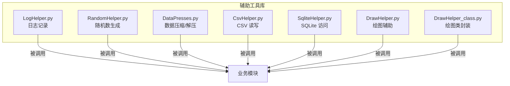
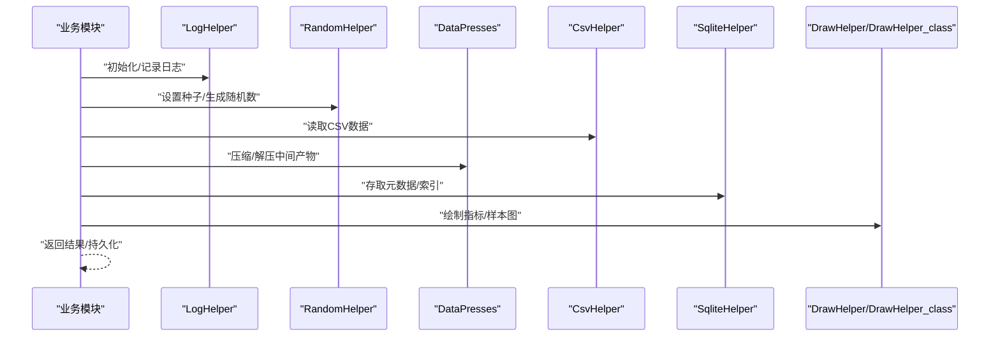
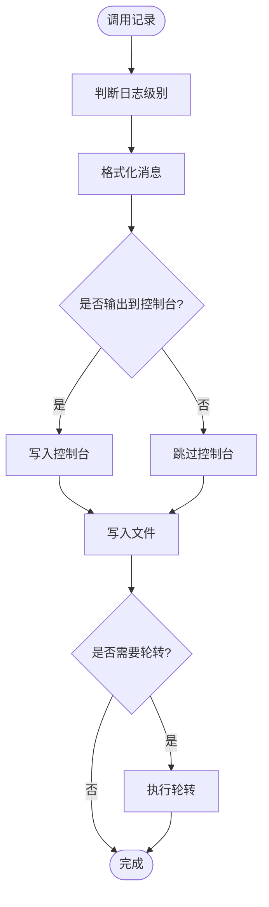
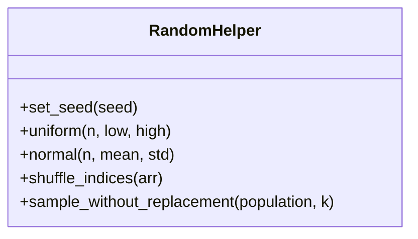
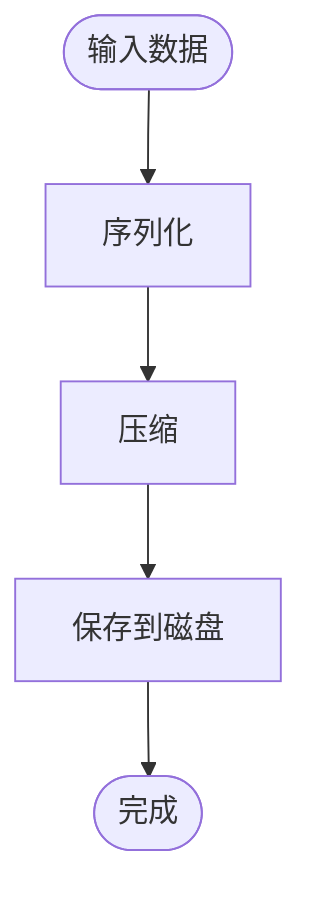
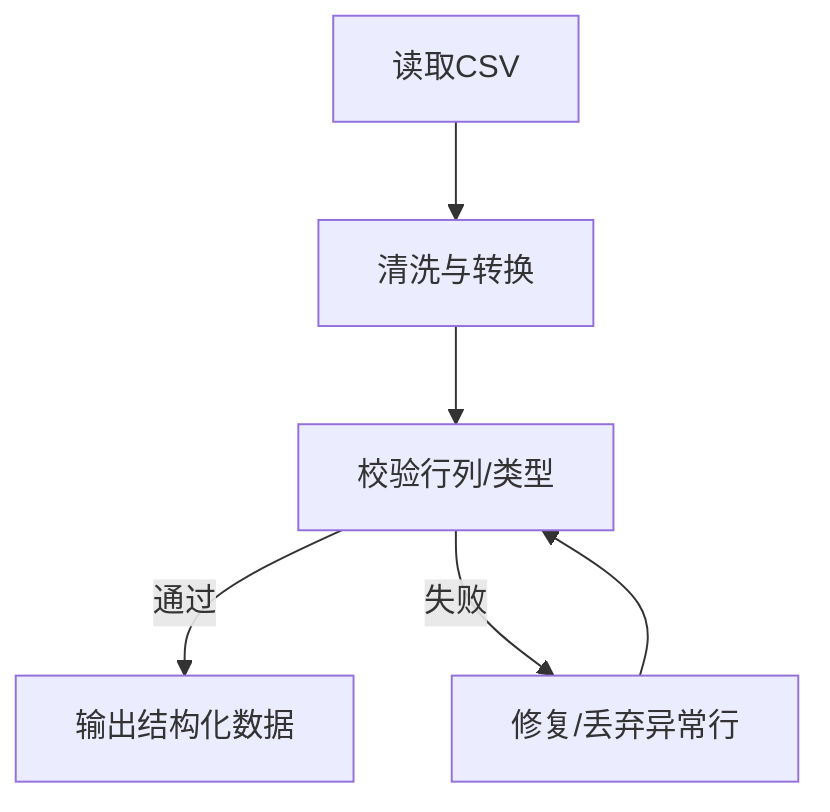
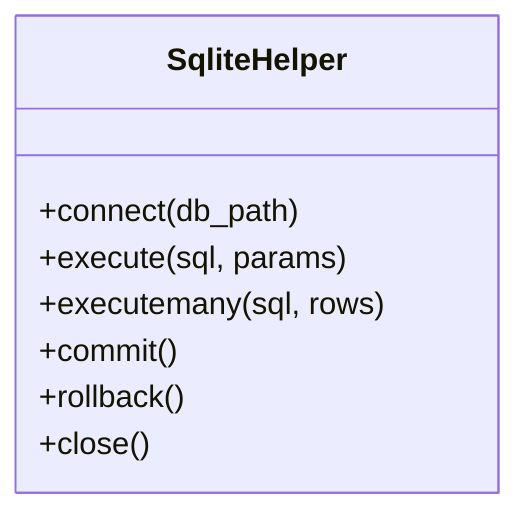
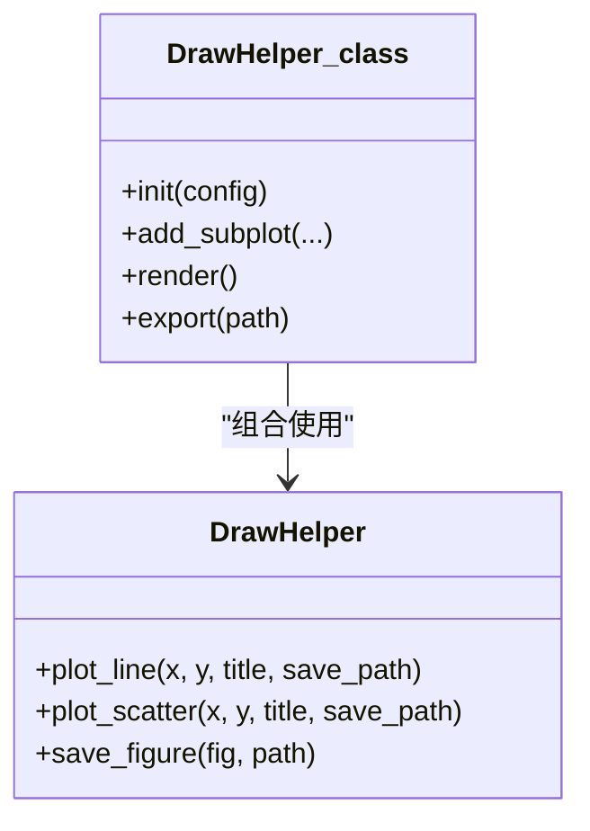
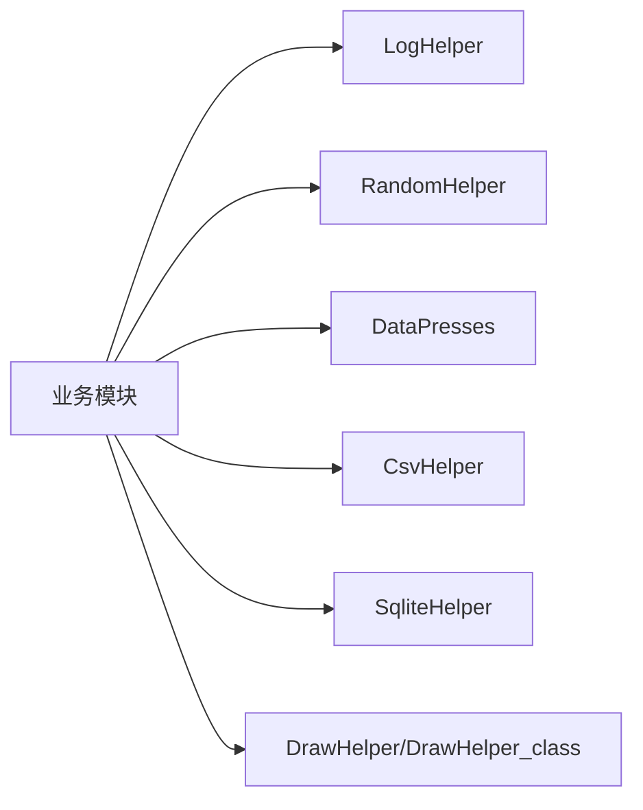

# 辅助工具库

<cite>
**本文引用的文件**   
- [CsvHelper.py](file://MyProject/Helper/CsvHelper.py)
- [DataPresses.py](file://MyProject/Helper/DataPresses.py)
- [DrawHelper.py](file://MyProject/Helper/DrawHelper.py)
- [DrawHelper_class.py](file://MyProject/Helper/DrawHelper_class.py)
- [LogHelper.py](file://MyProject/Helper/LogHelper.py)
- [RandomHelper.py](file://MyProject/Helper/RandomHelper.py)
- [SqliteHelper.py](file://MyProject/Helper/SqliteHelper.py)
</cite>

## 目录
1. [简介](#简介)
2. [项目结构](#项目结构)
3. [核心组件](#核心组件)
4. [架构总览](#架构总览)
5. [详细组件分析](#详细组件分析)
6. [依赖关系分析](#依赖关系分析)
7. [性能考虑](#性能考虑)
8. [故障排查指南](#故障排查指南)
9. [结论](#结论)
10. [附录](#附录) 

## 简介
本文件为“辅助工具库”的权威文档，聚焦于 MyProject/Helper 目录下的通用工具模块。内容覆盖日志记录、随机数生成、数据压缩与解压、CSV 读写、SQLite 数据库访问以及绘图辅助等能力。文档面向不同技术背景的读者，提供从高层概览到代码级细节的分层说明，并给出扩展机制、错误处理、性能监控与资源管理最佳实践，以及版本兼容性与迁移建议。

## 项目结构
辅助工具库位于 MyProject/Helper 目录下，按职责拆分为多个独立模块：
- 日志记录：LogHelper.py
- 随机数：RandomHelper.py
- 数据压缩：DataPresses.py
- CSV 读写：CsvHelper.py
- SQLite 访问：SqliteHelper.py
- 绘图辅助：DrawHelper.py、DrawHelper_class.py

图表来源
- [LogHelper.py](file://MyProject/Helper/LogHelper.py)
- [RandomHelper.py](file://MyProject/Helper/RandomHelper.py)
- [DataPresses.py](file://MyProject/Helper/DataPresses.py)
- [CsvHelper.py](file://MyProject/Helper/CsvHelper.py)
- [SqliteHelper.py](file://MyProject/Helper/SqliteHelper.py)
- [DrawHelper.py](file://MyProject/Helper/DrawHelper.py)
- [DrawHelper_class.py](file://MyProject/Helper/DrawHelper_class.py)

章节来源
- [LogHelper.py](file://MyProject/Helper/LogHelper.py)
- [RandomHelper.py](file://MyProject/Helper/RandomHelper.py)
- [DataPresses.py](file://MyProject/Helper/DataPresses.py)
- [CsvHelper.py](file://MyProject/Helper/CsvHelper.py)
- [SqliteHelper.py](file://MyProject/Helper/SqliteHelper.py)
- [DrawHelper.py](file://MyProject/Helper/DrawHelper.py)
- [DrawHelper_class.py](file://MyProject/Helper/DrawHelper_class.py)

## 核心组件
本节概述各工具模块的职责边界与典型用法要点（不展示具体代码）。

- 日志记录（LogHelper）
  - 设计目的：统一输出结构化日志，支持控制台与文件双写，便于调试与审计。
  - 关键能力：多级别日志、时间戳、可选轮转或追加写入、线程安全。
  - 配置项：日志级别、输出路径、是否启用控制台输出、格式模板。
  - 使用方式：在模块初始化时获取单例或上下文管理器，随后在各函数中按需记录信息。
  - 错误处理：IO 异常捕获、回退策略（降级至控制台）、幂等关闭。
  - 性能建议：批量写入、异步落盘（若实现）、避免高频极细粒度日志。

- 随机数（RandomHelper）
  - 设计目的：集中管理随机种子与采样方法，保证可复现实验结果。
  - 关键能力：设置全局种子、生成指定分布的随机数、无放回抽样、分片打乱。
  - 配置项：默认种子、算法选择（如 Mersenne Twister 或更现代算法）。
  - 使用方式：在实验入口固定种子；在数据预处理阶段进行稳定打乱。
  - 错误处理：参数校验（范围、类型）、异常抛出与提示。
  - 性能建议：批量生成优于循环逐个生成；避免频繁切换 RNG 状态。

- 数据压缩（DataPresses）
  - 设计目的：对中间数据进行压缩/解压，减少磁盘占用与 I/O 开销。
  - 关键能力：序列化对象压缩、流式读取、自动检测格式、断点续传（若实现）。
  - 配置项：压缩算法（如 gzip/zstd）、压缩等级、块大小。
  - 使用方式：训练前后对大型张量或数据集进行压缩存储；推理时按需解压。
  - 错误处理：损坏文件检测、校验和验证、回滚恢复。
  - 性能建议：根据 CPU/IO 权衡压缩等级；优先使用内存映射或流式接口。

- CSV 读写（CsvHelper）
  - 设计目的：简化 CSV 文件的读写与清洗流程。
  - 关键能力：批量读写、列名映射、缺失值处理、编码自动识别。
  - 配置项：分隔符、编码、是否保留空行、日期解析策略。
  - 使用方式：将原始行情或标签表转换为模型输入所需的 DataFrame/数组。
  - 错误处理：非法字符过滤、类型转换失败重试、行列对齐检查。
  - 性能建议：分块读取大文件、向量化操作替代逐行处理。

- SQLite 访问（SqliteHelper）
  - 设计目的：轻量级本地数据存储与查询，适合小中型数据集与快速原型。
  - 关键能力：连接池、事务封装、预编译语句、索引优化建议。
  - 配置项：数据库路径、超时、最大连接数、WAL 模式开关。
  - 使用方式：以上下文管理器或显式 close 确保资源释放；批量插入使用事务。
  - 错误处理：锁冲突重试、完整性约束异常、连接断开重连。
  - 性能建议：合理建索引、批量提交、避免长事务。

- 绘图辅助（DrawHelper / DrawHelper_class）
  - 设计目的：封装常用可视化逻辑，统一风格与输出路径。
  - 关键能力：折线/散点/柱状图绘制、多图布局、导出矢量图、中文渲染。
  - 配置项：字体、分辨率、颜色主题、保存目录。
  - 使用方式：在训练过程或评估后生成指标曲线与样本可视化。
  - 错误处理：字体缺失回退、目录不存在自动创建、内存不足降采样。
  - 性能建议：延迟渲染、缓存已生成图像、批量导出合并。

章节来源
- [LogHelper.py](file://MyProject/Helper/LogHelper.py)
- [RandomHelper.py](file://MyProject/Helper/RandomHelper.py)
- [DataPresses.py](file://MyProject/Helper/DataPresses.py)
- [CsvHelper.py](file://MyProject/Helper/CsvHelper.py)
- [SqliteHelper.py](file://MyProject/Helper/SqliteHelper.py)
- [DrawHelper.py](file://MyProject/Helper/DrawHelper.py)
- [DrawHelper_class.py](file://MyProject/Helper/DrawHelper_class.py)

## 架构总览
辅助工具库采用“低耦合、高内聚”的模块化设计，各模块通过明确定义的 API 暴露能力，供上层业务模块直接调用。整体交互如下：

图表来源
- [LogHelper.py](file://MyProject/Helper/LogHelper.py)
- [RandomHelper.py](file://MyProject/Helper/RandomHelper.py)
- [DataPresses.py](file://MyProject/Helper/DataPresses.py)
- [CsvHelper.py](file://MyProject/Helper/CsvHelper.py)
- [SqliteHelper.py](file://MyProject/Helper/SqliteHelper.py)
- [DrawHelper.py](file://MyProject/Helper/DrawHelper.py)
- [DrawHelper_class.py](file://MyProject/Helper/DrawHelper_class.py)

## 详细组件分析

### 日志记录系统（LogHelper）
- 设计目标
  - 统一日志出口，屏蔽底层差异，提供一致的调用体验。
- 主要功能
  - 分级日志（DEBUG/INFO/WARNING/ERROR/CRITICAL）
  - 控制台与文件双写
  - 格式化模板（时间、模块、行号、消息）
  - 可选的轮转与清理策略
- 配置选项
  - 日志级别、输出路径、是否开启控制台、格式字符串、轮转阈值
- 使用示例（概念性）
  - 在模块顶部导入并获取实例，在关键路径记录进入/退出、异常堆栈与关键变量摘要。
- 错误处理
  - IO 异常捕获与降级输出；重复关闭保护；权限问题友好提示。
- 性能建议
  - 控制日志粒度；批量化写入；避免在热路径打印超大对象。

图表来源
- [LogHelper.py](file://MyProject/Helper/LogHelper.py)

章节来源
- [LogHelper.py](file://MyProject/Helper/LogHelper.py)

### 随机数生成器（RandomHelper）
- 设计目标
  - 集中管理随机源，保障实验可复现与数据打乱一致性。
- 主要功能
  - 设置全局种子
  - 生成均匀/正态分布随机数
  - 无放回抽样与分片打乱
- 配置选项
  - 默认种子、算法名称、线程局部随机源开关
- 使用示例（概念性）
  - 在训练脚本入口处固定种子；在数据加载前对索引进行稳定打乱。
- 错误处理
  - 参数越界与类型校验；不可用算法回退提示。
- 性能建议
  - 批量生成；避免频繁切换随机源；多线程场景使用线程局部随机。

图表来源
- [RandomHelper.py](file://MyProject/Helper/RandomHelper.py)

章节来源
- [RandomHelper.py](file://MyProject/Helper/RandomHelper.py)

### 数据压缩工具（DataPresses）
- 设计目标
  - 降低中间数据体积，加速 I/O，提升端到端吞吐。
- 主要功能
  - 对象序列化与压缩
  - 流式读取/写入
  - 压缩格式自动识别
- 配置选项
  - 压缩算法、压缩等级、块大小、校验开关
- 使用示例（概念性）
  - 训练后将大型特征矩阵压缩保存；推理时按需解压到内存。
- 错误处理
  - 文件头校验、CRC 校验失败重试、损坏文件告警。
- 性能建议
  - 根据硬件选择合适压缩等级；优先使用内存映射；并行解压。

图表来源
- [DataPresses.py](file://MyProject/Helper/DataPresses.py)

章节来源
- [DataPresses.py](file://MyProject/Helper/DataPresses.py)

### CSV 读写（CsvHelper）
- 设计目标
  - 简化 CSV 数据的读取、清洗与导出。
- 主要功能
  - 批量读取/写入
  - 列映射与类型转换
  - 缺失值填充与去重
- 配置选项
  - 分隔符、编码、日期解析、是否忽略空行
- 使用示例（概念性）
  - 将原始股票行情 CSV 转换为模型可用的数值矩阵。
- 错误处理
  - 编码异常、字段长度不一致、类型转换失败的容错策略。
- 性能建议
  - 分块读取、向量化处理、避免逐行 Python 循环。

图表来源
- [CsvHelper.py](file://MyProject/Helper/CsvHelper.py)

章节来源
- [CsvHelper.py](file://MyProject/Helper/CsvHelper.py)

### SQLite 访问（SqliteHelper）
- 设计目标
  - 提供轻量、易用的本地数据库访问封装。
- 主要功能
  - 连接管理、事务封装、预编译语句
  - 索引与查询优化建议
- 配置选项
  - 数据库路径、超时、最大连接数、WAL 模式
- 使用示例（概念性）
  - 将实验元数据、超参与指标写入 SQLite，便于后续检索与分析。
- 错误处理
  - 锁冲突重试、完整性约束异常、连接断开重连。
- 性能建议
  - 批量插入使用事务；合理建索引；避免长事务。

图表来源
- [SqliteHelper.py](file://MyProject/Helper/SqliteHelper.py)

章节来源
- [SqliteHelper.py](file://MyProject/Helper/SqliteHelper.py)

### 绘图辅助（DrawHelper / DrawHelper_class）
- 设计目标
  - 统一可视化风格，降低绘图样板代码。
- 主要功能
  - 折线/散点/柱状图绘制
  - 多图布局与导出
  - 中文渲染与主题切换
- 配置选项
  - 字体、分辨率、颜色主题、保存目录
- 使用示例（概念性）
  - 训练过程中定期输出损失曲线与样本预测可视化。
- 错误处理
  - 字体缺失回退、目录不存在自动创建、内存不足降采样。
- 性能建议
  - 延迟渲染、缓存已生成图像、批量导出合并。

图表来源
- [DrawHelper.py](file://MyProject/Helper/DrawHelper.py)
- [DrawHelper_class.py](file://MyProject/Helper/DrawHelper_class.py)

章节来源
- [DrawHelper.py](file://MyProject/Helper/DrawHelper.py)
- [DrawHelper_class.py](file://MyProject/Helper/DrawHelper_class.py)

## 依赖关系分析
- 内部依赖
  - 各工具模块相互独立，遵循单一职责原则，避免循环依赖。
  - 绘图模块可能依赖第三方可视化库；日志模块可能依赖标准库 logging。
- 外部依赖
  - CSV 与 SQLite 分别依赖 csv/sqlite3 标准库；压缩模块可能依赖 zlib/gzip 或 zstandard。
- 集成点
  - 业务模块通过 import 引入工具模块，并以函数/类方法形式调用。
- 潜在风险
  - 第三方库版本差异导致行为变化（如绘图字体、压缩算法默认参数）。
  - 并发环境下共享资源的竞争（日志文件句柄、数据库连接）。

图表来源
- [LogHelper.py](file://MyProject/Helper/LogHelper.py)
- [RandomHelper.py](file://MyProject/Helper/RandomHelper.py)
- [DataPresses.py](file://MyProject/Helper/DataPresses.py)
- [CsvHelper.py](file://MyProject/Helper/CsvHelper.py)
- [SqliteHelper.py](file://MyProject/Helper/SqliteHelper.py)
- [DrawHelper.py](file://MyProject/Helper/DrawHelper.py)
- [DrawHelper_class.py](file://MyProject/Helper/DrawHelper_class.py)

章节来源
- [LogHelper.py](file://MyProject/Helper/LogHelper.py)
- [RandomHelper.py](file://MyProject/Helper/RandomHelper.py)
- [DataPresses.py](file://MyProject/Helper/DataPresses.py)
- [CsvHelper.py](file://MyProject/Helper/CsvHelper.py)
- [SqliteHelper.py](file://MyProject/Helper/SqliteHelper.py)
- [DrawHelper.py](file://MyProject/Helper/DrawHelper.py)
- [DrawHelper_class.py](file://MyProject/Helper/DrawHelper_class.py)

## 性能考虑
- 日志
  - 控制日志级别与频率；避免在热路径输出大对象；必要时使用异步队列。
- 随机数
  - 批量生成；固定种子用于复现；多线程使用线程局部随机源。
- 压缩
  - 选择合适的压缩等级；优先流式处理；利用多核并行解压。
- CSV
  - 分块读取；向量化转换；避免逐行 Python 循环。
- SQLite
  - 批量事务；合理索引；开启 WAL 模式提升并发读性能。
- 绘图
  - 延迟渲染；缓存已生成图片；批量导出合并。

[本节为通用指导，无需特定文件来源]

## 故障排查指南
- 日志无法写入
  - 检查输出路径权限与磁盘空间；确认日志轮转配置；查看是否发生 IO 异常。
- 随机结果不稳定
  - 确认是否在多处设置了不同的种子；检查多线程环境是否共享了同一随机源。
- 压缩文件损坏
  - 校验文件头与校验和；尝试使用更高兼容性算法；检查磁盘坏道。
- CSV 读取失败
  - 检查编码与分隔符；定位异常行并修复；增加容错与跳过策略。
- SQLite 锁冲突
  - 缩短事务时长；增加重试次数；调整连接池大小；考虑 WAL 模式。
- 绘图中文乱码
  - 安装中文字体；配置绘图后端；回退到英文标签。

章节来源
- [LogHelper.py](file://MyProject/Helper/LogHelper.py)
- [RandomHelper.py](file://MyProject/Helper/RandomHelper.py)
- [DataPresses.py](file://MyProject/Helper/DataPresses.py)
- [CsvHelper.py](file://MyProject/Helper/CsvHelper.py)
- [SqliteHelper.py](file://MyProject/Helper/SqliteHelper.py)
- [DrawHelper.py](file://MyProject/Helper/DrawHelper.py)
- [DrawHelper_class.py](file://MyProject/Helper/DrawHelper_class.py)

## 结论
辅助工具库通过清晰的模块划分与稳定的 API，为上层业务提供了可靠的日志、随机、压缩、CSV、SQLite 与绘图能力。遵循本文的最佳实践与排障建议，可在保证可维护性的同时获得良好的性能与稳定性。建议在团队内推广统一的工具使用规范，并在升级第三方依赖时进行回归测试。

[本节为总结性内容，无需特定文件来源]

## 附录

### 扩展机制与自定义工具添加
- 新增工具模块
  - 在 MyProject/Helper 下新建模块文件，定义清晰接口与文档字符串。
  - 在模块顶层提供便捷入口函数或类，保持命名一致。
- 注册与发现
  - 若需要动态加载，可在 Helper/__init__.py 中统一导出符号，或在配置中声明插件列表。
- 配置与开关
  - 使用配置文件或环境变量注入参数，避免硬编码。
- 测试与文档
  - 为每个新工具编写单元测试与最小可用示例；更新本文档对应章节。

[本节为通用指导，无需特定文件来源]

### 错误处理与资源管理最佳实践
- 错误处理
  - 明确异常层次；区分可恢复与不可恢复错误；记录必要上下文。
- 资源管理
  - 使用上下文管理器或 try/finally 确保文件句柄、数据库连接、图形对象正确释放。
- 幂等与重试
  - 对网络与 IO 操作实现指数退避重试；保证多次调用结果一致。

[本节为通用指导，无需特定文件来源]

### 性能监控与度量
- 埋点与计时
  - 在关键路径记录耗时与内存峰值；聚合统计指标。
- 告警与降级
  - 当 I/O 或计算超过阈值时触发告警；自动降级到更保守的策略。
- 基准测试
  - 建立回归基准，防止性能退化。

[本节为通用指导，无需特定文件来源]

### 版本兼容性与迁移指南
- 兼容性
  - 记录各模块支持的 Python 版本与第三方库版本范围。
  - 对破坏性变更提供弃用警告与迁移路径。
- 迁移步骤
  - 逐步替换旧 API；运行全量测试；对比输出一致性。
  - 更新配置文件与环境依赖；更新本文档。

[本节为通用指导，无需特定文件来源]