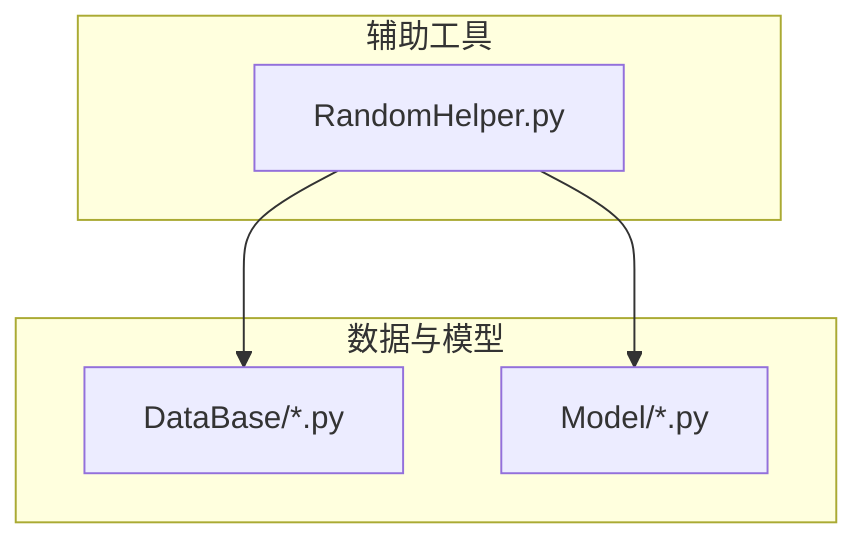
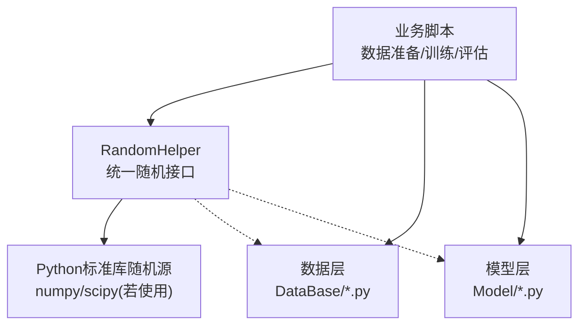
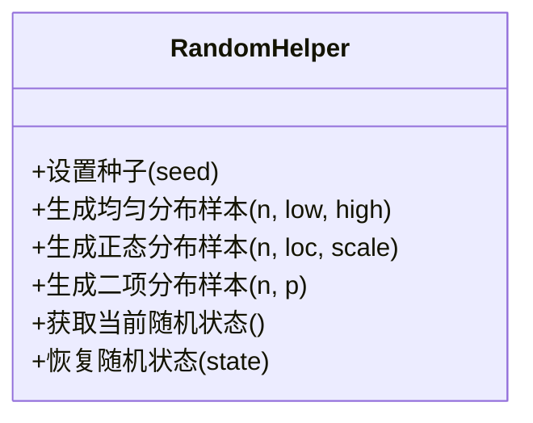
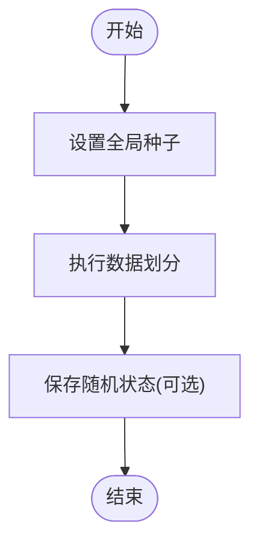
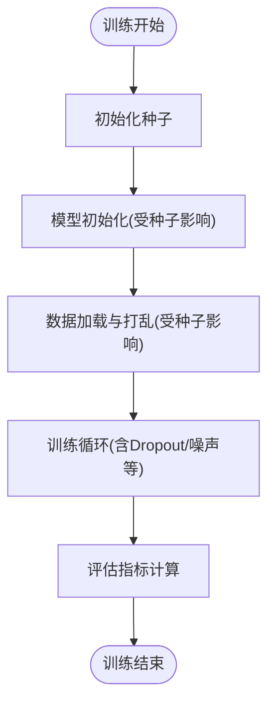
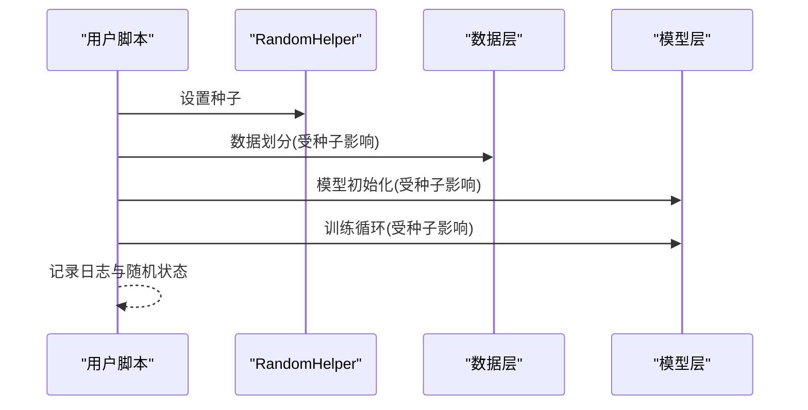
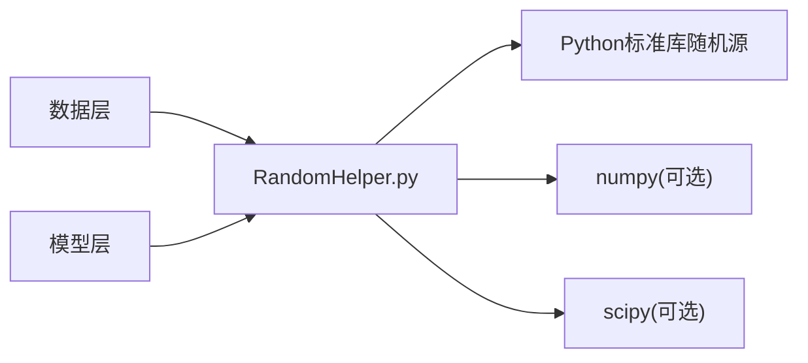

# 随机数生成器

<cite>
**本文引用的文件**   
- [RandomHelper.py](file://MyProject/Helper/RandomHelper.py)
</cite>

## 目录
1. [简介](#简介)
2. [项目结构](#项目结构)
3. [核心组件](#核心组件)
4. [架构总览](#架构总览)
5. [详细组件分析](#详细组件分析)
6. [依赖分析](#依赖分析)
7. [性能考虑](#性能考虑)
8. [故障排查指南](#故障排查指南)
9. [结论](#结论)
10. [附录](#附录) 

## 简介
本文件围绕 RandomHelper 类，系统化梳理其提供的随机数生成功能与使用方式，重点覆盖：
- 种子设置与可重复性保证机制
- 分布类型选择（均匀、正态、二项等）
- 在机器学习实验中的随机性控制方法（数据划分、模型初始化、训练过程）
- 线程安全性考量与性能优化技巧
- 在不同操作系统与 Python 版本下的兼容性说明

为保证文档的可复现性与严谨性，所有实现细节均以仓库中实际代码为准。

## 项目结构
本项目采用按功能模块组织的方式，随机数相关能力集中在 Helper 子包下，其中 RandomHelper.py 提供统一的随机数工具接口，便于在数据处理、模型训练与评估流程中统一调用。

图表来源
- [RandomHelper.py](file://MyProject/Helper/RandomHelper.py)

章节来源
- [RandomHelper.py](file://MyProject/Helper/RandomHelper.py)

## 核心组件
- 随机数生成器封装：对外暴露统一的 API，屏蔽底层库差异，提供一致的调用体验。
- 种子管理：支持全局与局部种子设置，确保不同运行环境下的结果可复现。
- 分布采样：提供常见概率分布的采样接口，如均匀分布、正态分布、二项分布等。
- 可重复性保障：通过固定种子与确定性操作顺序，使实验具备稳定复现能力。

章节来源
- [RandomHelper.py](file://MyProject/Helper/RandomHelper.py)

## 架构总览
下图展示了 RandomHelper 在项目中的位置及其与数据层、模型层的交互关系。该设计将随机性控制从业务逻辑中解耦，便于集中管理与审计。

图表来源
- [RandomHelper.py](file://MyProject/Helper/RandomHelper.py)

## 详细组件分析

### 组件A：RandomHelper 类
- 职责边界
  - 提供统一的随机数生成入口
  - 管理种子与可重复性策略
  - 封装常用分布采样方法
- 关键能力
  - 种子设置：支持全局种子与上下文级种子
  - 分布选择：均匀、正态、二项等
  - 可重复性：固定种子后，相同输入产生相同输出序列
- 典型用法场景
  - 数据划分：训练/验证/测试集分割
  - 模型初始化：权重或偏置的随机初始化
  - 训练过程：数据加载打乱、Dropout、噪声注入等

图表来源
- [RandomHelper.py](file://MyProject/Helper/RandomHelper.py)

章节来源
- [RandomHelper.py](file://MyProject/Helper/RandomHelper.py)

### 组件B：随机性控制流程（数据划分示例）
以下流程图展示在数据划分过程中如何通过 RandomHelper 保证可重复性。

图表来源
- [RandomHelper.py](file://MyProject/Helper/RandomHelper.py)

章节来源
- [RandomHelper.py](file://MyProject/Helper/RandomHelper.py)

### 组件C：随机性控制流程（模型训练示例）
以下流程图展示在模型训练中如何结合 RandomHelper 进行随机性控制。

图表来源
- [RandomHelper.py](file://MyProject/Helper/RandomHelper.py)

章节来源
- [RandomHelper.py](file://MyProject/Helper/RandomHelper.py)

### 概念性概览
在不绑定具体源码的前提下，下面给出一个通用的“可复现实验”工作流建议：
- 在进程启动时设置一次全局种子
- 对关键步骤（数据划分、模型初始化、训练循环）分别记录并恢复随机状态
- 在分布式或多进程环境下，为每个工作进程分配独立种子，避免竞争

[此图为概念性流程示意，不直接映射到具体源码文件]

## 依赖分析
- 内部依赖
  - RandomHelper 作为工具层被数据层与模型层间接引用，降低耦合度，提升可维护性。
- 外部依赖
  - 通常基于 Python 标准库随机源；若涉及高性能数值计算，可能引入 numpy/scipy 等库。
- 潜在风险
  - 多线程共享全局随机状态可能导致非预期行为，需通过隔离或锁机制规避。
  - 不同平台/版本的浮点运算差异可能影响高精度场景的完全一致。

图表来源
- [RandomHelper.py](file://MyProject/Helper/RandomHelper.py)

章节来源
- [RandomHelper.py](file://MyProject/Helper/RandomHelper.py)

## 性能考虑
- 批量采样优先：尽量一次性生成大批量样本，减少函数调用开销。
- 预分配内存：对大型数组，优先使用原地填充或预分配策略，避免频繁扩容。
- 避免不必要的状态切换：在长生命周期任务中，尽量减少种子的频繁重置。
- 并行化注意：多进程/多线程场景下，为每个进程/线程分配独立种子，避免竞争与同步开销。
- I/O 与随机性分离：将随机性控制与数据读写解耦，便于缓存与复用。

[本节为通用性能建议，不直接分析具体源码文件]

## 故障排查指南
- 现象：多次运行结果不一致
  - 检查是否在关键步骤前设置了种子
  - 确认是否存在未受控的随机源（如第三方库默认随机行为）
- 现象：多线程下出现异常或结果不稳定
  - 检查是否共享了全局随机状态
  - 为每个线程/进程分配独立种子或使用线程安全封装
- 现象：跨平台/跨版本结果不完全一致
  - 关注浮点精度差异与底层库实现差异
  - 在需要严格复现的场景下，锁定依赖版本与运行环境

章节来源
- [RandomHelper.py](file://MyProject/Helper/RandomHelper.py)

## 结论
RandomHelper 将随机性控制抽象为统一接口，有助于在数据处理与模型训练全流程中实现可复现的实验。通过合理的种子管理、分布选择与并发策略，可以在保证性能的同时获得稳定的结果。建议在工程实践中将其纳入标准流水线，并在关键节点记录随机状态以便回溯与审计。

[本节为总结性内容，不直接分析具体源码文件]

## 附录
- 术语
  - 种子：用于初始化随机数生成器的整型值，固定种子可得到确定性的随机序列。
  - 分布：描述随机变量取值概率规律的数学模型，如均匀分布、正态分布、二项分布等。
  - 可重复性：在相同输入与环境条件下，多次运行得到相同结果的能力。
- 最佳实践清单
  - 在进程入口处设置全局种子
  - 对关键步骤分别记录并恢复随机状态
  - 为多进程/多线程分配独立种子
  - 锁定依赖版本与运行环境以增强跨平台一致性

[本节为补充信息，不直接分析具体源码文件]