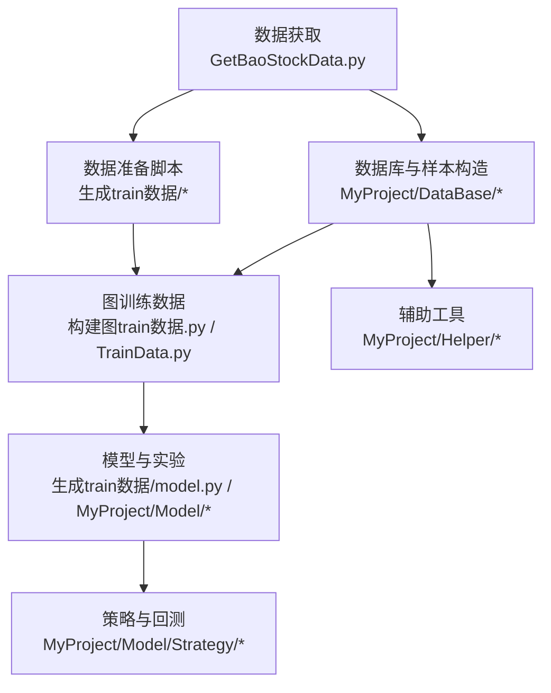
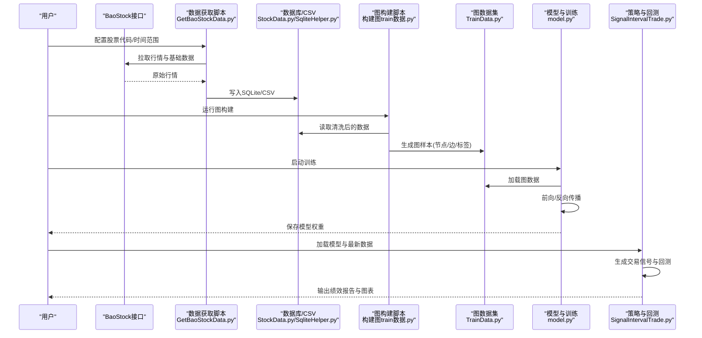
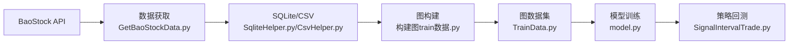

# 项目概述

<cite>
**本文引用的文件**   
- [GetBaoStockData.py](file://GetBaoStockData.py)
- [MyProject/DataBase/StockData.py](file://MyProject/DataBase/StockData.py)
- [MyProject/DataBase/StockPool.py](file://MyProject/DataBase/StockPool.py)
- [MyProject/DataBase/TrainData.py](file://MyProject/DataBase/TrainData.py)
- [MyProject/DataBase/构建图train数据.py](file://MyProject/DataBase/构建图train数据.py)
- [MyProject/Helper/CsvHelper.py](file://MyProject/Helper/CsvHelper.py)
- [MyProject/Helper/SqliteHelper.py](file://MyProject/Helper/SqliteHelper.py)
- [MyProject/Model/Strategy/SignalIntervalTrade.py](file://MyProject/Model/Strategy/SignalIntervalTrade.py)
- [MyProject/Model/Strategy/TradeTag.py](file://MyProject/Model/Strategy/TradeTag.py)
- [生成train数据/获取个股票行情.py](file://生成train数据/获取个股票行情.py)
- [生成train数据/获取股市码表.py](file://生成train数据/获取股市码表.py)
- [生成train数据/构建图train数据.py](file://生成train数据/构建图train数据.py)
- [生成train数据/model.py](file://生成train数据/model.py)
</cite>

## 目录
1. [简介](#简介)
2. [项目结构](#项目结构)
3. [核心组件](#核心组件)
4. [架构总览](#架构总览)
5. [详细组件分析](#详细组件分析)
6. [依赖关系分析](#依赖关系分析)
7. [性能与可扩展性](#性能与可扩展性)
8. [故障排查指南](#故障排查指南)
9. [结论](#结论)
10. [附录：快速开始](#附录快速开始)

## 简介
本项目是一个面向A股市场的图神经网络（GNN）预测系统，目标是通过构建“股票—指标—时间片”等异构图，利用PyTorch Geometric进行节点分类或序列建模，输出未来涨跌信号或交易标签，并基于策略模块进行回测评估。整体流程涵盖：
- 数据获取：通过BaoStock API拉取个股行情、指数与板块信息
- 图构建：将多只股票及其技术指标、行业/概念关联组织为图结构
- 模型训练：使用GCN/GAT等GNN层学习节点表示，完成分类任务
- 策略评估：根据预测结果生成交易信号，结合交易成本与滑点进行回测

关键技术栈包括：
- PyTorch Geometric（图数据与GNN层）
- BaoStock（历史行情与基础数据）
- SQLite/CSV（本地持久化）
- 自定义策略与可视化辅助工具

## 项目结构
仓库采用按功能域划分的目录组织方式：
- MyProject/DataBase：数据接入、清洗、存储与图训练样本构造
- MyProject/Helper：通用工具（CSV/SQLite/日志/绘图/随机数等）
- MyProject/Model：模型实验脚本与策略实现
- 生成train数据：数据准备与图构建的独立流水线脚本
- GetBaoStockData.py：统一的数据获取入口脚本
- 网络资料：学习与参考材料（非生产代码）

图表来源
- [GetBaoStockData.py](file://GetBaoStockData.py)
- [MyProject/DataBase/构建图train数据.py](file://MyProject/DataBase/构建图train数据.py)
- [MyProject/DataBase/TrainData.py](file://MyProject/DataBase/TrainData.py)
- [生成train数据/构建图train数据.py](file://生成train数据/构建图train数据.py)
- [生成train数据/model.py](file://生成train数据/model.py)
- [MyProject/Model/Strategy/SignalIntervalTrade.py](file://MyProject/Model/Strategy/SignalIntervalTrade.py)
- [MyProject/Helper/CsvHelper.py](file://MyProject/Helper/CsvHelper.py)
- [MyProject/Helper/SqliteHelper.py](file://MyProject/Helper/SqliteHelper.py)

章节来源
- [GetBaoStockData.py](file://GetBaoStockData.py)
- [MyProject/DataBase/StockData.py](file://MyProject/DataBase/StockData.py)
- [MyProject/DataBase/StockPool.py](file://MyProject/DataBase/StockPool.py)
- [MyProject/DataBase/TrainData.py](file://MyProject/DataBase/TrainData.py)
- [MyProject/DataBase/构建图train数据.py](file://MyProject/DataBase/构建图train数据.py)
- [生成train数据/构建图train数据.py](file://生成train数据/构建图train数据.py)
- [生成train数据/model.py](file://生成train数据/model.py)
- [MyProject/Model/Strategy/SignalIntervalTrade.py](file://MyProject/Model/Strategy/SignalIntervalTrade.py)
- [MyProject/Helper/CsvHelper.py](file://MyProject/Helper/CsvHelper.py)
- [MyProject/Helper/SqliteHelper.py](file://MyProject/Helper/SqliteHelper.py)

## 核心组件
- 数据获取层
  - 统一入口：负责调用BaoStock接口，批量拉取个股行情、指数与板块映射，落盘至SQLite/CSV
  - 关键职责：参数校验、重试与限流、增量更新、异常记录
- 数据与图构建层
  - 股票池管理：筛选标的、去重、时间对齐
  - 特征工程：计算技术指标（如均线、MACD、RSI等），构造时序窗口
  - 图构造：定义节点类型（股票、指标、时间片）、边关系（同板块、同概念、时序邻接）
- 模型与训练层
  - 图数据集封装：适配PyTorch Geometric的Dataset/InMemoryDataset
  - 模型定义：GCN/GAT等层组合，节点分类头
  - 训练循环：批次采样、损失计算、优化器与早停
- 策略与评估层
  - 信号生成：依据预测概率/类别阈值生成买卖信号
  - 回测引擎：考虑手续费、滑点、仓位规则，统计收益曲线与风险指标
- 辅助工具层
  - CSV/SQLite读写、日志、绘图、随机种子控制等

章节来源
- [MyProject/DataBase/StockData.py](file://MyProject/DataBase/StockData.py)
- [MyProject/DataBase/StockPool.py](file://MyProject/DataBase/StockPool.py)
- [MyProject/DataBase/TrainData.py](file://MyProject/DataBase/TrainData.py)
- [MyProject/DataBase/构建图train数据.py](file://MyProject/DataBase/构建图train数据.py)
- [生成train数据/构建图train数据.py](file://生成train数据/构建图train数据.py)
- [生成train数据/model.py](file://生成train数据/model.py)
- [MyProject/Model/Strategy/SignalIntervalTrade.py](file://MyProject/Model/Strategy/SignalIntervalTrade.py)
- [MyProject/Model/Strategy/TradeTag.py](file://MyProject/Model/Strategy/TradeTag.py)
- [MyProject/Helper/CsvHelper.py](file://MyProject/Helper/CsvHelper.py)
- [MyProject/Helper/SqliteHelper.py](file://MyProject/Helper/SqliteHelper.py)

## 架构总览
下图展示从数据到策略评估的整体数据与控制流。

图表来源
- [GetBaoStockData.py](file://GetBaoStockData.py)
- [MyProject/DataBase/StockData.py](file://MyProject/DataBase/StockData.py)
- [MyProject/DataBase/构建图train数据.py](file://MyProject/DataBase/构建图train数据.py)
- [MyProject/DataBase/TrainData.py](file://MyProject/DataBase/TrainData.py)
- [生成train数据/构建图train数据.py](file://生成train数据/构建图train数据.py)
- [生成train数据/model.py](file://生成train数据/model.py)
- [MyProject/Model/Strategy/SignalIntervalTrade.py](file://MyProject/Model/Strategy/SignalIntervalTrade.py)
- [MyProject/Helper/SqliteHelper.py](file://MyProject/Helper/SqliteHelper.py)

## 详细组件分析

### 数据获取与入库
- 职责
  - 提供统一的BaoStock数据拉取入口，支持批量股票代码与日期区间
  - 对缺失值、停牌日、复权处理进行预处理
  - 将结果持久化至SQLite与CSV，便于后续复用
- 关键点
  - 限流与重试：避免触发接口限制
  - 增量更新：仅拉取新增交易日数据
  - 错误隔离：单只股票失败不影响整体批处理

章节来源
- [GetBaoStockData.py](file://GetBaoStockData.py)
- [MyProject/DataBase/StockData.py](file://MyProject/DataBase/StockData.py)
- [MyProject/Helper/SqliteHelper.py](file://MyProject/Helper/SqliteHelper.py)
- [MyProject/Helper/CsvHelper.py](file://MyProject/Helper/CsvHelper.py)

### 股票池与样本构造
- 职责
  - 维护可交易的股票池（剔除ST、次新、流动性不足等）
  - 对齐时间轴，合并多源数据（行情、板块、概念）
  - 生成训练标签（例如未来N日涨跌方向）
- 关键点
  - 标签平滑与去噪：避免过拟合短期噪声
  - 正负样本均衡：防止类别不平衡导致偏差

章节来源
- [MyProject/DataBase/StockPool.py](file://MyProject/DataBase/StockPool.py)
- [MyProject/DataBase/TrainData.py](file://MyProject/DataBase/TrainData.py)
- [MyProject/Model/Strategy/TradeTag.py](file://MyProject/Model/Strategy/TradeTag.py)

### 图构建与图数据集
- 职责
  - 将股票、指标、时间片抽象为节点，定义边关系（同板块/同概念/时序邻接）
  - 输出PyTorch Geometric兼容的图对象集合
- 关键点
  - 稀疏化与裁剪：控制图规模，避免显存溢出
  - 动态边：按滑动窗口生成时序边，提升泛化能力

章节来源
- [MyProject/DataBase/构建图train数据.py](file://MyProject/DataBase/构建图train数据.py)
- [生成train数据/构建图train数据.py](file://生成train数据/构建图train数据.py)
- [MyProject/DataBase/TrainData.py](file://MyProject/DataBase/TrainData.py)

### 模型与训练
- 职责
  - 定义GNN主干（GCN/GAT等）与分类头
  - 实现训练循环、验证、早停与权重保存
- 关键点
  - 批次采样：针对大图采用子图采样或分块训练
  - 正则化：Dropout、权重衰减、标签平滑

章节来源
- [生成train数据/model.py](file://生成train数据/model.py)
- [MyProject/DataBase/TrainData.py](file://MyProject/DataBase/TrainData.py)

### 策略与回测
- 职责
  - 将模型输出转化为交易信号（买入/卖出/持有）
  - 执行回测，统计年化收益、最大回撤、夏普比率等
- 关键点
  - 交易成本：佣金、印花税、滑点
  - 风控：止损止盈、仓位控制、换手率约束

章节来源
- [MyProject/Model/Strategy/SignalIntervalTrade.py](file://MyProject/Model/Strategy/SignalIntervalTrade.py)
- [MyProject/Model/Strategy/TradeTag.py](file://MyProject/Model/Strategy/TradeTag.py)

### 辅助工具
- 职责
  - CSV/SQLite读写封装、日志记录、绘图、随机种子固定
- 关键点
  - 可复现实验：固定随机种子与数据版本
  - 可视化：训练曲线、收益曲线、混淆矩阵

章节来源
- [MyProject/Helper/CsvHelper.py](file://MyProject/Helper/CsvHelper.py)
- [MyProject/Helper/SqliteHelper.py](file://MyProject/Helper/SqliteHelper.py)

## 依赖关系分析
- 内部依赖
  - 数据获取 → 数据库/CSV → 图构建 → 图数据集 → 模型训练 → 策略回测
- 外部依赖
  - BaoStock API：行情与基础数据
  - PyTorch Geometric：图数据与GNN层
  - SQLite/CSV：本地存储
  - 可视化库：用于绘制训练与回测结果

图表来源
- [GetBaoStockData.py](file://GetBaoStockData.py)
- [MyProject/Helper/SqliteHelper.py](file://MyProject/Helper/SqliteHelper.py)
- [MyProject/Helper/CsvHelper.py](file://MyProject/Helper/CsvHelper.py)
- [MyProject/DataBase/构建图train数据.py](file://MyProject/DataBase/构建图train数据.py)
- [生成train数据/构建图train数据.py](file://生成train数据/构建图train数据.py)
- [MyProject/DataBase/TrainData.py](file://MyProject/DataBase/TrainData.py)
- [生成train数据/model.py](file://生成train数据/model.py)
- [MyProject/Model/Strategy/SignalIntervalTrade.py](file://MyProject/Model/Strategy/SignalIntervalTrade.py)

## 性能与可扩展性
- 数据层面
  - 增量更新与分区存储，减少重复IO
  - 列式缓存与索引优化，加速查询
- 图层面
  - 子图采样与邻居裁剪，降低内存占用
  - 异步数据加载与预取，提高GPU利用率
- 模型层面
  - 混合精度训练与梯度累积，扩大批次规模
  - 分布式训练与模型并行，缩短收敛时间
- 策略层面
  - 向量化回测与事件驱动回测分离，兼顾速度与灵活性

[本节为通用建议，不直接分析具体文件]

## 故障排查指南
- 数据获取失败
  - 检查网络与BaoStock服务状态，确认限流与重试策略
  - 核对股票代码与日期区间是否有效
- 数据不一致
  - 校验停牌日、除权除息与复权方式
  - 对比不同时间窗口的标签分布，检测漂移
- 图构建异常
  - 检查节点ID唯一性与边端点存在性
  - 监控图规模与密度，必要时裁剪或分层
- 训练不稳定
  - 调整学习率、权重衰减与Dropout比例
  - 观察损失与验证集指标，启用早停
- 回测结果异常
  - 核查交易成本与滑点设置
  - 检查信号生成逻辑与持仓约束

章节来源
- [MyProject/Helper/SqliteHelper.py](file://MyProject/Helper/SqliteHelper.py)
- [MyProject/Helper/CsvHelper.py](file://MyProject/Helper/CsvHelper.py)
- [MyProject/Model/Strategy/SignalIntervalTrade.py](file://MyProject/Model/Strategy/SignalIntervalTrade.py)

## 结论
本系统以“数据—图—模型—策略”为主线，围绕A股市场构建了端到端的GNN预测与回测框架。通过模块化设计与清晰的依赖关系，既满足初学者快速上手的需求，也为进阶开发者提供了扩展空间。建议在后续迭代中重点完善数据质量治理、图结构设计与策略鲁棒性，以提升实盘可用性。

[本节为总结性内容，不直接分析具体文件]

## 附录：快速开始
- 环境准备
  - 安装Python依赖（PyTorch、PyTorch Geometric、BaoStock客户端、SQLite/CSV相关库）
  - 配置BaoStock访问令牌与代理（如需）
- 数据获取
  - 运行数据获取脚本，指定股票代码列表与起止日期
  - 检查SQLite/CSV输出是否完整
- 图构建与训练
  - 运行图构建脚本，生成图样本与数据集
  - 启动训练脚本，观察训练曲线与验证指标
- 策略与回测
  - 加载训练好的模型与最新数据
  - 运行策略回测，查看收益曲线与风险指标
- 常见问题
  - 若出现内存不足，减小图规模或开启子图采样
  - 若训练震荡，降低学习率或增加正则化强度

章节来源
- [GetBaoStockData.py](file://GetBaoStockData.py)
- [生成train数据/获取个股票行情.py](file://生成train数据/获取个股票行情.py)
- [生成train数据/获取股市码表.py](file://生成train数据/获取股市码表.py)
- [生成train数据/构建图train数据.py](file://生成train数据/构建图train数据.py)
- [生成train数据/model.py](file://生成train数据/model.py)
- [MyProject/Model/Strategy/SignalIntervalTrade.py](file://MyProject/Model/Strategy/SignalIntervalTrade.py)